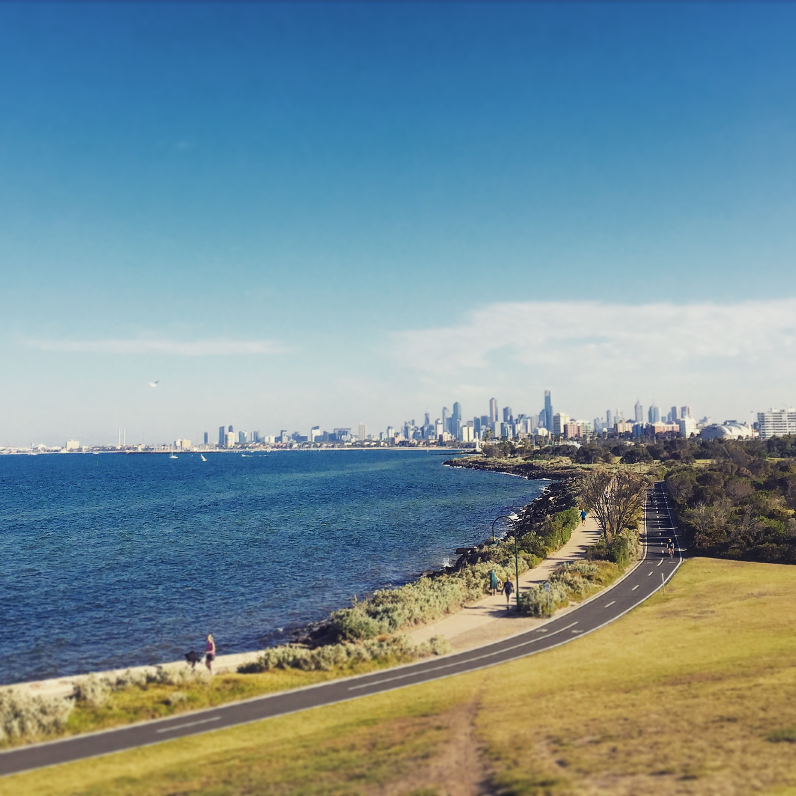
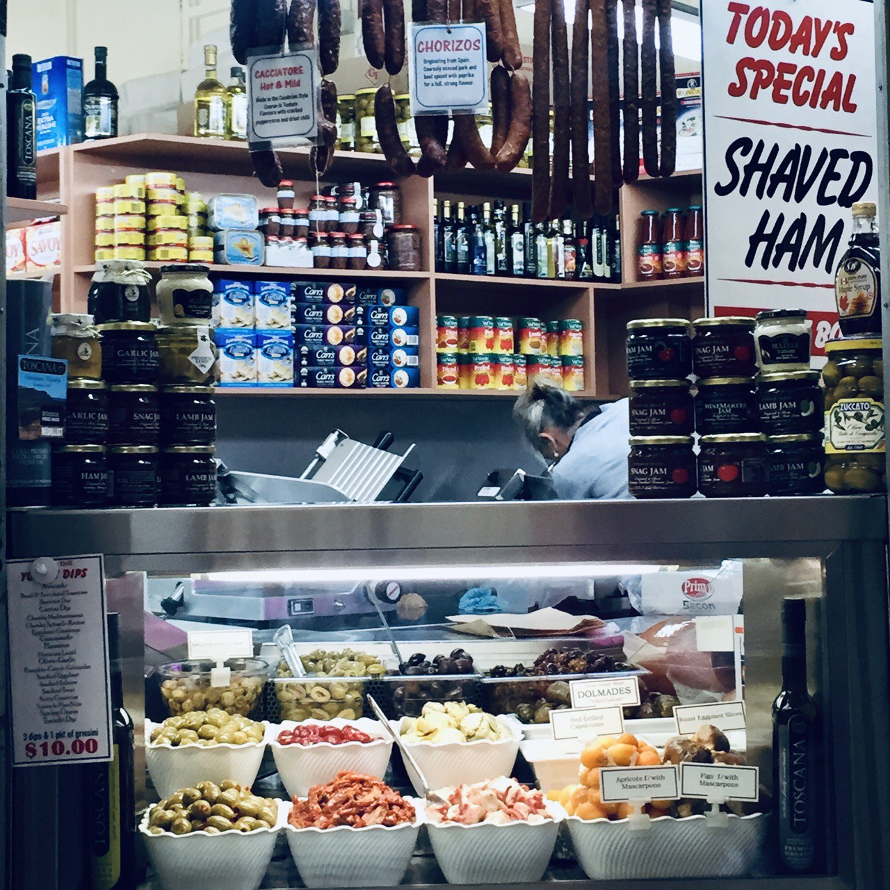
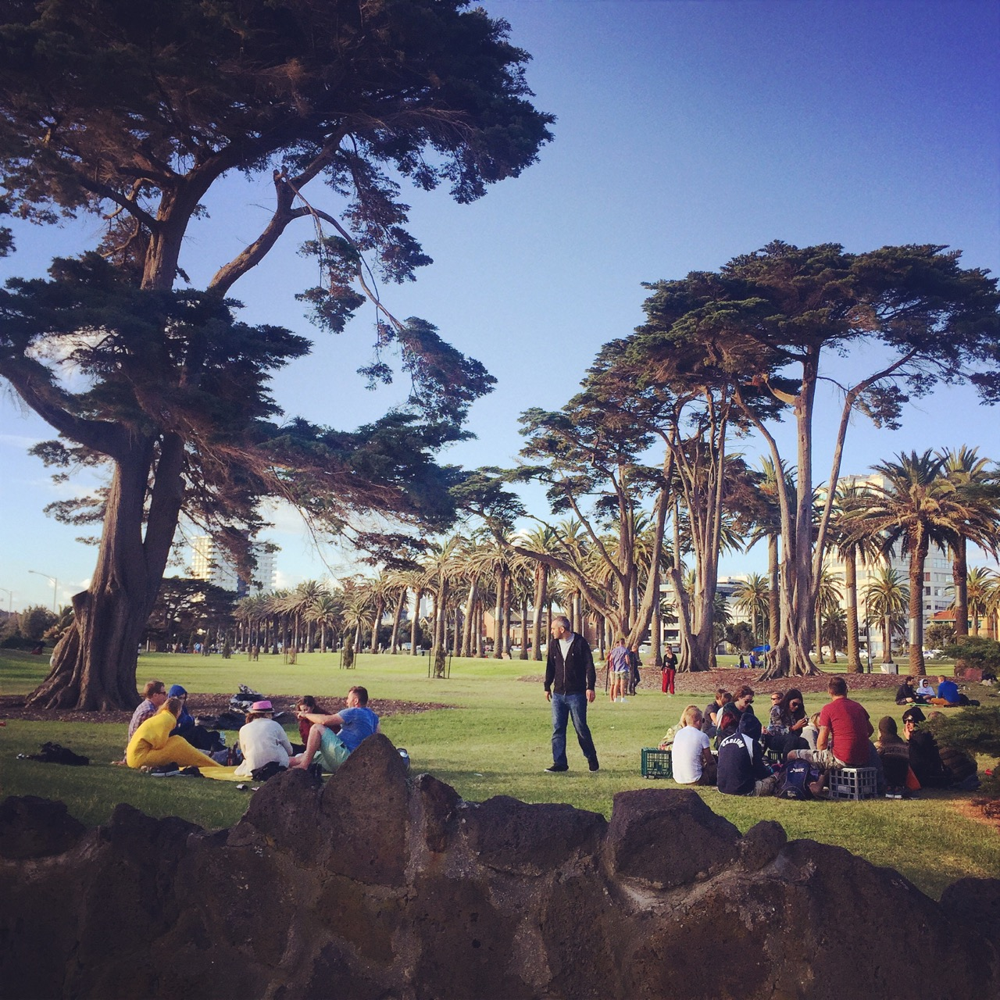
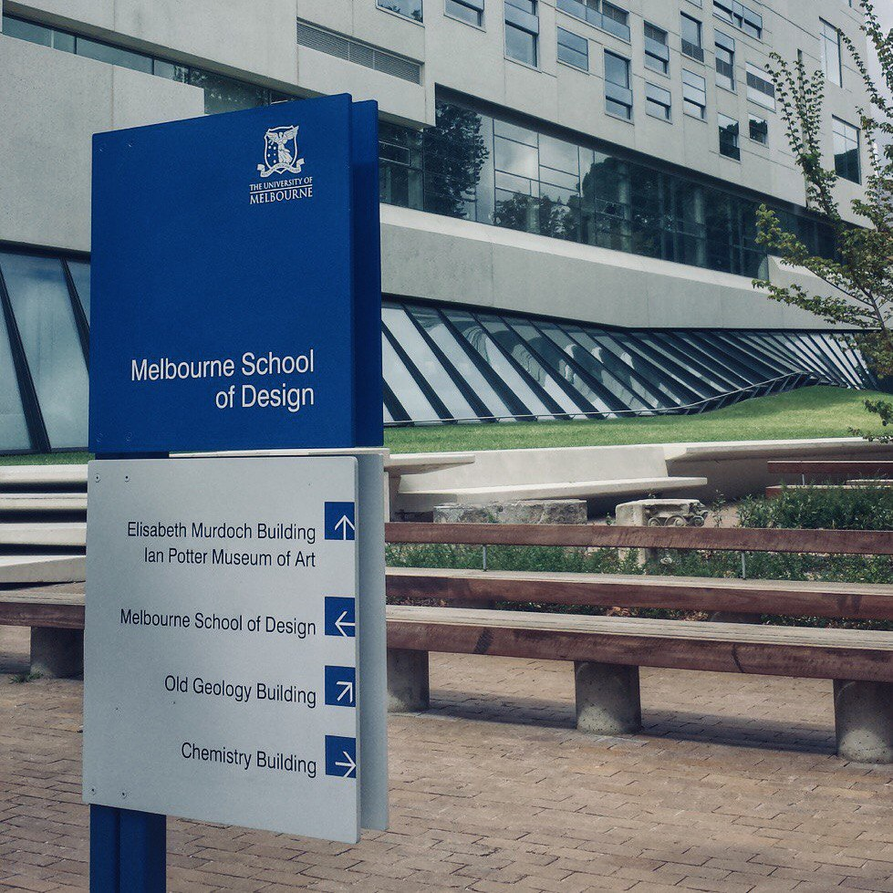
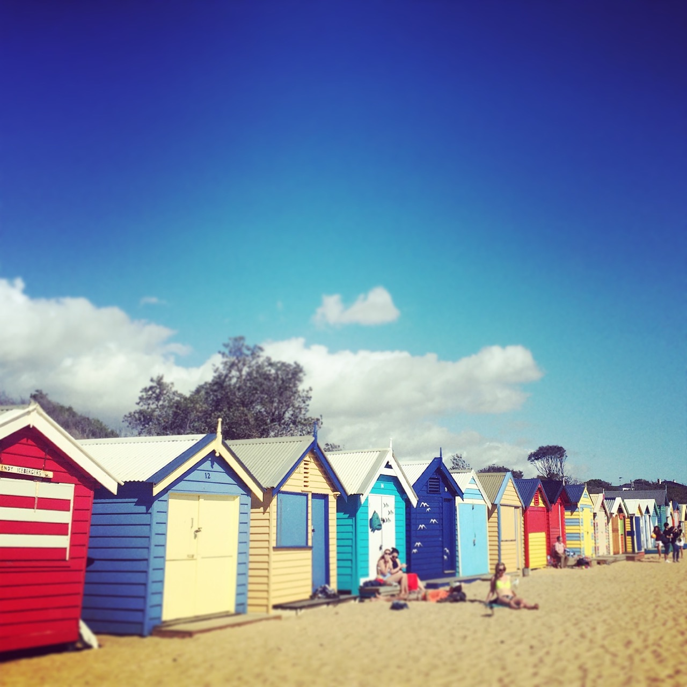
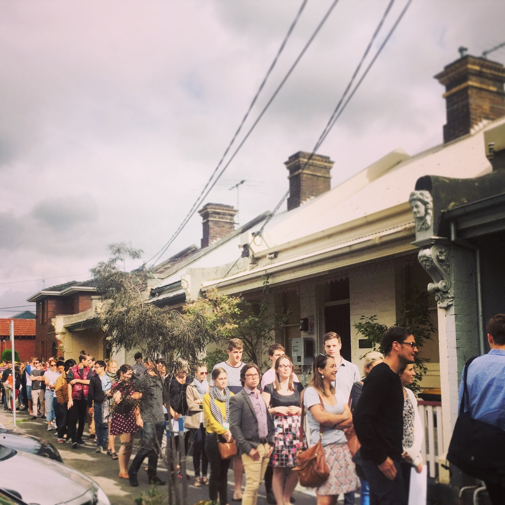
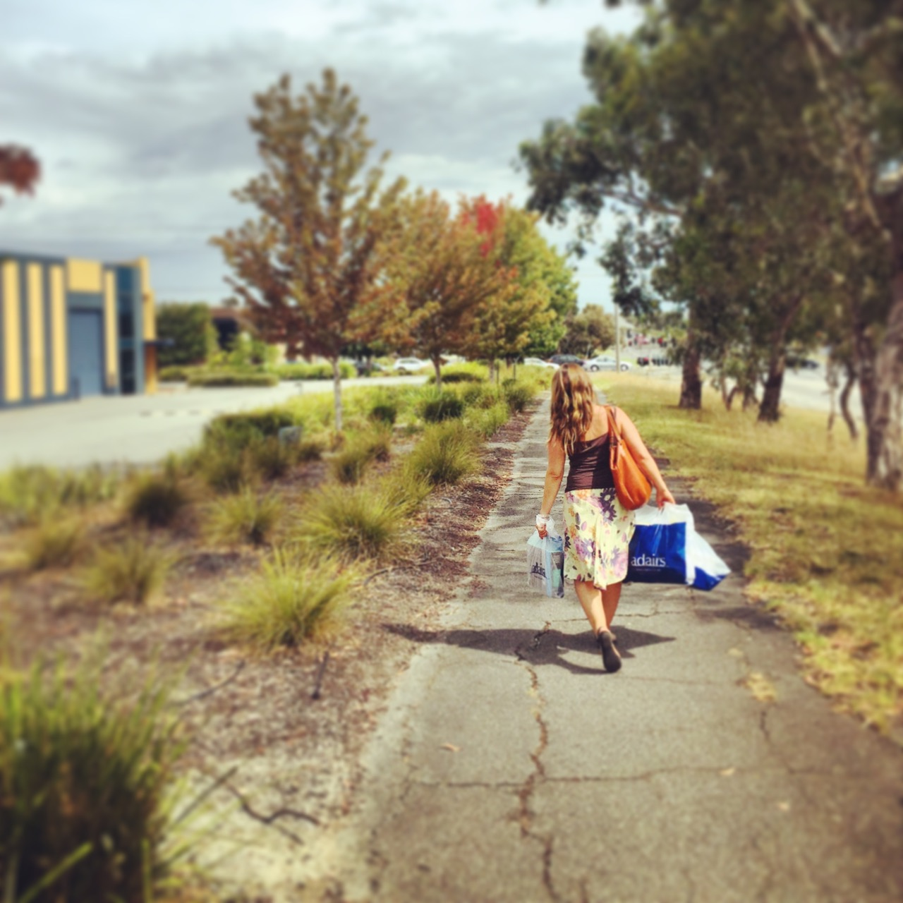

<link rel="stylesheet" href="kraustralia.css" type="text/css">

 
 
 

<!--- 0 Let's Go Anywhere ----------------------------------------------------------------------------- -->

<body>
  

   

    <figure>
      
    </figure>

  <h3>Let's Go Anywhere </h3>  
  <i>16 January 2015 </i>  
     Seattle, WA  
    

   We are setting off to start our our new life in Melbourne, Australia. With us on this adventure is as little as we could imagine bringing to a new home halfway around the world, . Two bags for each of us to last until our half container pod of remaining essentials (and some not so) are set to arrive 4-6 weeks after we do. 

  We bid adieu to Alley 24, our home for <a href="https://www.andykrause.com/kraustralia/kraustralia_full.html#kraustralia_0">... (click for more)</a>.
   

  </content>
<body>
 

<!--- Kraustralia 1  ------------------------------------------ -->
<body>
  

   

    <figure>
     
    </figure>

<h3>Arrival in Melbourne </h3>  
<i>22 January 2015 </i>  
Melbourne, Vic  
 
A full twenty-four hours after leaving Seattle -- via our scheduled Los Angeles stop and our unscheduled Sydney one -- we arrived in Melbourne. Immigration and customs took a matter of minutes, either a nod to Australian efficiency or, possibly, apathy. Our journey to the taxi stand took us outside and into the heat, a very welcome 36C (97F) heat. As our cab headed into the city our fatigue and exhaustion melted away as our new home came into view out of the car <a href="https://www.andykrause.com/kraustralia/kraustralia_full.html#kraustralia_1">... (click for more)</a>.

   

  </content>
<body>
 

<!---- Kraustralia 2 ---------------------------------------- -->

<body>
  

   

    <figure>
     
    </figure>

<h3>Settling In </h3>  
<i>23 January 2015 </i>  
Melbourne, Vic  
 

On our first full day, we dove right into the culture with a cup of morning tea out on our deck.  The cool, marine breeze of the early morning soon gave way to summer heat. We took a long walk along the Bay Trail down to Point Ormond.  The way back was warm; the heat, the sweat, the sun on our skin all so wonderful after the last few months in wet and cool Pacific Northwest. We live here now. 

   

  </content>
<body>
 

<!---- Kraustralia 3 ---------------------------------------- -->

<body>
  

   

    <figure>
     
    </figure>

<h3>The Tennis</h3>  
<i>24 January 2015 </i>  
Melbourne, Vic  
 

For three weeks in late January / early February all eyes -- in the tennis world at least -- are on Melbourne and the Australian Open.  Or, more affectionately referred to here on the ground as <em> The Tennis </em>. The cultural immersion program we had set for ourselves dictate that we attend, and that we did.  A gorgeous, sunny Saturday with temperatures near 30C (86F), we arrived early, as did the rest of <a href="https://www.andykrause.com/kraustralia/kraustralia_full.html#kraustralia_3">... (click for more)</a>.

   

  </content>
<body>
 

<!---- Kraustralia 4 Market Day ---------------------------------------- -->

<body>
  

   

    <figure>
     
    </figure>

<h3>Market Day</h3>  
<i>25 January 2015 </i>  
Melbourne, Vic  
 

The Queen Victoria Market is both a tourist trap full of fake Australian Outback hats and crocodile wallets as well as fully functional grocery store and mercantile. Where else can you buy a pallet of kangaroo pelts, mystery crystals, footie gear, toothpaste, antique collectibles and a dozen duck eggs all in the same place.  There is truly something for everyone.  We bought none of the above, <a href="https://www.andykrause.com/kraustralia/kraustralia_full.html#kraustralia_4">... (click for more)</a>.

   

  </content>
<body>
 

<!---- Kraustralia 5 'Stralia Day ---------------------------------------- -->

<body>
  

   

    <figure>
     
    </figure>

<h3>'Stralia Day</h3>  
<i>26 January 2015 </i>  
Melbourne, Vic  
 

Australia Day celebrates the 1788 landing of the British First Fleet in the Sydney Cove. We expected something like an Australian Fourth of July extravaganza. On account of souring public opinion over the ensuing treatment of the Aboriginal peoples, the reality of the holiday is something closer to a modest Columbus Day barbecue. As luck so had it, an old classmate of Erin's had recently moved to Melbourne <a href="https://www.andykrause.com/kraustralia/kraustralia_full.html#kraustralia_5">... (click for more)</a>.

   

  </content>
<body>
 

<!---- Kraustralia 6 Back to work ---------------------------------------- -->

<body>
  

   

    <figure>
     
    </figure>

<h3>Back to Work</h3>  
<i>27 January 2015 </i>  
University of Melbourne, Vic  
 

The fun had to end eventually, I was down here for a job after all. Mind you I wasn't headed to the salt mines or anything resembling difficult physical labor, but coming back to a schedule and being responsible to an employer was a unwelcome change nonetheless. 

I arrived to the brand new Melbourne School of Design (MSD) building and my 9:30 appointment to find <a href="https://www.andykrause.com/kraustralia/kraustralia_full.html#kraustralia_6">... (click for more)</a>.

   

  </content>
<body>
 

<!---- Kraustralia 7 Beach Boxes ---------------------------------------- -->

<body>
  

   

    <figure>
     
    </figure>

<h3>Beach Boxes</h3>  
<i>30 January 2015 </i>  
Brighton, Vic  
 

When not outside basking in the glorious January weather, we are busy on [Domain.com.au](https://www.domain.com.au/) searching for a place to live. This either means walking or taking the trams/trains to different neighborhoods around the city until we are exhausted or sunburned, often both. Our standard operating procedure once in such a condition is to find refuge and relief in a gelato or frozen yogurt shop. I dare you <a href="https://www.andykrause.com/kraustralia/kraustralia_full.html#kraustralia_7">... (click for more)</a>.

   

  </content>
<body>
 

<!---- Kraustralia 8 In Search of a Home ---------------------------------------- -->

<body>
  

   

    <figure>
     
    </figure>

<h3>In Search of a Home</h3>  
<i>1 February 2015 </i>  
Melbourne, Vic  
 

We are still vagabonds, living off of takeout at our small, but comfortable AirBnB in the heart of St. Kilda. We put in an application for the small brick homes in the photo below.  There are no guarantees here in this 'lottery for a rental home' system. It is just one of hundreds that we’ve looked at online and one of a handful that we’ve inspected and applied for. We feel like we have a good chance here because <a href="https://www.andykrause.com/kraustralia/kraustralia_full.html#kraustralia_8">... (click for more)</a>.

   

  </content>
<body>
 

<!---- Kraustralia 9 Not So Super Bowl ---------------------------------------- -->

<body>
  

   

    <figure>
     
    </figure>

<h3>Not So Super Bowl</h3>  
<i>2 February 2015 </i>  
Prahran, Vic  
 

9am Monday morning and we are headed to a bar. A friend of a friend had invited us out to the College Lawn Hotel in Prahran neighborhood.  Entrance was pricey, but we did get all you could drink beers and wines and a wide variety of free bar foods.  Upon arrival, we noticed the 12th man flag  We had made a good choice. The place filled <a href="https://www.andykrause.com/kraustralia/kraustralia_full.html#kraustralia_9">... (click for more)</a>.

   

  </content>
<body>
 

<!---- Kraustralia 10 How Ya Goin ---------------------------------------- -->

<body>
  

   

    <figure>
     
    </figure>

<h3>How Ya Goin</h3>  
<i>4 February 2015 </i>  
Albert Park, Vic  
 

After many tours, followup emails and countless hours scouring online listings, we finally secured a place to live.  It is a wee Victorian cottage in a neighborhood called Albert Park. It is a quaint, but upscale little area with adequate, but not hip, amenities and, importantly, is only a walk or short bike ride to the beach and a direct tram ride away from <a href="https://www.andykrause.com/kraustralia/kraustralia_full.html#kraustralia_10">... (click for more)</a>.

   

  </content>
<body>
 

<!---- Kraustralia 11 Ikea-a-thon ---------------------------------------- -->

<body>
  

   

    <figure>
     
    </figure>

<h3>Ikea-a-thon</h3>  
<i>8-9 February 2015 </i>  
Richmond, Vic  
 

We now have a house. It is filled with exactly nothing as all we own here are the bags we brought on the plane (and the various suncreens Andy has hoarded in the past two weeks) and those are still at the Airbnb we have for a few more days.  So we went shopping.  Furniture shopping -- the seventh level of hell for one of us. In fact, Andy might <a href="https://www.andykrause.com/kraustralia/kraustralia_full.html#kraustralia_11">... (click for more)</a>.

   

  </content>
<body>
 

