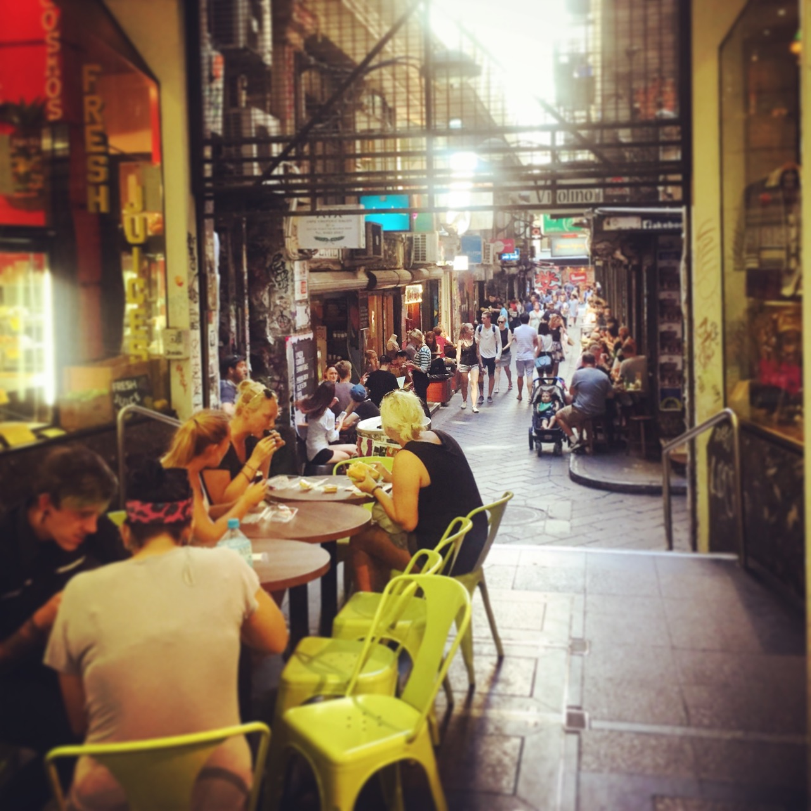
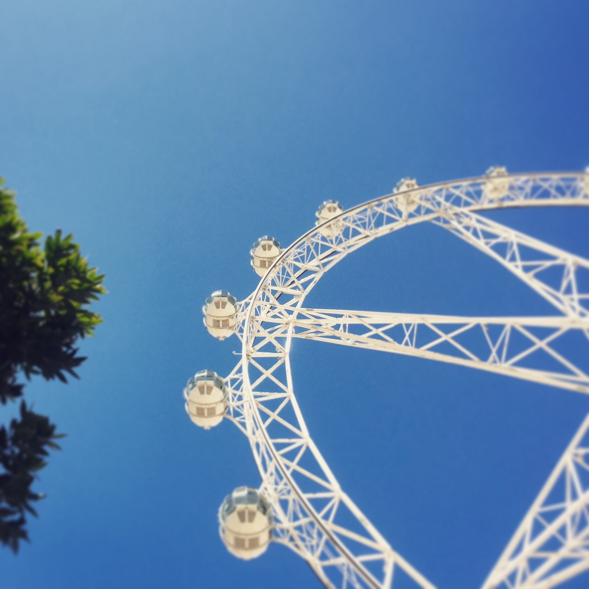
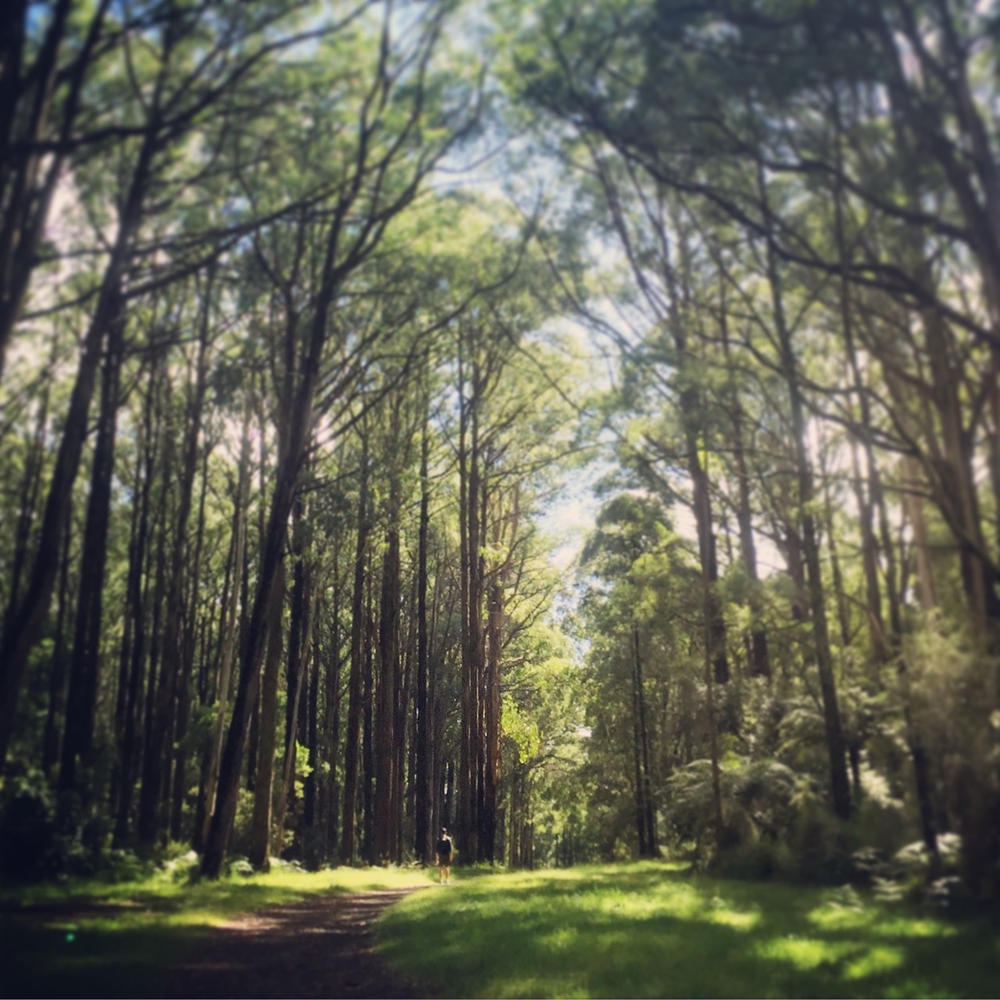
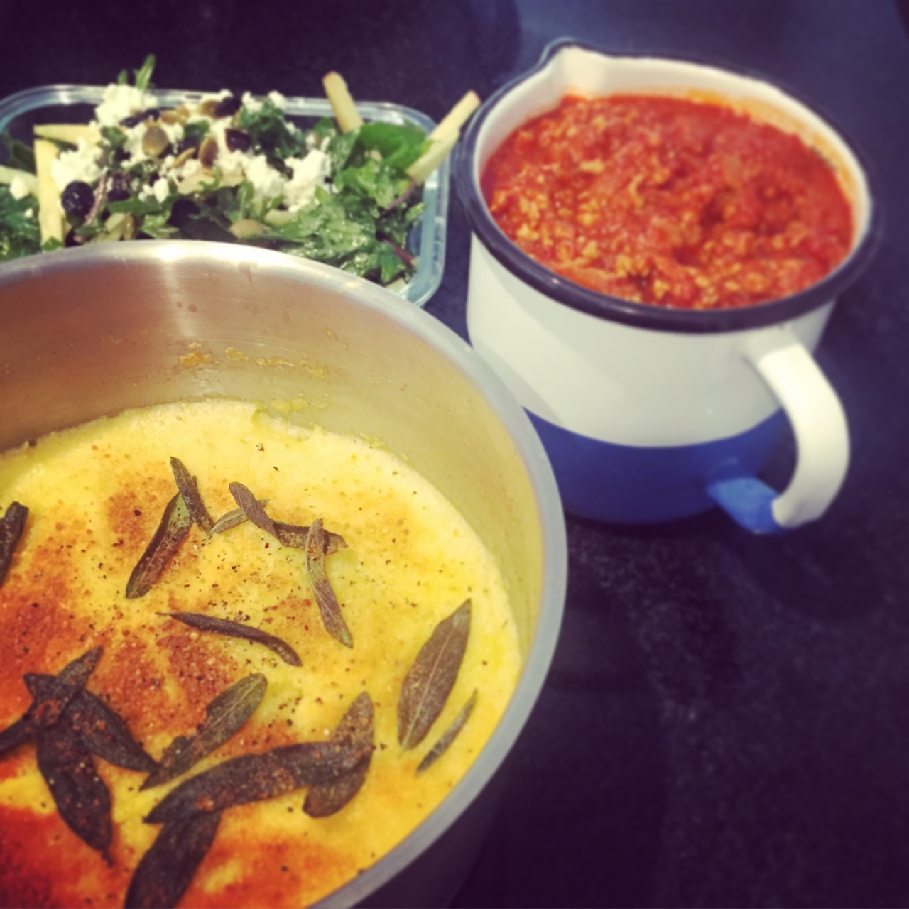
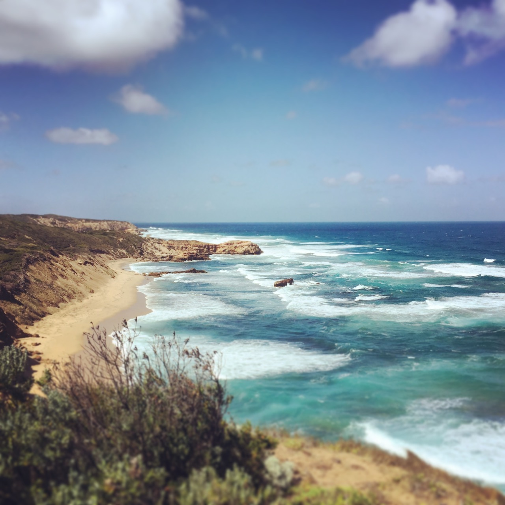
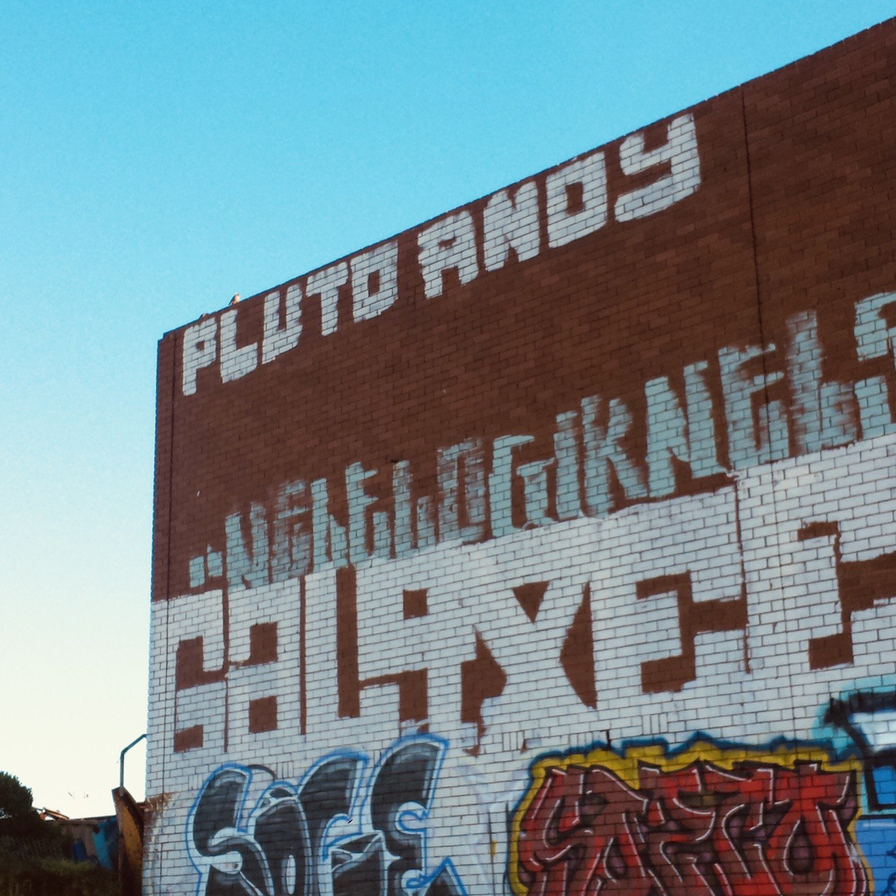
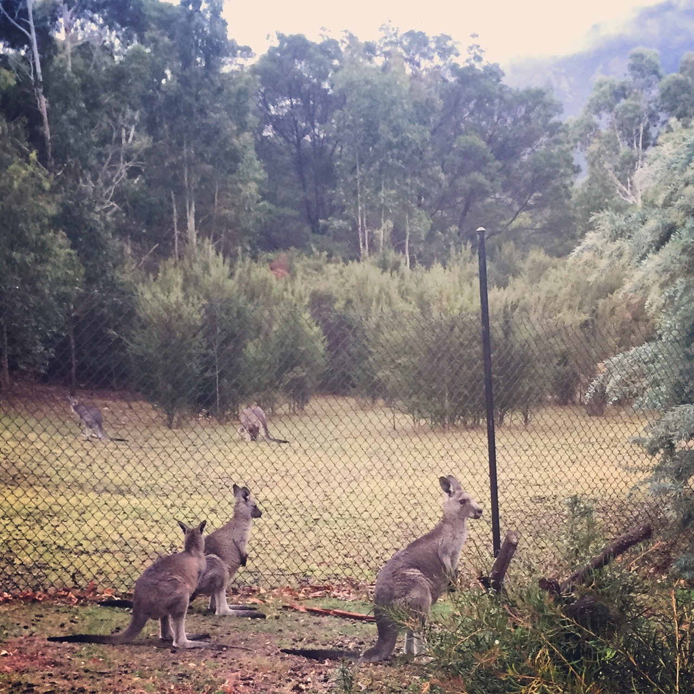
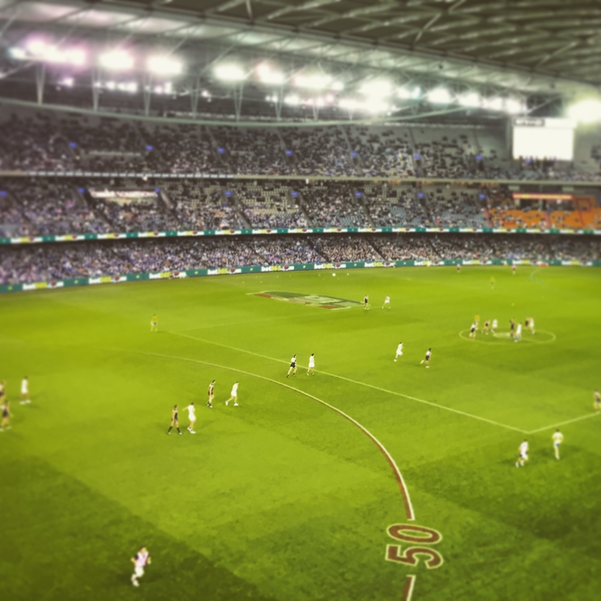
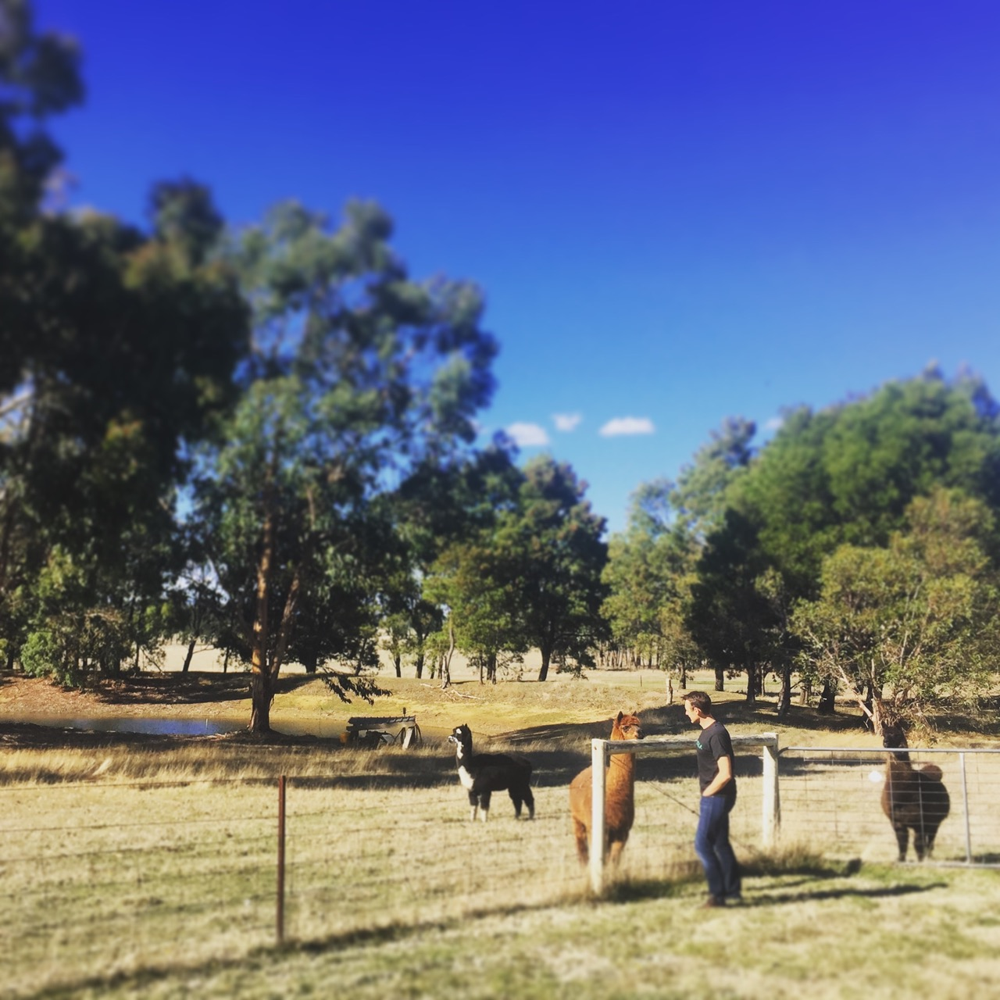

<link rel="stylesheet" href="kraustralia.css" type="text/css">

 
 
 

<!--- 0 Let's Go Anywhere ----------------------------------------------------------------------------- -->

<body>
  

   

    <figure>
      
    </figure>

  <h3>Let's Go Anywhere </h3>  
  <i>16 January 2015 </i>  
     Seattle, WA  
    

   We are setting off to start our our new life in Melbourne, Australia. With us on this adventure is as little as we could imagine bringing to a new home halfway around the world, . Two bags for each of us to last until our half container pod of remaining essentials (and some not so) are set to arrive 4-6 weeks after we do. 

  We bid adieu to Alley 24, our home for <a href="https://www.andykrause.com/kraustralia/kraustralia_full.html#kraustralia_0">... (click for more)</a>.
   

  </content>
<body>
 

<!--- Kraustralia 1  ------------------------------------------ -->
<body>
  

   

    <figure>
     
    </figure>

<h3>Arrival in Melbourne </h3>  
<i>22 January 2015 </i>  
Melbourne, Vic  
 
A full twenty-four hours after leaving Seattle -- via our scheduled Los Angeles stop and our unscheduled Sydney one -- we arrived in Melbourne. Immigration and customs took a matter of minutes, either a nod to Australian efficiency or, possibly, apathy. Our journey to the taxi stand took us outside and into the heat, a very welcome 36C (97F) heat. As our cab headed into the city our fatigue and exhaustion melted away as our new home came into view out of the car <a href="https://www.andykrause.com/kraustralia/kraustralia_full.html#kraustralia_1">... (click for more)</a>.

   

  </content>
<body>
 

<!---- Kraustralia 2 ---------------------------------------- -->

<body>
  

   

    <figure>
     
    </figure>

<h3>Settling In </h3>  
<i>23 January 2015 </i>  
Melbourne, Vic  
 

On our first full day, we dove right into the culture with a cup of morning tea out on our deck.  The cool, marine breeze of the early morning soon gave way to summer heat. We took a long walk along the Bay Trail down to Point Ormond.  The way back was warm; the heat, the sweat, the sun on our skin all so wonderful after the last few months in wet and cool Pacific Northwest. We live here now. 

   

  </content>
<body>
 

<!---- Kraustralia 3 ---------------------------------------- -->

<body>
  

   

    <figure>
     
    </figure>

<h3>The Tennis</h3>  
<i>24 January 2015 </i>  
Melbourne, Vic  
 

For three weeks in late January / early February all eyes -- in the tennis world at least -- are on Melbourne and the Australian Open.  Or, more affectionately referred to here on the ground as <em> The Tennis </em>. The cultural immersion program we had set for ourselves dictate that we attend, and that we did.  A gorgeous, sunny Saturday with temperatures near 30C (86F), we arrived early, as did the rest of <a href="https://www.andykrause.com/kraustralia/kraustralia_full.html#kraustralia_3">... (click for more)</a>.

   

  </content>
<body>
 

<!---- Kraustralia 4 Market Day ---------------------------------------- -->

<body>
  

   

    <figure>
     
    </figure>

<h3>Market Day</h3>  
<i>25 January 2015 </i>  
Melbourne, Vic  
 

The Queen Victoria Market is both a tourist trap full of fake Australian Outback hats and crocodile wallets as well as fully functional grocery store and mercantile. Where else can you buy a pallet of kangaroo pelts, mystery crystals, footie gear, toothpaste, antique collectibles and a dozen duck eggs all in the same place.  There is truly something for everyone.  We bought none of the above, <a href="https://www.andykrause.com/kraustralia/kraustralia_full.html#kraustralia_4">... (click for more)</a>.

   

  </content>
<body>
 

<!---- Kraustralia 5 'Stralia Day ---------------------------------------- -->

<body>
  

   

    <figure>
     
    </figure>

<h3>'Stralia Day</h3>  
<i>26 January 2015 </i>  
Melbourne, Vic  
 

Australia Day celebrates the 1788 landing of the British First Fleet in the Sydney Cove. We expected something like an Australian Fourth of July extravaganza. On account of souring public opinion over the ensuing treatment of the Aboriginal peoples, the reality of the holiday is something closer to a modest Columbus Day barbecue. As luck so had it, an old classmate of Erin's had recently moved to Melbourne <a href="https://www.andykrause.com/kraustralia/kraustralia_full.html#kraustralia_5">... (click for more)</a>.

   

  </content>
<body>
 

<!---- Kraustralia 6 Back to work ---------------------------------------- -->

<body>
  

   

    <figure>
     
    </figure>

<h3>Back to Work</h3>  
<i>27 January 2015 </i>  
University of Melbourne, Vic  
 

The fun had to end eventually, I was down here for a job after all. Mind you I wasn't headed to the salt mines or anything resembling difficult physical labor, but coming back to a schedule and being responsible to an employer was a unwelcome change nonetheless. 

I arrived to the brand new Melbourne School of Design (MSD) building and my 9:30 appointment to find <a href="https://www.andykrause.com/kraustralia/kraustralia_full.html#kraustralia_6">... (click for more)</a>.

   

  </content>
<body>
 

<!---- Kraustralia 7 Beach Boxes ---------------------------------------- -->

<body>
  

   

    <figure>
     
    </figure>

<h3>Beach Boxes</h3>  
<i>30 January 2015 </i>  
Brighton, Vic  
 

When not outside basking in the glorious January weather, we are busy on [Domain.com.au](https://www.domain.com.au/) searching for a place to live. This either means walking or taking the trams/trains to different neighborhoods around the city until we are exhausted or sunburned, often both. Our standard operating procedure once in such a condition is to find refuge and relief in a gelato or frozen yogurt shop. I dare you <a href="https://www.andykrause.com/kraustralia/kraustralia_full.html#kraustralia_7">... (click for more)</a>.

   

  </content>
<body>
 

<!---- Kraustralia 8 In Search of a Home ---------------------------------------- -->

<body>
  

   

    <figure>
     
    </figure>

<h3>In Search of a Home</h3>  
<i>1 February 2015 </i>  
Melbourne, Vic  
 

We are still vagabonds, living off of takeout at our small, but comfortable AirBnB in the heart of St. Kilda. We put in an application for the small brick homes in the photo below.  There are no guarantees here in this 'lottery for a rental home' system. It is just one of hundreds that we’ve looked at online and one of a handful that we’ve inspected and applied for. We feel like we have a good chance here because <a href="https://www.andykrause.com/kraustralia/kraustralia_full.html#kraustralia_8">... (click for more)</a>.

   

  </content>
<body>
 

<!---- Kraustralia 9 Not So Super Bowl ---------------------------------------- -->

<body>
  

   

    <figure>
     
    </figure>

<h3>Not So Super Bowl</h3>  
<i>2 February 2015 </i>  
Prahran, Vic  
 

9am Monday morning and we are headed to a bar. A friend of a friend had invited us out to the College Lawn Hotel in Prahran neighborhood.  Entrance was pricey, but we did get all you could drink beers and wines and a wide variety of free bar foods.  Upon arrival, we noticed the 12th man flag  We had made a good choice. The place filled <a href="https://www.andykrause.com/kraustralia/kraustralia_full.html#kraustralia_9">... (click for more)</a>.

   

  </content>
<body>
 

<!---- Kraustralia 10 How Ya Goin ---------------------------------------- -->

<body>
  

   

    <figure>
     
    </figure>

<h3>How Ya Goin</h3>  
<i>4 February 2015 </i>  
Albert Park, Vic  
 

After many tours, followup emails and countless hours scouring online listings, we finally secured a place to live.  It is a wee Victorian cottage in a neighborhood called Albert Park. It is a quaint, but upscale little area with adequate, but not hip, amenities and, importantly, is only a walk or short bike ride to the beach and a direct tram ride away from <a href="https://www.andykrause.com/kraustralia/kraustralia_full.html#kraustralia_10">... (click for more)</a>.

   

  </content>
<body>
 

<!---- Kraustralia 11 Ikea-a-thon ---------------------------------------- -->

<body>
  

   

    <figure>
     
    </figure>

<h3>Ikea-a-thon</h3>  
<i>8-9 February 2015 </i>  
Richmond, Vic  
 

We now have a house. It is filled with exactly nothing as all we own here are the bags we brought on the plane (and the various suncreens Andy has hoarded in the past two weeks) and those are still at the Airbnb we have for a few more days.  So we went shopping.  Furniture shopping -- the seventh level of hell for one of us. In fact, Andy might <a href="https://www.andykrause.com/kraustralia/kraustralia_full.html#kraustralia_11">... (click for more)</a>.

   

  </content>
<body>
 

<!---- Kraustralia 12 Moving In ---------------------------------------- -->

<body>
  

   

    <figure>
     
    </figure>

<h3>Moving In</h3>  
<i>12 February 2015 </i>  
Albert Park, Vic  
 

This entire blog post could be about nothing more than the series of minor failures that we have had in the past week while moving into our new home. Instead, we will channel the positive and enlighten you with the few, but crucial wins we have had secured. To begin, we are now the proud owners of <a href="https://www.andykrause.com/kraustralia/kraustralia_full.html#kraustralia_12">... (click for more)</a>.

   

  </content>
<body>
 

<!---- Kraustralia 13 Walk Around Downtown ---------------------------------------- -->

<body>
  

   

    <figure>
     
    </figure>

<h3>A Downtown Walkabout</h3>  
<i>14 February 2015 </i>  
Melbourne, Vic  
 

To celebrate St. Valentine (Valentino in the large Italian sector of Melbourne) we explored our city -- a long date filled with many cultural institutions and ice creams.  We began with a trip to the State Library and concluded at Federation Square, connecting these two iconic places via the least efficient <a href="https://www.andykrause.com/kraustralia/kraustralia_full.html#kraustralia_13">... (click for more)</a>.

   

  </content>
<body>
 

<!---- Kraustralia 14 A slice of home  ------------------------------- -->

<body>
  

   

    <figure>
     
    </figure>

<h3>A Slice of Home</h3>  
<i>21 February 2015 </i>  
Melbourne, Vic  
 

In need of a vacuum, a year’s worth of toilet paper, three liters of barbecue sauce, a kilo and half of haloumi and several other bulk items that can only be moved with a pallet jack, we took a short tram ride to Costco Australia, conveniently located just north of downtown Melbourne. Rumor has it that the Melburnians were so pleased with the arrival <a href="https://www.andykrause.com/kraustralia/kraustralia_full.html#kraustralia_14">... (click for more)</a>.

   

  </content>
<body>
 

<!---- Kraustralia 15 Furniture and F1 ------------------------------- -->
<body>
  

   

    <figure>
     
    </figure>

<h3>Furniture and F1</h3>  
<i>25 February 2015 </i>  
Albert Park, Vic  
 

Big week for us. We bought a grill (*barbie*), our couch and desk were delivered (installed incorrectly) and our internet was finally installed (with speeds near that of Andy's early 2000s dorm room...). After tethering our cell phones to our computers in order to get work done and sitting on the floor for 2 weeks, this was a big improvement.  That said, we are coming <a href="https://www.andykrause.com/kraustralia/kraustralia_full.html#kraustralia_15">... (click for more)</a>.

   

  </content>
<body>
 
 
<!---- Kraustralia 16 A Walk in the CIty; A Walk in the Bush ------------------------------- -->
<body>
  

   

    <figure>
     
    </figure>

<h3>A Walk in the City, A Walk in the Bush</h3>  
<i>2 March 2015 </i>  
Melbourne + Belgrave, Vic  
 

We are getting to know our new city bit by bit and day by day.  Whether by suggestions from new friends, places we have read about on local websites or curiosities stumbled upon while lost, we end up on weekly field trips to discover little city gems. Whilst wandering the city, one of the most pleasant surprises is volume and diversity of street art in Melbourne. This weekend we decided to specifically <a href="https://www.andykrause.com/kraustralia/kraustralia_full.html#kraustralia_16">... (click for more)</a>.

   

  </content>
<body>
 
 
 
<!---- Kraustralia 17 Classroom Debut ------------------------------- -->
<body>
  

   

    <figure>
     
    </figure>

<h3>Classroom Debut</h3>  
<i>8 March 2015 </i>  
Parkville, Vic  
 

The students returned to campus this week, which meant the peacefulness Andy had been enjoying at work was suddenly shattered. It was easy to forget hat a scene a thriving 40,000 student campus could become. Added to this was the fact that we were housed in a brand new building, the likes of which the students hadn't seen yet <a href="https://www.andykrause.com/kraustralia/kraustralia_full.html#kraustralia_17">... (click for more)</a>.

   

  </content>
<body>
 
 
<!---- Kraustralia 18 Experimental Cooking ------------------------------- -->
<body>
  

   

    <figure>
     
    </figure>

<h3>Experimental Cooking</h3>  
<i>18 March 2015 </i>  
Parkville, Vic  
 

[Erin] Growing up, whenever my mom would try a meal outside of her wheelhouse, she would always preface the meal with the  descriptive warning that it was ‘experimental’. Carrying this over into my adult life, I have begun to refer to Andy’s enthusiastic use of flavors and discretionary attention to recipes as ‘experimental cooking’ and now <a href="https://www.andykrause.com/kraustralia/kraustralia_full.html#kraustralia_18">... (click for more)</a>.

   

  </content>
<body>
 
 
<!---- Kraustralia 19 Mornington, Day 1  ------------------------------- -->
<body>
  

   

    <figure>
     
    </figure>

<h3>Mornington, Day 1</h3>  
<i>20 March 2015 </i>  
Mornington Peninsula, Vic  
 

For Erin's upcoming birthday we decided to finally leave the comforts of the big city and venture into rural Victoria -- the Mornington Peninsula to be precise.  To do so meant renting a car and driving. Not just any driving, but driving on the left hand side of the road...or basically unlearning everything that you've been consciously (and sometimes not so) doing for the past <a href="https://www.andykrause.com/kraustralia/kraustralia_full.html#kraustralia_19">... (click for more)</a>.

   

  </content>
<body>
 
 
<!---- Kraustralia 20 Mornington, Day 2  ------------------------------- -->
<body>
  

   

    <figure>
     
    </figure>

<h3>Mornington, Day 2</h3>  
<i>21 March 2015 </i>  
Mornington Peninsula, Vic  
 

Our last minute lodging at the Lindenderry Farm and Vineyards proved restful and we woke before sunrise to head to the Mornington Peninsula Hot Springs. With over twenty mineral pools to dip and soak in, we thought it would be the perfect morning activity. As the first people through the door, hustled up the hill to stake our claim in the aptly named Hilltop pool.  Doing so enabled us to catch sunrise <a href="https://www.andykrause.com/kraustralia/kraustralia_full.html#kraustralia_20">... (click for more)</a>.

   

  </content>
<body>
 
 
<!---- Kraustralia 20 Mornington, Day 2  ------------------------------- -->
<body>
  

   

    <figure>
     
    </figure>

<h3>Bachelor Life</h3>  
<i>31 March 2015 </i>  
Albert Park, Vic  
 

[Andy] A few weeks ago, you heard about Erin’s daily routine of one-pot cooking,  sun-bathing and trips to the market.  With Erin in Hawaii and me living the bachelor life, I’ll provide some insight into my own daily exploits. I teach on Tuesday and generally have meetings, class prep and other administrative duties  <a href="https://www.andykrause.com/kraustralia/kraustralia_full.html#kraustralia_21">... (click for more)</a>.

   

  </content>
<body>
 
 
 
 
<!---- Kraustralia 20 Mornington, Day 2  ------------------------------- -->
<body>
  

   

    <figure>
     
    </figure>

<h3>Botanical Gardens</h3>  
<i>5 April 2015 </i>  
Melbourne, Vic  
 
 
The city is a ghost town.  It is Easter weekend, a national holiday, and it would appear that most of our neighborhood and a fair bit of the city are off for a final summer's weekend someplace else. That included the shop owners and retail clerks.  As everything was closed up tight, we walked to the  <a href="https://www.andykrause.com/kraustralia/kraustralia_full.html#kraustralia_22">... (click for more)</a>.

  

 </content>
<body>
 

<!---- Kraustralia 23 Mornington, Day 2  ------------------------------- -->
<body>
  

   

    <figure>
     
    </figure>

<h3>Grampians National Park</h3>  
<i>6-7 April 2015 </i>  
Halls Gap, Vic  
 
 
Toward our effort to explore our new state of Victoria, we took a quick two-day trip out for some bushwalking in the [Grampians National Park](https://www.visitgrampians.com.au/discover-the-region). The Grampians Mountain Range, or Gariwerd as known to the local Aboriginals, is a photogenic sandstone range that runs north-south cutting through the Victorian plains. <a href="https://www.andykrause.com/kraustralia/kraustralia_full.html#kraustralia_23">... (click for more)</a>.

  

 </content>
<body>
 
             
<!---- Kraustralia 24 Fall and Footy  ------------------------------- -->
<body>
  

   

    <figure>
     
    </figure>

<h3>Fall and Footy</h3>  
<i>16-18 April 2015 </i>  
Melbourne, Vic  
 
 
Fall is definitely here, as the non-indigenous, deciduous trees are all beginning to drop their leaves.  After a lifetime in the Northern Hemisphere, it is really hard to condition yourself to think of April as being fall. We've both continually been referring to the upcoming months as 'summer', though they'll be anything but as our local friends are keen to remind us.  People here have assured us <a href="https://www.andykrause.com/kraustralia/kraustralia_full.html#kraustralia_24">... (click for more)</a>.

  

 </content>
<body>
   

<!---- Kraustralia 25 Farm Life  ------------------------------- -->
<body>
  

   

    <figure>
     
    </figure>

<h3>Farm Life</h3>  
<i>1-3 May 2015 </i>  
Ballarat, Vic  
 
 
This weekend we were invited out to visit our friends Brooke and Steve who are ‘farmsitting’ for a month out in the country. The farm is just outside of the town of Ballarat and although it seemed a world away from the city, it only took about an hour’s drive when we left midday Friday. After an afternoon tour of the farm, we drove into Ballarat to stock up on groceries and drinks.  Prior to the first gold strike, Ballarat was <a href="https://www.andykrause.com/kraustralia/kraustralia_full.html#kraustralia_25">... (click for more)</a>.

  

 </content>
<body>
   

