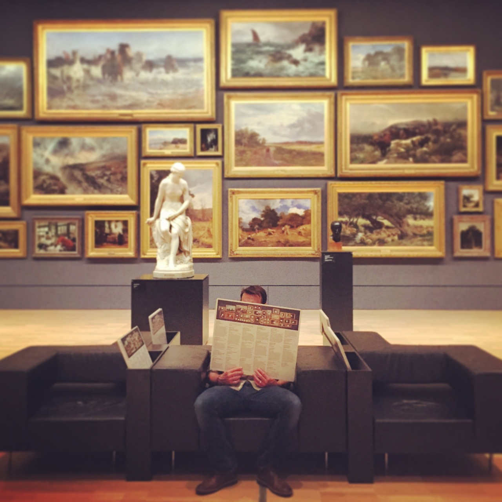
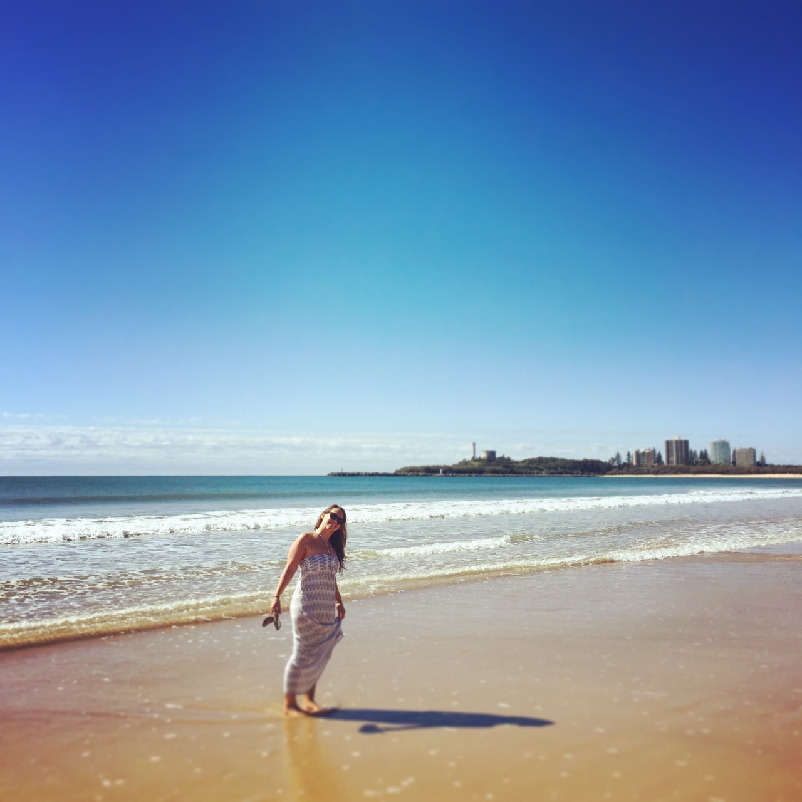
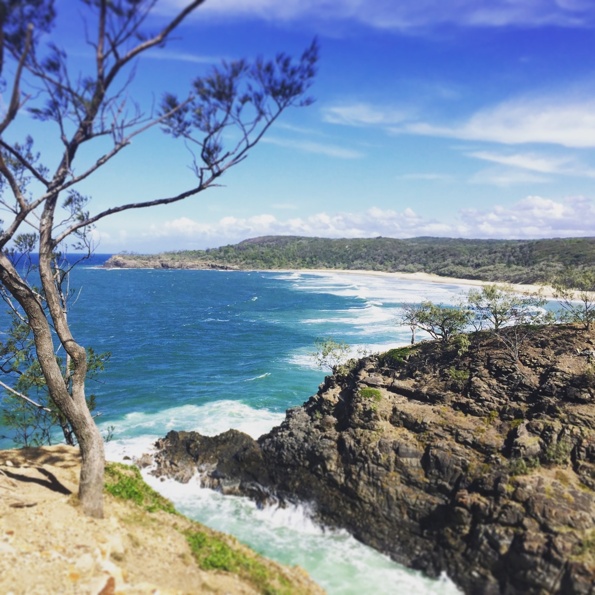
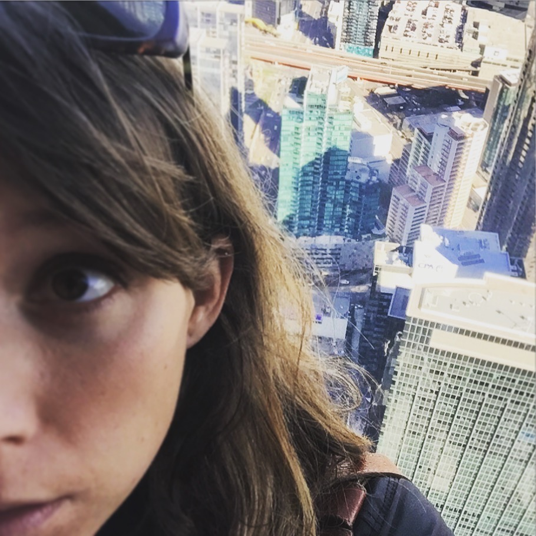
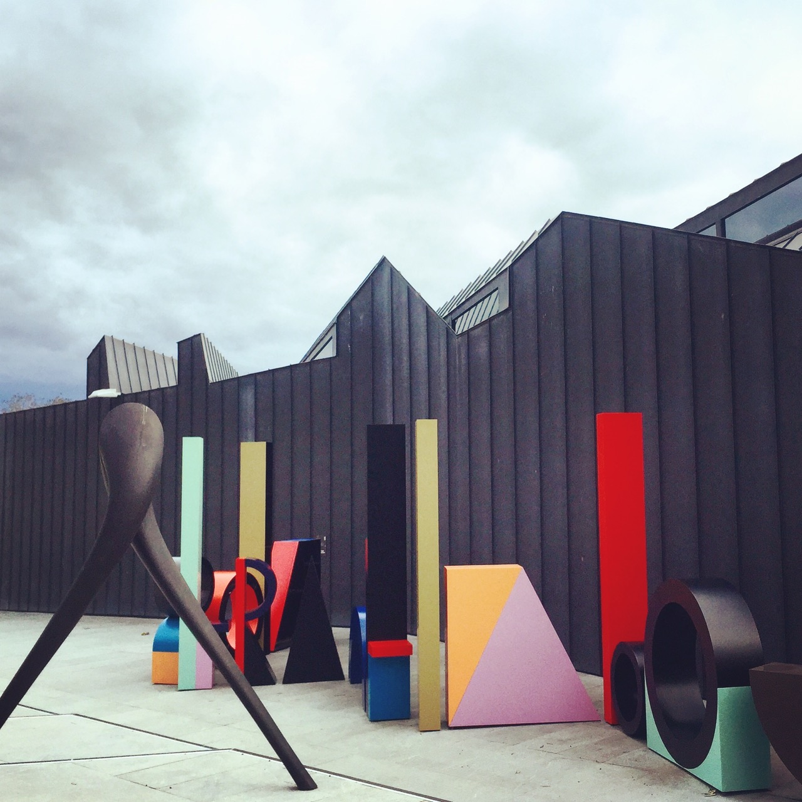
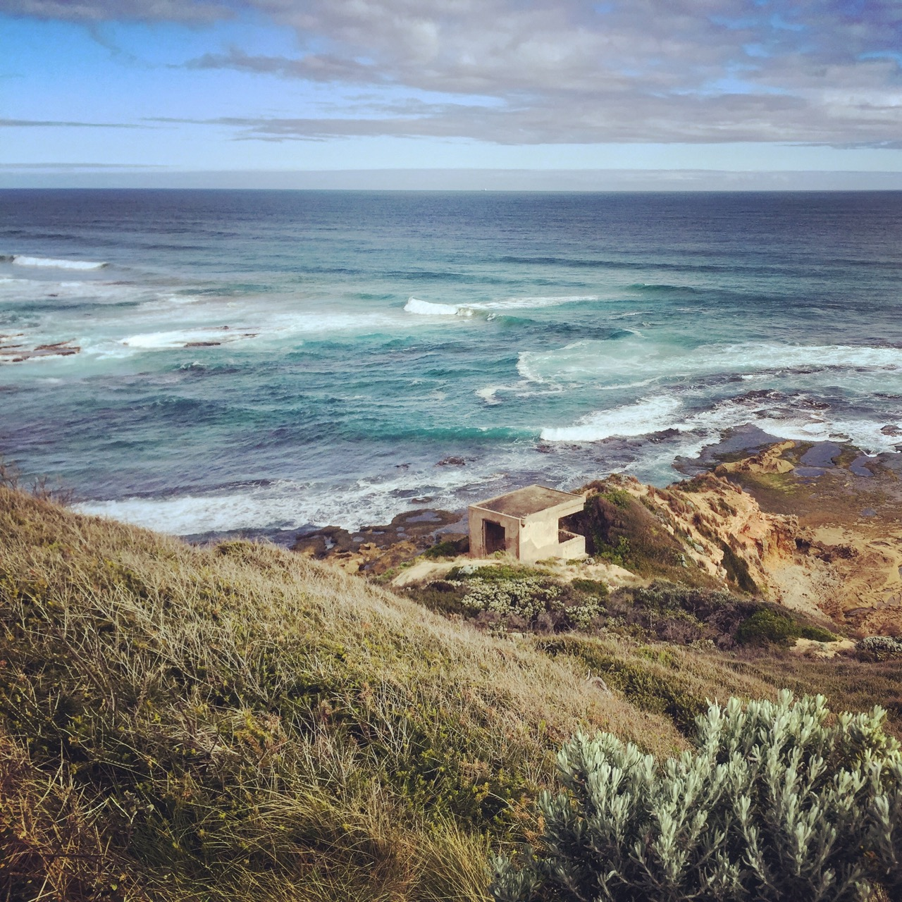
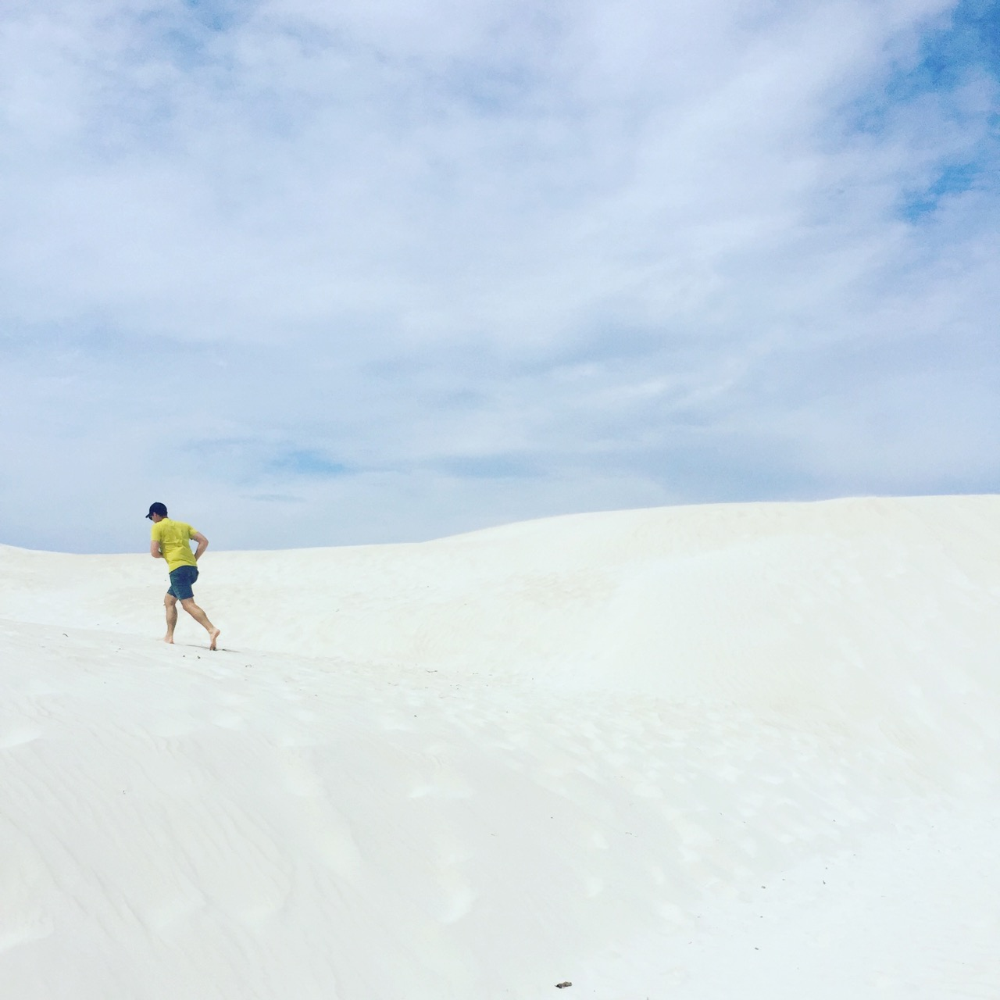
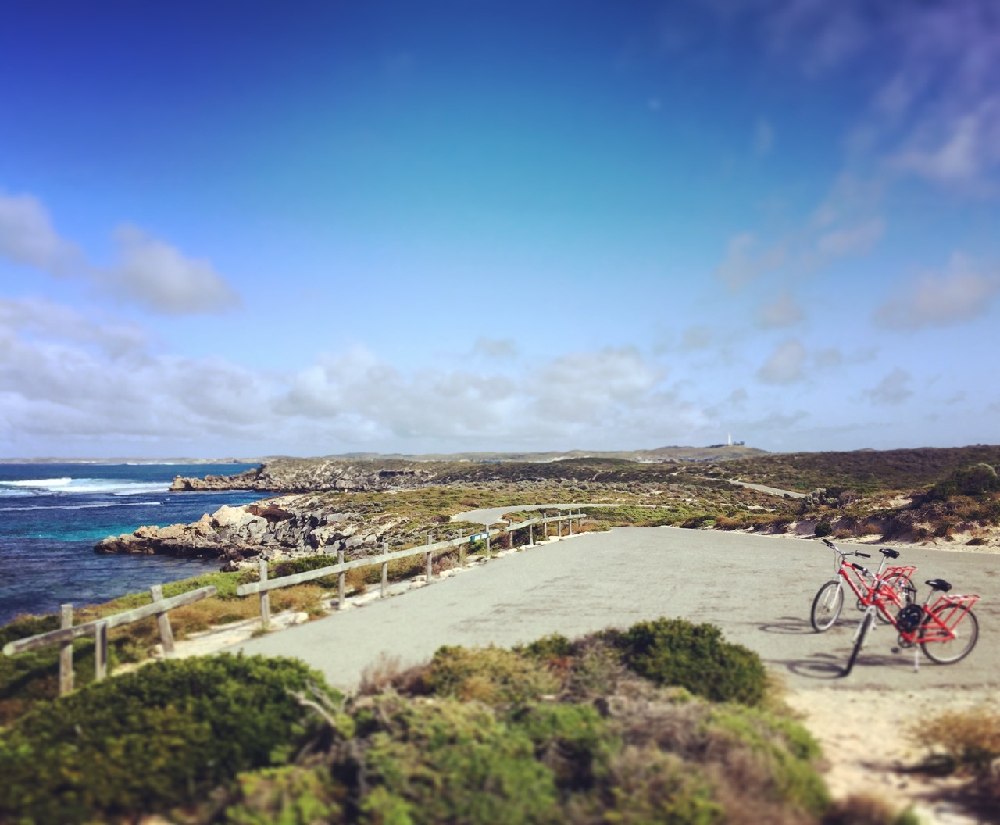
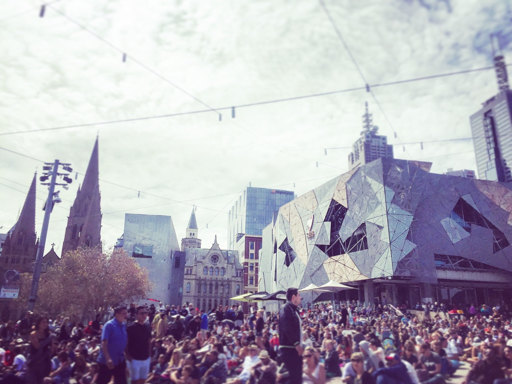
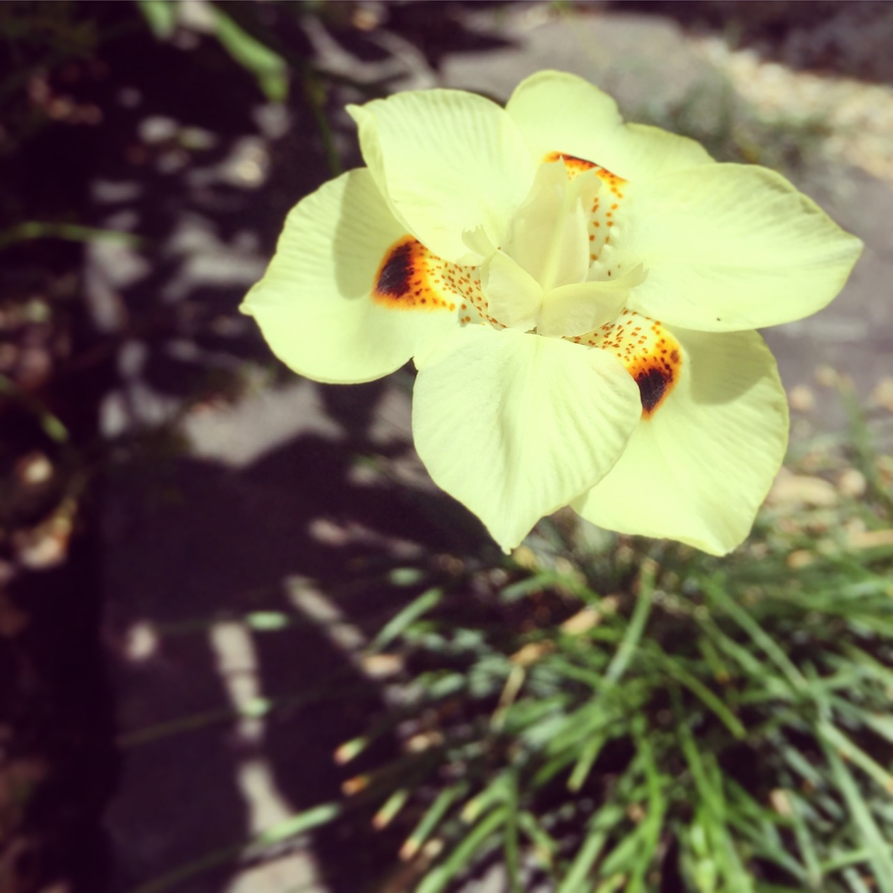

<link rel="stylesheet" href="kraustralia.css" type="text/css">

 
 
 

# <!--- 0 Let's Go Anywhere ----------------------------------- -->

<body>
  

   

    <figure>
      
     </a>
    </figure>

  <h3>Let's Go Anywhere </h3>  
  <i>16 January 2015 </i>  
     Seattle, WA  
   

We are setting off to start our new life in Melbourne, Australia. With us on this adventure is as little as we could imagine bringing to a new home halfway around the world. Two bags for each of us to last until our half container pod of remaining essentials (and some not so) are set to arrive 4-6 weeks after we do. 

On a steel gray January morning we bid adieu to Alley 24, our home for nearly four years, tossed our two bags into the Subaru for the last time and drove up to Ballard to crash in our friend's 4' by 7' TV room. This will be our cozy accommodations for four nights until our flight on the 20th. Sometime in that span we'll be selling our trusty steed and further shedding some last possessions that missed the boat but can't be justified in the checked luggage. 

Now that we are unemployed, transient couch surfers the enormity of the move must be faced.  No more second guessing the decision, no more dreamy discussions. Now just real, live logistics -- an AirBnB, work visas, money transfers, international shipping manifestos, packing re-packing our luggage.  

We'll be there soon and once we arrive we'll do our best to document our adventure here so feel free to follow along as we share the highlights of our life Down Under.

  

  </content>
<body>
 

# <!--- 1 Arrival in a Strange Land ------------------------------------------ -->
<body>
  

   

    <figure>
     
     </a>
    </figure>

<h3>Arrival in a Strange Land </h3>  
<i>22 January 2015 </i>  
Melbourne, Vic  
 

A full twenty-four hours after leaving Seattle -- via our scheduled Los Angeles stop and our unscheduled Sydney one -- we arrived in Melbourne. Immigration and customs took a matter of minutes, either a nod to Australian efficiency or, possibly, apathy. Our journey to the taxi stand took us outside and into the heat, a very welcome 36C (97F) heat. As our cab headed into the city our fatigue and exhaustion melted away as our new home came into view out of the car windows.  We had made it. Our new lives here were a blank canvass waiting for us to fill them with memories of a lifetime. This blew a strong wind into our sails; ready we were to see what this continent has to offer. 

After a few wrong turns down some tricky one-way alleys, our driver found our AirBNB flat <em>(apartment)</em> and set us free. We dumped our luggage, changed into our bathers <em>(swimsuits)</em> and headed down to the St. Kilda beach to showcase the whitest skin in all of Oz <em>(Australia)</em>, perhaps the Southern Hemisphere. In the mid-arvo  <em>(afternoon)</em>,our hunger pangs drove us from the beach to Fitzroy Street for a snack.  We cashed in our gift certificate to [Milk the Cow](https://milkthecow.com.au/), a wine and cheese shop near the beach. All manner of fancy spreads and cuts were brought our way; all consumed in short order.  We retired for our first night down under, but not before catching a few matches of The Tennis <em>(The Australian Open)</em> on The Tele <em>(TV)</em>. 

   

  </content>
<body>
 

# <!--- 2 Settling In ----------------------------------------- -->

<body>
  

   

    <figure>
     
     </a>
    </figure>

<h3>Settling In </h3>  
<i>23 January 2015 </i>  
St. Kilda, Vic  
 

On our first full day we dove right into the culture with a lazy cup of morning tea ([Twinnings] (https://twinings.com.au/), of course) on the deck.  The cool, marine breeze of the early morning quickly gave way to summer heat. Inspired to experience this new place we took a long walk along the [Bay Trail](https://en.wikipedia.org/wiki/Bay_Trail_(Australia)) down to Point Ormond. This is a truly fantastic trail. Kilometers upon kilometers of pricey coast real estate dedicated solely to public use. We will undoubtedly spend considerable time moving to and fro on non-vehicular thoroughfare. Bikes must be purchased and soon.  Andy is keen on rollerblades; Erin not so much so.  

The walk back was warm; the heat, the sweat, the sun on our skin all so wonderful after the last few months in wet and cool Pacific Northwest. We live here now. 

   

  </content>
<body>
 

# <!--- 3 The Tennis ----------------------------------------- -->

<body>
  

   

    <figure>
     
     </a>
    </figure>

<h3>The Tennis</h3>  
<i>24 January 2015 </i>  
Melbourne, Vic  
 

For three weeks in late January and early February all eyes -- in the tennis world at least -- are on Melbourne and the [Australian Open](https://ausopen.com/).  Or, more affectionately referred to here on the ground as <em> The Tennis </em>. The cultural immersion program we had set for ourselves dictated that we attend.  

On a gorgeous, sunny Saturday with temperatures near 30C (86F) we arrived early, as did the rest of the city. Tickets to the two main courts were sold out so we settled for ground passes. A ground pass allows access to all other venues but main courts, including the very large Hisense Arena. Our lack of planning did mean we'd miss Venus Williams' match; however, our early arrival permitted a viewing of Serena practicing from up close, so not all was lost. It should not go unmentioned that the lines to enter the cultural events -- the beer and wine gardens -- stretched on to the far reaches of the grounds as Melbourne's 20-somethings shook off last night's hangover and queued up for another run at it. No prom or gala in America had anything on this scene.

Serena's practice session sated our patriotic hunger; next on to Hisense for some live matches. Prior to the opening 11am match seats were plentiful.  As rookies do, we made a rookie mistake and sat in the glaring sun, amazed at why such good seats were available when less optimal ones (shaded) were taken.  A few hours later, the place was packed and we were sweating through our clothes, the full power of antipodal sun baking our pale northern bodies. We endured two hours of roasting to see the Spaniard, Muguruza, down Bacsinszky of Switzerland in a hard fought women's singles match. A welcome relief as the shade enveloped us for match two. Here, the 8th ranked Montenegro-Canadian Milos Raonic used his 220+ km/h serve to breeze by the scrappy Benjamin Becker of Germany.

The grounds were throbbing full at this point and, needing food and drink, we called it a day and left for home.  Our hunger and thirst pulled us into a pit stop at the Royal Croquet Club's (RCC) off-site Aussie Open extravaganza...basically a massive beer garden with food trucks, croquet courts and a DJ spinning house music. Attendance was thin -- it was early -- but judging by the size of the beer stands it would become a righteous rave later in the evening. Still jet-lagged and a good decade older than the intended demographic we could not muster the resolve to go on a day-long drinking spree and, after a delicious snack and two Hahn Lights, made our way home. Cultural immersion complete for today.

   

  </content>
<body>
 

# <!--- 4 Market Day ----------------------------------------- -->

<body>
  

   

    <figure>
     
     </a>
    </figure>

<h3>Market Day</h3>  
<i>25 January 2015 </i>  
Melbourne, Vic  
 

The [Queen Victoria Market](https://qvm.com.au/) is both a tourist trap full of fake Australian Outback hats and crocodile wallets as well as fully functional grocery store and mercantile. In what other seven hectare space upon the face of this earth can you buy a pallet of kangaroo pelts, powerful mystery crystals, Footie gear, a 55-gallon drum of raw almonds, Crest toothpaste, collectible dolls, antique hunting knives and a dozen fresh duck eggs? Any form of great quest can be outfitted from here; same too for fulfilling the needs of most eccentric among us. There is truly something for everyone. We bought none of the above, instead spending most our time investigating the widest variety of cured meats we'd ever seen. 

[Erin] Being from Seattle, my expectations of coffee are high. Melbourne's reputation as having a world class coffee culture proceeds it. In the three days we've been here, I've found it to be as promised and have been been gleefully sampling from a variety of new favorite, local cafes. [Market Lane Coffee](https://marketlane.com.au/pages/south-melbourne-cafe) has a corner shop in the Queen Vic Market and since I wasn't really sure what a flat white or a long black would end up as, I ordered a cappuccino like a pro, right up until I tried to pay for a $4 coffee with two 20 cent coins. (For some reason the smaller coins are larger amounts here). After Googling "long black" I decided it would be the closest to my Americano order back home and I can avoid looking like a complete dumbass next time.  I am also adding this bit of information to save you all from Googling "long black" in the workplace.

With Market bags in hand and caffeine needs met, we took the tram back to our temporary home in St. Kilda for a sunny lunch on our patio. At some point we will stop acting like this is a vacation and get on with the details of finding a permanent dwelling, communicating with family, preparing for work, being responsible adults, but not quite yet...after all, we are still wearing fresh, clean clothes from our suitcases.  Life doesn't really start until laundry calls. 

   

  </content>
<body>
 

# <!--- 5 'Stralia Day ---------------------------------------- -->

<body>
  

   

    <figure>
     
     </a>
    </figure>

<h3>'Stralia Day</h3>  
<i>26 January 2015 </i>  
Burwood, Vic  
 

Australia Day celebrates the 1788 landing of the British First Fleet at Sydney Cove. We expected something like an Australian Fourth of July extravaganza. However, on account of souring public opinion over the ensuing treatment of the Aboriginal peoples, the reality of the holiday is something closer to a modest Columbus Day barbecue. As luck so had it, an old classmate of Erin's had recently moved to Melbourne and had extended to us an invite to a afternoon party out in [Wattle Park](https://www.parks.vic.gov.au/places-to-see/parks/wattle-park), east of the city. On the (not to scale) Melbourne tram map, it looked close enough. Ignorant of the speed, or lack thereof, of the tram system we jumped aboard the 16 Tram headed east then north through St. Kilda East, Balacava, Caulfield North, Malvern, Kooyong and then Hawthorn where we transferred to the 70 Tram whereupon we crawled through Hawthorn East, Camberwell, Surrey Hills and finally into Burwood, home to the Park of Wattle.  Along the way we were overtaken by many cyclists, scooters, rickshaws, jitneys, wheelchairs, mums with prams, stray dogs; really anything wheeled or anyone particularly fleet of foot was bound to pass us eventually.  

Ninety or so minutes later we arrived. The beer that we purchased at the beginning of our journey was now fully the temperature of the ambient air. The small fete was enjoyable, a good chance to meet some local people and test our new land's ability to throw a bash. Marooned out here in the burbs, the only economically sensible thing to do was to ride the same slow pony back to town...at least we knew what to expect this time. We rewarded ourselves for our arduous travels with some of the world's greatest frozen yogurt, [Yo-Chi](https://yochi.com.au/). To walk off these excess calories, we ambled down to the beach to watch the sun dip below the gentle waves of Port Phillip Bay.

   

  </content>
<body>
 

# <!--- 6 Back to Work ---------------------------------------- -->

<body>
  

   

    <figure>
     
     </a>
    </figure>

<h3>Back to Work</h3>  
<i>27 January 2015 </i>  
University of Melbourne, Vic  
 

[Andy] Eventually, the fun had to end. I was down here for a job after all. Mind you I wasn't headed to the salt mines or anything resembling difficult physical labor, but coming back to a schedule and being responsible to an employer was an unwelcome change nonetheless.

I arrived to the sparkling new [Melbourne School of Design](https://msd.unimelb.edu.au/) (MSD) building and my 9:30 appointment with the department's lowest ranking human resources official to find that my name was not 'in the system'.  As a result, I could not be granted my ID card, login information, email, etc. Really anything that would permit me to do any actual work, administrative or otherwise. I was, however, awarded my complimentary kitchen set with a tea mug of a color of my choosing. Now this is the warm welcome I had been expecting. Editor's Note from the Future: This was a foreshadow of the general competence and priorities of the department. 

Additionally, due to some scheduling issues, there is a squatter in my current office for the next few weeks. I have been set up with with a temporary work space in a large group meeting-type room (with adequate space for my tea set).  It is comfortable enough and my office mates -- a pair of ebony mannequins of differing completeness -- are quiet, albeit a bit weird.

By midday I was starting to wonder if I actually had a job here, but in wandering the halls I did locate a door with my name on it...so at least someone was expecting me.  With any luck tomorrow I'll be able to commence my tenure at the University.  For now, I'm just a visitor stuck in a room with mannequins busy balancing his spoon on his nose while shotgunning lukewarm, free tea.  Oh yeah, and every time I leave the room to go to the bathroom I need to place a chair in the door lest it close behind me and lock me out.

   

  </content>
<body>
 

# <!--- 7 Beach Boxes ---------------------------------------- -->

<body>
  

   

    <figure>
     
     </a>
    </figure>

<h3>Beach Boxes</h3>  
<i>30 January 2015 </i>  
Brighton, Vic  
 

When not outside basking in the glorious January weather, we are busy on [Domain.com.au](https://www.domain.com.au/) searching for a place to live. Visiting these homes means walking or taking the trams/trains to different neighborhoods around the city until we are exhausted or sunburned, often both. Our standard operating procedure once in such a condition is to find refuge and relief in a gelato or frozen yogurt shop. I dare you to judge us.

Recently we found ourselves in Brighton touring a home which was wonderful but also for which we didn't really have the budget to live in. Brighton is a beautiful and bougie location just inland from a sparkling white beach. Like a crow drawn to shiny objects, Erin gravitates towards bright colors and patterns.  Being this close, we made time to visit to the famous [Brighton Beach Bathing Boxes](https://www.visitvictoria.com/regions/melbourne/see-and-do/history-and-heritage/heritage-buildings/brighton-bathing-boxes).  Our stay was no short affair.

Sticking our toes in the sand and watching the tourists (ourselves not included; we are locals after all) fumbled with self-sticks was a needed distraction from the stress of finding a home. The rental process here is, well, odd. Open houses or inspections, as they are referred to, are 15 minute affairs, and unfurnished rentals don't come with a washer/dryer, dishwasher or refrigerator unless you are lucky. As a result, the next time we move, we will be the proud owners of a bunch of big ass appliances. Two of the houses that we are interested in have inspection times tomorrow, unwittingly with overlapping 15 minute periods and across town from one another. We will divide and conquer, and hopefully trust the other's judgment...but for now, we worry not about this and relax on the beach dreaming of our next cool, sugary treat.

   

  </content>
<body>
 

# <!--- 8 In Search of a Home ---------------------------------------- -->

<body>
  

   

    <figure>
     
     </a>
    </figure>

<h3>In Search of a Home</h3>  
<i>1 February 2015 </i>  
St. Kilda, Vic  
 

As the calendar turned to February we remain vagabonds, living off of takeout at our small, but comfortable AirBnB in the heart of St. Kilda. We recently put in a rental application for a [small brick home](https://www.realestate.com.au/sold/property-house-vic-albert+park-129879290) in charming Albert Park.  There are no guarantees here in this 'lottery for a rental home' system as it is not clear what merits or perhaps roll of a dice determine whether or not we'll enjoy the luxury of paying a lot of money for a quaint living space. This home is one of hundreds that we’ve looked at online and one of a handful that we’ve inspected and applied for. We feel like we have a good chance here because it isn't the in the hip, cool neighborhoods north of the city, but in a quieter, family-ish area to the south. All the better for us as we prefer beaches and parks to bars and brunches anyways. 

This process has been, well, exhausting.  Our past weekend consisted mostly of jumping on and off various trams to schlep around to far-flung areas of the city in order to inspect homes or check out new neighborhoods. At some of the more glamorously located places, the crowds are insane; over 50 people showed up to a house in Fitzroy on Saturday morning. All this bandying about has its benefits -- we stumbled on a wild Chinese New Year celebration, have found some of the city's best architecture, sampled even more frozen yogurt and gelato shops and even procured Erin her first (likely of many) Australian meat pies. We know some tram routes by heart and now have a pretty good sense of what is overpriced.  All this local knowledge should also help Andy in the classroom where his first day of teaching is soon approaching.

   

  </content>
<body>
 

# <!--- 9 Not So Super Bowl ---------------------------------------- -->

<body>
  

   

    <figure>
     
     </a>
    </figure>

<h3>Not So Super Bowl</h3>  
<i>2 February 2015 </i>  
Prahran, Vic  
 

It was 9am Monday morning and we were headed not to work or to a house showing but, instead, to a pub. A friend from Seattle of a friend from Seattle had invited us out to the [College Lawn Hotel](https://collegelawnhotel.com.au/) in the Prahran neighborhood for the Super Bowl.  Entrance was pricey, but we did get all you could drink beers and wines and a wide variety of free bar foods. This is the sort of spectacle we had expected given all of our study about our new land suggested that the Aussies were "mad for sport."  Upon arrival, we noticed the 12th man flag in the window.  We had made a good choice.

The place filled quickly and there were about 200 people jammed in by the time the game started.  The College Lawn is a big place with numerous outdoor beer gardens, separate rooms and bars, so it never really felt too crowded.  I'd guess it was about 50% Seahawks fans, 30% Patriots fans, 10% random NFL jerseys (Barry Sanders, Darrelle Revis and Mark Chmura...ok, no Mark Chmura) with the balance made up of about 20 odd Aussie dudes who didn't care much for the game, but couldn't seem to pass up all-you-could drink event on a Monday morning.

We met about a dozen people from Seattle or the surrounding area, including one ex-Seattleite whose name was, I kid you not, Erin Krause.  The people and the atmosphere were great, the beer was good and the food was, well, filling.  We'll stop there as nothing really needs to be said about the [game itself](https://en.wikipedia.org/wiki/Super_Bowl_XLIX)....at least we had an ample selection of decent Australian microbrews (and Heineken) to kill the pain.

   

  </content>
<body>
 

# <!--- 10 How Ya Goin ---------------------------------------- -->

<body>
  

   

    <figure>
     
     </a>
    </figure>

<h3>How Ya Goin</h3>  
<i>4 February 2015 </i>  
Albert Park, Vic  
 

After many tours, followup emails and countless hours scouring online listings, we finally secured a place to live. It is a wee Victorian cottage in a neighborhood called Albert Park. It is a quaint, but upscale little area with adequate, but not hip, amenities.  Importantly is only a walk or short bike ride to the beach and a direct tram ride away from the University and downtown Melbourne. We are undoubtedly bringing down the median income for the area. We get the keys on Friday, so we will share more later in the week about the house. 

[Erin] Today, I focused on some early neighborhood reconnaissance. Near our house (feels weird to say this) is another open air market, the [South Melbourne Market](https://www.southmelbournemarket.com.au/). Compared to the Victoria Market we visited last week, this market is much smaller, but it still has amazing variety and better prices. It is less catered to the tourists and more toward locals looking for their groceries, staple items and delicious meals. Specialty shops abound, like the [Tea Drop](https://www.southmelbournemarket.com.au/traders/tea-drop) an entire booth dedicated to exotic and high end teas. It has Easter egg-colored canisters stacked so high, it necessitated a ladder to reach them. And that bookstore-style ladder is not just some trendy design detail, my own order required its use.  

Picking my way slowly stall by stall through the market, I continued to come across the same issue we've both have had for the past two weeks of meeting and greeting friendly Aussies.  Instead of the "G'day" that everyone in America expects Australians to say, we almost always get some slurred version of 'How ya goin' or 'How're ya going?' This obviously means 'Hi, How are you doing?', and so we usually answer 'Good', but every single time there is an urge to answer the question of where I'm going or how I got here, By tram? St. Kilda? I walked?

Knowing that we'd soon be leaving our St.Kilda apartment we spent our evening with a dinner at [Babu Ji](https://www.babuji.com.au/dine-in/) a fashionable Indian restaurant just down the street.  For a bit more than the cost of standard meal, the quality was outstanding. Some of most unique Indian flavors we each have ever tasted.  We are quite grateful that our new home is just a short tram ride away from this gem.  To aid in the digestion of this large meal, we concluded with a nice long walk along St.Kilda Beach.  Our home beach for just a few more days, until we relocated a mile or so to the west.
   
   

  </content>
<body>
 

<!---- Kraustralia 11 Ikea-a-thon ---------------------------------------- -->

<body>
  

   

    <figure>
     
    </figure>

<h3>Ikea-a-thon</h3>  
<i>8-9 February 2015 </i>  
Richmond, Vic  
 

We now have a house. It is filled with exactly nothing as all we own here are the bags we brought on the plane (and the various suncreens Andy has hoarded in the past two weeks) and those are still at the Airbnb we have for a few more days.  So we went shopping.  Furniture shopping -- the seventh level of hell for one of us. In fact, Andy might <a href="https://www.andykrause.com/kraustralia/kraustralia_full.html#kraustralia_11">... (click for more)</a>.

   

  </content>
<body>
 

<!---- Kraustralia 12 Moving In ---------------------------------------- -->

<body>
  

   

    <figure>
     
    </figure>

<h3>Moving In</h3>  
<i>12 February 2015 </i>  
Albert Park, Vic  
 

This entire blog post could be about nothing more than the series of minor failures that we have had in the past week while moving into our new home. Instead, we will channel the positive and enlighten you with the few, but crucial wins we have had secured. To begin, we are now the proud owners of <a href="https://www.andykrause.com/kraustralia/kraustralia_full.html#kraustralia_12">... (click for more)</a>.

   

  </content>
<body>
 

<!---- Kraustralia 13 Walk Around Downtown ---------------------------------------- -->

<body>
  

   

    <figure>
     
    </figure>

<h3>A Downtown Walkabout</h3>  
<i>14 February 2015 </i>  
Melbourne, Vic  
 

To celebrate St. Valentine (Valentino in the large Italian sector of Melbourne) we explored our city -- a long date filled with many cultural institutions and ice creams.  We began with a trip to the State Library and concluded at Federation Square, connecting these two iconic places via the least efficient <a href="https://www.andykrause.com/kraustralia/kraustralia_full.html#kraustralia_13">... (click for more)</a>.

   

  </content>
<body>
 

<!---- Kraustralia 14 A slice of home  ------------------------------- -->

<body>
  

   

    <figure>
     
    </figure>

<h3>A Slice of Home</h3>  
<i>21 February 2015 </i>  
Melbourne, Vic  
 

In need of a vacuum, a year’s worth of toilet paper, three liters of barbecue sauce, a kilo and half of haloumi and several other bulk items that can only be moved with a pallet jack, we took a short tram ride to Costco Australia, conveniently located just north of downtown Melbourne. Rumor has it that the Melburnians were so pleased with the arrival <a href="https://www.andykrause.com/kraustralia/kraustralia_full.html#kraustralia_14">... (click for more)</a>.

   

  </content>
<body>
 

<!---- Kraustralia 15 Furniture and F1 ------------------------------- -->
<body>
  

   

    <figure>
     
    </figure>

<h3>Furniture and F1</h3>  
<i>25 February 2015 </i>  
Albert Park, Vic  
 

Big week for us. We bought a grill (*barbie*), our couch and desk were delivered (installed incorrectly) and our internet was finally installed (with speeds near that of Andy's early 2000s dorm room...). After tethering our cell phones to our computers in order to get work done and sitting on the floor for 2 weeks, this was a big improvement.  That said, we are coming <a href="https://www.andykrause.com/kraustralia/kraustralia_full.html#kraustralia_15">... (click for more)</a>.

   

  </content>
<body>
 
 
<!---- Kraustralia 16 A Walk in the CIty; A Walk in the Bush ------------------------------- -->
<body>
  

   

    <figure>
     
    </figure>

<h3>A Walk in the City, A Walk in the Bush</h3>  
<i>2 March 2015 </i>  
Melbourne + Belgrave, Vic  
 

We are getting to know our new city bit by bit and day by day.  Whether by suggestions from new friends, places we have read about on local websites or curiosities stumbled upon while lost, we end up on weekly field trips to discover little city gems. Whilst wandering the city, one of the most pleasant surprises is volume and diversity of street art in Melbourne. This weekend we decided to specifically <a href="https://www.andykrause.com/kraustralia/kraustralia_full.html#kraustralia_16">... (click for more)</a>.

   

  </content>
<body>
 
 
 
<!---- Kraustralia 17 Classroom Debut ------------------------------- -->
<body>
  

   

    <figure>
     
    </figure>

<h3>Classroom Debut</h3>  
<i>8 March 2015 </i>  
Parkville, Vic  
 

The students returned to campus this week, which meant the peacefulness Andy had been enjoying at work was suddenly shattered. It was easy to forget hat a scene a thriving 40,000 student campus could become. Added to this was the fact that we were housed in a brand new building, the likes of which the students hadn't seen yet <a href="https://www.andykrause.com/kraustralia/kraustralia_full.html#kraustralia_17">... (click for more)</a>.

   

  </content>
<body>
 
 
<!---- Kraustralia 18 Experimental Cooking ------------------------------- -->
<body>
  

   

    <figure>
     
    </figure>

<h3>Experimental Cooking</h3>  
<i>18 March 2015 </i>  
Parkville, Vic  
 

[Erin] Growing up, whenever my mom would try a meal outside of her wheelhouse, she would always preface the meal with the  descriptive warning that it was ‘experimental’. Carrying this over into my adult life, I have begun to refer to Andy’s enthusiastic use of flavors and discretionary attention to recipes as ‘experimental cooking’ and now <a href="https://www.andykrause.com/kraustralia/kraustralia_full.html#kraustralia_18">... (click for more)</a>.

   

  </content>
<body>
 
 
<!---- Kraustralia 19 Mornington, Day 1  ------------------------------- -->
<body>
  

   

    <figure>
     
    </figure>

<h3>Mornington, Day 1</h3>  
<i>20 March 2015 </i>  
Mornington Peninsula, Vic  
 

For Erin's upcoming birthday we decided to finally leave the comforts of the big city and venture into rural Victoria -- the Mornington Peninsula to be precise.  To do so meant renting a car and driving. Not just any driving, but driving on the left hand side of the road...or basically unlearning everything that you've been consciously (and sometimes not so) doing for the past <a href="https://www.andykrause.com/kraustralia/kraustralia_full.html#kraustralia_19">... (click for more)</a>.

   

  </content>
<body>
 
 
<!---- Kraustralia 20 Mornington, Day 2  ------------------------------- -->
<body>
  

   

    <figure>
     
    </figure>

<h3>Mornington, Day 2</h3>  
<i>21 March 2015 </i>  
Mornington Peninsula, Vic  
 

Our last minute lodging at the Lindenderry Farm and Vineyards proved restful and we woke before sunrise to head to the Mornington Peninsula Hot Springs. With over twenty mineral pools to dip and soak in, we thought it would be the perfect morning activity. As the first people through the door, hustled up the hill to stake our claim in the aptly named Hilltop pool.  Doing so enabled us to catch sunrise <a href="https://www.andykrause.com/kraustralia/kraustralia_full.html#kraustralia_20">... (click for more)</a>.

   

  </content>
<body>
 
 
<!---- Kraustralia 20 Mornington, Day 2  ------------------------------- -->
<body>
  

   

    <figure>
     
    </figure>

<h3>Bachelor Life</h3>  
<i>31 March 2015 </i>  
Albert Park, Vic  
 

[Andy] A few weeks ago, you heard about Erin’s daily routine of one-pot cooking,  sun-bathing and trips to the market.  With Erin in Hawaii and me living the bachelor life, I’ll provide some insight into my own daily exploits. I teach on Tuesday and generally have meetings, class prep and other administrative duties  <a href="https://www.andykrause.com/kraustralia/kraustralia_full.html#kraustralia_21">... (click for more)</a>.

   

  </content>
<body>
 
 
 
 
<!---- Kraustralia 20 Mornington, Day 2  ------------------------------- -->
<body>
  

   

    <figure>
     
    </figure>

<h3>Botanical Gardens</h3>  
<i>5 April 2015 </i>  
Melbourne, Vic  
 
 
The city is a ghost town.  It is Easter weekend, a national holiday, and it would appear that most of our neighborhood and a fair bit of the city are off for a final summer's weekend someplace else. That included the shop owners and retail clerks.  As everything was closed up tight, we walked to the  <a href="https://www.andykrause.com/kraustralia/kraustralia_full.html#kraustralia_22">... (click for more)</a>.

  

 </content>
<body>
 

<!---- Kraustralia 23 Mornington, Day 2  ------------------------------- -->
<body>
  

   

    <figure>
     
    </figure>

<h3>Grampians National Park</h3>  
<i>6-7 April 2015 </i>  
Halls Gap, Vic  
 
 
Toward our effort to explore our new state of Victoria, we took a quick two-day trip out for some bushwalking in the [Grampians National Park](https://www.visitgrampians.com.au/discover-the-region). The Grampians Mountain Range, or Gariwerd as known to the local Aboriginals, is a photogenic sandstone range that runs north-south cutting through the Victorian plains. <a href="https://www.andykrause.com/kraustralia/kraustralia_full.html#kraustralia_23">... (click for more)</a>.

  

 </content>
<body>
 
             
<!---- Kraustralia 24 Fall and Footy  ------------------------------- -->
<body>
  

   

    <figure>
     
    </figure>

<h3>Fall and Footy</h3>  
<i>16-18 April 2015 </i>  
Melbourne, Vic  
 
 
Fall is definitely here, as the non-indigenous, deciduous trees are all beginning to drop their leaves.  After a lifetime in the Northern Hemisphere, it is really hard to condition yourself to think of April as being fall. We've both continually been referring to the upcoming months as 'summer', though they'll be anything but as our local friends are keen to remind us.  People here have assured us <a href="https://www.andykrause.com/kraustralia/kraustralia_full.html#kraustralia_24">... (click for more)</a>.

  

 </content>
<body>
   

<!---- Kraustralia 25 Farm Life  ------------------------------- -->
<body>
  

   

    <figure>
     
    </figure>

<h3>Farm Life</h3>  
<i>1-3 May 2015 </i>  
Ballarat, Vic  
 
 
This weekend we were invited out to visit our friends Brooke and Steve who are ‘farmsitting’ for a month out in the country. The farm is just outside of the town of Ballarat and although it seemed a world away from the city, it only took about an hour’s drive when we left midday Friday. After an afternoon tour of the farm, we drove into Ballarat to stock up on groceries and drinks.  Prior to the first gold strike, Ballarat was <a href="https://www.andykrause.com/kraustralia/kraustralia_full.html#kraustralia_25">... (click for more)</a>.

  

 </content>
<body>
   

<!---- Kraustralia 26 A Day of Culture  ------------------------------- -->
<body>
  

   

    <figure>
     
    </figure>

<h3>A Day of Culture</h3>  
<i>10 May 2015 </i>  
Melbourne, Vic  
 
 
Our well-laid plans to hike in the mountains east of the city were dashed due to storms. We pivoted and instead embarked on an urban hike to try to get to know our city a little better.  Andy kept on calling this a ‘Day of Culture’ but since I am writing this blog post, I will note that a ‘Day of walking really far’ would have been just as apt.  From our home in Albert Park, we trekked first to the National Gallery of <a href="https://www.andykrause.com/kraustralia/kraustralia_full.html#kraustralia_26">... (click for more)</a>.

  

 </content>
<body>
   

<!---- Kraustralia 27 Sunshine Coast ------------------------------- -->
<body>
  

   

    <figure>
     
    </figure>

<h3>Sunshine Coast</h3>  
<i>23 May 2015 </i>  
Alexandra Headlands, Vic  
 
 
As an early birthday present, Erin planned a short trip for us to Noosa and the Sunshine Coast -- a set of beachfront communities about an hour north of Brisbane.  We caught a Thursday afternoon flight out of Melbourne, which was quite bumpy due to the developing thunderstorms along coast.  As we approached the landing, our pilots hit the gas and pulled out of it a few moments before impact and then circled <a href="https://www.andykrause.com/kraustralia/kraustralia_full.html#kraustralia_27">... (click for more)</a>.

  

 </content>
<body>
   

<!---- Kraustralia 28 Noosa ------------------------------- -->
<body>
  

   

    <figure>
     
    </figure>

<h3>Noosa</h3>  
<i>25 May 2015 </i>  
Noosa, Qld  
 
 
We left our Alexandra Heads accommodation early on the slow bus bound for Noosa.  The trip -- cheap and comfortable -- follows the windy road all up the coast.  We stopped every ½ mile or so to pick up a barefooted surfer or two along the way.  Scenic, slow and crowded by the time we arrived in downtown Noosa. Noosa Heads is a very quaint, <a href="https://www.andykrause.com/kraustralia/kraustralia_full.html#kraustralia_28">... (click for more)</a>.

  

 </content>
<body>
   

<!---- Kraustralia 29 Delivery ------------------------------- -->
<body>
  

   

    <figure>
     
    </figure>

<h3>A Long Awaited Delivery</h3>  
<i>28 May 2015 </i>  
Albert Park, Vic  
 
 
After five months at sea – well more like two months at sea and three months in customs and port storage facilities – our shipment of household goods finally arrived.  And just 72 hours prior to our flights back to the U.S. for the month of June.  The boxes looked like they had been kicked, dragged and thrown the entire 8,186 miles, but miraculously nothing, minus <a href="https://www.andykrause.com/kraustralia/kraustralia_full.html#kraustralia_29">... (click for more)</a>.

  

 </content>
<body>
   

<!---- Kraustralia 30 Winter in Melbs ------------- -->
<body>
  

   

    <figure>
     
    </figure>

<h3>Winter in Melbourne</h3>  
<i>27 June 2015 </i>  
Albert Park, Vic  
 
 
[Andy] I returned from our hectic U.S. trip to depths of Melbourne winter. A calm and sunny 55 degrees.  As a native of the upper Midwest I remember late spring/early summer days that weren’t this nice. Yet, a good portion of the locals took the opportunity to don their North Face puffy jackets and knit, woolen hats.  Perhaps overkill, but I do love the smell of the wood fireplaces burning in our <a href="https://www.andykrause.com/kraustralia/kraustralia_full.html#kraustralia_30">... (click for more)</a>.

  

 </content>
<body>
   

<!---- Kraustralia 30 Melbs from the Sky ------------- -->
<body>
  

   

    <figure>
     
    </figure>

<h3>Melbourne from the Sky</h3>  
<i>20 July 2015 </i>  
Melbourne, Vic  
 
 
[Erin] I flew back to Melbourne on July 8th, prepared to keep myself busy with work until Andy got back on the 26th. One Cryptolock Virus, one trans-Pacific voyage for my computer and one panic attack later I found myself without a laptop, feeling completely un-tethered from society.  The only silver lining of sending my laptop back to the States for resurrection was that with the <a href="https://www.andykrause.com/kraustralia/kraustralia_full.html#kraustralia_31">... (click for more)</a>.

  

 </content>
<body>
   

<!---- Kraustralia 32 Heide Art Museum ------------- -->
<body>
  

   

    <figure>
     
    </figure>

<h3>Heide Art Museum</h3>  
<i>22 July 2015 </i>  
Heidelberg, Vic  
 
 
[Erin] Earlier this week, on a day that promised to have 0% chance of rain, I took a bike ride out of town to visit the Heide Museum of Modern Art. A 20 kilometer bike ride from the city, the Heide sits within 15 acres of parklands.  The land was purchased by John and Sunday Reed in 1934. And what was initially their home of a farm house, (Heide I) and kitchen <a href="https://www.andykrause.com/kraustralia/kraustralia_full.html#kraustralia_32">... (click for more)</a>.

  

 </content>
<body>
   

<!---- Kraustralia Blind Date ------------- -->
<body>
  

   

    <figure>
     
    </figure>

<h3>Blind Date</h3>  
<i>10 August 2015 </i>  
Frankston, Vic  
 

One perk of moving to a large, international city is that many of our friends, family and colleagues have connections here in Melbourne.  As a result, from time to time we get set up for, what could only be called, blind dates.  This Sunday was such an occasion.  One of Erin’s childhood friends had studied in New Zealand and knew a girl who happened to be living <a href="https://www.andykrause.com/kraustralia/kraustralia_full.html#kraustralia_33">... (click for more)</a>.

  

 </content>
<body>
   

<!---- Kraustralia Geelong ------------- -->
<body>
  

   

    <figure>
     
    </figure>

<h3>Geelong</h3>  
<i>25 August 2015 </i>  
Geelong, Vic  
 

We each had a busy past week preparing for new adventures; Andy with baseball tryouts for the Port Melbourne Mariners, (serendipitously enough our local team), and me with my first teaching experience at the University. I was hired as a teaching assistant, or a Tutor as they are referred to here, for a Site Planning and Design studio through the University Landscape Architecture program. <a href="https://www.andykrause.com/kraustralia/kraustralia_full.html#kraustralia_34">... (click for more)</a>.

  

 </content>
<body>
   

<!---- Kraustralia Footy Friday ------------- -->
<body>
  

   

    <figure>
     
    </figure>

<h3>Footy Friday</h3>  
<i>5 September 2015 </i>  
Melbourne, Vic  
 
Eric arrived today, our first visitor from back home. For his first full day, we hit up the South Melbourne Market for a lunch of Yum Cha (Dim Sum), Oysters and Meat Pies.  We then took a long, leisurely stroll into downtown, winding through Melbourne’s famous alleyways, eventually grabbing a few beers from a small café. There were many choices of alleyway bars, but we were lured in by the large Italian man who smelled strongly of coconut and vanilla and who offered us <a href="https://www.andykrause.com/kraustralia/kraustralia_full.html#kraustralia_35">... (click for more)</a>.

  

 </content>
<body>
  

<!---- GOR Day 1 ------------- -->
<body>
  

   

    <figure>
     
    </figure>

<h3>Great Ocean Road, Day 1</h3>  
<i>6 September 2015 </i>  
Apollo Bay, Vic  
 
The offer of a free upgrade at the rental car office is always a good omen for a road trip. The ‘upgrade’, in this case, meant getting handed the keys to metallic green Holden Commodore Sport Edition.  If you are anything other than an Aussie or absolute car wonk, you probably have never heard of Holden.  It is an oft-maligned domestic brand.  Think Pontiac not Cadillac. Pulling out the Avis garage, strange noises <a href="https://www.andykrause.com/kraustralia/kraustralia_full.html#kraustralia_36">... (click for more)</a>.

  

 </content>
<body>
  

<!---- GOR Day 2 ------------- -->
<body>
  

   

    <figure>
     
    </figure>

<h3>Great Ocean Road, Day 2</h3>  
<i>7 September 2015 </i>  
Warrnambool, Vic  
 
[Erin] We began day 2 of our Great Ocean Road trip in search of more koalas. Slow and seemingly high, these marsupials are 70% shanks, 20% ears and 100% adorable.  My maths don't add up, but the description should at least give you an overall understanding of the koala bear cuteness. We understood the 'bear' descriptor after seeing these little guys in action (or inaction), but I would probably characterize them as part Ewok, part hamster. <a href="https://www.andykrause.com/kraustralia/kraustralia_full.html#kraustralia_37">... (click for more)</a>.

  

 </content>
<body>
  

<!---- Heide Sculpture ------------- -->
<body>
  

   

    <figure>
     
    </figure>

<h3>Heide Sculpture Garden</h3>  
<i>10 September 2015 </i>  
Bulleen, Vic  
 

Eric and Erin ventured out to the Heide Museum of Modern Art for a late lunch in the museum's café and then toured the massive sculpture garden discussing which pieces we liked best. After hearing "I could make that" one too many times from Eric, they both settled on the airy and geometric volume create out of welded rebar as the top <a href="https://www.andykrause.com/kraustralia/kraustralia_full.html#kraustralia_38">... (click for more)</a>.

  

 </content>
<body>
  

# <!---- 39 Mornington Day Trip ------------------------------------------- -->
<body>
  

   

    <figure>
     
    </figure>

<h3>Mornington Day Trip</h3>  
<i>12 September 2015 </i>  
Portsea, Vic  
 

The weather called for 0% chance of rain so we decided to drive down to the Mornington Peninsula for the day. Naturally it started raining on us as we reached our first stop at the Cranbourne Royal Botanical Gardens.  These gardens were magnificent.  We can only imagine that the designers that got to work on this job were in heaven.  Within the featured Australian Garden, there were twenty or so individual <a href="https://www.andykrause.com/kraustralia/kraustralia_full.html#kraustralia_39">... (click for more)</a>.

  

 </content>
<body>
  

# <!---- 40 And they are off... ------------- -->
<body>
  

   

    <figure>
     
    </figure>

<h3>And they are off...</h3>  
<i>14 September 2015 </i>  
Flemington, Vic  
 

Horse racing in Victoria still maintains a measure of cultural and social importance.  Or, in other words, still offers members of polite society a chance to dress up and remind themselves that they are still members of polite society. The horses themselves are a bit of an afterthought.  Being two immigrants and a tourist, we first checked the style guide – no jodhpurs, cravats, <a href="https://www.andykrause.com/kraustralia/kraustralia_full.html#kraustralia_40">... (click for more)</a>.

  

 </content>
<body>
  

# <!---- 41 Last Hurrah (for Eric) ------------- -->
<body>
  

   

    <figure>
     
    </figure>

<h3>Last Hurrah (for Eric)</h3>  
<i>16 September 2015 </i>  
Halls Gap, Vic  
 

Eric's time with us was quickly coming to an end.  A successful first time for us hosting a fellow Yank. With the glorious spring weather, we snuck in one last little trip -- a one night excursion to the Grampians -- before Eric was set to return to America.  We had been to the <a href="https://www.andykrause.com/kraustralia/kraustralia_full.html#kraustralia_23"> Grampians before </a> but still had plenty to explore. <a href="https://www.andykrause.com/kraustralia/kraustralia_full.html#kraustralia_41">... (click for more)</a>.

  

 </content>
<body>
  

# <!---- 42 Perth, then North ------------- -->
<body>
  

   

    <figure>
     
    </figure>

<h3>Perth, then North</h3>  
<i>3-4 October 2015 </i>  
Perth(ish), Western Australia  
 

While our west coast trip was meant to get us out of the city, we did dedicate a morning to a small walkabout in central Perth.  It is a nice city, complete with multiple pedestrian zones, flashy new buildings and all the requisite retail chains, high end restaurants and tourist shops.  And when we say ‘nice’, we are hinting at <a href="https://www.andykrause.com/kraustralia/kraustralia_full.html#kraustralia_42">... (click for more)</a>.

  

 </content>
<body>
  

# <!---- 43 Rotto ------------- -->
<body>
  

   

    <figure>
     
    </figure>

<h3>Rotto</h3>  
<i>4 October 2015 </i>  
Rottnest Island, Western Australia  
 

While most of Australia was making its way to Melbourne to watch the Australian Football League Grand Finals, (the Aussie Superbowl), we were happily tucked into our small AirBnB in Fremantle, a suburb of Perth. After an evening of exploring town we booked morning tickets on the boat to <a href="https://www.andykrause.com/kraustralia/kraustralia_full.html#kraustralia_43">... (click for more)</a>.

  

 </content>
<body>
 

# <!---- 44 The Race that Stops a Nation ------------- -->
<body>
  

   

    <figure>
     
    </figure>

<h3>The Race that Stops a Nation</h3>  
<i>4 November 2015 </i>  
Melbourne, Victoria  
 

Tuesday was Melbourne Cup Day. It is the biggest race day of the 8-day Spring Carnival and a public holiday for all, except us lowly University employees.  This may seem a bit excessive for a horse race, but this is a country where gambling is as much of <a href="https://www.andykrause.com/kraustralia/kraustralia_full.html#kraustralia_44">... (click for more)</a>.

  

 </content>
<body>
 

# <!---- 45 Things I'm Loving about Melbourne ------------- -->
<body>
  

   

    <figure>
     
    </figure>

<h3>Things I'm Loving about Melbourne</h3>  
<i>17 November 2015 </i>  
Melbourne, Victoria  
 

**ART & DESIGN EVERYWHERE**

From government commissioned graffiti to land sculptures to temporary installations, this city supports art that will amaze you and engage you.
Also, I’m pretty sure it is someone’s full time job to cover our neighborhood sidewalks with cheery chalk drawings. <a href="https://www.andykrause.com/kraustralia/kraustralia_full.html#kraustralia_44">... (click for more)</a>.

  

 </content>
<body>
 

