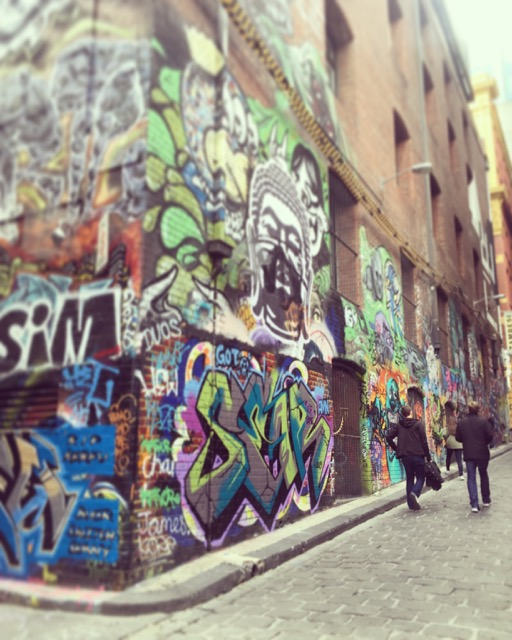
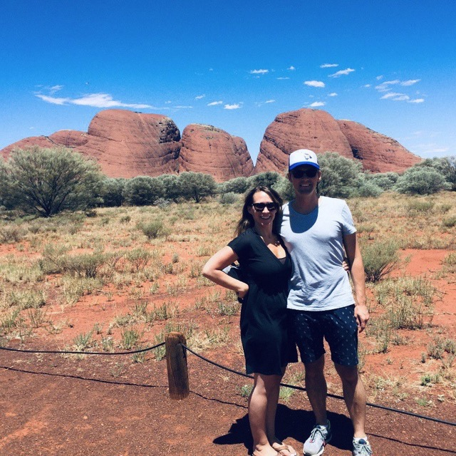

<link rel="stylesheet" href="kraustralia.css" type="text/css">

 
 
 

# <!--- 0 Let's Go Anywhere ----------------------------------- -->

<body>
  

   

    <figure>
      
     </a>
    </figure>

  <h3>Let's Go Anywhere </h3>  
  <i>16 January 2015 </i>  
     Seattle, WA  
   

We are setting off to start our new life in Melbourne, Australia. With us on this adventure is as little as we could imagine bringing to a new home halfway around the world. Two bags for each of us to last until our half container pod of remaining essentials (and some not so) are set to arrive 4-6 weeks after we do. 

On a steel gray January morning we bid adieu to Alley 24, our home for nearly four years, tossed our two bags into the Subaru for the last time and drove up to Ballard to crash in our friend's 4' by 7' TV room. This will be our cozy accommodations for four nights until our flight on the 20th. Sometime in that span we'll be selling our trusty steed and further shedding some last possessions that missed the boat but can't be justified in the checked luggage. 

Now that we are unemployed, transient couch surfers the enormity of the move must be faced.  No more second guessing the decision, no more dreamy discussions. Now just real, live logistics -- an AirBnB, work visas, money transfers, international shipping manifestos, packing re-packing our luggage.  

We'll be there soon and once we arrive we'll do our best to document our adventure here so feel free to follow along as we share the highlights of our life Down Under.

  

  </content>
<body>
 

# <!--- 1 Arrival in a Strange Land ------------------------------------------ -->
<body>
  

   

    <figure>
     
     </a>
    </figure>

<h3>Arrival in a Strange Land </h3>  
<i>22 January 2015 </i>  
Melbourne, Vic  
 

A full twenty-four hours after leaving Seattle -- via our scheduled Los Angeles stop and our unscheduled Sydney one -- we arrived in Melbourne. Immigration and customs took a matter of minutes, either a nod to Australian efficiency or, possibly, apathy. Our journey to the taxi stand took us outside and into the heat, a very welcome 36C (97F) heat. As our cab headed into the city our fatigue and exhaustion melted away as our new home came into view out of the car windows.  We had made it. Our new lives here were a blank canvass waiting for us to fill them with memories of a lifetime. This blew a strong wind into our sails; ready we were to see what this continent has to offer. 

After a few wrong turns down some tricky one-way alleys, our driver found our AirBNB flat <em>(apartment)</em> and set us free. We dumped our luggage, changed into our bathers <em>(swimsuits)</em> and headed down to the St. Kilda beach to showcase the whitest skin in all of Oz <em>(Australia)</em>, perhaps the Southern Hemisphere. In the mid-arvo  <em>(afternoon)</em>,our hunger pangs drove us from the beach to Fitzroy Street for a snack.  We cashed in our gift certificate to [Milk the Cow](https://milkthecow.com.au/), a wine and cheese shop near the beach. All manner of fancy spreads and cuts were brought our way; all consumed in short order.  We retired for our first night down under, but not before catching a few matches of The Tennis <em>(The Australian Open)</em> on The Tele <em>(TV)</em>. 

   

  </content>
<body>
 

# <!--- 2 Settling In ----------------------------------------- -->

<body>
  

   

    <figure>
     
     </a>
    </figure>

<h3>Settling In </h3>  
<i>23 January 2015 </i>  
St. Kilda, Vic  
 

On our first full day we dove right into the culture with a lazy cup of morning tea ([Twinnings] (https://twinings.com.au/), of course) on the deck.  The cool, marine breeze of the early morning quickly gave way to summer heat. Inspired to experience this new place we took a long walk along the [Bay Trail](https://en.wikipedia.org/wiki/Bay_Trail_(Australia)) down to Point Ormond. This is a truly fantastic trail. Kilometers upon kilometers of pricey coast real estate dedicated solely to public use. We will undoubtedly spend considerable time moving to and fro on non-vehicular thoroughfare. Bikes must be purchased and soon.  Andy is keen on rollerblades; Erin not so much so.  

The walk back was warm; the heat, the sweat, the sun on our skin all so wonderful after the last few months in wet and cool Pacific Northwest. We live here now. 

   

  </content>
<body>
 

# <!--- 3 The Tennis ----------------------------------------- -->

<body>
  

   

    <figure>
     
     </a>
    </figure>

<h3>The Tennis</h3>  
<i>24 January 2015 </i>  
Melbourne, Vic  
 

For three weeks in late January and early February all eyes -- in the tennis world at least -- are on Melbourne and the [Australian Open](https://ausopen.com/).  Or, more affectionately referred to here on the ground as <em> The Tennis </em>. The cultural immersion program we had set for ourselves dictated that we attend.  

On a gorgeous, sunny Saturday with temperatures near 30C (86F) we arrived early, as did the rest of the city. Tickets to the two main courts were sold out so we settled for ground passes. A ground pass allows access to all other venues but main courts, including the very large Hisense Arena. Our lack of planning did mean we'd miss Venus Williams' match; however, our early arrival permitted a viewing of Serena practicing from up close, so not all was lost. It should not go unmentioned that the lines to enter the cultural events -- the beer and wine gardens -- stretched on to the far reaches of the grounds as Melbourne's 20-somethings shook off last night's hangover and queued up for another run at it. No prom or gala in America had anything on this scene.

Serena's practice session sated our patriotic hunger; next on to Hisense for some live matches. Prior to the opening 11am match seats were plentiful.  As rookies do, we made a rookie mistake and sat in the glaring sun, amazed at why such good seats were available when less optimal ones (shaded) were taken.  A few hours later, the place was packed and we were sweating through our clothes, the full power of antipodal sun baking our pale northern bodies. We endured two hours of roasting to see the Spaniard, Muguruza, down Bacsinszky of Switzerland in a hard fought women's singles match. A welcome relief as the shade enveloped us for match two. Here, the 8th ranked Montenegro-Canadian Milos Raonic used his 220+ km/h serve to breeze by the scrappy Benjamin Becker of Germany.

The grounds were throbbing full at this point and, needing food and drink, we called it a day and left for home.  Our hunger and thirst pulled us into a pit stop at the Royal Croquet Club's (RCC) off-site Aussie Open extravaganza...basically a massive beer garden with food trucks, croquet courts and a DJ spinning house music. Attendance was thin -- it was early -- but judging by the size of the beer stands it would become a righteous rave later in the evening. Still jet-lagged and a good decade older than the intended demographic we could not muster the resolve to go on a day-long drinking spree and, after a delicious snack and two Hahn Lights, made our way home. Cultural immersion complete for today.

   

  </content>
<body>
 

# <!--- 4 Market Day ----------------------------------------- -->

<body>
  

   

    <figure>
     
     </a>
    </figure>

<h3>Market Day</h3>  
<i>25 January 2015 </i>  
Melbourne, Vic  
 

The [Queen Victoria Market](https://qvm.com.au/) is both a tourist trap full of fake Australian Outback hats and crocodile wallets as well as fully functional grocery store and mercantile. In what other seven hectare space upon the face of this earth can you buy a pallet of kangaroo pelts, powerful mystery crystals, Footie gear, a 55-gallon drum of raw almonds, Crest toothpaste, collectible dolls, antique hunting knives and a dozen fresh duck eggs? Any form of great quest can be outfitted from here; same too for fulfilling the needs of most eccentric among us. There is truly something for everyone. We bought none of the above, instead spending most our time investigating the widest variety of cured meats we'd ever seen. 

[Erin] Being from Seattle, my expectations of coffee are high. Melbourne's reputation as having a world class coffee culture proceeds it. In the three days we've been here, I've found it to be as promised and have been been gleefully sampling from a variety of new favorite, local cafes. [Market Lane Coffee](https://marketlane.com.au/pages/south-melbourne-cafe) has a corner shop in the Queen Vic Market and since I wasn't really sure what a flat white or a long black would end up as, I ordered a cappuccino like a pro, right up until I tried to pay for a $4 coffee with two 20 cent coins. (For some reason the smaller coins are larger amounts here). After Googling "long black" I decided it would be the closest to my Americano order back home and I can avoid looking like a complete dumbass next time.  I am also adding this bit of information to save you all from Googling "long black" in the workplace.

With Market bags in hand and caffeine needs met, we took the tram back to our temporary home in St. Kilda for a sunny lunch on our patio. At some point we will stop acting like this is a vacation and get on with the details of finding a permanent dwelling, communicating with family, preparing for work, being responsible adults, but not quite yet...after all, we are still wearing fresh, clean clothes from our suitcases.  Life doesn't really start until laundry calls. 

   

  </content>
<body>
 

# <!--- 5 'Stralia Day ---------------------------------------- -->

<body>
  

   

    <figure>
     
     </a>
    </figure>

<h3>'Stralia Day</h3>  
<i>26 January 2015 </i>  
Burwood, Vic  
 

Australia Day celebrates the 1788 landing of the British First Fleet at Sydney Cove. We expected something like an Australian Fourth of July extravaganza. However, on account of souring public opinion over the ensuing treatment of the Aboriginal peoples, the reality of the holiday is something closer to a modest Columbus Day barbecue. As luck so had it, an old classmate of Erin's had recently moved to Melbourne and had extended to us an invite to a afternoon party out in [Wattle Park](https://www.parks.vic.gov.au/places-to-see/parks/wattle-park), east of the city. On the (not to scale) Melbourne tram map, it looked close enough. Ignorant of the speed, or lack thereof, of the tram system we jumped aboard the 16 Tram headed east then north through St. Kilda East, Balacava, Caulfield North, Malvern, Kooyong and then Hawthorn where we transferred to the 70 Tram whereupon we crawled through Hawthorn East, Camberwell, Surrey Hills and finally into Burwood, home to the Park of Wattle.  Along the way we were overtaken by many cyclists, scooters, rickshaws, jitneys, wheelchairs, mums with prams, stray dogs; really anything wheeled or anyone particularly fleet of foot was bound to pass us eventually.  

Ninety or so minutes later we arrived. The beer that we purchased at the beginning of our journey was now fully the temperature of the ambient air. The small fete was enjoyable, a good chance to meet some local people and test our new land's ability to throw a bash. Marooned out here in the burbs, the only economically sensible thing to do was to ride the same slow pony back to town...at least we knew what to expect this time. We rewarded ourselves for our arduous travels with some of the world's greatest frozen yogurt, [Yo-Chi](https://yochi.com.au/). To walk off these excess calories, we ambled down to the beach to watch the sun dip below the gentle waves of Port Phillip Bay.

   

  </content>
<body>
 

# <!--- 6 Back to Work ---------------------------------------- -->

<body>
  

   

    <figure>
     
     </a>
    </figure>

<h3>Back to Work</h3>  
<i>27 January 2015 </i>  
University of Melbourne, Vic  
 

[Andy] Eventually, the fun had to end. I was down here for a job after all. Mind you I wasn't headed to the salt mines or anything resembling difficult physical labor, but coming back to a schedule and being responsible to an employer was an unwelcome change nonetheless.

I arrived to the sparkling new [Melbourne School of Design](https://msd.unimelb.edu.au/) (MSD) building and my 9:30 appointment with the department's lowest ranking human resources official to find that my name was not 'in the system'.  As a result, I could not be granted my ID card, login information, email, etc. Really anything that would permit me to do any actual work, administrative or otherwise. I was, however, awarded my complimentary kitchen set with a tea mug of a color of my choosing. Now this is the warm welcome I had been expecting. Editor's Note from the Future: This was a foreshadow of the general competence and priorities of the department. 

Additionally, due to some scheduling issues, there is a squatter in my current office for the next few weeks. I have been set up with with a temporary work space in a large group meeting-type room (with adequate space for my tea set).  It is comfortable enough and my office mates -- a pair of ebony mannequins of differing completeness -- are quiet, albeit a bit weird.

By midday I was starting to wonder if I actually had a job here, but in wandering the halls I did locate a door with my name on it...so at least someone was expecting me.  With any luck tomorrow I'll be able to commence my tenure at the University.  For now, I'm just a visitor stuck in a room with mannequins busy balancing his spoon on his nose while shotgunning lukewarm, free tea.  Oh yeah, and every time I leave the room to go to the bathroom I need to place a chair in the door lest it close behind me and lock me out.

   

  </content>
<body>
 

# <!--- 7 Beach Boxes ---------------------------------------- -->

<body>
  

   

    <figure>
     
     </a>
    </figure>

<h3>Beach Boxes</h3>  
<i>30 January 2015 </i>  
Brighton, Vic  
 

When not outside basking in the glorious January weather, we are busy on [Domain.com.au](https://www.domain.com.au/) searching for a place to live. Visiting these homes means walking or taking the trams/trains to different neighborhoods around the city until we are exhausted or sunburned, often both. Our standard operating procedure once in such a condition is to find refuge and relief in a gelato or frozen yogurt shop. I dare you to judge us.

Recently we found ourselves in Brighton touring a home which was wonderful but also for which we didn't really have the budget to live in. Brighton is a beautiful and bougie location just inland from a sparkling white beach. Like a crow drawn to shiny objects, Erin gravitates towards bright colors and patterns.  Being this close, we made time to visit to the famous [Brighton Beach Bathing Boxes](https://www.visitvictoria.com/regions/melbourne/see-and-do/history-and-heritage/heritage-buildings/brighton-bathing-boxes).  Our stay was no short affair.

Sticking our toes in the sand and watching the tourists (ourselves not included; we are locals after all) fumbled with self-sticks was a needed distraction from the stress of finding a home. The rental process here is, well, odd. Open houses or inspections, as they are referred to, are 15 minute affairs, and unfurnished rentals don't come with a washer/dryer, dishwasher or refrigerator unless you are lucky. As a result, the next time we move, we will be the proud owners of a bunch of big ass appliances. Two of the houses that we are interested in have inspection times tomorrow, unwittingly with overlapping 15 minute periods and across town from one another. We will divide and conquer, and hopefully trust the other's judgment...but for now, we worry not about this and relax on the beach dreaming of our next cool, sugary treat.

   

  </content>
<body>
 

# <!--- 8 In Search of a Home ---------------------------------------- -->

<body>
  

   

    <figure>
     
     </a>
    </figure>

<h3>In Search of a Home</h3>  
<i>1 February 2015 </i>  
St. Kilda, Vic  
 

As the calendar turned to February we remain vagabonds, living off of takeout at our small, but comfortable AirBnB in the heart of St. Kilda. We recently put in a rental application for a [small brick home](https://www.realestate.com.au/sold/property-house-vic-albert+park-129879290) in charming Albert Park.  There are no guarantees here in this 'lottery for a rental home' system as it is not clear what merits or perhaps roll of a dice determine whether or not we'll enjoy the luxury of paying a lot of money for a quaint living space. This home is one of hundreds that we’ve looked at online and one of a handful that we’ve inspected and applied for. We feel like we have a good chance here because it isn't the in the hip, cool neighborhoods north of the city, but in a quieter, family-ish area to the south. All the better for us as we prefer beaches and parks to bars and brunches anyways. 

This process has been, well, exhausting.  Our past weekend consisted mostly of jumping on and off various trams to schlep around to far-flung areas of the city in order to inspect homes or check out new neighborhoods. At some of the more glamorously located places, the crowds are insane; over 50 people showed up to a house in Fitzroy on Saturday morning. All this bandying about has its benefits -- we stumbled on a wild Chinese New Year celebration, have found some of the city's best architecture, sampled even more frozen yogurt and gelato shops and even procured Erin her first (likely of many) Australian meat pies. We know some tram routes by heart and now have a pretty good sense of what is overpriced.  All this local knowledge should also help Andy in the classroom where his first day of teaching is soon approaching.

   

  </content>
<body>
 

# <!--- 9 Not So Super Bowl ---------------------------------------- -->

<body>
  

   

    <figure>
     
     </a>
    </figure>

<h3>Not So Super Bowl</h3>  
<i>2 February 2015 </i>  
Prahran, Vic  
 

It was 9am Monday morning and we were headed not to work or to a house showing but, instead, to a pub. A friend from Seattle of a friend from Seattle had invited us out to the [College Lawn Hotel](https://collegelawnhotel.com.au/) in the Prahran neighborhood for the Super Bowl.  Entrance was pricey, but we did get all you could drink beers and wines and a wide variety of free bar foods. This is the sort of spectacle we had expected given all of our study about our new land suggested that the Aussies were "mad for sport."  Upon arrival, we noticed the 12th man flag in the window.  We had made a good choice.

The place filled quickly and there were about 200 people jammed in by the time the game started.  The College Lawn is a big place with numerous outdoor beer gardens, separate rooms and bars, so it never really felt too crowded.  I'd guess it was about 50% Seahawks fans, 30% Patriots fans, 10% random NFL jerseys (Barry Sanders, Darrelle Revis and Mark Chmura...ok, no Mark Chmura) with the balance made up of about 20 odd Aussie dudes who didn't care much for the game, but couldn't seem to pass up all-you-could drink event on a Monday morning.

We met about a dozen people from Seattle or the surrounding area, including one ex-Seattleite whose name was, I kid you not, Erin Krause.  The people and the atmosphere were great, the beer was good and the food was, well, filling.  We'll stop there as nothing really needs to be said about the [game itself](https://en.wikipedia.org/wiki/Super_Bowl_XLIX)....at least we had an ample selection of decent Australian microbrews (and Heineken) to kill the pain.

   

  </content>
<body>
 

# <!--- 10 How Ya Goin ---------------------------------------- -->

<body>
  

   

    <figure>
     
     </a>
    </figure>

<h3>How Ya Goin</h3>  
<i>4 February 2015 </i>  
Albert Park, Vic  
 

After many tours, followup emails and countless hours scouring online listings, we finally secured a place to live. It is a wee Victorian cottage in a neighborhood called Albert Park. It is a quaint, but upscale little area with adequate, but not hip, amenities.  Importantly is only a walk or short bike ride to the beach and a direct tram ride away from the University and downtown Melbourne. We are undoubtedly bringing down the median income for the area. We get the keys on Friday, so we will share more later in the week about the house. 

[Erin] Today, I focused on some early neighborhood reconnaissance. Near our house (feels weird to say this) is another open air market, the [South Melbourne Market](https://www.southmelbournemarket.com.au/). Compared to the Victoria Market we visited last week, this market is much smaller, but it still has amazing variety and better prices. It is less catered to the tourists and more toward locals looking for their groceries, staple items and delicious meals. Specialty shops abound, like the [Tea Drop](https://www.southmelbournemarket.com.au/traders/tea-drop) an entire booth dedicated to exotic and high end teas. It has Easter egg-colored canisters stacked so high, it necessitated a ladder to reach them. And that bookstore-style ladder is not just some trendy design detail, my own order required its use.  

Picking my way slowly stall by stall through the market, I continued to come across the same issue we've both have had for the past two weeks of meeting and greeting friendly Aussies.  Instead of the "G'day" that everyone in America expects Australians to say, we almost always get some slurred version of 'How ya goin' or 'How're ya going?' This obviously means 'Hi, How are you doing?', and so we usually answer 'Good', but every single time there is an urge to answer the question of where I'm going or how I got here, By tram? St. Kilda? I walked?

Knowing that we'd soon be leaving our St.Kilda apartment we spent our evening with a dinner at [Babu Ji](https://www.babuji.com.au/dine-in/) a fashionable Indian restaurant just down the street.  For a bit more than the cost of standard meal, the quality was outstanding. Some of most unique Indian flavors we each have ever tasted.  We are quite grateful that our new home is just a short tram ride away from this gem.  To aid in the digestion of this large meal, we concluded with a nice long walk along St.Kilda Beach.  Our home beach for just a few more days, until we relocated a mile or so to the west.
   
   

  </content>
<body>
 

# <!--- 11 Ikea-a-thon ---------------------------------------- -->

<body>
  

  

    <figure>
     
     </a>
    </figure>

<h3>Ikea-a-thon</h3>  
<i>8-9 February 2015 </i>  
Richmond, Vic  
 

We now have a house. It is filled with exactly nothing as all we own here are the bags we brought on the plane (and the various suncreens Andy has hoarded in the past two weeks) and those are still at the AirBnB we have for a few more days.  So we went shopping.  Furniture shopping -- the seventh level of hell for one of us. In fact, Andy might prefer any of the following over furniture shopping: going to the dentist, watching period-piece dramas and line dancing.  All of this shopping was, however, book-ended by two outdoor festival-type events and fun pit stops along the way -- which is probably why we got through it in one piece. And, not only does Andy now know the difference between a left and right chaise lounge but he can spot pebble weave upholstery from 50 meters out….  

All of the things that we couldn't physically carry out of the store will be delivered to our home sometime in the next week.  With any luck our number of days of sleeping on the floor will be exactly zero.

Overall, our weekend went something like this:

* (Fri) South Melbourne Market [night market](https://www.theurbanlist.com/melbourne/a-list/summer-evenings-at-south-melbourne-night-market) complete with delicious street paella.

* (Sat) Some suburban Ikea and Domain Housewares Mall (think Ron Swanson’s personal hell).

* (Sun AM) West Elm, then urban Ikea (yes, multiple Ikeas in a weekend)

* (Sun PM) The [St. Kilda Festival](https://www.stkildafestival.com.au/) with 300,000 of our fellow Melburnians…right in our back yard.

   

  </content>
<body>
 

# <!--- 12 Moving In ---------------------------------------- -->

<body>
  

   

    <figure>
     
     </a>
    </figure>

<h3>Moving In</h3>  
<i>12 February 2015 </i>  
Albert Park, Vic  
 

This entire blog post could be about nothing more than the series of minor failures that we have had in the past week while moving into our new home. Instead, we will channel the positive and enlighten you with the few, but crucial wins we have had secured.

To begin, we are now the proud owners of a complete set of 'white goods' -- washing machine, dryer, and refrigerator. True adults are we. Once past the initial annoyance of knowing that we would have to not only buy these and but then also move them around to each place we will rent in the city we have become quite attached to them. Not so far as to name them, though.  Not yet.

As our shipping crate of things -- some necessary and others not -- has been delayed until late March, we are trying to get by living minimally until then.  While temporarily living with 'just the essentials' seems simple enough, it really isn't as fun as it sounds to cook a full meal in one pot, or share one towel or sleep on a bed frame without the proper slats, therefore folding the mattress like a burrito, (one of many IKEA fails). To remedy this, Erin broke down and just started buying things we needed.  As satisfying as it felt to start filling up the house, without a car, she was the girl walking a mile and a half with a stainless steel garbage can balanced on her head, and then back a mile and a half to return it when she realized it didn't work with a plastic bag since, per the shopkeeper, you were just supposed to rinse out the plastic liner each time (?). Okay, so in the end we did share some of the fails; some things are too good to keep to oneself.

Back in the win column, we also bought bikes this week. This affair took an entire afternoon at [99 Bikes](https://www.99bikes.com.au/port-melbourne-bike-shop )but we ended up with two beautiful road bikes at a bargain price as well as finding ourselves a new and very Lithuanian friend. Test riding the bikes was a little horrific at first since biking on the wrong side of the road is only slightly less jarring than driving on the wrong side, but we caught on quick.  It took a little convincing our friend that Erin wasn't completely helpless on a bike, and in the end we both walked away with men's bikes. Erin was informed this men's bike would fit her fine due to her "gentlemen's shoulders".  We also learned more than we wanted to know about a recent crime epidemic in Footscray, the state of immigration politics in Australia and tips for maintaining proper brake cable tightness.

Our new wheels allowed us to explore farther and faster than before.  This offered a needed break from hours of Ikea instruction following.  It is also provided much needed practice at operating on the opposite side of street as we will, eventually, find ourselves driving down here.

   

  </content>
<body>
 

# <!--- 13 Walk Around Downtown ---------------------------------------- -->

<body>
  

   

    <figure>
     
     </a>
    </figure>

<h3>A Downtown Walkabout</h3>  
<i>14 February 2015 </i>  
Melbourne, Vic  
 

To celebrate St. Valentine (Valentino in the large Italian sector of Melbourne) we explored our city -- a long date filled with many cultural institutions and ice creams.  We began with a trip to the [State Library](https://www.slv.vic.gov.au/) and concluded at [Federation Square](https://fedsquare.com/), connecting these two iconic places via the least efficient and most interesting route possible. Down alleyways and up lanes, along the [Yarra River walk](https://walkingmaps.com.au/walk/3980) and through a Chinese New Year’s festival. Erin paused to capture more photos of activated streetscapes and sidewalk cafes than Andy cared to, but this city is proving to be a designer’s dream and she can’t help but get swept up in it.

Over the past few weeks, Erin has spent considerable time in cafes stealing wi-fi and drinking coffee with Melburnians. She's become familiar with the standard breakfast that is ordered to accompany a morning coffee.  The usual is a granola-based dish (occasionally bircher) with yogurt and some take on fruit compote.  Now that we have acquired a pot for our kitchen, she has decided she should start making this simple breakfast dish at home instead of eating out so much.  We are in the middle of summer, and all the markets are selling stone fruit for crazy sales, so recently she lugged home 2 kilos of it -- which is, as she learned, considerably more than two pounds and not that easy to carry home. When Andy came home to a fruit poaching factory and asked what I was making, he heard ‘Truman Capote’ instead of ‘fruit compote’, so now every morning for breakfast, I sit down to a small, but satisfying bowl of yogurt and Truman compote.

   

  </content>
<body>
 

# <!--- 14 A slice of home  ------------------------------- -->

<body>
  

   

    <figure>
     
     </a>
    </figure>

<h3>A Slice of Home</h3>  
<i>21 February 2015 </i>  
Melbourne, Vic  
 

In need of a vacuum, a year’s worth of toilet paper, three liters of barbecue sauce, a kilo and half of haloumi and several other bulk items that can only be moved with a pallet jack, we took a short tram ride to [Costco Australia](https://www.costco.com/warehouse-locations/docklands-melbourne-victoria-5101.html), conveniently located just north of downtown Melbourne. Rumor has it that the Melburnians were so pleased with the arrival of the big ‘C’ that they built a Ferris wheel in the parking lot.  

It was hot; 37C to be exact, which is about 99F if you are a Yank.  Inside of Costco -- a Costco nearly identical in shape, layout, color and smell to those back home -- was a comfortable 20 degrees. There were Kirkland signs everywhere, large families moving very slowly down every aisle and the pervasive odor (aroma?) of grilled meats. We trolled the samples; Erin hitting up the Jelly Belly lady more times than is likely allowed. Our cart swelled, we had purchased enough necessities that we had to catch a cab home as schlepping all of our goods on the tram would have been poor form. It was oddly comforting (or maybe no so oddly) to be in a place so familiar so far from home.  We’ll definitely make this a monthly outing…if for no other reason than to buy affordable American whiskey. 

In the afternoon, we took a short walk to the Optus store to update our cell phone plans. On the way home we were caught in a very heavy 15-minute downpour.  The sun was shining, the wind howling and massive raindrops pummeled the sidewalk.  It passed, but the heat did not abate so we grabbed some cheap beers and headed to the beach for sunset.  Sundowners on the beach just a ten minute walk from home.  This is a life one can get used to.   

   

  </content>
<body>
 

# <!--- 15 Furniture and F1 ------------------------------- -->

<body>
  

   

    <figure>
     
     </a>
    </figure>

<h3>Furniture and F1</h3>  
<i>25 February 2015 </i>  
Albert Park, Vic  
 

It was a big week for us. We bought a grill (*barbie*), our couch and desk were delivered (installed incorrectly) and our internet was finally installed (with speeds near that of Andy's early 2000s dorm room...). After tethering our cell phones to our computers in order to get work done and sitting on the floor for 2 weeks, this was a big improvement.  That said, we are coming around to the minimalist approach. Here, here, [Marie Kondo](https://en.wikipedia.org/wiki/Marie_Kondo). By the time our shipping crate arrives -- now scheduled for early April -- we may wonder why we thought we needed all the stuff we brought from Seattle. We will also have to find a place for our bikes which are currently stored in our second bedroom with all of the giant boxes from our appliances. Our recycling bin is small so each week Erin carefully cuts down the huge boxes into smaller pieces to jam into the tiny bin. We may have emptied that room out by mid-April, it will be tight. We've considered an illegal bonfire in the middle of street some night, but the Aussies as a whole are a bit jumpy about potential bush fires.  

We are riding our bikes every day and it almost feels OK to be riding on the wrong (left) side of the road.  After we moved in to the neighborhood we realized that the [Melbourne Grand Prix](https://www.grandprix.com.au/) course takes up residence here as well every March.  Although the races don’t actually start until the 12th of March, the course has been under construction since we have been here.  The course is a loop road around [Albert Park Lake](https://en.wikipedia.org/wiki/Albert_Park_and_Lake) and until they fully shut the road down our new evening ritual is to take laps around the course. It is actually quite fun whipping around the F1 course with no cars on it. Apparently it is going to be incredibly loud in our little village, but it seems like it will be entertaining. A lady in Erin's boxing class said she heads to the coast every year at this time since the neighborhood becomes “overrun with Bogans” (Australian term for 'redneck').

   

  </content>
<body>
 
 
# <!--- 16 A Walk in the CIty; A Walk in the Bush ------------------------------- -->
<body>
  

   

    <figure>
     
     </a>
    </figure>

<h3>A Walk in the City, A Walk in the Bush</h3>  
<i>2 March 2015 </i>  
Melbourne + Belgrave, Vic  
 

We are getting to know our new city bit by bit and day by day.  Whether by suggestions from new friends, places we have read about on local websites or curiosities stumbled upon while lost, we end up on weekly field trips to discover little city gems.

Whilst wandering the city, one of the most pleasant surprises is volume and diversity of street art in Melbourne.  This weekend we decided to specifically search out some of the downtown alleys and lanes that have been transformed to destinations.  While at first we were reminded of the Gum Wall in Pike Place Market -- the alleys smelled appropriately of warm garbage and small packs of people were milling around and taking pictures -- the colorful and character-filled alleys won us over and our hunt for the best hidden murals took most of the afternoon.

Before we moved here, we made it a priority each weekend get out of the city to hike or camp.  We realized it had been five weeks of living in Melbourne and we hadn't gotten out of town so we decided to take the train 1.5 hours east to the end of the line and spend some time hiking in the [Dandendong Ranges National Park](https://www.parks.vic.gov.au/places-to-see/parks/dandenong-ranges-national-park). The Ranges are hills, not mountains, but no matter, nature is nature. We hiked through massive Eucalyptus forests and other than an unruly and incredibly loud swarm of parrots, we didn't run into any wildlife, poisonous or otherwise. The smell of the Eucalyptus forests are intoxicating; an aroma that will no doubt stick with us for the rest of our days.  Erin did see a small red ant on Andy's back on the walk back to the train station which she immediately overreacted to and yelled "Fire Ant!"  before swatting at repeatedly.  The veracity of the ant sighting remains in doubt by one of our party.

   

  </content>
<body>
 
 
# <!--- 17 Classroom Debut ------------------------------- -->

<body>
  

   

    <figure>
     
     </a>
    </figure>

<h3>Classroom Debut</h3>  
<i>8 March 2015 </i>  
Parkville, Vic  
 

[Andy] The students returned to campus this week, which meant the peacefulness I had been enjoying at work was suddenly shattered. It was easy to forget what a scene a thriving 40,000 student campus could become. Added to this was the fact that we were housed in a brand new building, the likes of which the students hadn't seen yet, so much gawking, pointing and general malaise in way-finding occurred.  The start of the school year also meant that I had to teach.

In terms of week one, well, I survived.  My class lost a few minutes being locked out of our room and I undoubtedly used a number of American terms that they have no idea the meaning of.  To date, no official complaints were lodged with administration.  We'll see how many students show up this coming week.  While the students were focused on finding their classes, I sneaked away one afternoon to read in the sun on the surprisingly empty cricket grounds, enjoying the open spaces far from the teeming masses. 

After we accepted the job here and realized we would be moving to Melbourne, we spent a good bit of time poking around on Google Earth to check out our new city.  Once we came upon the small town of Ferntree Gully, we knew we had to pay it a visit.  I mean, it just sounds mystical, right?  The weather on Saturday was cloudy, but pleasant so we hopped a train bound for this -- assumed to be -- magical place.

The town is located at the edge of the [Dandenong Ranges National Park](https://www.parks.vic.gov.au/places-to-see/parks/dandenong-ranges-national-park), and hiking is the main attraction.  While it wasn't the easiest place to get into, the hike proved quite steep, challenging and full of massive eucalyptus (gum) trees and very little undergrowth.  A really nice, though busy, place for an afternoon hike.  Also, today we learned that there is an [Upper (but no lower) Ferntree Gully](https://en.wikipedia.org/wiki/Upper_Ferntree_Gully,_Victoria); the Upper also containing a chocolate factory.

On Sunday morning, we went for a short bike ride along the beach, cleaned up the back yard and then, when the sun came out, went back to the beach to relax.  We caught the end of a co-ed beach volleyball tournament -- that with a bit of practice -- we figured we could have been competitive in.  Next year....

We are settling in to a rhythm, a life less driven by hectic home searching and appliance shopping and more on finding a calmer, healthier routine than we had back in the States.

   

  </content>
<body>
 
 
# <!--- 18 Experimental Cooking ------------------------------- -->
<body>
  

   

    <figure>
     
     </a>
    </figure>

<h3>Experimental Cooking</h3>  
<i>18 March 2015 </i>  
Parkville, Vic  
 

[Erin] Growing up, whenever my mom would try a meal outside of her wheelhouse, she would always preface the meal with the descriptive warning that it was ‘experimental’. Carrying this over into my adult life, I have begun to refer to Andy’s enthusiastic use of flavors and discretionary attention to recipes as ‘experimental cooking’ and now whenever we try something new, it gets the ‘experimental’ disclaimer.

Food is culture. And there are a lot of new flavors in Melbourne for us to audition.  Lamb shows up in places it would never been seen in the U.S. There is a new palette of seafood and an incredible amount of beetroot. Some foods just have different names, like Capsicums (bell peppers), Lollies (sweets), PawPaw (Papaya), hundreds and thousands (candy sprinkles).  When I go to the market, I often spend a lot of time wandering around finding new things to try out in recipes.  The latest experiment involved a can of Duck Fat I found at the market.  Although this sounds absolutely disgusting, and honestly doesn’t look much better, I roasted baby potatoes and sage with duck fat and it was delicious.  I am pretty sure we will always be fully stocked with a gross little can of duck fat in our pantry from now on.

We remain without our shipment of goods and I refuse to buy a bunch of kitchen tools/dishes since we have all of our stuff ‘on-the-way’, we are rolling with just the essentials right now. This means 1 pot, 1 pitcher, 2 sets of cutlery, 2 plates/bowls and a variety of [Shark Reef Knives](http://www.sharkreefknives.com/) that we got for Christmas and had to check in our baggage. Remarkably, one can do a lot with one pot.  Just today with said pot,  I made tea, poached two eggs, toasted some pepitas, trapped a large bee-fly and transported it outside, cooked a chili pork ragu, and cooked and then roasted a cheesy polenta. Of course this usually means it takes twice the amount of time that any normal cooking process might take, but it usually gives me twice the satisfaction. Plus, Australia is an island and everyone here is on some form of Island time...might as well join the crowd.

Today’s Experiment:  Chili Pork Ragu over Cheesy Polenta and Kale Salad with Fennel and Apple.

In adventure news, we rigged a setup to allow our hammock in the backyard (garden) and took a nice long bike ride down the [Yarra River Trail](https://en.wikipedia.org/wiki/Main_Yarra_Trail), stopping only 'intermittently' to photograph interesting landscape design.
   

  </content>
<body>
 
 
# <!--- 19 Mornington, Day 1  ------------------------------- -->
<body>
  

   

    <figure>
     
     </a>
    </figure>

<h3>Mornington, Day 1</h3>  
<i>20 March 2015 </i>  
Mornington Peninsula, Vic  
 

For Erin's upcoming birthday we decided to finally leave the comforts of the big city and venture into rural Victoria -- the Mornington Peninsula to be precise.  To do so meant renting a car and driving. Not just any driving, but driving on the left hand side of the road...or basically unlearning everything that you've been consciously (and sometimes not so) doing for the past 15-20 years.

We picked up our small Toyota at 9am on Friday morning, convincing conned the salesman into believing that we knew what we were doing, entered the car on the correct side and managed to get out of the rental lot without hitting anything or anyone. The first 15 minutes are weird.  It is very hard to estimate the extents of your vehicle and we took a slow, circuitous route home to pick up our luggage and then were off.  The next 45 minutes are a bit less weird and finally after about an hour or so of driving it starts to feel somewhat natural.

Out of the city, we continued on the Nepean highway to the little town of Mornington and stopped for breakfast. From there we took the bay side road all the way to the [Point Nepean National Park](https://www.parks.vic.gov.au/places-to-see/parks/point-nepean-national-park). The parking lot was located in the old hospital and quarantine grounds that were used to offload passengers from British ships and stop the spread of typhus or whatever other diseases (not including bad taste and worse cooking) the Brits were bringing this way. From there, we hiked the coast all the way to the end of the Peninsula and the former Fort Nepean. Along the way we explored many of the bunkers, though for fear of snakes and poisonous spiders elected to remain on the exterior. The threat of unexploded ordnance, however, couldn't quite keep our adventurous spirits in check.

We hiked the road on the way back from the Fort and ran into our first large native monotreme, an echidna. Despite Erin's attempts to get a selfie with our new friend, he remained completely oblivious to us and cared only about sucking ants up out of the ground.

After our hike, we drove down to the [Cape Schanck lighthouse](https://www.parks.vic.gov.au/places-to-see/parks/cape-schanck-lighthouse-reserve), our intended accommodation for the evening.  Upon arrival, we were notified that they were full and that they had not received our reservation details from Expedia.  After 90 minutes of phone calls to various parties we were able to wrangle a refund from Expedia (or so we've been promised).  Each side blamed the other and tried to set us up elsewhere, but we just took the money and ran.  Most places were full on a Friday night but we were able to land a room at the [Lindenderry Farm and Winery](https://lancemore.com.au/properties/lancemore-lindenderry-red-hill/) up on Red Hill.  We slept comfortably after a long day of beach hikes, driving and phone calls with various customer service representatives...the latter being the most exhausting.

This was our first trip out to the open ocean (as Melbourne is on Port Philip Bay) and it is every bit as wild, windy and rugged as imagined. Oh, and also quite beautiful.

   

  </content>
<body>
 
 
# <!--- 20 Mornington, Day 2  ------------------------------- -->
<body>
  

   

    <figure>
     
     </a>
    </figure>

<h3>Mornington, Day 2</h3>  
<i>21 March 2015 </i>  
Mornington Peninsula, Vic  
 

Our last minute lodging at the Lindenderry Farm and Winery proved restful and we woke before sunrise to head to the [Mornington Peninsula Hot Springs](https://www.peninsulahotsprings.com/). With over twenty mineral pools to dip and soak in, we thought it would be the perfect morning activity. As the first people through the door, we hustled up the hill to stake our claim in the aptly named Hilltop pool. Doing so enabled us to catch sunrise with a 360-degree view all to ourselves. As other guests started to show up to the best pool in the land, we made our way down the hill to try out each of the different mineral pools.

Erin loves lighthouses. There is something romantically lonely and tragic about them and they are always anchored on some patch of wild coastline like a brave little pawn. The Cape Schanck Lighthouse was no different, and even though we weren't able to spend the night there as planned...we did return today to hike along the coastal trails of the National Park. Although the weather was hot and sunny, the wind made the temperature feel quite brisk, and after walking down the many stairs from lighthouse, we tucked in to this little cove and stretched out on the warm rocks before the steep hike back up the cliffs.

We spent the remainder of the day driving along the coast from small town to small town.  We stopped at a beach outside of Flinders to watch the surf competition that was in progress and next, in the town of Sorrento, at the sports fields to watch an ongoing game of Australian Rules Football. We had apparently parked in the equivalent of the endzone and our rental card got hit a few times by the ball. We probably could not have been less obvious as outsiders if we been sprinting around draped in a house-sized American flag.  To finish the day, we met up with some of our new friends at a particularly photogenic beach cove in the town of [Portsea](https://www.visitmelbourne.com/regions/mornington-peninsula/destinations/portsea) for 'sun-downers'. With our new mates, local wine and our toes buried in the sand, we toasted to the weekend.

   

  </content>
<body>
 
 
# <!--- 21 Bachelor Life ------------------------------- -->
<body>
  

   

    <figure>
     
     </a>
    </figure>

<h3>Bachelor Life</h3>  
<i>31 March 2015 </i>  
Albert Park, Vic  
 

[Andy] A few weeks ago, you heard about Erin’s daily routine of one-pot cooking, sun-bathing and trips to the market.  With Erin in Hawaii visiting her family and me living the bachelor life, I’ll provide some insight into my own daily exploits. 

I teach on Tuesday and generally have meetings, class prep and other administrative duties on Monday and Thursdays.  On those days, I take the leisurely 80-meter walk to our nearby stop and grab one of the [#1](https://www.ptv.vic.gov.au/route/721/1/) trams all the way to the University.  While a slow and often cramped ride, it drops me off less than a block from our new [Melbourne School of Design building](https://msd.unimelb.edu.au/).  These old beasts are usually full of business people and students and do, somewhat sadly, lack the ‘socio-economic experience’ of riding the bus through downtown Seattle.

My office (shared) is in the far northwest corner of the top floor of our new MSD building.  It afford regional views and abundant sunlight.   Wednesdays and Fridays are work-at-home research days whenever possible.  Weather permitting, they begin with a long, exploratory bike ride somewhere around the city.  Melbourne has an amazing number of bike trails and lanes which make navigating in the city very easy.  I’ve stumbled across many charming new neighborhoods and interesting acts of graffiti while pedaling away.

With Erin gone, I get the hammock to myself and have been eating a variety of grilled meats and simple greens.  Little in the way of laundry or unnecessary cleaning has been done.

   

  </content>
<body>
 
 
# <!--- 22 Botanical Gardens ------------------------------- -->
<body>
  

   

    <figure>
      
     </a>
    </figure>

<h3>Botanical Gardens</h3>  
<i>5 April 2015 </i>  
Melbourne, Vic  
 
 
The city is a ghost town.  It is Easter weekend, a national holiday, and it would appear that most of our neighborhood and a fair bit of the city are off for a final summer's weekend someplace else.

That included the shop owners and retail clerks.  As everything was closed up tight, we walked to the [Royal Botanic Gardens](https://www.rbg.vic.gov.au/) which are open every day free of charge. The Gardens were established in 1846 on a swampy site near the Yarra River.  As the city expanded around the gardens, the 38 hectares, (or 93 acres if you constantly forget what a hectare is like I do), remained, and continued to develop into the verdant treasure it is today.

[Erin] Since moving to Australia, I learned that there are over 700 different species of Eucalyptus, and since I can only make up so many Latin names before Andy starts to get suspicious, I figured I should start learning the 690 I don't currently know. I didn't make much of a dent in this quest for knowledge, but it was a wonderful way to spend our first Easter day in the middle of Fall.

  

 </content>
<body>
 

# <!--- 23 Grampians National Park  ------------------------------- -->

<body>
  

   <a id="kr23"> 
   

    <figure>
      
     </a>
    </figure>

<h3>Grampians National Park</h3>  
<i>6-7 April 2015 </i>  
Halls Gap, Vic  
 
 
To broaden our knowledge of our new State of Victoria, we embarked a quick two-day trip out for some bushwalking in the [Grampians National Park](https://www.visitgrampians.com.au/discover-the-region). The Grampians Mountain Range, or Gariwerd as known to the local Aboriginals, is a photogenic sandstone range that runs north-south cutting through the Victorian plains. The park is about 160 miles west of Melbourne, rising up from the surrounding farmlands like a shark's fine in the water. 

We set out early Monday morning in our little rental car with two goals: 1) To keep to the left side of the road; and 2) To see some kangaroos in their natural habitat. We reached the small town of Halls Gap at the base of the National Park in the mid-morning.  The weather was very Pacific Northwest-y, but we braved the windy and overcast conditions to spend the better part of the day exploring waterfalls, lookouts and canyons. That afternoon as we drove back through Halls Gap on the way to our hotel, we realized that there were dozens of kangaroos scattered in every field we passed.  Since moving to Australia, we went from a kangaroo count of zero to over three hundred in one day.

On Tuesday morning we left the [Grampians Motel](https://grampiansmotel.com.au/) early in order to ensure a parking spot as we undertook one of the parks more popular hikes, [The Pinnacle](https://www.parks.vic.gov.au/places-to-see/parks/grampians-national-park/attractions/central-grampians/things-to-do/the-pinnacle-walks). We needn’t have worried, as it was lightly showering and extremely windy we were the only car at the trailhead both when we arrived and left. The solitude coupled with the dramatic weather made the summit of The Pinnacle eerie, and even though we didn’t get the sweeping views that hike normally promises, it was well worth the scramble.

  

 </content>
<body>
 
             
# <!--- 24 Fall and Footy  ------------------------------- -->

<body>
  

   

    <figure>
      
     </a>
    </figure>

<h3>Fall and Footy</h3>  
<i>16-18 April 2015 </i>  
Melbourne, Vic  
 
 
Fall is definitely here, as the non-indigenous, deciduous trees are all beginning to drop their leaves.  After a lifetime in the Northern Hemisphere, it is really hard to condition yourself to think of April as being fall. We've both continually been referring to the upcoming months as 'summer', though they'll be anything but as our local friends are keen to remind us.  People here have assured us that it will get cold; we just are not quite sure how much we trust the judgement of those who grew up places like Sydney and Brisbane when it comes to defining cold.  I guess we'll find out soon enough.  While we wait, we are enjoying the cooler weather by cycling and walking about the city. 

Like in the States, the end of summer means the start of the football season.  [Australian Rules Football (AFL)](https://www.afl.com.au/) starts around April 1st each year and plays games every weekend for 23 weeks. We've watched a bit of it on the 'telly' (Australians abbreviate any and everything with more than 3 syllables) and can tell you that, while Football is an appropriate name in some sense, it is nothing similar to the NFL.  It is more like an adult game of tag mixed with kickball and soccer.  We've been assured attending games is good fun...so we decided we'd try it.

When we first moved here, the second thing everyone asks you (after where you are living) is which AFL team you support.  There are 18 teams in total, 10 of which are from the Greater Melbourne area (and Geelong).  AFL used to be a Melbourne-only sport -- then call the Victorian Football League -- but had gone national in the past few decades. Teams are based in the various suburbs and larger neighborhoods of the city.  It seems that fans generally cheer for the team near where they grew up, but not always.  Living in South Melbourne, our neighborhood team had left to become the [Sydney Swans](https://www.sydneyswans.com.au/) some time ago, so we had no obvious choice for a team.  The nearest teams to us are [St. Kilda](https://www.saints.com.au/) (4-19 last year) and the downtown team, Melbourne (lacking in 'spirit', we've been told).  Neither of those seemed very appealing.  The next closest are the North Melbourne Kangaroos.  They had a home game this Saturday at 7pm, so we decided to see if this squad might be worth our affection.

The 'Roos started out slow and quickly fell behind 15-6 in the first quarter.  One of the first things you realize when at the game is how much the local fan base contests every single foul call (or non-call) by the officials -- the seven spritely young men running around in bright yellow.   They especially hate it when there is a missed 'holding the ball' call on the other team.  Apparently (and we are still figuring this out) if you had a chance to pass or kick the ball, but didn't and then you get tackled it is a turnover to the other team.  It is a very subjective call, and happens quite often.  When it happens to the other team, the entire crowd yells something that sounds like 'hhmmggbbbaaalllll'.  Just imagine stuffing a complete hot dog and bun into your mouth and then yelling "Ball" at the top of your lungs....every 2-3 minutes.  It is, as we were promised, good fun.  Erin's favourite penalty was 'holding the man', which she like to suggest was occurring more than it really was.  The scoring of the game is simple, the strategies pretty straightforward, but the foul calling still remains a bit of a mystery.

We also had the luxury of sitting near a super-fan.  You know, the kind of guy who has a personal, and very loud conversation which each player.  "Oh, Benny, I told you to kick the ball".  "Dammit, George, ***** tackle that bastard", etc. This too was good fun.  Sadly, our team lost 113-105, giving up the deciding goal in the final 2 minutes.  The Kangaroos showed some heart.  Their ball-handling was suspect, but they did come on strong in the second half, have a great mascot and a 6'8" (201 cm) guy who looks exactly like CarrotTop so there is good chance they'll become our team.
  

 </content>
<body>
   

# <!--- 25 Farm Life  ------------------------------- -->
<body>
  

   

    <figure>
      
     </a>
    </figure>

<h3>Farm Life</h3>  
<i>1-3 May 2015 </i>  
Ballarat, Vic  
 
 
This weekend we were invited out to visit our friends Brooke and Steve who are ‘farmsitting’ for a month out in the country. The farm is just outside of the town of Ballarat and although it seemed a world away from the city, it only took about an hour’s drive when we left midday Friday.

After an obligatory tour of the farm, we drove into Ballarat to supplement our meager provisions.  Prior to the first gold strike, Ballarat was a humble sheep station, but it quickly turned into a major settlement in the 1850’s during the [Victorian Gold Rush](https://en.wikipedia.org/wiki/Victorian_gold_rush).  Food and drink secured, we toured the city first via car, then opting to stretch our legs with a walk around Lake Wendouree, site of the 1956 Olympic Rowing events.

An afternoon of more drinking than eating led a late night game of Australian Trivial Pursuit with all of use falling asleep to chorus of frogs that sounded like chiming cell phones. We spent a lazy Saturday morning of exploring the farm and the surrounding bush.  Steve led us on a bushwalk through huge Eucalyptus groves and farm fields where we sighted a smattering of wallabies, kangaroos and parrots. Responsible for the maintenance of the farm, we checked for eggs, brought water for the sheep, and threw treats for the pet magpie all the while Erin pointedly avoided the llamas and alpacas, (still traumatized from those llamas at Natalie Roush’s farm). Animals fed, we then tended to our own hunger by gathering Meyer lemons from the trees, cutting home grown squash, and enjoying fresh Eucalyptus blossom honey from the neighboring farm.  Foraging has never felt so successful.

The main event of Saturday was a pilgrimage to a nearby town of Clunes for the annual ‘booksale’. This booksale is actually a huge event, especially for a town just slightly larger than our home towns of [Navarino (WI)](https://townofnavarino.org/) and [Lopez Village (WA)](https://en.wikipedia.org/wiki/Lopez_Island).  The [Clunes Booktown Festival](https://www.clunesbooktown.com.au/2020/) closes down the town’s main street for cars and opens it up for book stalls, food trucks, live music and more book stalls.  The shops along the main street are opened up as temporary bookstalls and book traders from all around set up shop for the weekend.   As a group of book-nerds, this was our Mecca.  We  headed out on our own for the afternoon and each found ourselves elbow-deep, pawing through hundreds, thousands of books. Erin held herself to only three books, two on the local botany and biology and the last an old children’s book, an illustrated account of the discovery, exploration and colonization of Australia.  As we both know very little of our new country, it pays to start from the beginning.

About the time we returned back to the farm and starting preparing for a dinner Aussie style (which really just means double the amount of food any normal feast might have), the power went out.  Our new friend Ellen came by from a neighboring farm, (also without power) and so we all settled in for a night in the dark and went about re-imagining a dinner where everything could be made on the gas grill outside. We grilled Lamb, Chicken and steak, potatoes and every vegetable we could find   in the fridge or garden (found via torch (flashlight)).  The power came on as we had finally amassed enough candles to light up the table and we sat down to enjoy our efforts.  Dessert was apples filled with dates, brown sugar and sultanas (raisins) and baked in tinfoil...the oven coming back to life just in time. 

In the morning, we collected more bounty from the farm to take home with us and went on another bushwalk to soak in the smells of the eucalyptus grove. Brooke and Steve dropped us off at the train station in Ballarat and we headed back into Melbourne after a satisfying weekend in the decidely less cosmopolitan side of Victoria. 

  

 </content>
<body>
   

# <!--- 26 A Day of Culture  ------------------------------- -->
<body>
  

   

    <figure>
      
     </a>
    </figure>

<h3>A Day of Culture</h3>  
<i>10 May 2015 </i>  
Melbourne, Vic  
 
 
[Erin] Our well-laid plans to hike in the mountains east of the city were dashed due to storms. We pivoted and instead embarked on an urban hike to try to get to know our city a little better.  Andy kept on calling this a ‘Day of Culture’ but since I am writing this blog post, I will note that a ‘Day of walking really far’ would have been just as apt.  From our home in Albert Park, we trekked first to the [National Gallery of Victoria](https://www.ngv.vic.gov.au/), a wonderful and yet free gallery with art from around the world. 

Although I loved the Nordic art / furniture exhibit and the Mesoamerica art, my favorite would have to be a piece called ‘The Island Bird’ by Ernesto Neto. It was part Swiss Family Robinson tree house part hammock meets Chuck E. Cheese ball tank. I am sure the artist would be horrified seeing this description but I thought it was amazing. After I doubled checked with the attendant that yes, you can walk around in this giant hanging bird nest in a gallery, I bounced around until Andy got antsy and then bounced around a little more. (I obviously bounced as respectively as one can bounce being that I was in a national gallery)

We left the gallery, crossed the Yarra river, and walked through [Federation Square](https://fedsquare.com/), a large mixed use development adjacent to [Flinders Station](https://en.wikipedia.org/wiki/Flinders_Street_railway_station), built over the rail lines.  Although the modern design was hotly contested when proposed in 1997, (especially considering the historic character of the surrounding context), I love the buildings and series of open spaces that are built today.   By way of the Melbourne CBD (Central Business District), we moved on to the next destination, Cook’s Cottage in Fitzroy Gardens.  [Cook’s Cottage](https://en.wikipedia.org/wiki/Cooks%27_Cottage) is purportedly the oldest building in Australia, as it was actually constructed in Yorkshire, England by Captain Cook’s parents in 1755, before being dismantled brick by brick, shipped and reconstructed in the middle of a downtown Melbourne park in 1935.

We continued on from the cottage and towards the Richmond neighborhood a couple miles away.  I am in search for the best Bibimbap, a Korean rice dish, and I had scouted out a tiny shop called [Seoul Soul](https://www.timeout.com/melbourne/restaurants/seoul-soul) for a lunchtime stop.  For those not obsessed with the dish, Bibimbap is a staple Korean dish usually some variation of rice, sautéed and seasoned vegetables, chili and sesame sauce, grilled meat with an egg on top.  Mixed all together, this is one of my favorite foods and the Seoul Soul Bibimbap served in a hot stone pot, (everything is better with a little sizzle), was perfect.

From the largely Vietnamese neighborhood, we walked to the hipster central neighborhood of Fitzroy. On the way we stopped in Collingwood at a small Japanese café/shop Mina-no-ie, for afternoon tea and coffee.  While I was delighted with my coffee and opportunity to peruse tiny and well-designed crafts from the shop, Andy somehow ended up ordering the same type of odd barley/green tea he hated so much in Japan.

We ended our adventure a while later in Fitzroy and took the tram all the way home.  All in all, we walked well over 10 miles today through our fine city.  (10 miles sounds much more impressive in kilometers, about 16 km)

  

 </content>
<body>
   

# <!--- 27 Sunshine Coast ------------------------------- -->
<body>
  

   

    <figure>
     
     </a>
    </figure>

<h3>Sunshine Coast</h3>  
<i>23 May 2015 </i>  
Alexandra Headlands, Vic  
 
 
As an early birthday present, Erin planned a short trip for us to Noosa and the [Sunshine Coast](https://en.wikipedia.org/wiki/Sunshine_Coast,_Queensland) -- a set of beachfront communities about an hour north of Brisbane.  We caught a Thursday afternoon flight out of Melbourne, which was quite bumpy due to the developing thunderstorms along coast.  As we approached the landing, our pilots hit the gas and pulled out of it a few moments before impact and then circled around and landed in the other direction.  I think everyone on board was relieved when we finally touched down.   No explanation for our little stunt episode was given.

We would be spending the first two nights in a condo along Alexandra Headlands Beach (right between Mooloolaba and Maroochydore) before heading up to Noosa at the end of the trip.  Our taxi driver from the airport was a serious Queenslander.  We were told that “Finding ace tucker ‘round here is a piece of piss.  Heaps of feed joints in every direction.  No fossicking for a schooner either, mate.”  In English: Our place of stay was in the vicinity of numerous restaurants and bars.  He also informed us that once a month he and the other cabbies drive a few hours north to the [Bundaberg Distillery](https://www.bundabergrum.com.au/) and load the entire boot (trunk) of the car up with rum to last them the month. Queensland is a strange amalgamation of south Texas, north Florida and West Virginia. 

We did little the first night.  Erin was amazed at the incredibly poor offerings on Australian TV (Volcano starting Tommie Lee Jones and Anne Heche, Knights of Badassdom staring Steve Zahn and Peter Dinklage, six cooking shows and one musical game show).  The weather was perfect the next day and we went for a long beach walk, perused some of the area’s finest ‘op’ shops (goodwill-type stores) and read in the sun.  The evening’s lineup was much improved: Wolf of Wall Street and some live rugby action. We retired; sunsoaked, exhausted and pleased.

  

 </content>
<body>
   

# <!--- 28 Noosa ------------------------------- -->

<body>
  

   

    <figure>
     
     </a>
    </figure>

<h3>Noosa</h3>  
<i>25 May 2015 </i>  
Noosa, Qld  
 

We left our Alexandra Heads accommodation early on the slow bus bound for Noosa.  The trip -- cheap and comfortable -- follows the windy road all up the coast.  We stopped every kilometer or so to pick up a barefooted surfer or two along the way. By the time we slowly rolled into downtown Noosa the bus was packed with surfboards and dreadlocks; though lacking shoes and shirts. 

[Noosa Heads](https://www.visitnoosa.com.au/destinations/noosa-heads) is a very quaint, somewhat high-end beach town tucked in between a national park and brackish bog.  Its beach is north-facing which makes it an oddity along the eastern coast and, often, much sunnier and warmer than other east-facing beaches.  After stashing our luggage in a locker we quickly found a frozen yogurt stand.  Then off to the beach for some relaxation.  Erin read, Andy played in the waves wary of the stories of box jellyfish he had heard and then attempted to nap.

[Andy] To cool down from the relentless Queensland sun, we found an ice cream stand.  Not just any ice cream, but liquid nitrogen cooled ice cream.  They mix the ingredients in front of you and then rapidly cool it.  It is advertised as being smooth as silk.  This I can verify.  It is truly a game changer in terms of ice cream.  Your town needs a franchise, trust me.

Our friends Jodie and Paul picked us up shortly thereafter and we grabbed some beers and headed up to the National Park for sunset.  A civilized nation, open intoxicants are allowed in most places provided you aren’t being a jackass.  Maybe it was the beer on an empty stomach (or some sort of nitro-ice cream high), but the sunset seemed to last forever as we watched the surfers take in the last of the days waves.  Afterwards we grabbed a meal and drinks in Noosaville near Jodie’s parents place.  Australia also has this weird (unique) custom were you can bring your own alcohol to restaurants.  No more \$40 bottles of wine at dinner.  Simply show up with your favorite \$8 bottle of Syrah and drink the meal away.

On the way home Paul was able to convince driver Jodie to stop at a gelato stand.  Naturally, I had some, thereby completing the ultimate trifecta of frozen yogurt, ice cream and gelato in the same day.  Check that off the list.

The next morning, we did a long hike at the national park and then I headed to the airport for an afternoon flight home.  Erin stayed on for another two days to enjoy the beach and the warmth of north east Australia.

  

 </content>
<body>
   

# <!--- 29 Delivery ------------------------------- -->

<body>
  

   

    <figure>
     
     </a>
    </figure>

<h3>A Long Awaited Delivery</h3>  
<i>28 May 2015 </i>  
Albert Park, Vic  
 
 
After five months at sea – well more like two months at sea and three months in customs and port storage facilities – our shipment of household goods finally arrived.  And just 72 hours prior to our flights back to the U.S. for the month of June.  The boxes looked like they had been kicked, dragged and thrown the entire 8,186 miles, but miraculously nothing, minus a single plate, was broken.  The dresser did accumulate some scars…such is life on the road.  Somehow the delivery team did manage to unload our box spring at the wrong home but it was promptly brought back the day after.

While Erin cursed our poor labeling of boxes, it turned out to provide some welcome excitement as one never knew what sort of treasures would be in any given box.  I mean, why wouldn’t you pack three pairs of socks, excess batteries, a wooden spoon, a lamp and four grocery bags all inside of a box labelled “Books”?  Our sparse domicile quickly became a cluttered mess.

There were also quite a few WTF moments.  As in:  Why did we bring this?  The U.S. road atlas.  The Russian [ushanka](https://en.wikipedia.org/wiki/Ushanka) (hat).  Mostly empty salt and pepper containers.  Hundreds of sheets of loose graph paper.  An entire box of broken pens.  Two copies of a North American plant identification guide.  A non-functioning iron.  23 pennies and a nickel.

Our biggest mistakes, however, were the lamps and kitchen appliances.  Yeah, Australia in its strive to be exotic uses a different wattage (or is it voltage or ampage?) of electricity, rendering many common items useless here.  After blowing up two light bulbs and tripping our breaker three times, I just gave up and threw all the lamps in a pile.  We now have a large kitchen mixer whose only functional use is that of an anchor.

It felt nice to finally have our photographs, winter clothing, sports equipment, kitchen items and books.  Now we’ll need to figure out how to store all of these things.  The best news, however, is that second bed is here so you can all come visit now….just be advised that you might be schlepping a lamp or kitchen item back with you.

  

 </content>
<body>
   

# <!--- 30 Winter in Melbs ------------- -->
<body>
  

   

    <figure>
     
     </a>
    </figure>

<h3>Winter in Melbourne</h3>  
<i>27 June 2015 </i>  
Albert Park, Vic  
 
 
[Andy] I returned from our hectic U.S. trip to depths of Melbourne winter. A calm and sunny 55 degrees.  As a native of the upper Midwest I remember late spring/early summer days that weren’t this nice. Yet, a good portion of the locals took the opportunity to don their North Face puffy jackets and knit, woolen hats.  Perhaps overkill, but I do love the smell of the wood fireplaces burning in our neighbourhood.

With Erin still in the States, I had five days to myself in the city.  Due to jet lag this mostly meant waking at 3am and continuing the unpacking that we failed to finish prior to leaving in late May, followed by afternoons of preparing for my upcoming Asia work trip.  In the wee hours of the morning, I finally got around to putting together Erin’s 60-pound beach cruiser bicycle (the bane of my existence), sorting our sporting gear and breaking down the remaining boxes.  There were still some gems to be found – like the baseball signed by my high school team from my first complete game 20 years ago (for the record, Weyawega wasn’t very good).  Yes, 20 years ago.  It is hard to type, let alone fathom, that fact.

Between packing for my trip and cleaning up the house, I took a walk to [St. Kilda](https://en.wikipedia.org/wiki/St_Kilda,_Victoria) for one last Anglo meal before the upcoming month of Asian delights.  I gorged on a burger and chips and had to take the tram home on account of gluttony.

Just five days later, I’ll be back at the international terminal in Melbourne bound for Hong Kong. See you in month Melbourne!

  

 </content>
<body>
   

# <!--- 31 Melbs from the Sky ------------- -->

<body>
  

   

    <figure>
     
     </a>
    </figure>

<h3>Melbourne from the Sky</h3>  
<i>20 July 2015 </i>  
Melbourne, Vic  
 
 
[Erin] I flew back to Melbourne on July 8th, prepared to keep myself busy with work until Andy got back on the 26th. One Cryptolock Virus, one trans-Pacific voyage for my computer and one panic attack later I found myself without a laptop, feeling completely un-tethered from society.  The only silver lining of sending my laptop back to the States for resurrection was that with the package also went the responsibility. Faced with two weeks without my computer and my husband I decided to throw myself into as many different things as possible. I took jazz, tap and hip-hop classes, went to the gym every day and either walked or road my bike to different parts of the city on mini adventures.

On one of the more sunny winter days, I decided to walk downtown and take in the views from the deck of Melbourne’s tallest highrise.  The [Eureka Skydeck](https://www.melbourneskydeck.com.au/) is on floor 88, boasting the title of the “Southern Hemisphere’s highest viewing platform”.

The electronic voice in the lift assured me that feeling the tower sway is completely normal and that is was designed to sway 30 centimeters back and forth.  Level 88 welcomed me with 360 degrees views of Melbourne, the surrounding suburbs and mountain ranges beyond. Just me, a dozen retirees and three hundred ‘schoolies’ enjoyed a blue bird sky.

From 285 metres up you look over the CBD and along the Yarra River.  For a dense urban downtown, Melbourne has an incredibly expansive system of open spaces and pedestrian connections.  Several pedestrians bridges lace over the Yarra which on that day looked uncharacteristically and unfortunately flat and brown.  Since it was the first sunny day in a week, people were out for runs or coffee; tiny confetti from 88 floors up.

I continued my walk to Federation Square, but instead of stopping at the festive urban plaza, my destination was the rooftop of the parking garage.  In partnership with Little Veggie Patch Co., the rooftop has been transformed to the city’s largest community garden.  Over 140 individual plots make up the Pop Up Patch and are leased to the public, including plots for all of the Fed Square restaurants and cafes. Despite the winter season, the garden was still supporting an incredible variety of fresh produce and felt like a messy haven in the middle of downtown life.
  

 </content>
<body>
   

# <!--- 32 Heide Art Museum ------------- -->
<body>
  

   

    <figure>
     
     </a>
    </figure>

<h3>Heide Art Museum</h3>  
<i>22 July 2015 </i>  
Heidelberg, Vic  
 
 
[Erin] Earlier this week, on a day that promised to have 0% chance of rain, I took a bike ride out of town to visit the [Heide Museum of Modern Art](https://www.heide.com.au/). A 20 kilometer bike ride from the city, the Heide sits within 15 acres of parklands.  The land was purchased by John and Sunday Reed in 1934. And what was initially their home of a farm house (Heide I) and kitchen garden, evolved into a bohemian refuge for young artists and creative visionaries of the time.  With a great appreciation of modern art, John and Sunday helped to establish the Gallery of Contemporary Art, later evolving into the Museum of Modern Art of Australia. After they outgrew the small farmhouse in the mid-1960’s, the Reeds commissioned the modernist architect David McGlashan to design another house, (Heide II), or as they envisioned, ‘a gallery to be lived in’. Today, along with the Reed’s two previous houses Heide I and Heide II, the museum has a new wing housing revolving exhibits, a café supported by the produce grown in the two sprawling kitchen gardens and acres of sculpture park.  I was inspired by such early vision in support of grass roots food culture, literature, architecture and art and fell in love with the museum.

The museum itself was lovely… the bike ride there and back, not so much.
In total, I ended up biking 45 kilometers, 5 of those because I got lost, the other 40 because I was a little aggressive on my goals for the day.  Most of the ride was on busy city streets where the Aussie drivers are perhaps aware rules do exist, but nevertheless, decide to ignore them.  In hopes of taking a back-road to get on the main trail system that runs along the Yarra River and leads to the museum, I found myself halfway down a freeway on-ramp before wildly aborting off the ramp into the bush.  Only in Australia can you accidentally find yourself bicycling onto a freeway.

Once I found my way along the Yarra River, I had the trail all to myself, peaceful and fragrant with blooming Wattle and Eucalyptus trees. The bike ride home was less enjoyable since the trusty Melbourne weather report had changed dramatically and started to rain.  At least I took care not to get lost on the way home.

Note to other potential Museum visitors: In order not to look like a jackass straight off, Heide is an affectionate abbreviation of the nearby suburb of 'Heidelberg' (in my experience, Australian's love to shorten all words, or lengthen them if they are already manageably short).  So I would recommend pronouncing 'Heide' similarly to the blonde girl from the Alps, not Hide and Seek, if you don't want the Museum patron to throw a considerable amount of shade.

  

 </content>
<body>
   

# <!--- 33 Blind Date ------------- -->
<body>
  

   

    <figure>
     
     </a>
    </figure>

<h3>Blind Date</h3>  
<i>10 August 2015 </i>  
Frankston, Vic  
 

One perk of moving to a large, international city is that many of our friends, family and colleagues have connections here in Melbourne.  As a result, from time to time we get set up for, what could only be called, blind dates.  This Sunday was such an occasion.  One of Erin’s childhood friends had studied in New Zealand and knew a girl who happened to be living in the Melbourne area at the moment.  After a few emails and texts back and forth, we were set to visit them at 2pm on Sunday.  They lived in a suburb (exurb, really) known as [Frankston](https://en.wikipedia.org/wiki/Frankston,_Victoria).

When our other friends were informed that we were headed to Frankston on Sunday, we were met with beguiled looks and subdued excitement, culminating in comments such as “Well, at least the beach is nice.”  Andy's trainer at the gym was a bit more up-front (in a classic Aussie way):  “Mate, it’s a bit rough down there.”  Undaunted, we boarded the tram bound for Frankston.  Due to construction we had to transfer to a train and then to a bus; arriving in Frankston 2 hours later.

ASIDE:  Australia definitely has some interesting taste sensations gracing the supermarket shelves.  The Frankston Safeway to be especially good fodder in our on-going search to located the finest (strangest) local flavours.  Today’s finds included Hot Dog flavoured potato chips (or crisps), the [Grapetiser](https://www.appletiser.com/en/za/products/white-grapetiser), a carbonated purple drink and Doritos Roulette (one in seven chips is especially spicy).  We purchased none of these items, but can do so on request if/when you, dear reader, decide to visit.

As promised, Frankston represented a segment of society rather absent from our current neighbourhood and much of Melbourne in general.  The area proximate to the train station where we waited for our blind date to pick us up was especially captivating.  Ten minutes in, a man approached us and asked if we were the Americans waiting for a ride.  It was Damien, the husband of Erin’s friend’s friend.  After answering in the affirmative, he said: “I knew it. You were the only people around here wearing shoes.”  This was quickly followed by:  “Are you Mormons?”  When we answered in the negative, he seemed visually relieved and said “Good, because I feel like having a few beers this afternoon.”  This sounded promising.

A short drive down the highway we arrived at their place which was very nicely located in the best part of town. Bridie, Damien’s pregnant wife, greeted us at their home.  A very nice lunch was preceded by, continued through and eventually capped off by adult beverages and good conversation.   Damien, after being diagnosed with gluten intolerance a few months back, ordered, in his words, ‘a few cases of hard cider’ so as to still be able to ‘crack a cold one’ from time to time.  Upon our tour of the home we discovered that ‘a few’ meant 200.  Cases.  His basement man-cave has over 4,500 bottles of cider waiting to be consumed.  We put, but a small dent in that.  The truly sad (funny?) part of the story is that he was mis-diagnosed and it is actually a fructose allergy that he has and should not be drinking cider at all.

Bridie drove us all back to the train station and our trip home commenced.  But not without a case of cider to go and a few open ‘roaddies’ for the 30 minute ride back to the Mordialloc station.  One of our best blind dates yet.  If invited back, we’ll definitely make the trip to Frankston again.

  

 </content>
<body>
   

# <!--- 34 Geelong ------------- -->

<body>
  

   

    <figure>
     
     </a>
    </figure>

<h3>Geelong</h3>  
<i>25 August 2015 </i>  
Geelong, Vic  
 

[Erin] We each had a busy past week preparing for new adventures; Andy with baseball tryouts for the [Port Melbourne Mariners](https://www.portmariners.com/), (serendipitously enough our local team), and me with my first teaching experience at the University. I was hired as a teaching assistant, or a Tutor as they are referred to here, for a Site Planning and Design studio through the University of Melbourne Landscape Architecture program. This first week went really well; however, four hours of presenting to and working with students reminded me how exhausting design studios can be. These first few weeks of class I will be leading the class lecture and workshop based on some of my professional work, so I will fill you in next weekend in detail.

[Andy] My arm and rest of my body is quite sore.  I still take a mean infield, but struggle with outside pitches.  We'll see how next week's practice goes.

[Erin] As it is almost September, I have been feeling the urge to ease into Fall and buy heaps of apples and make applesauce, or cook spicy and hearty soups, but instead, I have been greeted with sunny skies the past few mornings and warm winds out of the north. Melbourne seems to be inching (or centimetering) out of the winter hibernation mode, and while the general populace still continues to whinge about the cold, the days turned warm enough for us to head down to the beach town of [Geelong](https://en.wikipedia.org/wiki/Geelong) about an hour train ride southwest of the Melbourne.

Arriving to the train station early, we stopped along the Yarra River to get a coffee for me, a beer for Andy and to watch people stroll along the riverfront promenade.  It felt like the first warm-ish day in Seattle, when everyone is outside, (usually in flip flops and shorts), and somehow everyone just seems extremely happy. After our train ride to Geelong, and a walk through downtown, I dragged Andy to another botanical garden.

The waterfront along Geelong has a series of public art installations, so we spent the afternoon exploring.  While walking through all of the downtown and looping back along the waterfront promenade, we continued to come across these ‘pole people’.  We saw the first two in the Botanical Garden, representatives of the Garden’s founders, but soon realized that there were hundreds scattered around town.  Beach boys, beach girls, policemen, pirates, footy players, mimes (not pictured here due to mimes being the worst), musicians, colonists, etc.  After much cajoling, I got Andy next to these pole people for a photo, and a passing older gentlemen commented “that man is taken with the big surfer girls”. I didn’t take it personally.

We took the train back into the city, and although I often miss the ease and freedom of having a car, at least on the train we can both look out the window at our new country… and/or the more likely scenario, both fall asleep…

  

 </content>
<body>
   

# <!--- 35 Footy Friday ------------- -->

<body>
  

   

    <figure>
     
     </a>
    </figure>

<h3>Footy Friday</h3>  
<i>5 September 2015 </i>  
Melbourne, Vic  
 

Eric arrived today, our first visitor from back home. For his first full day, we hit up the South Melbourne Market for a lunch of Yum Cha (Dim Sum), Oysters and Meat Pies.  We then took a long, leisurely stroll into downtown, winding through Melbourne’s famous alleyways, eventually grabbing a few beers from a small café. There were many choices of alleyway bars, but we were lured in by the large Italian man who smelled strongly of coconut and vanilla and who offered us happy hour prices before happy hour started.

Thirst quenched, we headed to Etihad Stadium for a match between [North Melbourne](https://www.nmfc.com.au/) (our adopted AFL team) and [Richmond](https://www.richmondfc.com.au/).  As this was the last week of the season and both teams had made the playoffs, each side sat many of their starters so we were treated to backups and rookies running about the field.  Not that we’d know the difference as it all looks confusing to us anyways.  By far the highlight of the game were the three dudes in front of us who never lacked for clever comments and biting criticism of every and all players on the field.

  

 </content>
<body>
  

# <!--- 36 GOR; Day 1 ------------- -->

<body>
  

   

    <figure>
     
     </a>
    </figure>

<h3>Great Ocean Road, Day 1</h3>  
<i>6 September 2015 </i>  
Apollo Bay, Vic  
 

The offer of a free upgrade at the rental car office is always a good omen for a road trip. The ‘upgrade’, in this case, meant getting handed the keys to metallic green [Holden Commodore Sport Edition](https://en.wikipedia.org/wiki/Holden_Commodore_(VF)).  If you are anything other than an Aussie or absolute car wonk, you probably have never heard of Holden.  It is an oft-maligned domestic brand.  Think Pontiac not Cadillac. Pulling out of the Avis garage, strange noises originating in the suspension and exhaust could be heard, but quickly faded as I accelerated.  Hopefully this steed, this oddly shiny and squeeky steed, would make the trip.  On the bright side, we’d never have an issue finding our vehicle in the parking lot.

Our first stop on the tour was the world famous [Bells Beach](https://en.wikipedia.org/wiki/Bells_Beach,_Victoria).  Immortalized in the cult classic Point Break, we filled the 90-minute drive there with our best Keanu Reeves/Patrick Swayze quotes. “Vaya con Dios”, “Utah, get me two”…etc.  The wind was fierce and it was cold, but, as to be expected, there was a surf competition going on at the time.  We gave a few dudes a ‘what’s up brah’ and then quickly and quietly ducked into our not at all inconspicuous rental car and peaced out.

Next up was the Split Point Lighthouse. Erin loves lighthouses, but not enough to wait 90 minutes for the next tour (or pay $9 per person), so we did a short hike around it, snapped some photos and were on our way.  Lunch was had in Lorne (or ‘lawn’ as the Aussies pronounce it).  Eric was perplexed by the beetroot in his burger, but finished it nonetheless.  Powered by beef, we stopped to hike up to Cumberland Falls.  After a strange beginning where the trail wanders somewhat aimlessly through a caravan park, we emerged into a grand valley of a small river that had cut it ways through the local sandstone to create some impressive vertical relief.  As it is spring, the water is high and we had to perform a safe but not too safe water crossing.  A ways further another crossing was completely overwhelmed and we turned back short of our goal.

From there we took a drive down Grey River Road, a mountainous gravel road known locally as a Koala hotspot. Not two kilometers from the highway we pulled over and saw four of the beasts eating their way through a set of Manna Gum trees (their preferred food).  Many animals look clean and decent in zoos and photos but end up quite dirty and disgusting in their natural habitat.  Koalas are not.  They look just like stuffed animals crawling around (well mostly sleeping) in the canopy.  And they are bigger than we expected.

After settling into our lodging in [Apollo Bay](https://visitapollobay.com/), we climbed a nearby hill to watch the sun go down over the great southern ocean.  Well, two of us did.  Erin was too concern with a nearby lamb that had become separated from its flock to enjoy the beauty mother nature had bestowed on us. A majority vote won out, and we did not take the young lamb home with us, nor physically carry it across the valley to the nearest congregation of its species.  Dinner was Chinese takeout, perhaps an odd choice for rural Australia.

  

 </content>
<body>
  

# <!--- 37 GOR Day 2 ------------- -->

<body>
  

   

    <figure>
     
     </a>
    </figure>

<h3>Great Ocean Road, Day 2</h3>  
<i>7 September 2015 </i>  
Warrnambool, Vic  
 

[Erin] We began day 2 of our [Great Ocean Road](https://visitgreatoceanroad.org.au/) trip in search of more koalas. Slow and seemingly high, these marsupials are 70% shanks, 20% ears and 100% adorable.  My maths don't add up, but the description should at least give you an overall understanding of the koala bear cuteness. We understood the 'bear' descriptor after seeing these little guys in action (or inaction), but I would probably characterize them as part Ewok, part hamster.

With a few tips from seasoned travelers and some shear dumb luck, we ended up in the middle of several koala forests over the weekend. Oftentimes we saw a few koalas in a single tree, which is most likely a sign of overpopulation in selected forests, but we weren't complaining.

The main act of our road trip adventure and one of the biggest attractions in the State of Victoria was the next stop along the coast.  The majesty and scale of the 12 Apostles is difficult to capture and so dramatic that any description is inadequate.  That being said, with the wind snapping at our faces and a storm threatening from the southwest, it was a place I wish I could visit every day simply to be reminded of my own insignificance.

Further along the coast we hiked down into the protected gorge cove of [Loch Ard](https://www.parks.vic.gov.au/places-to-see/parks/port-campbell-national-park/things-to-do/loch-ard-gorge).  Tucked in along the aptly nicknamed 'Shipwreck Coast', this gorge was named after an English ship that wrecked off the reef in 1878. Of the fifty four passengers and crew, only Tom Pearce and Eva Carmichael survived the wreck.  Tom rescued Ava, dragged her to shore, and revived her with a case of brandy that had also washed into the small cave where they had taken shelter. Tom received a hero's welcome in his new country and the local villagers closely followed the story of the survivors. Apparently, many felt that Tom should have proposed to Eva - given they had spent an evening together unsupervised in the cave and had drunk brandy to keep warm, the backbone of all lasting relationships...We stopped at the shipwreck cemetery to pay our respects and then continued hiking along the coastline.

We finished our day in the town of [Warrnambool](https://www.warrnambool.vic.gov.au/), a seaside town boasting a rich maritime history and a calving bay for Southern Right Whales.  Since we were arriving near the end of calving season, we didn't have high expectations to actually spot any whales, but before the sun set, we hustled out to one of the whale lookouts perched along the sea. Running beneath our platform, a ribbon of beach spooled out to each side and in front of us the water was clear enough to see the large dark shadow weave among the brave surfers.  The large whale we saw, seemed to do a few lazy sweeps parallel to the beach, with a few mellow breaches and rolls on its back.

With Eric as our first guest, we are relishing the position of being tourists again.
  
  

 </content>
<body>
  

# <!--- 38 Heide Sculpture ------------- -->

<body>
  

   

    <figure>
     
     </a>
    </figure>

<h3>Heide Sculpture Garden</h3>  
<i>10 September 2015 </i>  
Bulleen, Vic  
 

Eric and Erin ventured out to the Heide Museum of Modern Art for a late lunch in the museum's café and then toured the massive sculpture garden discussing which pieces we liked best. After hearing "I could make that" one too many times from Eric, they both settled on the airy and geometric volume create out of welded rebar as the top installation. ([Theoretical Matter](https://collection.heide.com.au/objects/1025/theoretical-matter) by Neil Taylor) 

Erin's favorite part about the entire place was a small commissioned garden near the original house (Heide I), called the Wild Garden.  Hidden paths and tucked away places to sit, it felt undersigned and magical.  Eric also enjoyed it but was ultimately more interested in the nearby avian battle between an eagle-sized white parrot and 3 crows.

  

 </content>
<body>
  

# <!--- 39 Mornington Day Trip ------------------------------------------- -->

<body>
  

   

    <figure>
     
     </a>
    </figure>

<h3>Mornington Day Trip</h3>  
<i>12 September 2015 </i>  
Portsea, Vic  
 

The weather called for 0% chance of rain so we decided to drive down to the Mornington Peninsula for the day. Naturally it started raining on us as we reached our first stop at the [Cranbourne Royal Botanical Gardens](https://www.rbg.vic.gov.au/cranbourne-gardens/).  These gardens were magnificent.  We can only imagine that the designers that got to work on this job were in heaven.  Within the featured Australian Garden, there were twenty or so individual exhibition gardens highlighting the varied Australian plant communities.  Erin took hundreds fewer pictures than she would have liked and tried to keep up with Andy and Eric.

The weather cleared up as we reached the seaside town of Sorrento where we stopped for lunch.  [Sorrento](https://en.wikipedia.org/wiki/Sorrento,_Victoria) has a mellow downtown with a lazy summer vacation feel.  Since all of the views look like the below photos it is likely that everyone who lives here is actually staying at their second or third home, so we could actually be correct about the vacation vibe.  We ate at a café called Cakes & Ale, and although we sampled neither of their namesake edibles, we were all extremely satisfied with our orders.

At the end of the road, we arrived at [Point Nepean National Park](https://www.parks.vic.gov.au/places-to-see/parks/point-nepean-national-park) and we started our hike along a new track that we hadn't previously explored.  Previously a military base, the park is part historical site, part ecological preserve.  Left to be covered by sand and taken over by native vegetation after WWII, the military bunkers and tunnels were carefully excavated in 1988 when the point was designated a National Park.  The bunkers, barracks and gun emplacements were built into the sandy slopes of Point Nepean which made for hours of exploring.  After hiking out to the Fort at the end of the point, we followed each hidden tunnel and staircase before returning back.

Heading back to the city just before sunset, we stopped at a viewpoint that looked back over the peninsula that we had spent the day exploring.   Instead of marveling at the sunset, we ended up spending most of our time taking pictures of the huge pack of kangaroos that were grazing in the park.  Most of the kangaroos paid no attention to us excitable tourists, but one overly large and aggressive male kept an eye on us the entire time, making kangaroo grunt noises and seemingly trying to outflank us on our path back to the car.  We tactfully took our leave in order to avoid a confrontation.

  

 </content>
<body>
  

# <!--- 40 And they are off... ------------- -->

<body>
  

   

    <figure>
     
     </a>
    </figure>

<h3>And they are off...</h3>  
<i>14 September 2015 </i>  
Flemington, Vic  
 

Horse racing in Victoria still maintains a measure of cultural and social importance.  Or, in other words, still offers members of polite society a chance to dress up and remind themselves that they are still members of polite society. The horses themselves are a bit of an afterthought.  Being two immigrants and a tourist, we first checked the style guide – no jodhpurs, cravats, safari suits, leggings worn as pants, pants tucked into socks, anoraks(?), beanies, midriff, playsuits, scuffs, gumboots, Drizabone jackets or dilapidated footwear – put on our Saturday bests and made our way to [Flemington Racecourse](https://www.vrc.com.au/).  NOTE:  Foreign visitors are allowed to wear the “formal national dress of their country”…for Americans would that be an NFL jersey and sweatpants?

Dressed ‘smartly’, we arrived and errantly entered the Victoria Racing Club (VRC) Members-Only area.  Lacking any Rolex or Botox, it was obvious we were in the wrong place. After a bit of confusion and a discussion with an equally confused Lithuanian security guard we found our way to the General Admission section.  Down two escalators and up a set of stairs to find our people.  Well, mostly hardened track degenerates waving yellowed racing forums and about six dozen buck and hen (bachelor/bachelorette) parties.  The lawn area in front was littered with families who had staked various claims and spread out with veritable buffets of food and drink.  All carry-ins (except alcohol) are allowed, though security was so lax we probably could have rolled in with a keg of beer strapped to the back of an elephant and no one would have said a word (such is Australia’s adherence to the established rules).

The middle (and best) seats in the grandstand are reserved for the VRC; we plebs were relegated to the aforementioned lawn or an area to the right of the grandstand near the finish line.  All in all, not bad seats. To the very far right (and out of sight of the grandstand) is the VRC wine garden - an area where the 20-something sons and daughters of the VRC members can properly misbehave beyond the watchful eye of mum and dad.  I assume, by no mere coincidence, the general admission area is located between these two pillars of rot and mirth.  We had the joy of watching down-on-their luck young socialites traversing back and forth to replenish their coin purses from the family vault (or maybe just to use the toilets, hard to say).  All said, the track is a scene that can be enjoyed by all walks of life.  The gorgeous day and Melbourne skyline in the backdrop merely add to the experience.

By some miracle we all ended up ahead on the day.  Erin by notching small victories with solid horses, Eric by meticulously analyzing his racing forum and Andy by hitting big on a long shot exacta box.  Granted, our wins were small and certainly not enough to cover the train fare and a round of beers, but winning is winning.  Our victorious day was made only more so by scoring the last available table at [Hutong Dumpling House](https://hutong.com.au/) on the way home. Arguably, the best dumplings in the city.

  

 </content>
<body>
  

# <!--- 41 Last Hurrah (for Eric) ------------- -->
<body>
  

   

    <figure>
     
     </a>
    </figure>

<h3>Last Hurrah (for Eric)</h3>  
<i>16 September 2015 </i>  
Halls Gap, Vic  
 

Eric's time with us was quickly coming to an end.  A successful first time for us hosting a fellow Yank. With the glorious spring weather, we snuck in one last little trip -- a one night excursion to the Grampians -- before Eric was set to return to America.  We had been to the <a href="https://www.andykrause.com/kraustralia/kraustralia.html#kr23"> Grampians previously </a> but still had plenty to explore.

We arrived in the afternoon and took the long, windy road up to the lookout at Mount William.  While the views were worth the time, the most memorable part of this drive was listening to the Footy game on the radio.  One of the commentators was absolutely 'mad' and made no attempt to hide his preferred team, the absolute rottenness of the opponents and the lack of brain cells possessed by the officiating crew.  He was an old chap, thick accent, a true Aussie bloke.  You could practically taste the [Carlton Draught](https://www.carltondraught.com.au/) he most certainly had been drinking and was likely spilling down the front of his shirt (no sleeves) as he gesticulated wildly.  This is how footy ought to be experienced.

We retired to the Grampians Motel, our favorite, uncomfortable place to stay in the park.  We arose early -- well as early as Eric would let us -- did another rock scramble up a local peak and then made haste back to Melbs.  Eric flew out the next day; the nearly two weeks went by quickly.  Much was seen with nearly all the major dining destinations checked off of our big list.  We eagerly await our next visitor(s).

  

 </content>
<body>
 

# <!---- 42 Perth, then North ------------- -->

<body>
  

  <a id="kr42">
   

    <figure>
      
     </a>
    </figure>

<h3>Perth, then North</h3>  
<i>3-4 October 2015 </i>  
Perth(ish), Western Australia  
 

While this West Coast trip was meant to get us out of the city, we felt it would have been unfair to entirely skip out on seeing the urban delights of Perth. As such, we dedicated a morning to a small walkabout in the central city.  It is a nice city, complete with multiple pedestrian zones, flashy new buildings and all the requisite retail chains, high end restaurants and tourist shops.  And when we say ‘nice’, we are hinting at ‘ordinary’.  Which is alright, because the natural surrounds and the weather are what really shine here.  As part of our wandering we explored the famous Kings Park with its views of downtown, the Swan River waterfront and even managed to find a trendy renovated garage restaurant for a decent breakfast.  (Note: Hip restaurants in Australia must, by law, serve bircher, poached eggs, hand-made chutney, smashed ‘avo’(cado) on toast and regular pork sausages referred to by a foreign word meaning ‘tube of meat’).

Urban experience complete, the next day we headed north up the Great Indian Ocean Road to check a few more Australian national parks off of our list.  En route, and with great merriment, we spotted a number of feral emus galloping (?) across the scrub bush plains.  Many kangaroos dotted the landscape, as did one lone (and invasive) red fox.  Finally, to take in more wildlife, we stopped at [Lake Thetis](https://exploreparks.dbca.wa.gov.au/site/lake-thetis), home to one of the world’s only blistering bacteria mats (stromatolites)…a true family attraction.

Content with our dosage of fauna, we spent the remainder of the day looking at plants, rocks and sand.

Stop 1:  [Pinnacles Desert, Namburg National Park](https://en.wikipedia.org/wiki/The_Pinnacles_(Western_Australia)).  The Pinnacles Desert is a small, but rewarding, stop whereby one can drive and hike through thousands of small pinnacles now exposed by the drifting sand dunes of the area.  They are no more than a few metres tall, but the sheer number of them gives the area an eerily feeling.  As it was still early (we are early risers), the park was mostly empty, so we were able to run and bound through the area at our leisure.  Erin peed behind a pinnacle.  Otherwise, we left no trace except footprints that would be quickly blown over.  The sand here was coarse and orange in colour.

Stop 2: [Leseuer National Park](https://exploreparks.dbca.wa.gov.au/park/lesueur-national-park).  Next, we continued north to the wildflower capital of Western Australia.  Andy is not one much for wildflowers, but even he agreed that this park was rather enjoyable. In any given 10 square meters there are upwards of 80 different species, all of which were flowering during our visit.  If you happen to ever find yourself 250 km north of Perth in early October it is definitely worth the stop.

Stop 3: Random sand dune on the side of the road.  Finally, on the way home we pulled off the road next to a large, exposed and perfectly white sand dune to do a bit of exploring.  Dark clouds were gathering, giving the area a surreal contrast of colours and shades.  The sand here was white and ulta-fine and felt like running through the largest imaginable pile of flour.  Remnants of the cardboard sleds that others had used to descend the dunes littered some of the low points between dunes. Being good citizens, we commented on the shame of the previous litterers, enjoyed our moral superiority for a moment and then left them there for future dune sledders.

  

 </content>
<body>
 

# <!---- 43 Rotto ------------- -->

<body>
  

   <a id="kr43">
   

    <figure>
     
     </a>
    </figure>

<h3>Rotto</h3>  
<i>4 October 2015 </i>  
Rottnest Island, Western Australia  
 

While most of Australia was making its way to Melbourne to watch the Australian Football League Grand Finals, (the Aussie Superbowl), we were happily tucked into our small AirBnB in Fremantle, a suburb of Perth. After an evening of exploring town we booked morning tickets on the boat to [Rottnest Island](https://www.rottnestisland.com/) (or more commonly, Rotto, as is the Aussie custom of shortening all words and adding an ‘o’).

The small island (only 14K in length) received its lovely name from the first European visitors to land on the island.  Mistaking the native marsupials that colonized the island for rats, the Dutch sailors called the island ‘Rotte nest’, remarking that the island was overrun by “rats as big as a common cat”.  [Quokkas](https://en.wikipedia.org/wiki/Quokka), as the original Aboriginal inhabitants named them, are small marsupials that have become a major tourist draw since Rotto is one of the few areas in the world where the quokka can be found.  With the butt of a large rabbit and the head of a guinea pig, they laze around the island in the shade, trying to the ignore masses of eager tourists who have made it their mission to get an oddly on-trend quokka selfie.

After the initial European and minor settlement, the island was converted to an Aboriginal prison and later during WWI and WWII temporarily used as a military base.  In perhaps one of the most unexpected transitions possible, in the early 1900’s, the government decided to transform the former penal colony into a holiday resort destination.  With this kind of weird-ass history and unique natural environment, we thought it was a perfect day trip adventure.

The island is a short ferry ride from the city and vehicles are not permitted on the island, so we rented a few bicycles and spent the remainder of the day circumnavigating the island. We rode all the way out to the west end of the island to search for whales and sea lions, but had to be satisfied with the dozens of King skinks we almost ran over with our bikes.  We also came across our first poisonous snake in this so-called lethal land. There were plenty of signs warning us of the highly poisonous Dugite snake, so we were a little wary of hiking off trail.  Luckily it was on the road and easy to spot, (and swiftly outmaneuver if need be).  Erin really wanted a picture and suggested poking at it with a stick, but Andy vetoed that super fun idea. (Imagine a creepy snake photograph here).

Since we had biked to the most remote area on the island, and we caught the red eye ferry to the island, (shocking, I know), we rarely ran into any other visitors and felt like we had the island all to ourselves. Twelve amazing beach coves, two lighthouses, a handful of wayfinding mishaps and sixteen miles later we made our way back to the ferry for the boat ride back to the mainland.

  

 </content>
<body>
 

# <!---- 44 The Race that Stops a Nation ------------- -->

<body>
  

   <a id="kr44">
   

    <figure>
     
     </a>
    </figure>

<h3>The Race that Stops a Nation</h3>  
<i>4 November 2015 </i>  
Melbourne, Victoria  
 

Tuesday was [Melbourne Cup](https://en.wikipedia.org/wiki/Melbourne_Cup) Day. It is the biggest race day of the 8-day Spring Carnival and a public holiday for all, except us lowly University employees.  This may seem a bit excessive for a horse race, but this is a country where gambling is as much of the national ethos as surfing, meat pies and Steve Irwin.  The university even had sanctioned (and highly encouraged) wagering on the race.  In truth, it is also a good reason to engage in day drinking on a random Tuesday in spring.  Hard to argue with that.

We were very close to scoring some members-only tickets to Flemington Racecourse on the big day, but ended up settling for a lower-class (and lower cost) affair by joining the plebian masses to watch it on the big screen at Federation Square.  As 3pm approached, the place filled with anxious punters (gamblers), onlookers and others too cheap or busy to spend the entire day drinking champagne at the race track.

At 3:02 the gates opened and for the next three and half minutes the crowd was transfixed as a pack of 24 horses circled the track.  It is quite hard to tell what is going on and the screen only showed the top three, so for the first three minutes or so everyone is lulled into complacency and the re-filling of wine glasses.  Over the last 500 meters, the field opened up and the horses made their final push.  The longest shot in the field, [Prince of Penzance](https://www.livinglegends.org.au/blog/our-legends/prince-of-penzance/) (started the day at 101:1 odds) pushed to the front and won by a length.  One very excited gambler erupted in absolute joy down near the front; the odds were good and he must have made a small fortune.  It should be noted that this was also the first time a female jockey, [Michelle Payne](https://en.wikipedia.org/wiki/Michelle_Payne), had won the Cup.  

As Andy rode home from the University around 6pm later that evening the city was full of well-dressed and completely drunk people.  It was probably the most dangerous biking experienced he had here to date with pedestrians stumbling out into the streets and bike lanes.  Not bad for a Tuesday.

  

 </content>
<body>
 

# <!---- 45 Things I'm Loving about Melbourne ------------- -->

<body>
  

  <a id="kr45">
   

    <figure>
      
     </a>
    </figure>

<h3>Things I'm Loving about Melbourne</h3>  
<i>17 November 2015 </i>  
Melbourne, Victoria  
 

**ART & DESIGN EVERYWHERE**

From government commissioned graffiti to land sculptures to temporary installations, this city supports art that will amaze you and engage you. Also, I’m pretty sure it is someone’s full time job to cover our neighborhood sidewalks with cheery chalk drawings.

**"IT'S ANDY'S SHOUT"**

Instead of saying I will get your drink, or so-and-so is buying us beers, etc. here, you use the phrase, "it’s (insert name here)'s shout". I love it so much. I go out of my way to ask if things are my shout, or feel extremely pleased when I can naturally fit it into a sentence with locals.

Speaking of drinks, the portions and names are different here. Different than the States, but also, it seems different bar to bar.  A pint, a schooner, a pot and a jug are the usual suspects, but I am never really sure what name applies to what size. The first time I asked for clarification, the bartender answered me, (naturally), in millilitres, which I still hadn’t really worked out, but wasn’t going to admit to, so I just asked for a pint and looked it up later. When I finally thought I had it down, we went to Perth in Western Australia, and apparently there is a completely separate naming system there, and so I just asked for a pint and figured I would drink whatever was placed in front of me.  As writing this, I have doubled checked and they are as follows: 

* Jug – 40 oz) 
* Pint – 20 oz (Although some places serve an Imperial Pint which is 16 oz.) 
* Schooner/Middy –15 oz 
* Pot – 10 oz 
* Glass – 7 oz 

When in doubt, ask for a pint. 

**SPRING**

I love that the flower shops have in-season peonies and sweet pea blossoms in November.  Instead of buying gourds at the market, I am buying cherries, a sun hat instead of a rain jacket. The other day I excitedly pointed out to Andy that my tiny backyard garden had produced its inaugural flower, his comment was "I thought that was a piece of paper stuck in that tree".  So perhaps not everyone is as enchanted with Spring's riches as I am.

**A STRONG WIND**

Normally this wouldn't be on my list of favorites, but my run along the waterfront is far more entertaining when I am in the good company of sailboats, kiteboards and parachutes.

  

 </content>
<body>
 

# <!--- 46 To a Lighthouse in the Rain ------------- -->

<body>
  

  <a id="kr46">
   

    <figure>
      
     </a>
    </figure>

<h3>To a Lighthouse in the Rain</h3>  
<i>25 November 2015 </i>  
Wilsons Promontory, Victoria  
 

The spring weather had been fantastic, unseasonably so.  As a result, we decided to roll the dice and spend a weekend at [Wilson’s Promontory National Park](https://www.parks.vic.gov.au/places-to-see/parks/wilsons-promontory-national-park) (aka ‘The Prom’).  About three hours southeast of Melbourne, the park is renowned for its natural beauty, abundant hiking trails and foul weather.  The latter is due in large part to fact that the park lies in the [Bass Strait](https://en.wikipedia.org/wiki/Bass_Strait), the treacherous body of water – now lain with shipwrecks – that separates Tasmania from the mainland.  The week leading up to our trip it was perfectly clear and sunny at The Prom.  That, of course, was due to change.

We left Melbourne early and chased a fantastic thunderstorm all the way down to the park.  We tried to wait out the rain, but eventually just decided to suck it up and test our mettle. Not everyone was happy with this decision...but moods did improve.  

It rained for the first three hours (15km) of our hike.  We rarely slowed down, for fear of losing motivation.  After one quick stop for a bite to eat, Andy managed to attract a small hitch-hiking leech on my neck.  Erin enjoyed this occurrence too much for his liking.  As we rounded the final corner and headed for our lighthouse lodging, it did finally let up enough for us to take a few photos.  5km later (20km in total), we arrived wet, tired, hungry, but rejuvenated by the beauty of our surrounds. Our shared bunk room turned out to be a single room for just us two.  Win.  Four of the others sharing our bunkhouse were quite loud and obnoxious, but despite the constant din sleep came easy due to the long day on our feet.  After a brief rest, we found the energy to sneak in a lighthouse tour and a dehydrated food dinner with a sunset view prior to our much needed sleep.  The wind howled all night, shaking the windows and rattling the doors.  The keeper said this was an average spring day at the lighthouse.  I can only imagine what it is like during a winter storm.  Also, sleeping in the top bunk as an adult is highly underrated.  

  

 </content>
<body>
 

# <!--- 47 From a Lighthouse in the Sun ------------- -->

<body>
  

  <a id="kr47">
   

    <figure>
      
     </a>
    </figure>
    
<h3>From a Lighthouse in the Sun</h3>  
<i>26 November 2015 </i>  
Wilsons Promontory, Victoria  
     
    
Our morning at the lighthouse brought continued wind, but the sun did poke through the clouds.  We fought through stiff legs and backs and were the first group out the door.  After a light breakfast, some heavy stretching and one final look around the complex we were off.

One of the great things about this trek is that it is a loop for the most of the later half, so we would not be retracing our steps from yesterday.  No, we would be going the long way home (an extra 4km).  The extra distance proved to be certainly worth it as the stop at [Waterloo Bay](https://www.tripadvisor.com/Attraction_Review-g679085-d10432986-Reviews-Little_Waterloo_Bay-Wilsons_Promontory_National_Park_Gippsland_Victoria.html) was wonderful.  We were the only people on a 3 mile long, perfectly white sand beach.  Protected from the wind and in full sun it was hard to believe that yesterday we had been chilled to the bone by wind and rain just an hours walk from this very spot. 

Leaving the beach, we hiked up and over a small pass by the Mussolini Rocks and then the long climb back up the parking lot.  All said the 42km, two-day trip wasn’t as hard as we had expected, but were both relieved to take off our shoes and relax in the rental car’s comfy seats.  That evening we set up camp at the [Tidal River campground](https://www.parks.vic.gov.au/places-to-see/parks/wilsons-promontory-national-park/where-to-stay/tidal-river-campground) just down the road.  Exhausted, we delayed sleep for a few hours in lieu of a well-deserved ice cream treat and a small wombat-spotting side trip (three wombats sighted).  

The following morning we woke with the surfers to pack up camp, secretly wishing we had our neighbor's fragrant bacon breakfast rather than our own trail mix.  With a quick stop to clamber around on the lichen-covered monoliths at Squeaky Beach, we left the Prom with intentions to return.

  

 </content>
<body>
 

# <!--- 48 Thanksgiving in OZ ------------- -->

<body>
  

  <a id="kr48">
   

    <figure>
      
     </a>
    </figure>
    
<h3>Thanksgiving in OZ</h3>  
<i>30 November 2015 </i>  
Albert Park, Victoria  
     

[Erin] I write this blog post partly to share our Australian Thanksgiving experience, and partly as a reminder for next year when I will undoubtedly think about making another Thanksgiving feast by myself.

For our first Thanksgiving in Oz, we had invited our good friends Jodie and Paul over to introduce them to the holiday. Heavy on ambition, light on reason, I sketched out the planned menu to help wrap my head around the grocery list/level of insanity. 
During the three days of preparation, I dearly missed my mixer and food processor, cursing voltage differences while hand-whisking cream, chopping ginger nut cookies into a crumble for my cheesecake, and cutting butter into my tart dough with a pastry scraper. I had some seasonal and cultural disconnects as well, the only cranberries I could find for my chutney were frozen, they apparently don’t have canned pureed pumpkin in this country and our oven is the size of a small gas can. Excuse me, petrol can.

I tried to tell myself that scratch cooking would bring me much more personal satisfaction, but when I was pureeing fresh pumpkin in our shitty blender at midnight, I wanted to break up with Australia, or at least Thanksgiving.
I felt better the following morning, when I awoke to my first sunny and hot Thanksgiving day.

When the weather cooled down enough to eat a hot meal, we sat down to our feast at our classy dining table, (tiny IKEA picnic table), and encouraged our guests to eat way too much, as is the custom…

On Saturday, we joined up with some other expat friends and celebrated with a big Thanksgiving BBQ at a local park.  About thirty of us gathered, mostly from the States and Canada, but also friends-of-friends from Chile, Germany, India and Bulgaria.  We had everything from traditional stuffing to homemade Paneer; a truly diverse spread. We brought meat to grill and a roasted peach tart. Forgetting that this was summer Thanksgiving and my mascarpone-based tart would immediately melt if left out for more than ten minutes, (amateur move), we happily ate the tart with the meat course.

We tossed the football around in the nearby Cricket field, whinged about the things that annoyed us in Australia and marveled about what we loved, all agreeing we loved far more than we didn’t…

It was comforting to come together with a community of Thanksgiving orphans, and it took away the sting of missing family and traditions from home, at least a little bit.

  

 </content>
<body>
 

# <!--- 49 Morningside Farm ------------- -->

<body>
  

  <a id="kr49">
   

    <figure>
      
     </a>
    </figure>
    
<h3>Morningside Farm</h3>  
<i>13 December 2015 </i>  
Nagambie, Victoria  
   

To outsiders, Australia is often advertised as a land of beaches and deserts, koalas and kangaroos, sparkling harbours, poisonous spiders and beer-swilling men in cut-offs shorts. While these all certainly exist in good number, a sizable portion of the eastern half of the country is farmland.  Acres and acres (OK, hectares and hectares) of paddocks, pastures and cropland.  Our friend Paul’s father is the proud owner of one such farm about 90 minutes north of the city.  We took a short drive to see this ‘other side’ of Australia. 

Morningside Farm, located on the Goulburn River just north of [Nagambie, Victoria](https://en.wikipedia.org/wiki/Nagambie), is less ‘farm’ in the sense of a traditional Midwest dairy farm and more ‘ranch’ as in something out of the high plains of Texas or eastern Montana.  It is home to a few hundred Wagyu cattle, a few dozen thoroughbred horses and countless kangaroos that pay the simple paddock fences no mind.  

We stopped in the small town of Nagambie to stock up on fruits, vegetables and beer along the way.  Meat, in the form of prime Wagyu steak, was well stocked at the ranch and required no purchase.  After arrival and unpacking we took an evening stroll, drinks in hand, to observe and discuss the finer points of cattle breeding and general animal husbandry.  A particularly unfortunate previous member of their herd provided a delicious main course later that night.  It is hard to beat local Wagyu on the ‘barbie’.    

The next morning we took a leisurely tour of the grounds, stopping by the river frontage and checking in on the various components of the herd.  It was hot (nearly 100) and the flies were out in full force.  Simple reminders that, if only for a moment, one thinks farming is a luxury profession that they are mistaken.  Also, a good justification for an afternoon nap. Post nap, we packed up, took a ride on the 6-wheel gators down to the river and then headed for home.

 

 </content>
<body>
 

# <!--- 50 Kaikoura and Christchurch ------------- -->

<body>
  

  <a id="kr50">
   

    <figure>
      
     </a>
    </figure>
    
<h3>Kaikoura and Christchurch</h3>  
<i>18 December 2015 </i>  
Kaikoura, New Zealand

We arrived in New Zealand three days ahead of our friends Luke and Sara. To pass the time, we headed north from Christchurch about 180KM to the coastal town of [Kaikoura](https://www.kaikoura.co.nz/). With New Zealand's narrow and windy roads, this amounted to a two and half hour drive.  

We arrived to a sunny, but windy day.  Checked in to our [modest seaside hotel](https://www.anchorinn.co.nz/) and set off on foot to circumambulate the Kaikoura Peninsula. On our journey we stopped at a [roadside seafood barbecue](https://www.facebook.com/thekaikouraseafoodbbq/) -- little more than a small shack with some picnic tables out front -- for a cheap and satisfying lunch. We then encountered a colony of seals, one of which found the elevated walkway to be its favored sunning spot. After the seal colony, the path climbed up the bluff and the next hour of walking provided amazing views of the coast below and the snow-capped Kaikoura Range.

On day two, the weather turned a bit sour, windy with rain threatening.  Undaunted, we set out for a hike up [Mt. Fyffe](https://www.doc.govt.nz/parks-and-recreation/places-to-go/marlborough/places/ka-whata-tu-o-rakihouia-clarence/things-to-do/tracks/mt-fyffe-and-the-seaward-kaikoura-range/) just north west of town.  The trail proved to be a real thigh-burner as it was an old forest road that took the shortest (steepest) possible route up the ridge.  At about half way, we entered the clouds.  Though we trekked on, hoping for a clearing and the magnificent views of the town and the coast, the clouds did not pass and the views were minimal. At least the hike would likely prove to be good training for later treks on this trip. As an added bonus we hiked down with an American couple who had quit their jobs and had been traveling for the past six months.  They had good tips for places to see at some of our upcoming locations.  

For dinner, we stopped at the road side mussel stand near our hotel.  I misread the menu and ordered what I thought was a Whitefish Sammie.  What I actually ordered was a 'Whitebait Sammie'.  What I got was a handful of [small minnows](https://www.thespruceeats.com/classic-fried-whitebait-with-aioli-1300842) cooked into an omelette of sorts, topped with a huge chunk of butter and placed between two pieces of Wonderbread. Apparently a local delicacy.  It wasn't actually too bad (due to the butter) if you didn't look at what you were eating.   

We tried unsuccessfully to hire (rent) kayaks the next morning and then decided to head down to the [Banks Peninsula](https://en.wikipedia.org/wiki/Banks_Peninsula) for the day before picking up Luke and Sara much later that evening. The drive from Christchurch to Akaroa (the center of the Banks Peninsula) was incredibly windy but also very picturesque.  The quaint town of Akaroa is set in a large bay with steep, sheep-covered hills on all sides. A good side trip and a relaxing end to our first three days in New Zealand. 

 

 </content>
<body>
 

# <!--- 51 Over and Through the Southern Alps ------------- -->

<body>
  

  <a id="kr51">
   

    <figure>
      
     </a>
    </figure>
    
<h3>Through the Southern Alps</h3>  
<i>22 December 2015 </i>  
Hokitika, New Zealand

After picking up our travel companions late in the night, the next destination along the NZ road trip was the small city of Hokitika.  It is clear across the south island, east coast to west coast in one day.  To split up the drive, we decided to stop mid-morning at [Hanmer Springs](https://hanmersprings.co.nz/), to relax and soak in the series of hot springs and thermal pools.

While beautiful surrounds, we lasted just a few hours as eventually the combination of hot weather and hot pools nudged us in the direction of the nearby [brew pub](https://www.mbbh.co.nz/).  We enjoyed a massive lunch and cold drinks before hopping back on the road towards the mountain pass.  Sara and Erin promptly fell asleep for the next few hours while the guys navigated towards Hokitika. We drove through several small towns with enticing attractions such as Rosie’s house of ill-repute, a scale model of NZ’s largest gold nugget, and a replica of the biplane that made the first solo trans-Tasman flight and then crashed in a field nearby.  Also, millions of sheep. Despite the draw, we kept driving and reached Hokitika just in time to search for drinks and dinner.

The weather felt like we were back on the Washington Coast, but we tramped along the beach for a bit and wandered the town looking for the following day’s provisions.  Our AirBnb accommodation for the evening, aptly called ‘The Villa’, was huge and comfortable.  We had a mellow evening, relaxing by the wood stove, which was fitting, as Andy’s normally ironclad stomach failed him, and he was down for the night with what we imagine was food poisoning or a light case of Ebola. 

Rested and somewhat recovered from the previous day, we journeyed south and just inland to visit the [Franz Joseph Glacier](https://www.newzealand.com/int/franz-josef-glacier/).  One of the many glaciers in New Zealand’s Southern Alps, Franz Joseph is one of the few glaciers in sub arctic latitudes that flows almost to sea level.

The valley walls rise up around a wide glacial-fed river, which we followed along a path to the bottom of the glacier.  Rocks covered in a verdant green moss and a bright rust lichen surround the path, which we embraced as an unintended celebration of Christmas.

Although the clouds refused to move from their position covering the mountain peaks, we were able to see the cloudy blue tail of the glacier from the lookout point and the end of our trek.  As soon as we left and continued our pilgrimage through the Southern Alps, the sun cleared and four hours later when we reached the town of [Wanaka](https://www.lakewanaka.co.nz/). We elbowed our way through the masses of local adventure guides to a sunny table by the lake, enjoying cold beers in the hot sun.

After wandering the town and having the world’s [slowest Mexican meal](https://amigos.co.nz/), finished the evening at our [B&B lodge](https://tewanaka.co.nz/) with drinks in the hot tub. For brekkie at the lodge we were introduced to the local fare, sweet corn fritters.  This cultural delicacy went over much better than the Whitebait mentioned in a previous blog entry.  As we had a steep climb ahead of us to get to our mountain hut lodging near Mount Cook, we didn’t have much time to relax in Wanaka the next morning but did manage to get in a quick paddle before hitting the road.

 </content>
<body>
 

# <!--- 52 Mueller Hut -- Day 1 ------------- -->

<body>
  

  <a id="kr52">
   

    <figure>
      
     </a>
    </figure>
    
<h3>Mt Cook, Day 1</h3>  
<i>23 December 2015 </i>  
Mt. Cook Village, New Zealand

Most of our holiday has been about the destinations, but part of it is purely based on enjoying the beauty we see out our windows as we drive the short distances but long hours on the one-lane, curvy New Zealand roads. En route to Mount Cook, lies one of the most dramatic lakes we've have ever seen. [Lake Pukaki](https://en.wikipedia.org/wiki/Lake_Pukaki) is a massive glacial-fed lake that gets its unnaturally blue color from, as one particularly frisky guide book mentioned, years of rock-on-rock action.  Similar to some of the glacial lakes we have visited in the Canadian Rockies, Erin could have stopped here all day to take photos.

Our lodging for the night was 1,800 meters (5,900 feet or over one vertical mile) up in the Sealy Range of the Southern Alps.  The [Mueller Hut](https://www.doc.govt.nz/parks-and-recreation/places-to-go/canterbury/places/aoraki-mount-cook-national-park/things-to-do/huts/mueller-hut/) is one of the many climber’s huts located around NZ providing rustic shelter for adventurers high in the mountains.  We had reserved four bunks for the evening, and we set off with packs on our backs on the hunt of 360-degree views among New Zealand’s highest peaks.  The hike itself was quite short in distance, just over 3 miles but with just above 3600 feet in elevation gain. The first half mile from the car park is relatively flat until you reach a set of stairs that worms up the mountain. It is exactly 1,807 steps up to the halfway point at Sealy Tarns.  Stairs is a generous description, more like "ladders", as that is what it felt like when lugging a backpack up them. Still it was hard to complain as each new view was more magnificent than the next.

From Sealy Tarns, the remainder of the hike was up loose scree with orange poles marking the suggested trail.  In the last 1 KM you turn the corner of the mountain face and head towards the Hut which was tucked just under the summit of Mount Ollivier, the first mountain that [Sir Edmund Hillary](https://en.wikipedia.org/wiki/Edmund_Hillary) climbed.

We reached the hut in high spirits, and quickly realized we were the last group arriving and would not have choice of the bunks.  Not that having your choice of bunks really matters as either way you are still stuck in a bunk house with twenty-four strangers, not counting the mountain hobos who don’t make reservations and yet still use the ‘kitchen’ and ‘toilets’ and start a sing-along late at night before heading outside to their tents. 

[Erin] As you may tell from my tone, our group didn’t get much sleep. Most likely due to the family of tweens that had perfected the shout-whisper and continued to go outside to take moon photographs with their iPad or the antics of the aforementioned mountain hobos.
I thought about toning down this rant after re-reading it, but despite all of this, it was still a memorable and amazing experience, and I would do it again in a second.  Mount Cook was crisp and wicked in the sun, and we spent the afternoon watching for the massive avalanches across the valley from us, too far to ever do any damage, but chilling and powerful all the same. My bunk was in front of a huge window, so I didn’t sleep a wink with the bright moon, but I was able to see the Southern Cross arc over Mount Ollivier, as I counted the hours to daylight and descent.

[Andy] I drew the lucky straw and was situated on the one remaining bottom bunk spot (the other three were up above) and did manage a few hours of sleep as the lower bunk is were the tired, olds mostly slept.  I too, rued the mountain hobos who added only noise and congestion to the existant melee.  

 </content>
<body>
 

# <!--- 53 Mueller Hut -- Day 2 ------------- -->

<body>
  

  <a id="kr53">
   

    <figure>
      
     </a>
    </figure>
    
<h3>Mt Cook, Day 2</h3>  
<i>24 December 2015 </i>  
Mt. Cook Village, New Zealand

After a night of light (no) sleep, we awoke with the sun to begin our descent back to the parking lot.  Quickly packing and enjoying a breakfast of trail mix and stale hut air, we were out the door of the cramped and just stirring Red Hut at 5:45.

It had frozen overnight, so the snow was much easier to navigate on our way down.  The wind was blowing straight off of the nearby glacier and both of us cursed ourselves for failing to bring gloves.  Watching the sun come up over the valley below was incredibly beautiful and deathly quiet. Leaving early had it perks...though we likely missed some bad guitar breakfast music.  An hour in, we had made it down to the Sealy Tarns and the start of the maintained trail (the dreaded stairs).

Two hours, ten minutes and one fall by Erin later we were at our car.  Smelly, tired but in good spirits.  We changed, packed the car and started on the three and a half hour drive down to Gibbston...but not without stopping to admire some invasive species along the way.

 </content>
<body>
 

# <!--- 54 Christmas Down Under ------------- -->

<body>
  

  <a id="kr54">
   

    <figure>
      
     </a>
    </figure>
    
<h3>Christmas Down Under</h3>  
<i>25-27 December 2015 </i>  
Gibbston, New Zealand

After our whirlwind of driving and hiking the past three days, we were anxious to settle in for a bit.  We had booked an AirBNB home at [Pagan Vines](https://www.airbnb.com/rooms/1160770) in Gibbston – 25km east of Queenstown -- for the 24th, 25th and 26th.  We arrived too early and headed into town for supplies while our hosts finished cleaning.  The grocery store was a madhouse.  Every single person with a holiday home in the area must have arrived at the same moment we did.  With little sleep and having just done a long drive, tensions were high but we made it out without inflicting (or even verbally threatening) bodily harm to anyone.  Win.  Too tired to cook dinner, we walked down the road to the ‘Impossibly Cute’ [Gibbston Tavern](https://www.gibbstontavern.co.nz/) for a pizza and pint.  Early to bed for all on Christmas Eve.

We had little planned for Christmas Day.   Much of the morning was spent hanging out on our deck enjoying the scenery, the calm and the sun.  Late morning we drove to [Queenstown](https://www.queenstownnz.co.nz/) for a wander about town.  On the way back we stopped in Arrowtown, an old mining town a few miles off the highway.  Lazy tourist type activities never felt so good.  We returned home and took lunch and few beers down to the river beach on the property where we were staying.  Despite a few sand flies, it was a perfect afternoon spent taking in some sun, skipping stones and napping down by the bright blue (and very cold and fast) water of the Kawarau River.

In the evening we made a pit stop at the trampoline (never too old for a trampoline) before cooking up a large dinner on the grill, complete with a few bottles of wine from our hosts.  As it cooled,  we stoked the campfire and watched the sun go down over the valley. The full moon rose up over the ridge around 10:40, ushering us all to bed.

 </content>
<body>
 

# <!--- 55 Fiordlands ------------- -->

<body>
  

  <a id="kr55">
   

    <figure>
      
     </a>
    </figure>
    
<h3>Fiordlands</h3>  
<i>30 December 2015 </i>  
Te Anau, New Zealand

Our last full day in New Zealand we made the long and roundabout drive from Queenstown to [Fiordlands National Park](https://www.doc.govt.nz/parks-and-recreation/places-to-go/fiordland/places/fiordland-national-park/?tab-id=50578).  Only 50 or so direct kilometres away from Queenstown, the sound is a four-hour drive...and that is if you don't mind speeding a bit. Fourteen fiords span 215 kilometres of the southwest coast of New Zealand and although we could have spent days here exploring, with limited time, we decided to visit the main attraction of [Milford Sound](https://en.wikipedia.org/wiki/Milford_Sound).

From the head of the fiord to the open ocean, Milford Sound is sixteen kilometres long, a perfect distance for a 2-hour boat trip to the mouth of the fiord and back.  According to Maori legend, the Fiordlands were created by the demi-god Tu-te-raki-whanoa, who carved the sheer granite walls with a titanic adze.  I can understand the origins of the legend when faced with the beauty, scale and architecture of Milford Sound.  Sheer cliffs rise up 1500 metres straight from the ocean.  Waterfalls plunge hundreds of feet directly into the sound.  Photos do not do it justice.

Sunny but with a crisp wind, we stayed bundled up on the top deck of the boat and were able to see New Zealand fur seals as well as the more rare Bottlenose dolphins.  The best seats on the top deck are right behind the kitchen exhaust fan (the boat serves a cafeteria lunch, which we avoided).  As such, our beautiful and ever changing view was met with an equally diverse set of aromatic sensations.  Sesame chicken, roast pork, burnt coffee, something with too much garlic followed by something that could have used some more.

It was a long day's drive, but all four took their turn at the wheel.  Radio stations were sparse, but when we did find one it was inevitably playing either Adele or Bieber.  We stopped home, tidied up and headed out for our last New Zealand dinner in the small village of Arrowtown ([Slow Cuts](https://slowcuts.co.nz/)). Andy had a rabbit pie while Luke downed a massive set of barbeque ribs.  The ladies went with more sensible options.  Another gorgeous day in Aotearoa (New Zealand in Maori).

 </content>
<body>
 

# <!--- 56 Jacobs in Melbourne ------------- -->

<body>
  

  <a id="kr56">
   

    <figure>
      
     </a>
    </figure>
    
<h3>Jacobs in Melbourne</h3>  
<i>13 January 2016 </i>  
Albert Park, VIC

The elder Jacobs contingent arrived earlier this week.  Fresh off a brief, and somewhat rainy, stopover in Fiji, Kurt and Kathie were ready for life in the big city.  As is becoming the custom for our visitors, we took them to an opening night sunset (complete with wine and snacks) out at the Brighton Beach boxes.  There are few better places in the city to enjoy a warm summer's evening.

No stay in Melbourne is complete without a breakfast experience.  This time, we did [Chez Dre](https://chezdre.au/) in South Melbourne.  Only Erin chose the local favourite of smashed avocado, toast and eggs.  We made it through breakfast without and spilling on my myself, Kurt telling any bad jokes to the staff or Kathie questioning any of the neighbouring patrons.  A successful morning.

The [Australian Open](https://ausopen.com/) was in town, so we trekked to the grounds during one of the mid-week days to avoid the crowds.  Little good that did as the place was still packed, which did make for a good viewing experience.  We were lucky (unlucky?) enough to have been seated directly behind a rowdy collection of self-styled tennis hooligans and a group of high classmates of one of Australians youngest, rising stars.  Complete with painted faces, sporting chants and smuggled booze, they definitely livened up the event.

 </content>
<body>
 

# <!--- 57 Mornington Peninsula ------------- -->

<body>
  

  <a id="kr57">
   

    <figure>
      
     </a>
    </figure>
    
<h3>Mornington Peninsula</h3>  
<i>15 January 2016 </i>  
Mornington Peninsula, VIC

Being 8,000 miles from home often means that you can get away with not sending Christmas presents home due to the cost of international shipping.  However, when family members come visit it is then time to pay the proverbial piper.  For Kurt and Kathie this meant treating them to a day on the Mornington Peninsula.  We began with a stop for an early lunch at [Foxey's Hangout](https://www.foxeys-hangout.com.au/), a small winery near Red Hill.  No time is too early for a tasty Pinot for Kurt and we were also happy to indulge, so it was a good start to the day.

We spent the afternoon driving to the various beaches, sampling at a few more vineyards and chasing the nearly tame Kangaroos at Arthur's Seat National Park.  Gift giving can be quite painless if done properly.

 </content>
<body>
 

# <!--- 58 Tasmania ------------- -->

<body>
  

  <a id="kr58">
   

    <figure>
      
     </a>
    </figure>
    
<h3>Tasmania</h3>  
<i>15 January 2016 </i>  
Tasmania

Tasmania's weather is notoriously fickle, though January offers the best chance at clear and sunny.  Playing the odds, we joined Erin's parents for a five-day adventure to Australia's southernmost state.  It is a quick 45 minute flight from Melbourne to Hobart, the capital.  Upon landing, the smell of smoke was obvious; Tasmania had been suffering from some of its worst bushfires (wildfires) in memory.  Usually too cold and damp, the dry spring and summer had turned its hills into a tinderbox.

Upon landing, we grabbed our car and headed off to the [Museum of Old and New Art (MONA)](https://mona.net.au/), just north of Hobart.  Built by a billionaire gambler looking to tax shelter some of his winnings, the gallery/winery/cafe/park is now open to the public.  The art itself, well, it is mostly quite modern and not for the squeamish or shy.  Definitely a cultural experience and something we'd recommend doing...though I wouldn't take your kids or your parents.

After checking in to our [AirBNB](https://www.airbnb.com/rooms/6338877), we drove the 18 windy kilometers up to the top of [Mt. Wellington](https://en.wikipedia.org/wiki/Mount_Wellington_(Tasmania)) for some fabulous, though hazy, views of the city and surrounds below.  The weather was pleasant, but cool.  On the way down, we made a call at the [Cascade Brewery](https://www.cascadebreweryco.com.au/) for some liquid refreshment.

That evening we returned to the MONA for the sunset light show.  The 'show' is a [quasi-permanent installation by noted light artist James Turrell](https://mona.net.au/stuff-to-do/james-turrell-amarna).  The structure slowly changes colors (there is probably a better word for it) via projected lights over the course of a few hours.  Contrasting the light against the changing sky through the rectangular hole in the roof is mesmerizing.  Well worth the trip back.  Our only regret is that we didn't bring a bottle of wine or two (as a number of the more experienced spectators had done).

The famous [Salamanca Market](https://www.salamancamarket.com.au/Home) was our first stop on Day 2.  Truly a lively affair.  The entire length of the street is packed with vendors of all sorts.  With a backdrop of the old wharf buildings, one is easily reminded of what Hobart was like 80 or 100 years ago....minus the skinny jeans and man-buns that proliferate amongst the hipster vendors.  This market is also home to the second best breakfast sandwich in Australia, as evidenced by my ongoing and highly unscientific study.

A short drive and a shorter ferry ride later, we found ourselves on sleepy [Bruny Island](https://www.brunyisland.org.au/).  Mostly home to sheep, kangaroos and gravel roads, we spent the afternoon exploring small beach coves and eating local fare.  Kurt made an adventurous lunch order -- a wallaby burger -- the rest of found something less exotic to sate our hunger pangs.

Day 3, we headed up the east coast of Tassy en route to our next [AirBNB near Launceston](https://www.airbnb.com/rooms/5983149).  Definitely the scenic route, we spent much of the day at 70kmh stuck behind caravans and large trucks.  The coast, however, did not disappoint.  Strange rock formations, crystal clear waters, small coastal towns, plenty of animal life (dead and alive) and few people.  There is little in the way of services so pack a lunch, turn off your mobile phone and just enjoy the drive.

From Launceston we took our fourth day to explore [Cradle Mountain National Park](https://parks.tas.gov.au/explore-our-parks/cradle-mountain).   The drive took us through some very thick smoke from worst of the fires.  This particular area hadn't burned in human memory and losses include some stands of trees nearly 1,000 years old.  Tragic.  Home of the famous [Overland Track](https://parks.tas.gov.au/explore-our-parks/cradle-mountain/overland-track), the scenery here is certainly unique.  A scaled down and highly weathered version of some parts of Banff-Jasper would be the best way to describe it.  Dozens of plants found nowhere else in the world.   The hiking trails are abundant and well marked.  It is a tough drive getting to the park and we left wishing we had another day to explore.

The weather had been nearly perfect our entire time in Tasmania...too good in fact.  The locals desperately needed rain to quell the fires.  As we stopped at one last [lighthouse](https://enjoytasmania.com.au/things-to-do/low-head/lighthouse/) on our way to the airport, the clouds were building and rain was on its way.  Our flight got out before the approaching storm.  It rained for a few days straight after our departure and put an end to the fires, for now.

 </content>
<body>
 

# <!--- 59 Janie's Trip to Australia ------------- -->

<body>
  

  <a id="kr59">
   

    <figure>
      
     </a>
    </figure>
    
<h3>Janie in OZ</h3>  
<i>20 February 2016 </i>  
Melbourne and Surrounds

Janie escaped the frigid Midwest for a 12-day visit.  Fresh off 30 hours of travel, we gave her little rest as we packed in a busy day trip to the Mornington Peninsula on her first full day here.  First stop was the [Moonlit Sanctuary](https://moonlitsanctuary.com.au/).  While, in general, I'm a bit skeptical of much of what passes for sanctuaries here in Australia, this place is really well done and takes in mostly injured animals that have no hope of re-release into the wild.  Along with the standard kangaroos, wallabies and koalas they had a massive emu, one small wombat and a pair of dingoes.

After the sanctuary, we hit up a number of secluded beaches, including [Bushrangers Bay](https://www.visitmelbourne.com/regions/mornington-peninsula/see-and-do/nature-and-wildlife/beaches-and-coastlines/bushrangers-bay) which required an hour hike each way to reach.  The hike is well worth it.  We soon had the beach to ourselves and I took my first swim in the open, southern ocean.   A brief encounter with a large and unidentified snake on the walk back raised everyone's heartrate significantly.

After spending the week exploring the sites in the city, we grabbed a rental car and embarked on a Great Ocean Road -> Grampians -> Ballarat loop.  Following the long, sinuous Great Ocean Road we made a number of stops such as the cairn beach, the koalas on Grey Road and a variety of overlooks and pull-offs.  This was the first time we had been through the area after the disastrous December fires.  While most of the towns were saved, the fire torched much of the forest all the way down to the ocean.  An eerie sight.

Having fought the afternoon tourist buses at The 12 Apostles and Loch Ard Gorge on a number of occasions, we decided to check into our cottage in Peterborough first and return for the evening showing.  While the crowds were still plentiful, it was much more manageable and the clouds had broken and gave us excellent light.  We've now been here morning,  afternoon and evening and it has looked so very different each time.

Next up, the Grampians.  It rained all day on our drive up from Peterborough.  Sensing the poor weather we took a lunch detour to the [Timboon Distillery](https://www.timboondistillery.com.au/).  If I'm going to hike in the rain, I'd at least like a drink or two first.  The rain had slowed to a drizzle by the time we arrived in Halls Gap, the underwhelming town at the center of the amazing national park.  We fought through the damp to do a small hike down to MacKenzie Falls, partially to check out the falls but mostly to examine the very interestingly designed and built trail.

As the sun forced its way through, we hit up another short but rewarding hike.  Named the 'Grand Canyon' you won't confuse it with that much larger hole in the ground in Arizona, but it was a nice walk up a steep gully in the heavily eroded sandstone prevalent in this part of the world.  A bit of amateur rock scrambling topped off an adventurous day. On our way out of town in the morning, we hiked it up to the every popular Pinnacle lookout. Beating the crowds we had the place to ourselves.

 </content>
<body>
 

# <!--- 60 Diamond Days of Summer ------------- -->

<body>
  

  <a id="kr60">
   

    <figure>
      
     </a>
    </figure>
    
<h3>Diamond Days of Summer</h3>  
<i>24 February 2016 </i>  
Melbourne and Surrounds

The [Victorian Summer Baseball League](https://baseballvictoria.com.au/victorian-summer-baseball-league/) season ('comp' in Australian) has come to a close.  Being near the bottom of the standings ('ladder') meant that we won't be playing in the playoffs ('finals').  It is a long season, 26 games, and our [Port Melbourne Mariners](https://www.portmariners.com/) had our share of trials and tribulations both on the field and off.  Overall, it was great to get back to the game after eight years away.  It took me some time to get my swing back as well as my control on the mound, but that is to be expected for a 35-year old.  Things are looking up heading into the winter season.  Yes, they play all year round here. 

 </content>
<body>
 

# <!--- 61 Short Sydney Trip ------------- -->

<body>
  

  <a id="kr61">
   

    <figure>
      
     </a>
    </figure>
    
<h3>Two Days in Sydney</h3>  
<i>26 February 2016 </i>  
Sydney, NSW

For Janie's last two days, she and Andy made a short trip up to Sydney.  He had a work meeting there on Monday, so it made for a well-time excursion.  We arrived on an early Sunday morning flight after a late night at Melbourne's [White Night festival](https://whitenight.com.au/).  A bit tired, we spent the morning exploring Darling Harbour while they prepared our room.  We checked in as early as possible and managed to grab a quick nap. The weather had improved, so we jumped a ride out to [Manly Beach](https://int.sydney.com/things-to-do/beach-lifestyle/manly-beach) and back during the afternoon.  Upon our return, we spent an hour or so wandering around the Opera House and the Rocks neighborhood.  Touristy, yes, but a satisfying way to spend a sunny Sunday afternoon.  

My meeting ended early, so we spent Monday afternoon sampling a variety of Sydney's Happy Hours...which I must say are a better deal than those in Melbourne.  Janie received an initiation into global cuisine with her first Korean BBQ that evening.

We nearly had to spend the night again as our delayed flight left the tarmac at 10:59:45..exactly 15 seconds before the 11pm Sydney Airport curfew would have taken effect.  We had been given advanced warning that it was going to be close and all 211 passengers boarded the plane in less than 15 minutes, proving that provided the right incentives loading a plane doesn't have to be the most frustrating and inefficient activity in modern life.

 </content>
<body>
 

# <!--- 62 Autumn at Uni ------------- -->

<body>
  

  <a id="kr62">
   

    <figure>
      
     </a>
    </figure>
    
<h3>Autumn at UniMelb</h3>  
<i>7 April 2016 </i>  
Parkville, VIC

[Erin] With both of us teaching at the University this semester, life in Melbourne has been full on.  We are just now halfway through the Autumn/Winter Semester and we have finally settled in to a bit of a rhythm.  It took me 2 weeks to get Uni wifi, 3 weeks to learn about the printers and I still don't know if I am filling out her timesheet out correctly, but I am slowly worming my way into the system. I am teaching a Landscape Architecture design studio focusing on Sustainable Urbanism as well as tutoring (the U.S. equivalent of a teaching assistant) for a Property Environments class.  Although I had my first taste in teaching/tutoring last year, this Semester is much more time consuming but also rewarding.  After trading a busy, sometimes flat out frantic workplace environment in a firm, to a much more relaxed and solitary desk in a home office, I had missed the energy of a studio design environment.

The University of Melbourne has a beautiful campus, mirroring the city itself, it has a mix of historical architecture and bold modern design, each with their own hipster coffee shop catering to the masses of the early-twenties crowd in culottes and crop top regalia... and me.  For a while I was able to float along in the comfortable denial that I was blending in with the student population until one day standing in my recently and resentfully purchased maternity outfit, I looked around and realized things done changed.

Notwithstanding this slap of reality, I have found teaching incredibly enjoyable.  Bringing some of the studio exercises back to life that inspired me while in school, encouraging students to sketch, think conceptually and get out and explore has reminded me how much I love design.  Plus, a few rainy site visits made me think of home sweet Seattle.

 </content>
<body>
 

# <!--- 63 Werribee Gorge State Park ------------- -->

<body>
  

  <a id="kr63">
   

    <figure>
      
     </a>
    </figure>
    
<h3>Werribee Gorge State Park</h3>  
<i>11 April 2016 </i>  
Pentland Hills, VIC

[Erin] Not long after moving to Melbourne, Andy and I started scouting out all the nearby hikes we wanted to explore, trying to maintain some level of hiking fitness despite being an ocean away from our beloved Pacific Northwest mountains.

We have been faithfully checking each hike off the list and revisiting some of our favourites.  Undoubtedly, whenever we discuss which hike to set out for over the weekend, Andy always suggests [Werribee Gorge State Park](https://www.parks.vic.gov.au/places-to-see/parks/werribee-gorge-state-park), and I always shoot the idea down.  Gorge hikes don’t really interest me as you usually have to descend first, finishing a long hike with an uphill climb, (a pet peeve of mine), and there is often a lack of epic views or dangerous conditions which are some of my main hiking attractions.  I finally and begrudgingly gave in to this hike and we set off on a sunny Autumn day to explore the Gorge.

The Werribee gorge is home to a bevy of native Australian animals including the reclusive platypus, and although we didn’t see any, we spent a fair amount of time down by the river watching for bubbles and duckbills.  The trail started off with a series of scrambles around a rock face while holding on to a metal cable, which immediately improved my outlook on the hike.

After a few miles along the river, we carved up and out of the gorge, climbing up to the ridge with views down to the oxbow below and 360 degree views of the surrounding bush.

With sun shining and a slight warm breeze, we continued along our 10km loop back to the river, through open Eucalypt forests, down and back up a few steep gullies, but by that time, I had already admitted to a considerably smug Andy, that Werribee Gorge was one of my new favourites.

 </content>
<body>
 

# <!--- 64 Fall Weekend in Bright ------------- -->

<body>
  

  <a id="kr64">
   

    <figure>
      
     </a>
    </figure>
    
<h3>Fall Weekend in Bright</h3>  
<i>28 April 2016 </i>  
Bright, VIC

About 300km northeast of Melbourne one finds the Australian Alps.  To many, us Pacific Northwesterners included, using the term 'Alps' to refer to these ranges registers a touch on the side of wishful thinking.  Foothills would be a more appropriate moniker. Nonetheless, they are a welcome departure from the coastal plains of Melbourne. I think we've both realized that too much time staring at flat horizons leaves us wanting (and weak in the thighs).

Being the middle of Autumn, a road trip to Alpine Country would also permit us the opportunity to catch the fall colours.  Many of valleys and riverbeds in this part of the state have been planted with aspens, beech, elm and other deciduous trees that, against their own good judgement and whatever passes for floral biological instinct, turn all shades and drop their leaves...in April. A holiday weekend, every other family from the state had the same idea so not only were the roads littered with amateur photographers parking any place that offered a shot of a bright red tree, but the hotels and restaurants were full as well.  As with most U.S. National Parks, a mile walk down a trail will distance you from 99% of the masses, and this proved no exception.

Failing to find an open table in the busy town of Bright, we settled for quick lunch in the tiny village of Harrietsville. Sated, we took a long, sinuous drive up to [Mt. Hotham Village](https://www.mthotham.com.au/) and did our first hike up above the Australian tree line, or at least what had been the tree line prior to a bush fire wiping out all the trees in the area a few years ago.

On the way back down the mountain and to our hotel we managed to secure a table and had a quick drink at the [Bright Brewery](https://brightbrewery.com.au/).  Our lodging for the night was 80km due north in the town Albury, NSW, located along the mighty Murray River.  Exhausted from a long day's drive, we ate snacks for dinner and fell asleep early.  If you never make it to Albury, NSW, I wouldn't harbour any regrets.

The next morning we headed south, this time to [Mt. Buffalo](https://www.parks.vic.gov.au/places-to-see/parks/mount-buffalo-national-park) on the east side of Bright.  The hiking here is much less exposed and feels more like a bit of Tasmania or New Zealand transplanted into the middle of Australia, with a nice little lake tucked into the mountain top.

On the way of out town we made a number of stops to take some photographs of the very unique and well-kept agricultural buildings in the region.  Nearly every farm had a collection of 'kilns' which appeared to be used to slowly dry out hay or hops.

 </content>
<body>
 

# <!--- 65 Bellarine Peninsula ------------- -->

<body>
  

  <a id="kr65">
   

    <figure>
      
     </a>
    </figure>
    
<h3>Bellarine Peninsula</h3>  
<i>15 August 2016 </i>  
Queenscliff, VIC

We took advantage of the sunny and warm mid-winter day to get out of the city and head down to the [Bellarine Peninsula](https://www.visitmelbourne.com/regions/geelong-and-the-bellarine).  The city of Melbourne sits on the top of Port Philip Bay while the Bellarine Peninsula and the Mornington Peninsula, divided by just a thin kiss of sea known as The Rip, separate the Bay from the Bass Strait.  This is the only shipping access into Melbourne and so the 3.5 km stretch between the two peninsulas is crowded with vessels bound for the port most of the day.  We have explored the Mornington Peninsula many times since moving here, but hadn't spent much time out on the more mellow, less touristy Bellarine.  A drive along the coast side of the Peninsula runs parallel to a large swath of rugged and windblown dunes. Every 1 km or so, there is a parking lot packed with surfers perched on top of their vans, taking videos or photos with cameras triple the cost of said vans,  and scouting the next set of waves.  The bay side of the Peninsula, has small towns that cater to the seasonal visitors coming down from the city.  Along the shore drive, beautiful old hotels anchor each little town with names like 'Indented Head' and 'Moolap'.  Either through tourism or recreation, the towns still support a tiny maritime community, and countless piers with lightly-brined fishermen, both young and ancient, reach out into the bay.

[Erin] Instead of a usual trek along the coast or some kind of vigorous sporting activity, our pace is a bit slower at the moment, so we spent the day doing retiree activities such as visiting lighthouses, botanic gardens, shipwrecks, and hunting for odd Aussie treasures at vintage warehouses.  With just a few more weeks to go before this baby is born, I am more than ready to be done serving my purpose as a house.  Andy recently told me that he didn't remember a time when I wasn't pregnant, and although I wasn't really sure how I should take that comment, I completely agreed with the sentiment.  I am grateful that I have had a healthy pregnancy thus far, and I am sure, (sort of), I will look back and treasure the experience, however, I would still like to vote for the option of laying an egg and having Andy sit on it for months on end.

 </content>
<body>
 

# <!--- 66 Last of Winter, First of Spring ------------- -->

<body>
  

  <a id="kr66">
   

    <figure>
      
     </a>
    </figure>
    
<h3>Last of Winter, First of Spring</h3>  
<i>6 September 2016 </i>  
Melbourne, VIC

[Erin] As we move into the final days (weeks?) of my pregnancy, we also transition from winter to spring in the Southern Hemisphere.  In actuality, Spring doesn’t officially start until the Equinox on September 22 this year, however, we found out last year that Australians consider September 1st the beginning of Spring and celebrate it joyfully.

Also arriving with the warmer season, are my parents.  The intent was for them to be here just a bit before the baby is born, and then after to help us as we flail around as new parents, but at this point, the ‘after’ time period is slowing waning as the baby continues to stay put.

Since this is their second visit to Melbourne, we have focused less on the must-see tourist attractions, and more on the day-to-day pleasures that make this city the ‘most livable in the world’ 6 years running.  In the last week we have attended that last of the [Winter Night Markets](https://winternightmarket.com.au/) at the Queen Vic market, tried out a new café each day, tested various routes to and from the hospital, attended a footy game, and sent them off on their own to museums and shops to explore.

Each day we go for walks to enjoy the sunshine along the beach promenade, also with the plan of shaking the baby out.  It hasn’t worked yet, but I can only hope it will soon.

 </content>
<body>
 

# <!--- 67 Macedon Ranges ------------- -->

<body>
  

  <a id="kr67">
   

    <figure>
      
     </a>
    </figure>
    
<h3>Macedon Ranges</h3>  
<i>11 September 2016 </i>  
Trentham, VIC

[Erin] In hopes that the baby would upset some well-laid plans, we decided to take a day trip just a couple hours outside of town to the Macedon Ranges.  Starting out in the cool and semi-dreary weather, our first stop was the [Organ Pipes National Park](https://www.parks.vic.gov.au/places-to-see/parks/organ-pipes-national-park).  The linear basalt columns giving the park its name, rise 70 metres from the banks of Jackson Creek creating a vision of nature’s cathedral.  We strolled down from the parking lot and huffed it back up the canyon – me moving at a remarkably slower pace than normal.

Next stop was the [Hanging Rock Reserve](https://www.visitmacedonranges.com/see-do/hanging-rock-macedon-ranges/), home to Mount Diogenes. This Reserve is one of the best places in the world to see an example of a Mamelon, or the geologic feature that occurs when thick lava pushes through a narrow vent in the bedrock.  We hiked up through the rock formations and then clambered about at the top, (as much as a 9-month pregnant woman can clamber), taking in the views to the surrounding country.

For lunch we visited the [Redbeard Bakery](https://www.redbeardbakery.com.au/) in the small town and foodie destination of Trentham. Famous for their wood fired sourdoughs, the bakery is using the same Scotch Oven from 1891, although now the bakery has been expanded to include an inviting café and small foodstore stocked with local preserves, honey and other goods.

Similar to the wonderful Holly B’s Bakery located in my hometown, this bakery seemed to serve as both local community hub and beloved destination for visitors and tourists. We left happy and sated with a backpack full of baked goods.

The nearby Trentham Falls was our last stop before finishing up the loop and heading back to Melbourne.  Previously spoiled by the glorious waterfalls of the PNW, Andy and I have found ourselves underwhelmed by the waterfall destinations we have visited in Australia.  The last few days of heavy rains made it a perfect time to view the [Trentham Falls](https://www.parks.vic.gov.au/places-to-see/parks/coliban-river-scenic-reserve/attractions/trentham-falls), and this time we were not disappointed. The day ended uneventfully, with, unfortunately for my current level of comfort, no trip to the hospital.  Quickly approaching my due date, I can only hope this baby is ready very soon.

 </content>
<body>
 

# <!--- 68 Everett Arrives ------------- -->

<body>
  

  <a id="kr68">
   

    <figure>
      
     </a>
    </figure>
    
<h3>Everett Arrives</h3>  
<i>12 September 2016 </i>  
Parkville, VIC

[Andy] I awoke to ‘Oh shit, my waters are breaking!’  Six hours later little Everett Tasman Krause was wriggling and wailing on mom’s chest. I had two jobs in this drama: 1) Driving to the hospital, which I managed with only one illegal turn and 2) Cutting the umbilical cord, which I completed with all the skill of a kindergartner who, after eating a stick of paste and drinking two Mountain Dews, decides to make a paper snowflake. It took me four snips, one of which missed. It is a damn good thing we only play a small role in this process.
Erin was a hero (or heroine), condensing the whole process into a short six-hour window and whinging oh so little along the way.  The little guy weighed in at 3,370 grams -- it sounds so much more grand in metric -- or 7lbs almost 7oz.  Everyone is healthy and happy and ready for the challenge ahead.  More photos in the posts that follow.

 </content>
<body>
 

# <!--- 69 Everett's First Outing ------------- -->

<body>
  

  <a id="kr69">
   

    <figure>
      
     </a>
    </figure>

<h3>Everett's First Outing</h3>  
<i>17 September 2016 </i>  
Port Melbourne, VIC

Every 3rd Saturday a farmers market is held at one of the nearby parks in our neighborhood. The park is named [Gasworks Arts Park](https://www.gasworks.org.au/), making us nostalgic for Seattle.  The park has a set of old factory ruins surrounding a central green space, an area which has been repurposed for art studios, community uses, and cafes.  Carts and stalls set up here early, varying from Lebanese wraps, to hand cut sprouted greens, fresh dairy, in-season fruit and veg, bagels, cider and beer, native flowers and hot pies.

The weather was sunny and warm, so we packed Everett up in his pram, gathered up enough gear and essentials to raise him until he was 10, and set out on his first outing. Less than a week old, he didn't do much except wriggle out of his hat every 5 minutes, so we were able to eat lunch, purchase groceries for dinner, and soak in the sun at our leisure.
While he was still asleep, we continued on our walk, stopping at the nearby cricket oval to watch the local team training, and then finally vectored home to unpack our purchases and newborn baby.

 </content>
<body>
 

# <!--- 70 From 5 to 3 ------------- -->

<body>
  

  <a id="kr70">
   

    <figure>
      
     </a>
    </figure>

<h3>From 5 to 3</h3>  
<i>7 October 2016 </i>  
Around Melbourne, VIC

As September turned to October we prepared for the departure of Kurt and Kathie.  Gone would be our dedicated cleaner, handy-man, grocer-getter and baby-handlers.  LIttle Everett will probably miss all of the attention as well.

October also means the beginning of the summer baseball season.  Erin will likely continue to be our most dedicated fan, and Everett the youngest.  We've already suffered a number of injuries and legal mishaps so it might another tough season for the Port Melbourne Mariners.

Finally, we took advantage of the free childcare one last time to have an adult meal at one of our favourite places in the Windsor neighbourhood, [The Thai on Chapel](https://www.facebook.com/people/The-Thai-on-Chapel/100063766982364/).  En route, we detoured through one of Melbourne's many alleyways covered by amazingly detailed, constantly changing and not always kid-friendly street art.  

 </content>
<body>
 

# <!--- 71 You Yang Ranges ------------- -->

<body>
  

  <a id="kr71">
   

    <figure>
      
     </a>
    </figure>

<h3>You Yang Ranges</h3>  
<i>17 October 2016 </i>  
Little River VIC

This spring has been particularly wet, windy and cold.  Luckily, this past Sunday was a welcome exception.  To celebrate we took little E out for his first bush walk (hike).  Both of us are a bit out of hiking shape and we didn't know how long he would last in the Ergo-Baby carrier, so we chose a short and nearby tramp though the [You Yang Ranges](https://www.parks.vic.gov.au/places-to-see/parks/you-yangs-regional-park).  The one-hour hike offered plenty of good views down to Port Phillip Bay and the surrounding fields turned green by the wet weather.   Everett slept most of the way and appeared to rather enjoy being bounced up, down, over and around the well worn rocks along the trail.   Mom and dad got in some moderate climbing which was enough for our-now weak thighs.  What flat-landers we have become.

After the hike, we discussed the animals that we had seen on the trip in one of his infant books.  While he didn't quite pick out the correct answers, at least he pointed to animals on the right continent.

 </content>
<body>
 

# <!--- 72 Yarra Valley ------------- -->

<body>
  

  <a id="kr72">
   

    <figure>
      
     </a>
    </figure>

<h3>Yarra Valley</h3>  
<i>31 October 2016 </i>  
Yarra Valley, VIC

Northeast of the city, the flat lands of Melbourne gradually transition into the rolling hills of the Yarra Valley. Known for its stellar wines, farmstand produce, art galleries and other trappings of a bougie weekend - the valley also is also an easy day trip for a newborn and his parents who are still trying to maintain some sense of adventure.

We took the back roads to Yarra Glen, stopping first at the [Hargreaves Hills Brewery](https://hargreaveshill.com.au/) - sat in sun and enjoyed a beer and delicious food from locally sourced ingredients. From there we continued to the [Tarrawarra Museum of Art](https://www.twma.com.au/) farther up valley - impressively passing by both a chocolaterie and a distillery without stopping -  being parents has certainly streamlined our adventures somewhat...

The art museum is set in to a hillside with a prospect out to the Yarra valley beyond. A modern building stretches out horizontally along the hill - concrete, glass and rammed earth. In addition to the art museum, the property is home to a winery complete with cellar door tasting room, outdoor sculpture garden and a restaurant.  The weather was perfect as the afternoon warmed up and visitors lay on the grass enjoying the sun and the views.

[Erin] I fell in love with the outdoor museum café - a simple tiered deck with bright tables and chairs under a grove of Pepper trees, perfect for espresso or wine in the afternoon heat.

Everett wasn't that impressed with the art, views or cafe and instead slept in a little ball in dad's arms while mom ran around taking dorky design photographs of construction details and plants.

We have been trying to get Everett accustomed to longer hikes, so on this trip we shrugged him in the front pack and took him hiking at the [Sugarloaf Reservoir](https://www.parks.vic.gov.au/places-to-see/parks/sugarloaf-reservoir-park). Ever watchful for snakes, we trekked under the canopies of massive Eucalyptus trees and down along the water's edge.

Out in the country, surrounded by bush vegetation, the heat intensifies the smell of the eucalyptus and wattle - such a different scent than our Pacific Northwest evergreens - foreign and yet now becoming familiar as we have been Kraustralians for almost two years now.

 </content>
<body>
 

# <!--- 73 Mornington with SarahB ------------- -->

<body>
  

  <a id="kr73">
   

    <figure>
      
     </a>
    </figure>

<h3>Mornington with SarahB</h3>  
<i>5 November 2016 </i>  
Red Hill, VIC

The Mornington Peninsula is the day-trip of choice with visitors when the weather cooperates.  The beauty of it is that no matter how many times you go you always find something new to do.  This would also be Everett's first trip here as well, though try as we did, it is doubtful he'll remember much of it.

It was a gorgeous, mostly sunny 27 degrees so our first stop was the beach in the eponymous town of Mornington.  It was getting a bit warm for Everett in his capsule (car seat) so we took him into the water for his first swim in the sea.  Being mid-spring the water is cold and when a wave rolled in he decided, quite quickly, that cold salt water wasn't the thing for him...at least not yet.  Mornington's beach has dozens of small, colored beach boxes as well, always a fun adventure for the design-minded.

Apart from its scenic splendor, the peninsula has a burgeoning artisan food industry.  A fine destination for our visitor who once ran a popular Seattle food blog.  Stops included [Johnny Ripe's gourmet pie shop](https://www.parks.vic.gov.au/places-to-see/parks/sugarloaf-reservoir-park), [Flinders Chocolaterie](https://www.mpchoc.com.au/), [Red Hill Brewery](https://www.redhillbrewery.com.au/), [Ten Minutes by Tractor Winery](https://www.tenminutesbytractor.com.au/) and [Main Ridge Dairy](https://www.mainridgedairy.com.au/).  We had no less than five small lunches during the day, as well as a few beers and glasses of wine, strategically spread between driving and feeding duties.

We ended the day as always, with a dusk trip to [Arthur's Seat Park](https://www.parks.vic.gov.au/places-to-see/parks/arthurs-seat-state-park) for some kangaroo viewing.  The little guy performed well on his first long day trip.  Only one small episode of 'crackin it' (unnecessary and inconsolable crying) and multiple naps in his capsule.  We want to train him to be 'road-ready' from an early age.  The first try was a success.

 </content>
<body>
 

# <!--- 74 To Horsham by way of Grampians ------------- -->

<body>
  

  <a id="kr74">
   

    <figure>
      
     </a>
    </figure>

<h3>To Horsham by way of Grampians</h3>  
<i>9 November </i>  
Horsham, VIC

We began our four-day road trip with a stop in the Grampians.  A near perfect, mid-week day meant that the park was much emptier than normal.  Being with small child and a visitor recovering from a ankle injury our hikes were short and sweet, mostly 20-minute affairs from the various carparks.

Mobile phone coverage is spotty throughout the park, a usual annoyance which today, Election Day in the US, had the effect of putting us in great suspense as the votes tallied up.  When we got to the lookout below our phones came to life and all the beauty of the world in front of us did little to obscure the ugliness from home. It was a quite ride to our [small, farm shack accommodation](https://www.airbnb.com/rooms/3585391) just outside of Horsham that evening.

 </content>
<body>
 

# <!--- 75 Little Desert National Park to Robe ------------- -->

<body>
  

  <a id="kr75">
   

    <figure>
      
     </a>
    </figure>

<h3>Little Desert National Park to Robe</h3>  
<i>10 November 2016 </i>  
Robe, South Australia

We started Day two of our road trip with fresh eggs from the chickens and smashed avo on toast. What we have found to be the quintessential Aussie brekkie.

[Erin] Back on the road, the route from the mountains to the coast didn’t hold many attractions - so most of our day was spent on lonely roads through farmlands and bush. We did stop at [Little Desert National Park](https://www.parks.vic.gov.au/places-to-see/parks/little-desert-national-park) for a quick bush walk through the spring wildflowers.  Andy packed the bub, Sarah swatted wildly (known here as the Australian Salute) at the persistent swarm of flies, and I took a few hundred plant photos, marveling at the rusts, pinks, golds and countless tones of green.

A couple hours of driving later, we crossed from the State of Victoria into the State of South Australia and reached the coastal town of Kingston.  This small town provided an opportunity to stretch our legs, but mostly an excuse to visit the town’s claim to fame, a massive steel and fiberglass lobster.  [The Big Lobster](https://en.wikipedia.org/wiki/Big_Lobster) is an incredibly literal and large advertisement for the the town’s bounty of crustaceans, and one in the collection of the country’s subtly named attractions ‘[Australia’s Big Things](https://en.wikipedia.org/wiki/Big_things_(Australia)’.  Apparently there are hundreds of **Big** structures all over the country, part novelty, part kitsch. Most often the themes originate from the area’s history or specialty, (Big Ned Kelly, Big Avocado, Big Kookaburra), they can also be oddly oversized and intentionally gonzo artifacts intended as an tourist draw, (Big Poo, [Big Bogan](https://en.wikipedia.org/wiki/The_Big_Bogan), Big Rubik’s Cube).

From Kingston, we drove the coast highway east to our destination for the evening in the small town of [Robe](https://southaustralia.com/destinations/limestone-coast/places/robe).  While Robe is certainly busy during the hot summer months, it wasn’t so during our visit and most of the shops and cafes closed down at 4pm. After a quick walk to the beach, we finished the evening at the local pub – happily surrounded by the din of locals, a cricket game on the TV and a crackle from the wood fire – only in Australia would a fire be necessary on a day reaching the low 70 degrees.

 </content>
<body>
 

# <!--- 76 Robe to Port Fairy ------------- -->

<body>
  

  <a id="kr76">
   

    <figure>
      
     </a>
    </figure>

<h3>Robe to Port Fairy</h3>  
<i>11 November 2016 </i>  
Port Fairy, VIC

Starting Day 3 of our roadtrip, Andy and I woke early – me because I was protecting our son from the blood-sucking mozzies in our room and Andy because I was thrashing around wildly.
After the pest crisis was solved, we took advantage of having a willing babysitter and drove out to a for a sunrise walk along the coast from the old Gaol (jail) to a picturesque obelisk, (read as primitive lighthouse).

We took off from Robe after breakfast and as the weather was already heating up, our route stayed along the coastline to take advantage of the breezes.  We climbed over a few massive and scrub-covered dunes to reach the long stretch of beach at [Canunda National Park](https://www.parks.sa.gov.au/parks/canunda-national-park) before continuing along the coast to [Cape Nelson Lighthouse](http://www.capenelsonlighthouse.com.au/).

Our drive continued east along the coast, through fields of windmills and emus,  back across the state border into Victoria. We spent the evening in the town of [Port Fairy](https://portfairyaustralia.com.au/). Despite threatening weather, we walked into town and stopped at [Coffin Sally](http://coffin-sally.squarespace.com/) to pick up some amazing pumpkin, and goat cheese pizza. The ‘restaurant’ was so small it was practically a kiosk – with a table and stools on the sidewalk for customers – Sarah and I could barely squeeze into the doorway area to order.  Luckily, the pizza was far more ample than the real estate, and we had delicious leftovers for breakfast.

 </content>
<body>
 

# <!--- 77 Port Fairy to Home ------------- -->

<body>
  

  <a id="kr77">
   

    <figure>
      
     </a>
    </figure>

<h3>Port Fairy to Home</h3>  
<i>12 November 2016 </i>  
Great Ocean Road, VIC

We made some last minute changes on Day 4 of our road trip as the weather called for a series of rainstorms washing across the coastline – and directly over our path of travel for the day.

[Erin] We hustled to visit some of the main attractions early, [Loch Ard Gorge](https://greatoceanroadmelbournetours.com.au/attractions/loch-ard-gorge/) and the [12 Apostles](https://www.parks.vic.gov.au/places-to-see/parks/port-campbell-national-park/things-to-do/twelve-apostles) – before the storms and the crowds.  Andy and I have visited this area several times now by ourselves and each time guests come to visit and the experience is different. The seasons, the weather, the tides all affecting the colors, access and light. This particular morning, attendance was low, we practically had the place to ourselves. The light was also low, with the storm sitting just over the horizon it was hard to see the sky and sea as distinct. Although the color of the water is absolutely brilliant on a clear and sunny day, this may have been one of my favorite visits, a moody light, a crisp breeze and the lack of selfie sticks.
 
We finished up our roadtrip by taking Sarah to a couple of our Koala-spotting locations, stopping in a few small towns for snacks and sundries and made it back to Melbourne by the evening. Everett was a total champ on the trip, sleeping when we drove, eating when we stopped, happily packed around in an assortment of transportation devices.

 </content>
<body>
 

# <!--- 78 Thanksgiving ------------- -->

<body>
  

  <a id="kr78">
   

    <figure>
      
     </a>
    </figure>

<h3>Thanksgiving</h3>  
<i>1 December 2016 </i>  
Port Melbourne, VIC

For our second Thanksgiving in Australia, Everett’s first Thanksgiving ever, I wanted to make everything perfect.  Andy made me rein back the menu a bit from last year by ordering a turkey and having our guests bring a dish, so I kept most of my sanity and it ended up being a fantastic feast.

We invited four of our Aussie friends – in the spirit of spreading American traditions, thanks, and calories.  Quite coincidentally, my cousin Michael was visiting from San Francisco, so it was wonderful to have him there as well.  

With dishes going in and out of the tiny oven and last minute food prep, I forgot to take a picture of our table filled with food and surrounded by friends, but I did manage to capture our counter covered in food before we tucked in.  If you can imagine 7 adults and 2 babies in a small living room/ kitchen gathered around a tall desk and a small picnic table, some standing, some sitting, some worming around on the floor, drinking, eating, laughing and drooling – then you get the idea.

The following day, we attended another Thanksgiving meal this time with a group of new expat friends I have met through the yoga studio I attend.  A delightful group of half Americans, half Australians – we had an amazing spread including all of the Thanksgiving classics but with a gourmet Aussie spin.

Everyone ate outside on the back porch in the sun – sharing recipes and stories.  We finished the meal with pie and homemade Butter Pecan ice cream – a flavor that hasn’t made it to Australia yet, so it tastes 100% like the USA. Through both boisterous events – Everett was content being passed from arms to arms, or quieting studying the different sounds and intently smelling the different scents.  We are, as always, thankful for family, friends, and good health – but this year, we are especially thankful for our little pip.

One of our guests made the comment that they weren't returning this year if I didn't make the Pumpkin Cheesecake again, so I made extra this year to send home as leftovers.  This also means having baby cheesecakes for brekkie - my person Thanksgiving ritual.

 </content>
<body>
 

# <!--- 79 Calm Before the Storm ------------- -->

<body>
  

  <a id="kr79">
   

    <figure>
      
     </a>
    </figure>

<h3>Calm Before the Storm</h3>  
<i>5 December 2016 </i>  
Port Melbourne, VIC

Over the next three months we will have visitors for most of the time and will be travelling to all parts of the country with them, so we took the opportunity to do a few things around the city on this last weekend by ourselves. Friday was a cool, crisp spring day and we made our way down to the new park in Port Melbourne.  It is reclaimed from part of an industrial pier and offers great views from the observation deck back to city.  Everett was not as excited as we were and slept through most of it.

[Andy] On Saturday, we stopped by the [Big Design Market](https://melbourne.thebigdesignmarket.com/) expo at the very old and ornate Melbourne Exhibition Hall.  It was a bit of melee and had one too many artisan soap sellers for my liking, but I did manage to cross off a few Christmas gifts from my list and purchase myself a much needed leather belt. Erin left without kicking and screaming, but I know she really wanted a few more hours inside.

Needing some fresh air, we headed to the Dandenong Ranges for a short bushwalk on Sunday.  We found an interesting botanical gardens ([RJ Hamer Arboretum](https://www.parks.vic.gov.au/places-to-see/parks/rj-hamer-arboretum)) that consisted of various groves of North American and Asian tree species. Much to Erin's delight, she was able to give Everett and me the full Latin names for most of the trees we walked by.  I'm not sure which of us was more impressed.  Luckily, the little guy enjoys bopping around the woods in his Ergo carrier because there will be plenty of that in his future.

 </content>
<body>
 

# <!--- 80 Kata Tjutta National Park ------------- -->

<body>
  

  <a id="kr80">
   

    <figure>
      
     </a>
    </figure>

<h3>Kata Tjuta National Park</h3>  
<i>13 December 2016 </i>  
Yulara, NT 

We took advantage of some cheap airfares to do a 24-hour in-and-out trip to the Red Centre to see some big rock formations.  It was Everett's first plane ride so we didn't really know what to expect, but he was a champion, sleeping most of the 3-hour flight on the way there and when he wasn't sleeping he was charming the young female backpackers sitting near us (some behavior, it would seem, is genetic).  Flying with an infant requires more gear than an Antarctic mission so it was nice to have the grandparents along as porters.

We exited the plane stairs onto the tarmac to enjoy that sweet smell of desert air and a comforting 41C/106F heat.  We grabbed our bags and rental car and at the fork in the road headed west to [Kata Tjuta](https://northernterritory.com/us/en/uluru-and-surrounds/destinations/kata-tjuta-the-olgas), Uluru's less famous and nearly as impressive cousin.

Besides the heat, the flies are real bad in this part of the world...but moving quickly between attractions seemed to help.  After sprinting about 100m to a view point overlook I was momentarily inspired to do more long distance running when I returned home.  That feeling quickly faded to a desire for multiple ice cold beers.

Normally, we'd do a fair bit of hiking here, but with the little guy and the intense sun we, somewhat begrudgingly, became your standard tourists driving from one parking lot to the next.  In Australia, sometimes it is safer to stay on the beaten path.  And the beaten path here was, extreme heat and flies notwithstanding, truly amazing.

 </content>
<body>
 

# <!--- 81 Uluru National Park ------------- -->

<body>
  

  <a id="kr81">
   

    <figure>
      
     </a>
    </figure>

<h3>Uluru National Park</h3>  
<i>14 December 2016 </i>  
Yulara, NT 

Kata Tjuta rock formation and the better known [Uluru](https://parksaustralia.gov.au/uluru/) are actually within the same National Park boundary, but Uluru gets all the attention.  Both are spectacular, but Uluru, its sheer mass grounded to such a flat plane seems like something out of a dream or a sci-fi movie. It is hard to capture in photos, but magical in person. The rock has a mutable quality, changing with levels of light, heat and variation of cloud cover.  Each time we drove by, heading from one viewing point or lookout to the next, the scene changed.  Over the two days of our visit, we saw clear bluebird skies, a heavy rising moon, a fraction of a rainbow, raked cloud cover and a rain drizzle over Uluru. Each painting the rock with a different set of shadows and colors – reinventing the experience from minute to minute.

On day two, we were up before the sun, hustling back to the park in hopes that the light would sneak under the cloud cover to shine on Uluru. We were not disappointed. As the sun slowly ascended, the colors became more saturated and peaked with a bright vermillion before evening out to shades of red, purple and brown as the daylight brightened.

Everett wasn’t as impressed as we were and he continued to sleep through the sunrise and our circumambulation of the rock. The temperatures had dropped drastically overnight so we were able to take him out of an air-conditioned car or hotel room and allowing him to take in some of the desert views.  He was once again back asleep as we boarded the airplane and returned to Melbourne, already a seasoned traveler and a pro at sleeping on the go.

 </content>
<body>
 

# <!--- 82 Sorrento Holiday ------------- -->

<body>
  

  <a id="kr82">
   

    <figure>
      
     </a>
    </figure>

<h3>Sorrento Holiday</h3>  
<i>24 December 2016 </i>  
Sorrento, VIC 

With the Jacobs 4 and the Krause 2 all squeezed in our modest Melbourne home, we retreated to an Airbnb for some sun, sand and space.  Our destination: Sorrento, a small but lively town on the Mornington Peninsula about 90 minutes drive from Melbourne.  On a cloudy Monday morning we loaded the hired (rented) trailer, packed into the car a bit like sardines and off we went.

Sorrento is located near the very tip of the peninsula and offers beaches on both the cold and breezy ocean side as well as the warmer and calmer bay side.  Our [rented home](https://www.airbnb.com/rooms/11852089) was located very near the ocean side, giving us walking access to the numerous, very picturesque and often deserted, beaches.

Most of our time was spent with our feet in the water or in the welcoming hot tub back at the house.  With three (ok two) capable baby-sitters, Erin and I managed to sneak away for a long bike ride out to [Nepean Point](https://www.parks.vic.gov.au/places-to-see/parks/point-nepean-national-park).   A wonderful ride through old military bunkers and scenic panoramas; all without the bother of motorized vehicles.  It was Erin's first time back on the bike after the bub, so someone was a bit sore the next day.

Our four days at the house went by much too fast, but at least we had Christmas in summer to look forward to.  Much to my surprise, I only made a single visit to Sorrento's gourmet ice cream shop during our stay.

 </content>
<body>
 

# <!--- 83 Christmas in Summer ------------- -->

<body>
  

  <a id="kr83">
   

    <figure>
      
     </a>
    </figure>

<h3>Christmas in Summer</h3>  
<i>25 December 2016 </i>  
Port Melbourne, VIC 

For Northern Hemispherers(ites?), a warm Christmas with long, sunny days is certainly odd.  We passed on getting an actual Christmas tree (high fire risk) and opted for the use of local plants -- Eucalyptus wreaths and bouquets -- to add some holiday cheer. With the Family Jacobs in town, there was no shortage of gifts to be opened.  But first, the beach.

Christmas Eve was a sweltering 37C/98F, so on to the water for some relief.  Everett was quite happy with his dip in the warm bay water, especially since mom and dad were there to help. A friend of Erin's from high school also happened to be in town, so we had an entire section of the beach dedicated to Yanks with strange accents and stranger customs.  

Christmas Day was even warmer, hitting 100F.  We left the house for a family photo and quickly retreated back inside.  In true Aussie fashion, our Christmas meal was done on the grill; shrimp, fish and lamb. Cold drinks closed out a wonderful, though too warm, day with family.

 </content>
<body>
 

# <!--- 84 Torquay ------------- -->

<body>
  

  <a id="kr84">
   

    <figure>
      
     </a>
    </figure>

<h3>Torquay</h3>  
<i>28 December 2016 </i>  
Torquay, VIC 

Post-Christmas we had the pleasure (luck?) of being tasked with house-sitting for one of my work colleagues.  Her home is located in [Torquay](https://en.wikipedia.org/wiki/Torquay,_Victoria), a famous beach town renown for it's surf beaches and culture.  The weather wasn't the most cooperative, but we managed a number of beach hikes and short road trips down the Great Ocean Road and around the Bellarine Peninsula during our time there.  Again, it was nice to have the added space and cool ocean breezes.

One afternoon, a strong northerly breeze blew in seriously hot and dry air from the Outback.  A thirst arose among the group. [Blackman's Brewery](https://www.blackmansbrewery.com.au/) in town held the cure for our ails.   Everett enjoyed the multi-colored tasting paddles that we ordered, well, visually at least. The rest of us enjoyed them in the proper fashion.

On our return from Torquay we made a slight diversion to visit the [Ballarat Wildlife Park](https://wildlifepark.com.au/).  For a modest price, one can walk among some of Australia's friendlier native and get a close up, caged looked at some of it's fiercest.  In addition to the kangaroos and emus that wander the grounds, there are all many of snakes, koalas, quolls, wombats, Tasmanian devils and assorted avian species in pens and glass cases.  While the snakes are frightening, the star of the show is the 15-foot look saltwater crocodile names 'Crunch'.  At first glance he appears to be a model replica of some terror from the Jurassic, but with time he slowly moves, eyes often following a human walk past his adequately secure enclosure.  Simply being in that large room with him makes you question your assumed position at the top of the food chain.

After the park, we left the grandparents in Ballarat for a one-night stay of their own and Erin, Eric, Everett and I headed back to Melbourne.  A few days later Eric would head back
for school and work.  Then there were five.

 </content>
<body>
 

<!-- # <!--- 69 Everett's First Outing ------------- --> -->

<!-- <body> -->
<!--   
 -->
<!--   <a id="kr69"> -->
<!--    
 -->
<!--     <figure> -->
<!--        -->
<!--      </a> -->
<!--     </figure> -->

<!-- <h3>Everett's First Outing</h3>   -->
<!-- <i>17 September 2016 </i>   -->
<!-- Parkville, VIC -->

<!-- Great Aussie Road Trip - The Long Way North -->
<!-- JANUARY 15, 2017 -->
<!-- ““ -->
<!-- The car was full to brim, including luggage on most people's laps, as we took Kurt and Kathie to the airport for their long journey home.  After their departure we would head north for the first leg of our Great Aussie Road Trip.  The abundance of gear was due to the first law of modern parenting which states that the amount of things you need to bring to support your child varies inversely with the weight of that child.   -->
<!-- ““ -->
<!-- We would head nearly due north for three days until we arrived in Noosa to stay with our friends Jodie and Paul. We'll be taking the A39 highway most of the way.  After a few hours rolling through grain fields on a narrow and poorly maintained 2-lane highway, we quickly admitted a vastly increased appreciation of the U.S. interstate system.   -->
<!-- With Everett, we try to time the driving to coincide with his naps and then stop and take him out to play in a park of some sorts between.  It makes for slow going, but does allow one to appreciate the small town scattered across the vast Australian plain.  This is farm country.  Straight, flat roads filled with semi-trucks.  Limited trees and wildlife.  Flies. many flies.   -->
<!-- ““ -->
<!-- Our first stop was in the town of Parkes.  A regional center, we oddly had a hard time finding a hotel room on a Wednesday night.  As we learned later, the largest Elvis festival in Australia was happening this coming weekend and over 25,000 people would descend on the town. Unfortunately for them and for us, they were in the midst of an intense heat wave.  Temps were pushing 42C/107F when we arrived.   -->
<!-- ““ -->
<!-- ““ -->
<!-- At least Ev likes his carseat... -->
<!-- The next day we awoke and drove through much of west-central Victoria.  The mercury continued to rise, so our stop were short and consisted of finding an air-conditioned McDonalds or public building in which to feed Everett.  At our lunch stop in Narrabri, our vehicle's thermometer registered 46C (115F).  Rolling into Goondiwindi that night to stay, it had dropped to 41.  Nonetheless, our rooms AC was a welcome amenity.   -->
<!-- Finally, half way through day three, the landscape changed from tree-less, pastoral expanses to thick vegetation and rolling hills.  We had crossed the Great Divide into tropical Queensland.  The temperature dropped and the humidity rose.  In place of cows and wheat were people and swimming pools.  A bit tired, we arrived at Jodie + Pauls around 3pm.  A cold beer or two was enjoyed.   -->

<!-- 
 -->
<!--  </content> -->
<!-- <body> -->
<!--   -->

<!-- # <!--- 69 Everett's First Outing ------------- --> -->

<!-- <body> -->
<!--   
 -->
<!--   <a id="kr69"> -->
<!--    
 -->
<!--     <figure> -->
<!--        -->
<!--      </a> -->
<!--     </figure> -->

<!-- <h3>Everett's First Outing</h3>   -->
<!-- <i>17 September 2016 </i>   -->
<!-- Parkville, VIC -->

<!-- Hotel Burns-Phillips (Noosa) -->
<!-- JANUARY 17, 2017 -->
<!-- ““ -->
<!-- After three long, hot days and 1,907 kilometers of rolling wheat fields, road trains and record setting heat we found ourselves in Noosa, our northern most port of call on the journey.  It was hotter than usual here to, so the unpacking of the car was put on hold while a few cold beverages were consumed.  A medical necessity.  We'd be spending three nights at our friends Paul and Jodie's new home in Noosa Heads. -->
<!-- ““ -->
<!-- Some famous male models...i think -->
<!-- ““ -->
<!-- On day one, the weather was splendid.  A perfect opportunity to test out Paul's new beach tent.  The water here is much warmer than down in Melbourne, a fact that was not lost on Everett as he took his first dip in the tropical Pacific Ocean.  No crying this time.   Due to Queensland's refusal to employ daylight savings, the sun goes down early here and we spent the the evening enjoying free meat on the grill and watching the full moon rise out over the sea. Day two brought a break to the heat and scattered thunderstorms.  An ideal day for a leisurely stroll through the farmer's market and a long nap.   -->
<!-- ““ -->
<!-- We left Noosa early Monday and began the great journey back south, this time along the coast.  Jodie and Paul would be joining us for the first leg, from Noosa to Byron Bay, about 3.5 hours south.  Along the way we made a few pit stops, one in the Gold Coast and another at Coolangatta to watch the surfer's attack the famous rip.  The surf was down, but the weather was ideal.  Everett seems not to mind being back on the road again.    -->

<!-- 
 -->
<!--  </content> -->
<!-- <body> -->
<!--   -->

<!-- # <!--- 69 Everett's First Outing ------------- --> -->

<!-- <body> -->
<!--   
 -->
<!--   <a id="kr69"> -->
<!--    
 -->
<!--     <figure> -->
<!--        -->
<!--      </a> -->
<!--     </figure> -->

<!-- <h3>Everett's First Outing</h3>   -->
<!-- <i>17 September 2016 </i>   -->
<!-- Parkville, VIC -->

<!-- Byron Bay -->
<!-- JANUARY 19, 2017 -->
<!-- ““ -->
<!-- ““ -->
<!-- Byron Bay is, arguably, one of the most beautiful and inspiring places on the eastern coast of Australia.  It holds something for surfers, shoppers and seekers, beach-goers, backpackers and bums.  And they are all here, all of the time.  What used to be a small, quiet beach town is now a bustling little hub of all things tourist-y.  The natural beauty of it suffers very little, thankfully, from man's encroachment.   -->
<!-- ““ -->
<!-- Having booked a bit late, we were only able to find lodging in Brunswick Heads, a small town about 10 minutes drive from Byron.  Brunswick Heads is probably what Byron was like in the 1970s; small local restaurants and shops, uncrowded beaches and an easy time finding parking.  While the action is in Byron, the authenticity remains in Brunswick.  From the local pub to the Mexican restaurant, you feel less like a tourist and more like a regular.   -->
<!-- ““ -->
<!-- The Brunswick Heads street scene -->
<!-- ““ -->
<!-- On our last morning, Erin, Everett and I awoke early and parted ways with Jodie and Paul.  We made for Wategos Beach to beat the throngs that would descend later in the day.  Swimming in the impossibly blue waters, a school of dolphins approached and appeared to be riding the breaking waves and performing for the early morning crowd.  While we were quite a distance away and by no means 'swam with the dolphins', it remained a magical moment in a magical place.   Wishing we had another day, we packed up and headed south.  Next up:  Sydney.  -->

<!-- 
 -->
<!--  </content> -->
<!-- <body> -->
<!--   -->

<!-- # <!--- 69 Everett's First Outing ------------- --> -->

<!-- <body> -->
<!--   
 -->
<!--   <a id="kr69"> -->
<!--    
 -->
<!--     <figure> -->
<!--        -->
<!--      </a> -->
<!--     </figure> -->

<!-- <h3>Everett's First Outing</h3>   -->
<!-- <i>17 September 2016 </i>   -->
<!-- Parkville, VIC -->

<!-- Sydney -->
<!-- JANUARY 22, 2017 -->
<!-- ““ -->
<!-- Sydney.  Melbourne's bigger, louder cousin.  We arrived midday after a two-day trip down from Byron.   Excited to get out of the car and onto our feet for two days, we were lucky enough to get an early check-in, unpacked and hit the town.  Traveling with a landscape architect means that public parks and open spaces are always high on the list.  After a bit of a walk through the tourist throngs of Darling Harbour, we found ourselves at the newly opened Bangaroo Park.  An old port/industrial facility, it has been transformed into an amazingly fresh and open park right in the heart of the city.   -->
<!-- From the park, we walked up through the old stone buildings of The Rocks neighborhood.  Dehydrated from the long walk on our feet we ducked into the Lord Byron Hotel for a quick pint.  Advertised as Australia's old brewery, the scene was just picking up with happy hour revellers as we made our exit.  The small child beast we were carting around the city had awoken and his hunger trumped our thirst.  Erin and said beast hustled back to the hotel while I make a slight detour through Haymarket to get us some Thai food for the evening.  Total walked distance: 7.4 miles.  -->
<!-- ““ -->
<!-- ““ -->
<!-- ““ -->
<!-- Up early on day 2, we took the first ferry from Darling Harbour out to Manly beach.   By virtue of our earliness we were the only people on the boat, the stunning view of the harbor all to ourselves.  in going out to Manly the journey itself is at least half of the reward.  The wind was blowing in hard off the water, so we grabbed a quick breakfast and ambled along the shore for a bit before return to the city, via Circular Quay. -->
<!-- ““ -->
<!-- ““ -->
<!-- ““ -->
<!-- ““ -->
<!-- Back in the city proper, we followed the crowds to the Opera House.  The weather threatened and shortly after the selfie below the rain began.  We fought through the initial sprinkles to catch lunch at the street market, but after the food the skies opened up and we plodded back to the hotel in a downpour.   -->
<!-- ““ -->
<!-- ““ -->
<!-- ““ -->
<!-- After waiting out the rain, we made a short circuit around Darling Harbour and nearby sites.  A long day on our feet, but a good one despite the rain.  Total distance walked:  11.23 miles.  Even Everett looked knackered and he didn't take a single step.  -->

<!-- 
 -->
<!--  </content> -->
<!-- <body> -->
<!--   -->

<!-- # <!--- 69 Everett's First Outing ------------- --> -->

<!-- <body> -->
<!--   
 -->
<!--   <a id="kr69"> -->
<!--    
 -->
<!--     <figure> -->
<!--        -->
<!--      </a> -->
<!--     </figure> -->

<!-- <h3>Everett's First Outing</h3>   -->
<!-- <i>17 September 2016 </i>   -->
<!-- Parkville, VIC -->

<!-- Bondi Beach -->
<!-- JANUARY 23, 2017 -->
<!-- ““ -->
<!-- I fell in love with Bondi Beach. Part California coast with the flair of the Italian Riviera - Art Deco and Malibu pastels all soaked in sun and perfect for people-watching.  We started the day with a fancy brekkie at a packed beachside café. Everett stared at all the Aussies in their bathers as they strutted by, Andy and I tried to stare a little less obviously. -->
<!-- ““ -->
<!-- ““ -->
<!-- Before the heat became overwhelming, we started the coast walk that connects Bondi Beach to the less famous, but equally striking Bronte Beach. The trail snakes along the sandstone coast, transitioning from boardwalk to stone staircases, up and around the headlands with panoramic views.  Like many other places in Australia, they have managed to keep much of the shoreline and beachfront areas accessible to the public, so instead of massive homes stacked side by side, there is a wonderful expanse of public amenity.  -->
<!-- ““ -->
<!-- The Iceberg Pools at Bondi - incredibly photogenic - saltwater, views and protected from the creatures -->
<!-- ““ -->
<!-- Andy and Everett turned back part way as we are terrified of Everett getting a sunburn.  I walked on along the coast until I had my fill of the heat and the views and then returned for one final lap along the beach. On our way out of town, we made a last stop to the first lighthouse built in Australia, a bright white beauty that faces east, high above the sea below. -->
<!-- Although we still had a couple more days of driving home from Sydney, this was our final day to explore and be tourists, the final days were mostly spent driving in 3 hours chunks during naps and finding small playgrounds to let Ev roll around in the grass.  The Great Australian Road Trip may not have been as epic as our pre-bub explorations, it certainly felt like quite the adventure... -->

<!-- 
 -->
<!--  </content> -->
<!-- <body> -->
<!--   -->

<!-- # <!--- 69 Everett's First Outing ------------- --> -->

<!-- <body> -->
<!--   
 -->
<!--   <a id="kr69"> -->
<!--    
 -->
<!--     <figure> -->
<!--        -->
<!--      </a> -->
<!--     </figure> -->

<!-- <h3>Everett's First Outing</h3>   -->
<!-- <i>17 September 2016 </i>   -->
<!-- Parkville, VIC -->

<!-- Day Trip with M+K -->
<!-- FEBRUARY 06, 2017 -->
<!-- Matt and Kathy survived the 29-hour marathon trip from Green Bay, WI to Melbourne.  After giving them a few days to orient themselves (and beat the jet lag), we took off for a  day trip to the Mornington Peninsula.  We left Melbourne before dawn so we could arrive at the Peninsula Hot Springs as they opened.  The first ones through the door, we headed straight for the pool at the top of the hill and the view over to the rising sun.   -->
<!-- Throughout the morning we worked our way through the various hot pools.  Everett enjoys bath time, so for him this was just an extended two-hour bath with his whole family in the tub with him.   -->
<!-- ““ -->
<!-- For the middle of summer, it wasn't a particularly warm day.  A cool breeze blew from the south and the clouds slowly built throughout the day.  Before grabbing lunch in Flinders, we stopped at the Cape Schanck Lighthouse for a short, but steep hike down to the water and back.  The wind blew fiercely here and one is easily reminded that the next dry land beyond that point is Antarctica (if you steer around the edge of Tasmania).   -->
<!-- ““ -->
<!-- ““ -->
<!-- ““ -->
<!-- Travelling with a five-month old means that day trips have to be fairly short or someone gets upset.  After a brief stop Arthurs Seat for a view of the bay and a few odd kangaroos we headed home to the city. -->

<!-- 
 -->
<!--  </content> -->
<!-- <body> -->
<!--   -->

<!-- # <!--- 69 Everett's First Outing ------------- --> -->

<!-- <body> -->
<!--   
 -->
<!--   <a id="kr69"> -->
<!--    
 -->
<!--     <figure> -->
<!--        -->
<!--      </a> -->
<!--     </figure> -->

<!-- <h3>Everett's First Outing</h3>   -->
<!-- <i>17 September 2016 </i>   -->
<!-- Parkville, VIC -->

<!-- A Night of Footy -->
<!-- FEBRUARY 08, 2017 -->
<!-- No trip to Melbourne is complete without catching at least one Australian Rules Football game.  Footy for short.  The men's season had not yet started, but luckily for us the women were in full swing.  In an effort to increase the fan base there were free tickets to the game.  We arrived 30 minutes before the start and were one of the last few hundred to be let in as it was a capacity crowd.   -->
<!-- These women hit just as hard as the men and there were some good fights and tussles as well as a few nice goals.   -->

<!-- 
 -->
<!--  </content> -->
<!-- <body> -->
<!--   -->

<!-- # <!--- 69 Everett's First Outing ------------- --> -->

<!-- <body> -->
<!--   
 -->
<!--   <a id="kr69"> -->
<!--    
 -->
<!--     <figure> -->
<!--        -->
<!--      </a> -->
<!--     </figure> -->

<!-- <h3>Everett's First Outing</h3>   -->
<!-- <i>17 September 2016 </i>   -->
<!-- Parkville, VIC -->

<!-- Rural Victoria Loop -->
<!-- FEBRUARY 13, 2017 -->
<!-- ““ -->
<!-- Having spent their first week in the city, we decided to head out to rural Victoria to give Matt and Kathy a taste of the quieter side of Australia.  Our first stop was the old mining town of Castlemaine.   An old wool mill that is now a brewery/antique shop/dairy/ice creamery/cafe was our first stop.  Good beer, respectable food and sizeable collection of Australiana's best. The temperature was pushing 40C (104F) so, in the name of decency, we had ice cream to go.  -->
<!-- ““ -->
<!-- That night we made our home in Bendigo, in a nice little Airbnb opposite the railway station from downtown.  After a brief stop at a local hotel (pub) to cool us down, we retired to the air-conditioned house for an evening of Australian television...always a treat.    -->
<!-- ““ -->
<!-- Day two we drove across a few hundred miles of farmland to reach the Little Desert National Park, just outside of the aptly named town of Nhill.  The temperature had only risen and was now pushing 44C / 111F. Arriving at the Little Desert Nature Lodge -- our attempt to give our guests the most 'Outback' experience possible within a day's drive of Melbourne -- we immediately retired to our air-conditioned rooms to wait out the heat of the day.  We managed get in a few small hikes around the national park, hustling from shade to shade.  At dusk, the yard filled with kangaroos and the resident emu.    -->
<!-- ““ -->
<!-- ““ -->
<!-- ““ -->
<!-- ““ -->
<!-- After an amazing sunrise we beat the heat and took a longer walk into the National Park.  From there it was a three-hour drive through to the Grampians.  A few stops at the major lookouts and hikes had everyone hungry for our picnic lunch in Halls Gap.   -->
<!-- ““ -->
<!-- ““ -->
<!-- ““ -->
<!-- ““ -->
<!-- That night we stayed in the small town of Dunkeld, at the southern entrance to the Grampians.  We were fortunate enough to catch a local game of adult league cricket.  While we didn't really know what was going on, the presence of full cooler of beer and the backdrop of Mt. Sturgeon made for a welcoming afternoon.  That evening we dined at the pub of the famous Royal Milk Hotel.  The foreigners had their first taste of Chicken Parma, the Australian mainstay pub meal, and loved it.   -->
<!-- ““ -->
<!-- ““ -->
<!-- ““ -->
<!-- The rain the following morning ruined our plans of long hike in the Grampians.  We made our way to the wildlife park in Ballarat instead for some up close and personal time with kangaroos, koalas and a 16-foot saltwater crocodile.  -->

<!-- 
 -->
<!--  </content> -->
<!-- <body> -->
<!--   -->

<!-- # <!--- 69 Everett's First Outing ------------- --> -->

<!-- <body> -->
<!--   
 -->
<!--   <a id="kr69"> -->
<!--    
 -->
<!--     <figure> -->
<!--        -->
<!--      </a> -->
<!--     </figure> -->

<!-- <h3>Everett's First Outing</h3>   -->
<!-- <i>17 September 2016 </i>   -->
<!-- Parkville, VIC -->

<!-- Around Town with the Krause Siblings -->
<!-- FEBRUARY 15, 2017 -->
<!-- ““ -->
<!-- Janie arrived near the end of Matt and Kathy's stay.  Amidst the full house, Everett was never without a playmate.  He'll be in for quite a surprise when it is down to just mom and dad in a few weeks time.   -->
<!-- To keep us from getting too claustrophobic with 5 adults and child in our tiny home, we made a number of little day trips out and around town.  Checking out the amazing collection of plants at the botanical gardens or the edgy street art in some of the grittier neighborhoods were good fun for everyone.   -->
<!-- ““ -->
<!-- ““ -->
<!-- ““ -->
<!-- Kathy came down with a stomach virus and Erin volunteered to watch Evo for the day so the Krause siblings could do a day of adventure on their own.  We started with a late morning hike in the rain forest-y Dandenong National Park east of the city.  The 1,000 steps trail had all of us flatlanders looking for breath by the top.  After a long lunch with beers at Bell's Tavern in Belgrave we made a stop by the Brighton Beach boxes for one last bit of sun and beach before Matt and Kathy return to February in Wisconsin.   -->

<!-- 
 -->
<!--  </content> -->
<!-- <body> -->
<!--   -->

<!-- # <!--- 69 Everett's First Outing ------------- --> -->

<!-- <body> -->
<!--   
 -->
<!--   <a id="kr69"> -->
<!--    
 -->
<!--     <figure> -->
<!--        -->
<!--      </a> -->
<!--     </figure> -->

<!-- <h3>Everett's First Outing</h3>   -->
<!-- <i>17 September 2016 </i>   -->
<!-- Parkville, VIC -->

<!-- NZ with Janie: Christchurch to Aoraki -->
<!-- FEBRUARY 22, 2017 -->
<!-- ““ -->
<!-- Our late Sunday night flight landed around midnight, Everett having slept through nearly all of it.  A brief debacle leaving Australia on account of Everett's non-existent visa and a slight skirmish at NZ customs due to my poor hand-writing had me 0-2 on the day. There is certainly now a mark near my name in a database somewhere. Luckily the hotel shuttle arrived and we finally crawled to bed around 2am.  After picking up the car we made straight for the hills, well mountains really.  Out of the clouds of Christchurch and up into the sunny skies of central Canterbury.    -->
<!-- Our first real stop was at Lake Tekapo.  One of the many aquamarine alpine lakes east of the NZ alps, it was a bit overrun with tour busses, but we found some time to play in the clear and not too cold water.  That night we made our home at a small chalet in Twizel.   -->
<!-- ““ -->
<!-- ““ -->
<!-- We arose early and made the 45-minute drive down the length of Lake Pukaki to Mt. Cook village at the foot of Aoraki (Mt. Cook).  This drive rivals the trip from Jasper to Banff as my all-time favorite drives.  The water is an impossible blue, the hills bright shades of yellow and green and Aoraki standing in front of you, a perfect white pyramid defying the moisture laden air rolling over its flanks from the wet side of the island.  Photos truly do not do it justice.   -->
<!-- ““ -->
<!-- ““ -->
<!-- Our first stop was up the Tasman Valley for a short, but steep hike to see the Tasman Glacier and the lake and river that flow out of it.  Everett's middle name is Tasman, mostly due to the beauty of this valley.  He honored this eponymous hike with a severe wetting of his pants at the top, necessitating a high altitude diaper change.  Overall, I think he was pleased with his namesake glacier, dirty and receding as it may be this far down the mountain.   -->
<!-- After a brief foray into the Hooker Valley on foot the clouds moved in and the views rapidly diminshed.  We retreated to the gift shop to grab some keepsakes for the bub.  Everett slept most of the three hour trip to Wanaka, our home for the next three days.  -->

<!-- 
 -->
<!--  </content> -->
<!-- <body> -->
<!--   -->

<!-- # <!--- 69 Everett's First Outing ------------- --> -->

<!-- <body> -->
<!--   
 -->
<!--   <a id="kr69"> -->
<!--    
 -->
<!--     <figure> -->
<!--        -->
<!--      </a> -->
<!--     </figure> -->

<!-- <h3>Everett's First Outing</h3>   -->
<!-- <i>17 September 2016 </i>   -->
<!-- Parkville, VIC -->

<!-- ““ -->

<!-- NZ with Janie: Wanaka and Surrounds -->
<!-- FEBRUARY 26, 2017 -->
<!-- ““ -->
<!-- Wanaka has always been the step-sister to the much more popular Queenstown nearly an hour away.  I think the residents like it that way.  And so did we.  Absent the Louis Vuitton stores and Jet Boat rides, Wanaka just gets on with providing a relaxing place to stay amidst the natural splendor of New Zealand's alpine lakes and towering peaks.   The downtown lakefront is such a great place to relax, have a beer and watch the sun go down.  We spent every night here, usually with a burrito from one of the delicious food trucks in town.  That qualifies as partying when you have a 5-month old.  -->
<!-- ““ -->
<!-- ““ -->
<!-- We took a day trip between the lakes, over the crest and through the woods to the wet western side of the island.  In the span of an hour you go from high, dry plains to temperate rain forest.  What are not pictured above and below are the vicious sand flies which made our hike to the Blue Pools both short and painful.     -->
<!-- ““ -->
<!-- ““ -->
<!-- ““ -->
<!-- Our final day in Wanaka we drove the tenuous road through the Cardona Valley to Queenstown.  It was high season and it was hard to find space for the pram on the sidewalk, let alone parking.  We retreated to quaint Arrowtown for lunch and returned home via the more sensible highway route.   -->

<!-- 
 -->
<!--  </content> -->
<!-- <body> -->
<!--   -->

<!-- # <!--- 69 Everett's First Outing ------------- --> -->

<!-- <body> -->
<!--   
 -->
<!--   <a id="kr69"> -->
<!--    
 -->
<!--     <figure> -->
<!--        -->
<!--      </a> -->
<!--     </figure> -->

<!-- <h3>Everett's First Outing</h3>   -->
<!-- <i>17 September 2016 </i>   -->
<!-- Parkville, VIC -->

<!-- NZ with Janie: Mountains to Coast and Home -->
<!-- MARCH 01, 2017 -->
<!-- Leaving Wanaka, we drove the scenic route down to the coast.  Through towns like Ranfurly, Ophir and Inch Valley we had finally found ourselves off of the tourist track.  Miles and miles of rolling hills, burnt yellow by the summer sun.  We finally arrived at the coast near Moeraki, a small town famous for its boulders.  But first lunch.   -->
<!-- ““ -->
<!-- ““ -->
<!-- Erin had found a small boathouse turned famous restaurant where we dined on all manner of creatures only recently pulled from the surrounding waters.  We then made our way to the aformentioned boulders.  Strange orbs dotting the coast for about a fifty-meter stretch, they proved worthy of the slight diversion.  -->
<!-- ““ -->
<!-- ““ -->
<!-- ““ -->
<!-- ““ -->
<!-- ““ -->
<!-- ““ -->
<!-- That night we stayed in the quirky little town of Oamaru.  Famous for its Victorian buildings and Steampunk culture, it did not disappoint.  While there, we stumbled on an amazing bookstore dedicated solely to travel and adventure books, a movie* being filmed and a great little brewery.  If you are at all nostalgic or a fan of architecturally interesting, yet enduringly practical construction Oamaru is worth a day or two of your time.    -->
<!-- *Note that for a few hours we though the movie in question was going to be the one starting Oprah and Mindy Kaling (which was filming in NZ at the time).  It was not.   -->
<!-- ““ -->
<!-- ““ -->
<!-- ““ -->
<!-- ““ -->
<!-- We had a late flight out of Christchurch that next evening.  There was trouble again at immigration, but a few phone calls and a bit of waiting and Everett was allowed onto the plane and back into Australia.   -->
<!-- A whirlwind trip of late night flights, 1,200kms of driving and minding the arsenal of goods required to travel with a five-month old (even one as well behaved as Everett was on this trip) can leave you exhausted. But a place like NZ refreshes the internal vigor and provides the perspective one needs as life races forward.  Courtesy of that amazing little bookstore in Oamaru, we leave you with some eternal wisdom from one of America's greatest: -->

<!-- 
 -->
<!--  </content> -->
<!-- <body> -->
<!--   -->

<!-- # <!--- 69 Everett's First Outing ------------- --> -->

<!-- <body> -->
<!--   
 -->
<!--   <a id="kr69"> -->
<!--    
 -->
<!--     <figure> -->
<!--        -->
<!--      </a> -->
<!--     </figure> -->

<!-- <h3>Everett's First Outing</h3>   -->
<!-- <i>17 September 2016 </i>   -->
<!-- Parkville, VIC -->

<!-- A few things I am currently loving about Melbourne -->
<!-- MARCH 26, 2017 -->
<!-- ““ -->
<!-- DESIGN - The mix of old and new architecture in Melbourne continues to impress me. An old brick wool factory will be next door to a modern design, a decrepit shack abbuting a multimillion dollar estate.   -->
<!-- ““ -->
<!-- LANEWAYS - Every week we live here, we explore a little more, and now, over two years into this adventure, we have gotten to know the city quite well. That being said, each time we go out for a walk or meal in a different neighborhood, we seem to find a new hidden laneway or alley. Most of them are mere pedestrian connections thru to the next block, but they almost always are blanketed in dramatic street art or hiding a speakeasy, or covered in hanging plants.  Many cities have large tourist draws, must-see destinations to marvel at, like the Sydney Opera House, the Seattle Space Needle, the Roma Coliseum... With Melbourne, we always take visitors on walks through these city-wide series of laneways, since they may not hold the same level of wonderment, but they do provide an equal level of delight, and capture the essence of what makes Melbourne so special. -->
<!-- ““ -->
<!-- ““ -->
<!-- NEIGHBORHOOD STREETS - I love these tree-lined streets in our neighborhood, making walks in the blistering heat just a little more comfortable... -->
<!-- ““ -->
<!-- COFFEE CULTURE - Perhaps finding a level above Seattle in coffee snobbery, Melbourne also has the goods to back up the bluster.  No meal is complete with out a flat white, or a long black or a cold filter.  If you order a chai latte, you will almost always be served with what amounts to an entire kitchen of cups and saucers and spoons and there is a high tea level ritual to the process. Sometimes I will order one just for the fuss of it.  Also, I recently learned that if you order an 'Iced Coffee' you will end up with a scoop of ice cream in with your espresso and topped with whipped cream. The newest hipster coffee trend here is the Golden Latte which is a spiced concoction of turmeric and ginger, cinnamon, milk and espresso... while I usually stick with a simple coffee, I love all the options.. -->
<!-- ““ -->
<!-- ““ -->
<!-- ““ -->
<!-- ROOFTOP & HIDDEN BARS - Sometimes through a secret bookshelf door, a hot dog deli freezer door, a back alley staircase or simply a subtle elevator - you find yourself transported to an entire new side to Melbourne.  It is impossible not to get caught up in the excitement of a secret bar, even if half of the city also knows about it, deeming it not as secret as you thought. Still, the speakeasy vibe to many of the bars around Melbourne make a good excuse to head out for a drink. Being that we are often carting around a miniature +1and all of his many accessories, we prefer the pram-friendly, open-in-the-afternoon 'hidden' bars... -->

<!-- 
 -->
<!--  </content> -->
<!-- <body> -->
<!--   -->

<!-- # <!--- 69 Everett's First Outing ------------- --> -->

<!-- <body> -->
<!--   
 -->
<!--   <a id="kr69"> -->
<!--    
 -->
<!--     <figure> -->
<!--        -->
<!--      </a> -->
<!--     </figure> -->

<!-- <h3>Everett's First Outing</h3>   -->
<!-- <i>17 September 2016 </i>   -->
<!-- Parkville, VIC -->

<!-- ““ -->
<!-- The beginning of the end -->
<!-- APRIL 21, 2017 -->
<!-- With a heavy heart, Erin and I have decided that we’ll be moving back to the States at the end of May.  While we are most certainly excited about returning to the homeland, there many, many things that we’ll truly and dearly miss about Melbourne.  Over on Instagram we are doing a blitz of things we’ll long for once gone.  Check it out at #thingswewillmissaboutMelbourne.   -->
<!-- Just 40 days remaining.  Sometimes it seems like we’ve been here a lifetime, but at others I vividly remember that cab ride into the city after we landed for the first time and it feels like yesterday.   -->
<!-- This now is the last week of calm before our lives get very busy with a five-week sprint including a short out-of-state weekend, my conference in Chicago, Erin and I finishing up teaching, packing, cleaning and moving.  As a result, we (along with Sarah B. for 13 glorious days) have been using this past month to simply enjoy the small everyday pleasures of being in the world’s most livable city (as voted by The Economist).  Hiking. Frequenting local pubs.  Playing in park.  Wandering the town. Listening to Raffi.  Basking in the Antipodean autumnal sun.  Parenting.  You know, life.  -->

<!-- 
 -->
<!--  </content> -->
<!-- <body> -->
<!--   -->

<!-- # <!--- 69 Everett's First Outing ------------- --> -->

<!-- <body> -->
<!--   
 -->
<!--   <a id="kr69"> -->
<!--    
 -->
<!--     <figure> -->
<!--        -->
<!--      </a> -->
<!--     </figure> -->

<!-- <h3>Everett's First Outing</h3>   -->
<!-- <i>17 September 2016 </i>   -->
<!-- Parkville, VIC -->

<!-- Byron Bay Long Weekend -->
<!-- MAY 02, 2017 -->
<!-- ““ -->
<!-- Between the packing, teaching and Andy's travel we were able to carve out one last weekend for an out-of-town trip.  Cheap flights and a desire to see what we missed on our last stop sent us back to Byron Bay and the Northern Rivers region of New South Wales.   We brought baby-sitters this time (Kurt and Kathie in tow), so mom and dad might get some more 'beers on the beach' time.    -->
<!-- ““ -->
<!-- ““ -->
<!-- Being a bit older, Everett had a lot more fun in the water and the sand.  He thoroughly enjoyed the hikes around the headland, digging tiny holes with his toes and eating the seed pods in the park.  We enjoyed being able to leave the house for a swim with the dolphins at Wategos Beach, sans child.   -->
<!-- ““ -->
<!-- ““ -->
<!-- ““ -->
<!-- The weather did not disappoint as it was mid 20s (low 70s) and sunny nearly every day.  Our Airbnb was right downtown Byron so we had a chance to see a bit of the night life (until about 8pm) and sample some of the finer smoothies and gelatos on the coast.  On the last day we did a long drive through the hinterlands to see all the small town that are prospering by being in Byron's wake.  As our plane departed, it was sad to leave knowing it might be a decade or more before we return.  -->

<!-- 
 -->
<!--  </content> -->
<!-- <body> -->
<!--   -->

<!-- # <!--- 69 Everett's First Outing ------------- --> -->

<!-- <body> -->
<!--   
 -->
<!--   <a id="kr69"> -->
<!--    
 -->
<!--     <figure> -->
<!--        -->
<!--      </a> -->
<!--     </figure> -->

<!-- <h3>Everett's First Outing</h3>   -->
<!-- <i>17 September 2016 </i>   -->
<!-- Parkville, VIC -->

<!-- Moving Out -->
<!-- MAY 17, 2017 -->
<!-- ““ -->
<!-- Our time at 7 Spring Street has come to an end.  Once the empty boxes arrived from the moving company, the fact that we are leaving Australia at the end of this month hit home.  When we made the decision 7 months ago it seemed so far off.  Now its a matter of days.   -->
<!-- Kurt and Kathie are down to help with the move and to make a few stops in Fiji, Sydney and Hawaii.  Their service in packing has been invaluable.  As a reward, they get to watch the child while we go about working, cataloguing and completing the hundred other little things that go with preparing for an international move.   -->
<!-- Everett has picked a good time to become very mobile as there is no lack of things to climb over, under and through -- as most of the household goods are strewn about in anticipation of being boxed up.   The movers come the morning of the 19th and after that point it is living out of our suitcases for 45-60 days while our things ride the slow boat to Seattle.  Of the things traveling with us on the plane, i'd venture a guess that at least half are for the smallest member of the family.     -->

<!-- 
 -->
<!--  </content> -->
<!-- <body> -->
<!--   -->

<!-- # <!--- 69 Everett's First Outing ------------- --> -->

<!-- <body> -->
<!--   
 -->
<!--   <a id="kr69"> -->
<!--    
 -->
<!--     <figure> -->
<!--        -->
<!--      </a> -->
<!--     </figure> -->

<!-- <h3>Everett's First Outing</h3>   -->
<!-- <i>17 September 2016 </i>   -->
<!-- Parkville, VIC -->

<!-- City Living -->
<!-- MAY 29, 2017 -->
<!-- ““ -->
<!-- For our last 12 days in Australia we booked an Airbnb in the heart of downtown, near the corner of Lonsdale and Russell to be exact. Closer to work, restaurants and many of the attractions we want to see one last time, we are hoping for a relaxing end to our Antipodean Odyssey...if such a thing is possible with small child.  -->
<!-- Using the proceeds from our Gumtree (Craigslist) fire-sale of Australian appliances and household goods too bothersome to ship, we lived heavy on high quality take-out food.  By no coincidence, our place borders both Chinatown and Little Athens, two of the better ethnic food neighborhoods in downtown.   -->
<!-- There are three major parks within a ten minute walk.  Most afternoons Everett and I have ventured to them to dig our toes into the grass and, mostly, to eat as many of the falling leaves as possible.  The little guy especially likes the night time walks around the bars and restaurants with their milling crowds and flashy lights.  He bores easily inside, but seems to really relish the action of city life.   -->
<!-- We are also using our central location to set up as many 'good-bye' lunches, drinks and walks as possible.  Good-byes are hard.  And they don't seem to get any easier with age.   -->

<!-- 
 -->
<!--  </content> -->
<!-- <body> -->
<!--   -->

<!-- # <!--- 69 Everett's First Outing ------------- --> -->

<!-- <body> -->
<!--   
 -->
<!--   <a id="kr69"> -->
<!--    
 -->
<!--     <figure> -->
<!--        -->
<!--      </a> -->
<!--     </figure> -->

<!-- <h3>Everett's First Outing</h3>   -->
<!-- <i>17 September 2016 </i>   -->
<!-- Parkville, VIC -->

<!-- The End -->
<!-- MAY 29, 2017 -->
<!-- It is hard to believe it's been nearly two and half years since we first landed in Melbourne; tired, but ready for an adventure.  We certainly had one.  We didn't see and do everything we set out to, but we experienced many things and places we had no idea existed.  And we are the better for it.   -->
<!-- We now leave with an addition to our family, an appreciation of this strange culture and beautiful land and a deeper understanding of ourselves, our relationship, our goals and our dreams.     -->
<!-- Thank you Australia, and Melbourne, and Friends.   -->
<!-- THE END -->

