<link rel="stylesheet" href="kraustralia.css" type="text/css">
 
 
 

<!-- Kraustralia 0 ----------------------------- --->  

<body>

<a id="kraustralia_0">
  <h3>Let's Go Anywhere</h3>  
</a>
<i>16 January 2015 </i>  
Seattle, WA  
 

We are setting off to start our our new life in Melbourne, Australia. With us on this adventure is as little as we could imagine bringing to a new home halfway around the world, . Two bags for each of us to last until our half container pod of remaining essentials (and some not so) are set to arrive 4-6 weeks after we do. 

We bid adieu to Alley 24, our home for nearly four years, tossed our two bags into the Subaru for the last time and drove up to Ballard to crash in our friend's 4' by 7' TV room. This will be our cozy accommodations for four nights until our flight on the 20th. Sometime in that span we'll be selling our trusty steed and further shedding some last possessions that missed the boat but can't be justified in the checked luggage. 

Now that we are unemployed, transient couch surfers the enormity of the move must be faced.  No more second guessing the decision, no more dreamy discussions. Now just real, live logistics -- an AirBnB, work visas, money transfers, international shipping manifestos, packing re-packing our luggage.  

We'll be there soon and once we arrive we'll do our best to document our adventure here so feel free to follow along as we share the highlights of our life Down Under.

 <figure>
    <!-- 
 -->
      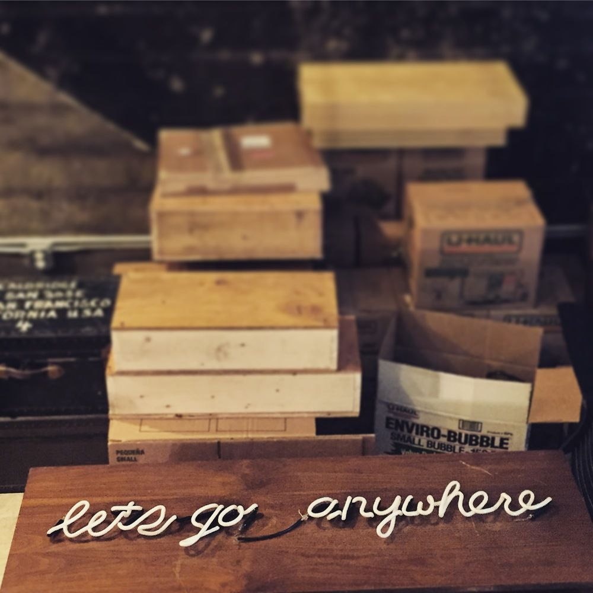
      <!-- <figcaption>Fig.1 - Trulli, Puglia, Italy.</figcaption>  -->
    <!-- 
  -->
 </figure>

</content>
<body>
 

<!-- Kraustralia 1 ----------------------------- --->  

<body>

<a id="kraustralia_1">
  <h3>Arrival in Melbourne</h3>  
</a>
<i>22 January 2015 </i>  
Melbourne, Vic  
 

A full twenty-four hours after leaving Seattle -- via our scheduled Los Angeles stop and our unscheduled Sydney one -- we arrived in Melbourne. Immigration and customs took a matter of minutes, either a nod to Australian efficiency or, possibly, apathy. Our journey to the taxi stand took us outside and into the heat, a very welcome 36C (97F) heat. As our cab headed into the city our fatigue and exhaustion melted away as our new home came into view out of the car windows.  We had made it. Our new lives here were a blank canvass waiting for us to fill them with memories of a lifetime. This blew a strong wind into our sails; ready we were to see what this continent has to offer. 

After a few wrong turns down some tricky one-way alleys, our driver found our AirBNB flat <em>(apartment)</em> and set us free. We dumped our luggage, changed into our bathers <em>(swimsuits)</em> and headed down to the St. Kilda beach to showcase the whitest skin in all of Oz <em>(Australia)</em>, perhaps the Southern Hemisphere. In the mid-arvo  <em>(afternoon)</em>,our hunger pangs drove us from the beach to Fitzroy Street for a snack.  We cashed in our gift certificate to [Milk the Cow](https://milkthecow.com.au/), a wine and cheese shop near the beach. All manner of fancy spreads and cuts were brought our way; all consumed in short order.  We retired for our first night down under, but not before catching a few matches of The Tennis <em>(The Australian Open)</em> on The Tele <em>(TV)</em>. 

 <figure>
    <!-- 
 -->
      
      <!-- <figcaption>Fig.1 - Trulli, Puglia, Italy.</figcaption>  -->
    <!-- 
  -->
 </figure>
 
 <figure>
    <!-- 
 -->
      
      <!-- <figcaption>Fig.1 - Trulli, Puglia, Italy.</figcaption>  -->
    <!-- 
  -->
 </figure>
 
  <figure>
    <!-- 
 -->
      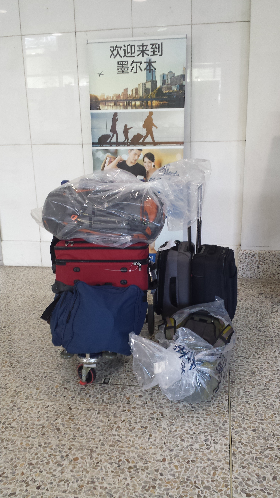
      <!-- <figcaption>Fig.1 - Trulli, Puglia, Italy.</figcaption>  -->
    <!-- 
  -->
 </figure>
 
  <figure>
    <!-- 
 -->
      
      <!-- <figcaption>Fig.1 - Trulli, Puglia, Italy.</figcaption>  -->
    <!-- 
  -->
 </figure>
 
  <figure>
    <!-- 
 -->
      
      <!-- <figcaption>Fig.1 - Trulli, Puglia, Italy.</figcaption>  -->
    <!-- 
  -->
 </figure>
 
  <figure>
    <!-- 
 -->
      
      <!-- <figcaption>Fig.1 - Trulli, Puglia, Italy.</figcaption>  -->
    <!-- 
  -->
 </figure>
 
  <figure>
    <!-- 
 -->
      
      <!-- <figcaption>Fig.1 - Trulli, Puglia, Italy.</figcaption>  -->
    <!-- 
  -->
 </figure>
</content>
<body>
 

<!-- Kraustralia 2 ----------------------------- --->  

<body>

<a id="kraustralia_2">
  <h3>Settling In</h3>  
</a>
<i>23 January 2015 </i>  
Melbourne, Vic  
 

On our first full day, we dove right into the culture with a cup of morning tea out on our deck.  The cool, marine breeze of the early morning soon gave way to summer heat. We took a long walk along the Bay Trail down to Point Ormond.  The way back was warm; the heat, the sweat, the sun on our skin all so wonderful after the last few months in wet and cool Pacific Northwest. We live here now. 

 <figure>
    <!-- 
 -->
      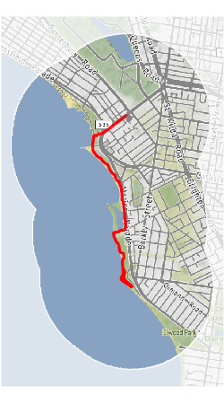
      <!-- <figcaption>Fig.1 - Trulli, Puglia, Italy.</figcaption>  -->
    <!-- 
  -->
 </figure>

 <figure>
    <!-- 
 -->
      
      <!-- <figcaption>Fig.1 - Trulli, Puglia, Italy.</figcaption>  -->
    <!-- 
  -->
 </figure>
 
 <figure>
    <!-- 
 -->
      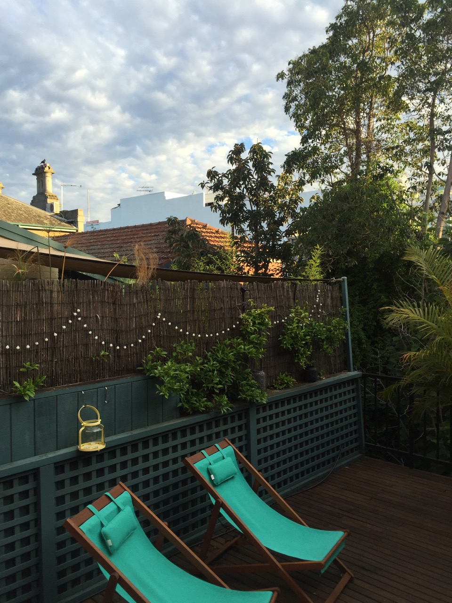
      <!-- <figcaption>Fig.1 - Trulli, Puglia, Italy.</figcaption>  -->
    <!-- 
  -->
 </figure>
 
  <figure>
    <!-- 
 -->
      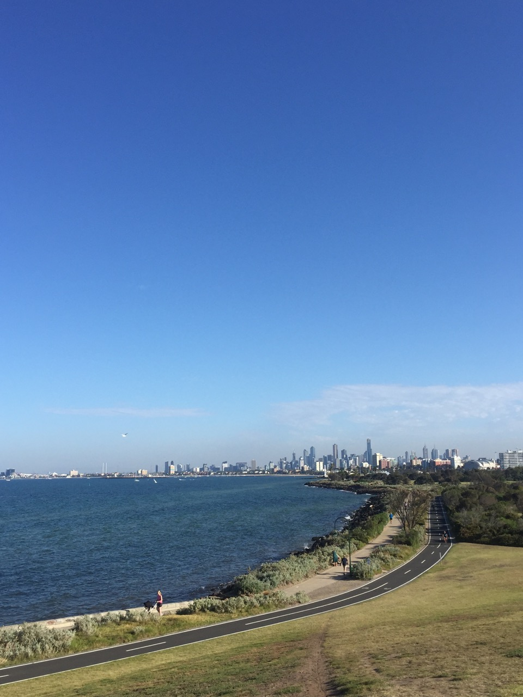
      <!-- <figcaption>Fig.1 - Trulli, Puglia, Italy.</figcaption>  -->
    <!-- 
  -->
 </figure>
 
</content>
<body>
 

<!-- Kraustralia 3 ----------------------------- --->  

<body>

<a id="kraustralia_3">
  <h3>The Tennis</h3>  
</a>
<i>24 January 2015 </i>  
Melbourne, Vic  
 

For three weeks in late January / early February all eyes -- in the tennis world at least -- are on Melbourne and the Australian Open.  Or, more affectionately referred to here on the ground as <em> The Tennis </em>. The cultural immersion program we had set for ourselves dictate that we attend, and that we did.  A gorgeous, sunny Saturday with temperatures near 30C (86F), we arrived early, as did the rest of the city. Tickets to the two main courts were sold out so we settled for ground passes. A ground pass allows access to all other venues but main courts, including the very large Hisense Arena. Our lacking of planning did mean we'd miss Venus Williams' match; however, our early did permit a showing of Serena practicing from up close, so not all was lost. It should not go unmentioned that the lines to enter the cultural events -- the beer and wine gardens -- stretched on to the far reaches of the grounds as Melbourne's 20-somethings shook off last night's hangover queued up for another run at it. No prom or gala in America had anything on this scene.     

Serena's practice session sated our patriotic hunger; next on to Hisense and some actual matches. Prior to the opening 11am match seats were plentiful.  As rookies do, we made a rookie mistake and sat in the glaring sun, amazed at why such good seats were available when less optimal ones (shaded) were taken.  A few hours later, the place was packed and we were sweating through our clothes, the full power of antipodal sun baking our northern bodies. We endured two hours of roasting to see the Spaniard, Muguruza down Bacsinszky of Switzerland in a hard fought women's singles match. A welcome relief as the shade enveloped us for match two. Here, the 8th ranked Montenegro-Canadian Milos Raonic used his 220+ km/h serve to breeze by the scrappy Benjamin Becker of Germany. 

The grounds were throbbing full at this point and, needing food and drink, we called it a day and left for home.  Our hunger and thirst pulled us into a pit stop at the Royal Croquet Club's (RCC) off-site Aussie Open extravaganza...basically a massive beer garden with food trucks, croquet courts and a DJ spinning house music.  Attendance was minimal -- it was early -- but judging by the size of the beer stands it would become a righteous rave later in the evening. Still jet lagged and a good decade older than the likely demographic, we could not muster the resolve to go on a day long drinking spree and, after a delicious snack and two Hahn Lights made our way home. Cultural immersion complete. 

  <figure>
      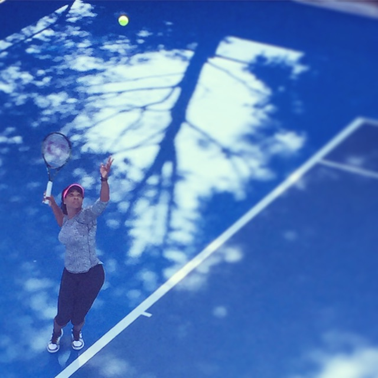
  </figure>
  <figure>
      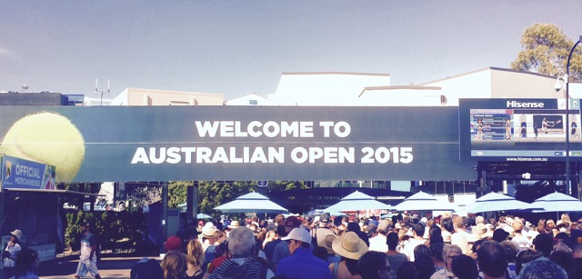
  </figure>
  <figure>
      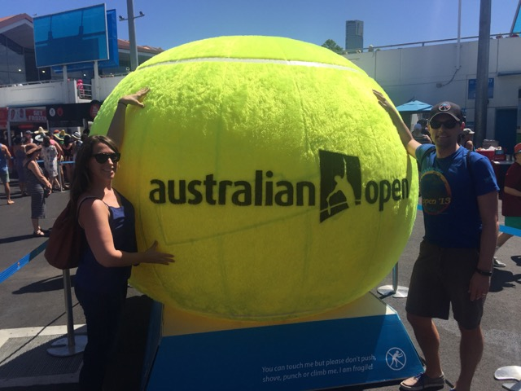
  </figure>
  <figure>
      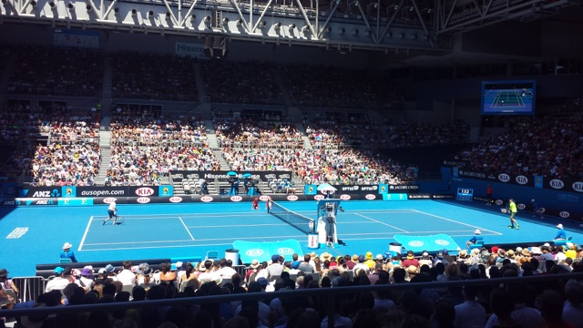
  </figure>
   <figure>
      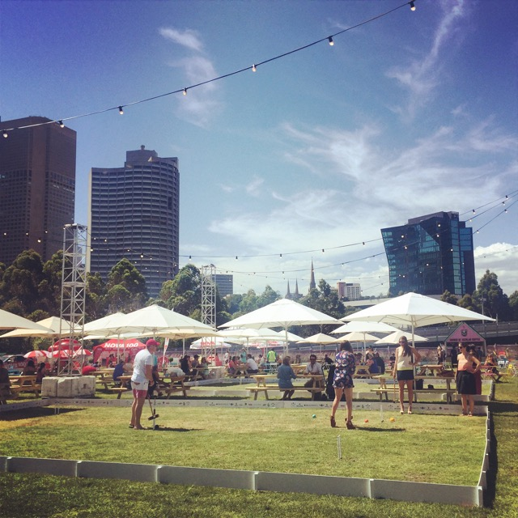
  </figure>
 
</content>
<body>
 

<!-- Kraustralia_4 ----------------------------- --->    

<body>

<a id="kraustralia_4">
  <h3>Market Day</h3>  
</a>
<i>25 January 2015 </i>  
Melbourne, Vic  
 

The [Queen Victoria Market](https://qvm.com.au/) is both a tourist trap full of fake Australian Outback hats and crocodile wallets as well as fully functional grocery store and mercantile. Where else can you buy a pallet of kangaroo pelts, mystery crystals, footie gear, toothpaste, antique collectibles and a dozen duck eggs all in the same place? There is truly something for everyone.  We bought none of the above, instead spending most our time investigating the widest variety of cured meats we'd ever seen.

[Erin] Being from Seattle, my expectations of coffee are high. Melbourne's reputation as having a world class coffee culture proceeds it. In the three days we've been here, I've found it to be as promised and have been been gleefully sampling from a variety of new favorite, local cafes. [Market Lane Coffee](https://marketlane.com.au/pages/south-melbourne-cafe) has a corner shop in the Queen Vic Market and since I wasn't really sure what a flat white or a long black would end up as, I ordered a cappuccino like a pro, right up until I tried to pay for a $4 coffee with two 20 cent coins. (For some reason the smaller coins are larger amounts here). After Googling "long black" I decided it would be the closest to my Americano order back home and I can avoid looking like a complete dumbass next time.  I am also adding this bit of information to save you all from Googling long black in the workplace. 

With Market bags in hand and caffeine needs met, we took the tram back to our temporary home in St. Kilda for a sunny lunch on our patio. At some point we will stop acting like this is a vacation and get on with the details of finding a house, but not quite yet...

  <figure>
      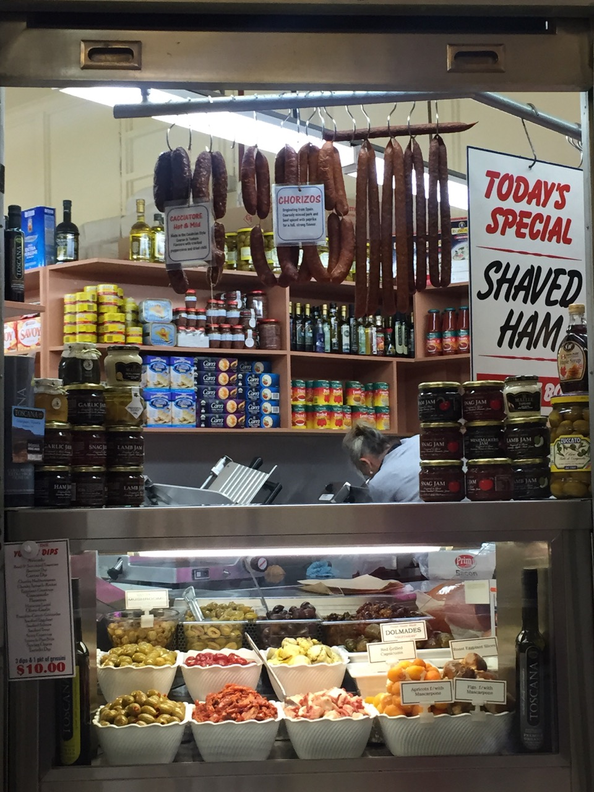
  </figure>
  
  <figure>
      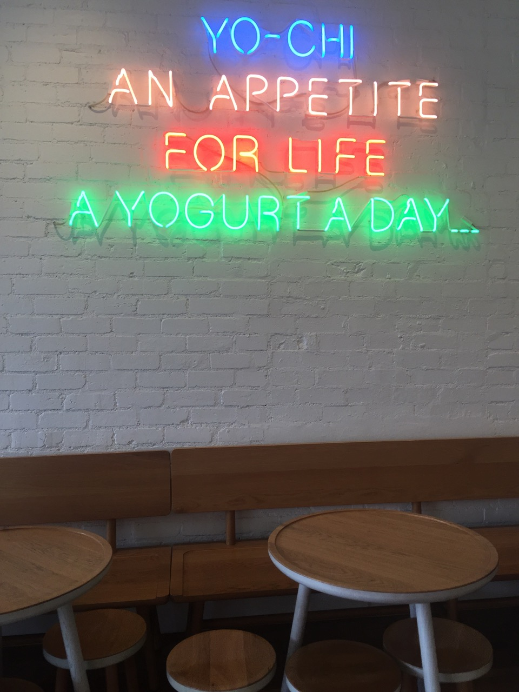
  </figure>
  
  <figure>
      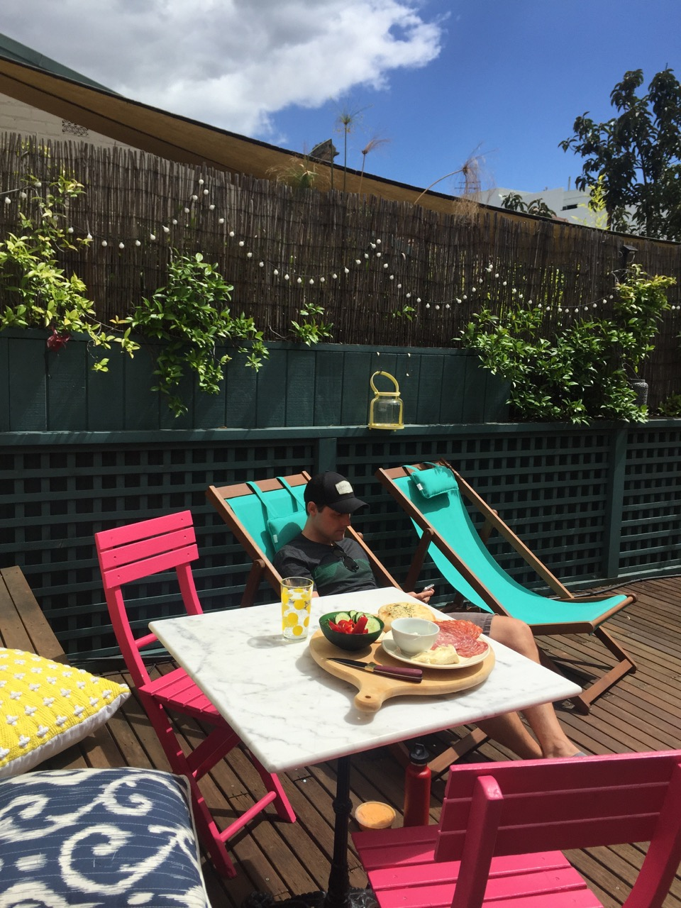
  </figure>
     
  <figure>
      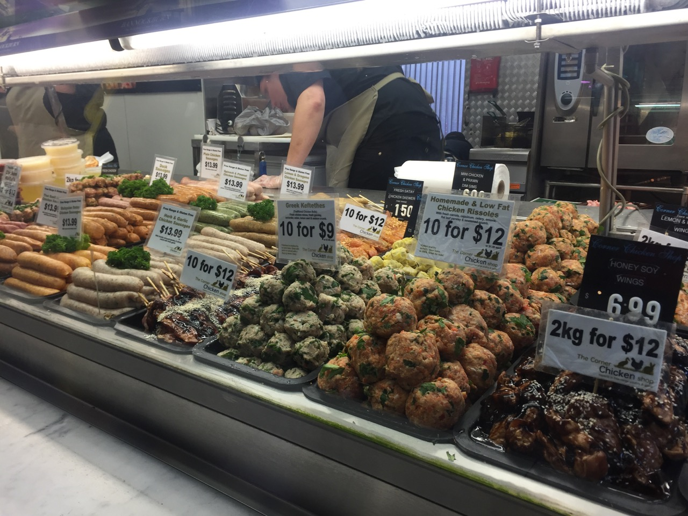
  </figure>
  
</content>
<body>
 

<!-- Kraustralia_5 ----------------------------- --->    

<body>

<a id="kraustralia_5">
  <h3>'Stralia Day</h3>  
</a>
<i>26 January 2015 </i>  
Melbourne, Vic  
 

Australia Day celebrates the 1788 landing of the British First Fleet in the Sydney Cove. We expected something like an Australian Fourth of July extravaganza. On account of souring public opinion over the ensuing treatment of the Aboriginal peoples, the reality of the holiday is something closer to a modest Columbus Day barbecue. As luck so had it, an old classmate of Erin's had recently moved to Melbourne and had extended to us an invite to a afternoon party out in [Wattle Park](https://www.parks.vic.gov.au/places-to-see/parks/wattle-park), east of the city. On the (not to scale) Melbourne tram map, it looked close enough. Ignorant of the speed, or lack thereof, of the tram system, we jumped aboard the 16 east then north through St. Kilda East, Balacava, Caulfield North, Malvern, Kooyong and then Hawthorn where we transferred to the 70 where upon we crawled through  Hawthorn East, Camberwell, Surrey Hills and finally into Box Hill South, home to the Park of Wattle.  Along the way we were overtaken by many a cyclist, scooter, rickshaw, jitney, wheelchair, pram, stray dog; really anything wheeled or anyone particularly fleet of foot was bound to pass us eventually. 

We arrived eventually, the beer that we purchased earlier now fully the temperature of the ambient air. The small fete was enjoyable, a good chance to meet some local people and test our new land's ability to through a bash. Marooned out here in the burbs, the only economically sensible thing to do was to ride the same slow pony back to town...at least we knew what to expect this time. We rewarded ourselves for our arduous travels with some of the world's greatest frozen yogurt, [Yo-Chi](https://yochi.com.au/). To walk off these excess calories, we ambled down to the beach to watch the sun dip below the gentle waves of Port Phillip Bay. 

  <figure>
      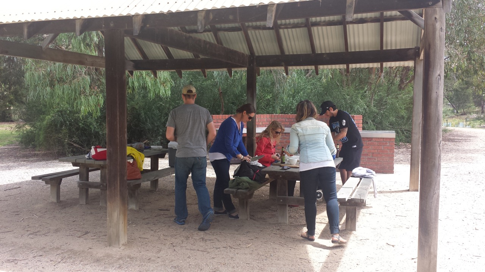
  </figure>
  
  <figure>
      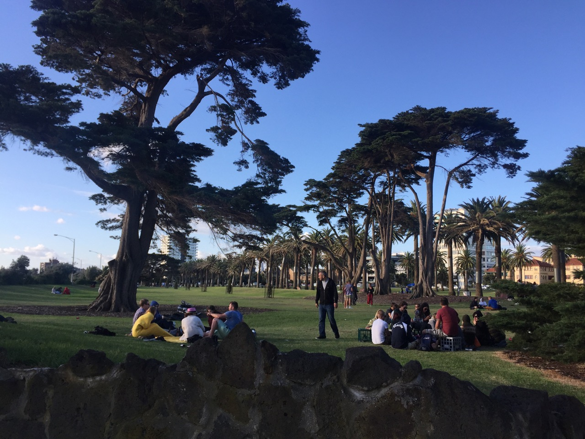
  </figure>
  
  <figure>
      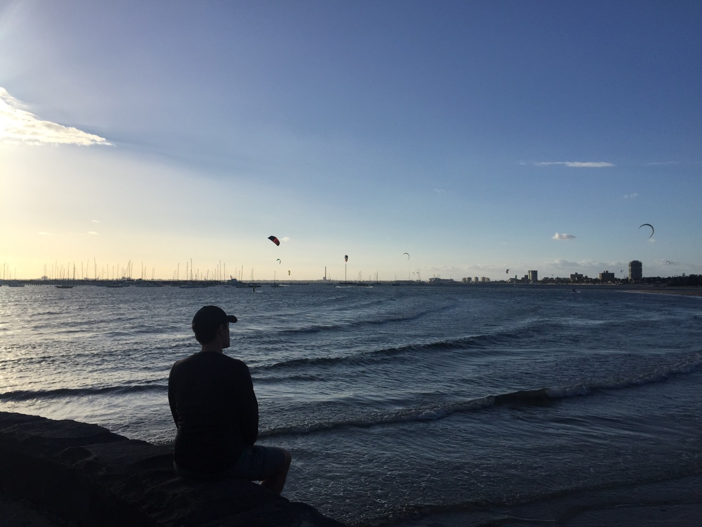
  </figure>
  
  <figure>
      
  </figure>
  
  
</content>
<body>
 

<!-- Kraustralia_6 Back to Work ----------------------------- --->    

<body>

<a id="kraustralia_6">
  <h3>Back to Work</h3>  
</a>
<i>27 January 2015 </i>  
University of Melbourne, Vic  
 

The fun had to end eventually, I was down here for a job after all. Mind you I wasn't headed to the salt mines or anything resembling difficult physical labor, but coming back to a schedule and being responsible to an employer was a unwelcome change nonetheless. 

I arrived to the brand new [Melbourne School of Design](https://msd.unimelb.edu.au/) (MSD) building and my 9:30 appointment to find that my name was not in the system.  As a result, I I could not be granted my ID card, login information, email, etc. Really anything that would permit me to do any actual work, administrative or otherwise. I was, however, awarded my complimentary kitchen set (with a tea mug of my favorite color). This is the warm welcome I had been expecting.

Additionally, due to some scheduling issues, there is a squatter in my current office for the next few weeks. I have been set up with with a temporary space in a large group meeting-type room (with adequate space for my tea set).  It is comfortable enough and my office mates are quite, albiet a bit weird.

I was starting to wonder if I actually had a job here, but in wandering the halls I did locate a door with my name on it...so I guess that is a good sign.  Hopefully, tomorrow I'll be able to commence my tenure at the University.  For now, I'm just a visitor stuck in a room with mannequins busy balancing his spoon on his nose while shotgunning lukewarm, free tea.  Oh yeah, and every time I leave the room to go to the bathroom I need to place a chair in the door lest it close behind me and lock me out.  

  <figure>
      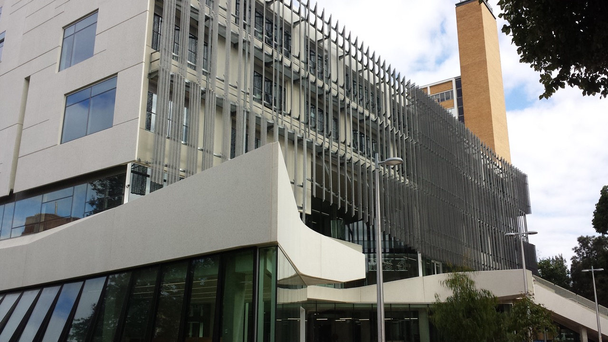
  </figure>
  
  <figure>
      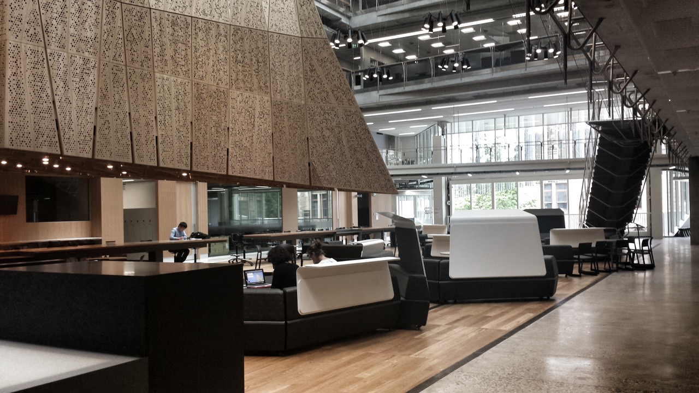
  </figure>
  
  <figure>
      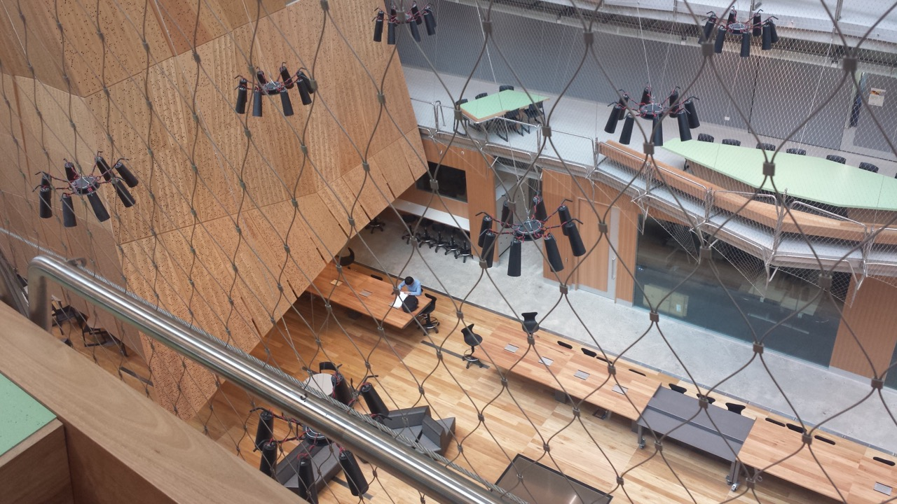
  </figure>
  
  <figure>
     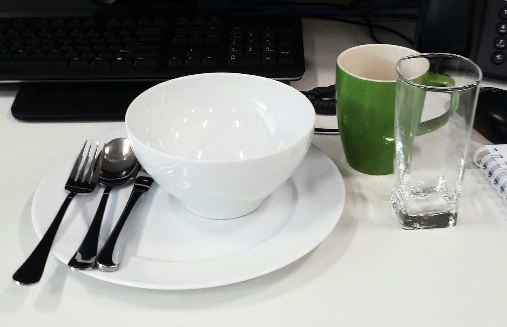
  </figure>
  
  <figure>
      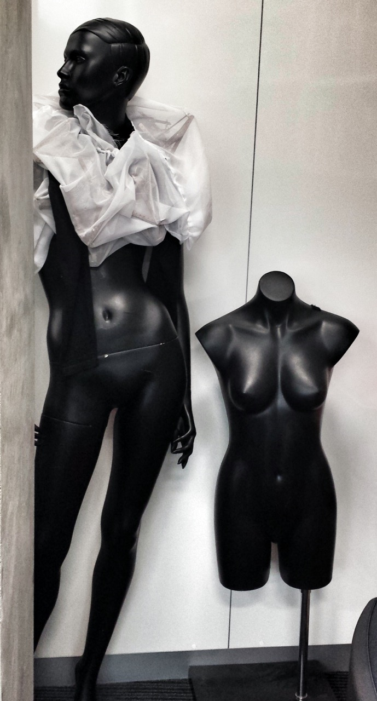
  </figure>
  
  <figure>
    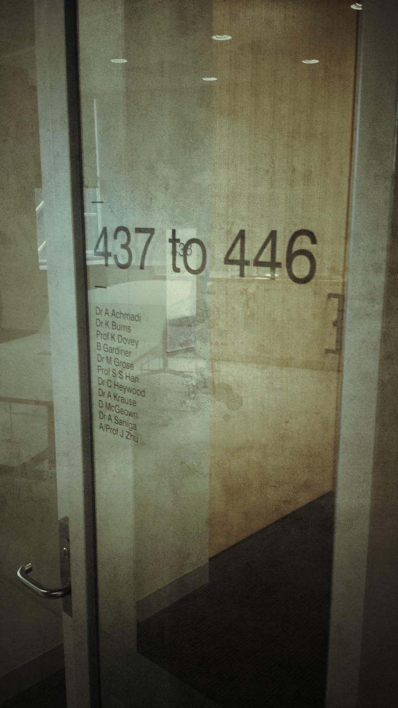
  </figure>
  
</content>
<body>
 

<!-- Kraustralia_7 Beach Boxes ----------------------------- --->    

<body>

<a id="kraustralia_7">
  <h3>Beach Boxes</h3>  
</a>
<i>30 January 2015 </i>  
Brighton, Vic  
 

When not outside basking in the glorious January weather, we are busy on [Domain.com.au](https://www.domain.com.au/) searching for a place to live. This either means walking or taking the trams/trains to different neighborhoods around the city until we are exhausted or sunburned, often both. Our standard operating procedure once in such a condition is to find refuge and relief in a gelato or frozen yogurt shop. I dare you to judge us. 

Recently we found ourselves in Brighton touring a home for which we didn't really have the budget to rent.  Brighton is a beautiful, higher end location just inland from a sparkling white beach. Like a crow drawn to shiny objects, Erin gravitates towards bright colors and patterns.  Our visit to the famous [Brighton Beach Bathing Boxes](https://www.visitvictoria.com/regions/melbourne/see-and-do/history-and-heritage/heritage-buildings/brighton-bathing-boxes) was no short affair. 

Sticking our toes in the sand and watching the tourists (ourselves not included; we are locals after all) was a needed distraction from the stress of finding a home. The rental process here is, well, odd. Open houses or inspections, as they are referred to, are 15 minute affairs, and unfurnished rentals don't come with a washer/dryer, dishwasher or refrigerator unless you are lucky. As a result, the next time we move, we will be the proud owners of a bunch of big ass appliances. Two of the houses that we really like have inspection times tomorrow, unwittingly with overlapping 15 minute periods and across town from one another. We will divide and conquer, and hopefully trust the other's judgment...but for now, we worry not about this and relax on the beach dreaming of our next cool, sugary treat. 

  <figure>
      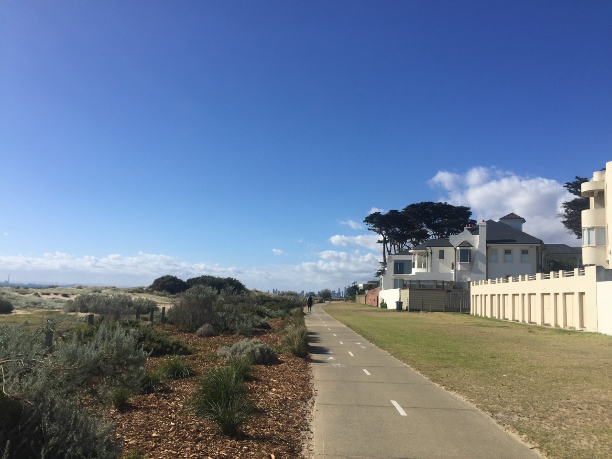
  </figure>
  
  <figure>
      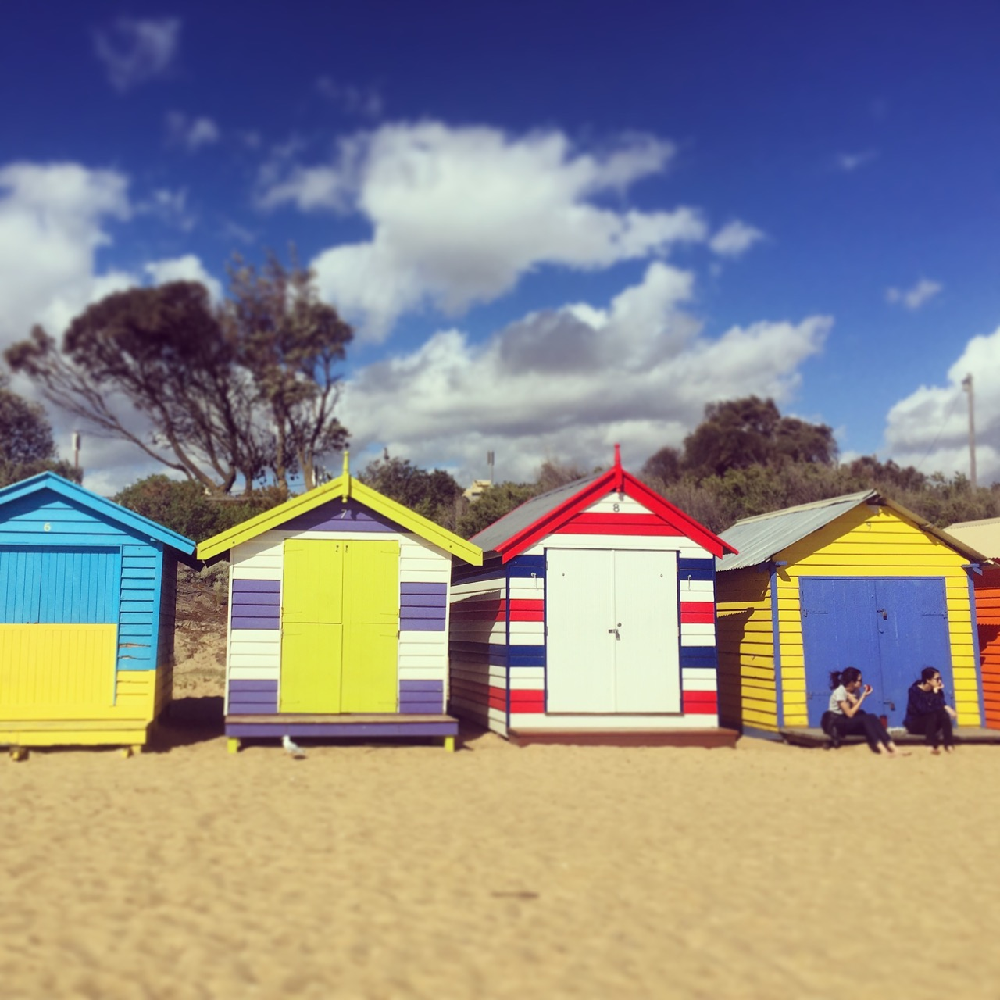
  </figure>
  
  <figure>
      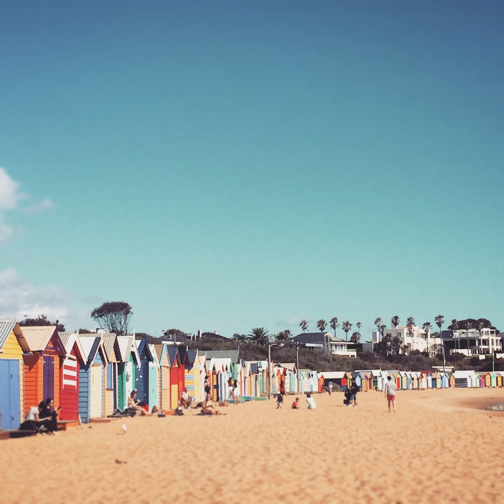
  </figure>
  
  <figure>
     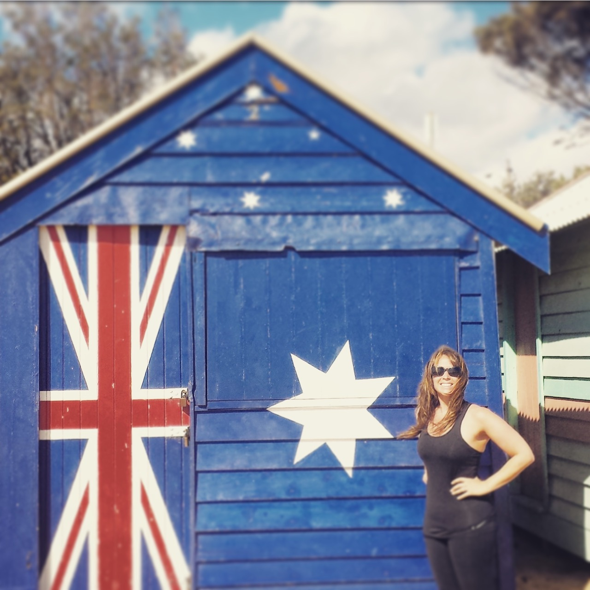
  </figure>
  
</content>
<body>
 

<!-- Kraustralia_8 In Search of a Home ----------------------------- --->    

<body>

<a id="kraustralia_8">
  <h3>In Search of a Home</h3>  
</a>
<i>1 February 2015 </i>  
Melbourne, Vic  
 

We are still vagabonds, living off of takeout at our small, but comfortable AirBnB in the heart of St. Kilda. We put in an application for the small brick homes in the photo below.  There are no guarantees here in this 'lottery for a rental home' system. It is just one of hundreds that we’ve looked at online and one of a handful that we’ve inspected and applied for. We feel like we have a good chance here because it isn't the in the hip, cool neighborhoods north of the city, but in a quieter, family-ish area to the south.  All the better for us as we prefer beaches and parks to bars and brunches anyways. 

This process has been, well, exhausting.  Our past weekend consisted mostly of jumping on and off various trams to schlep around to far-flung areas of the city in order to inspect homes or check out new neighborhoods. At some of the more glamorously located places, the crowds are insane; over 50 people showed up to a house Saturday morning. All this bandying about has its benefits -- we stumbled on a wild Chinese New Year celebration, have found some of the city's best architecture, sampled even more frozen yogurt and gelato shops and even procured Erin her first (likely of many) Australian meat pies. We know some tram routes by heart and now have a pretty good sense of what is overpriced.  All this local knowledge should also help me in the classroom where my first day of teaching is soon approaching. 

  <figure>
      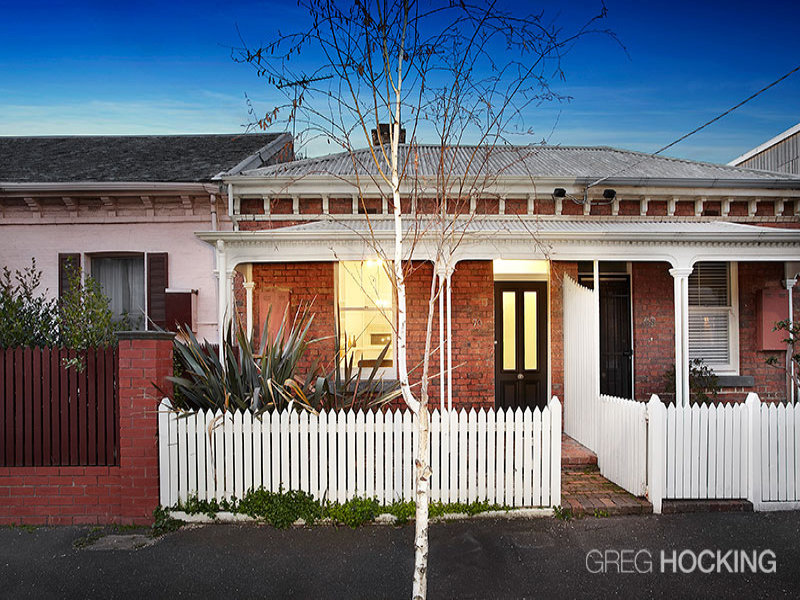
  </figure>
  
  <figure>
      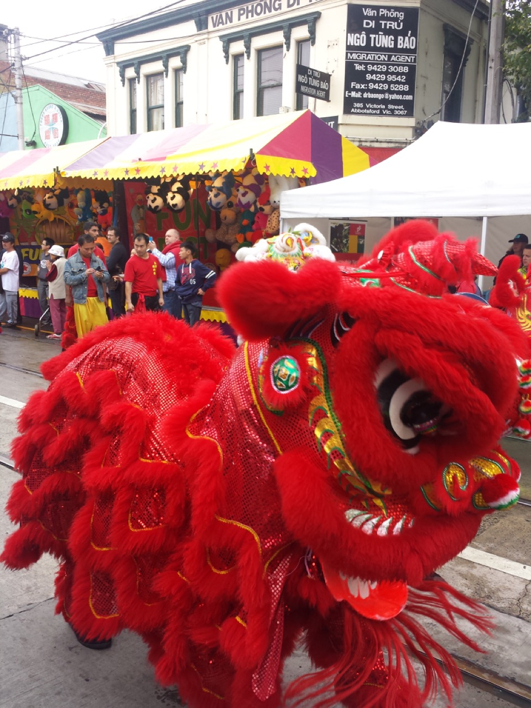
  </figure>
  
  <figure>
      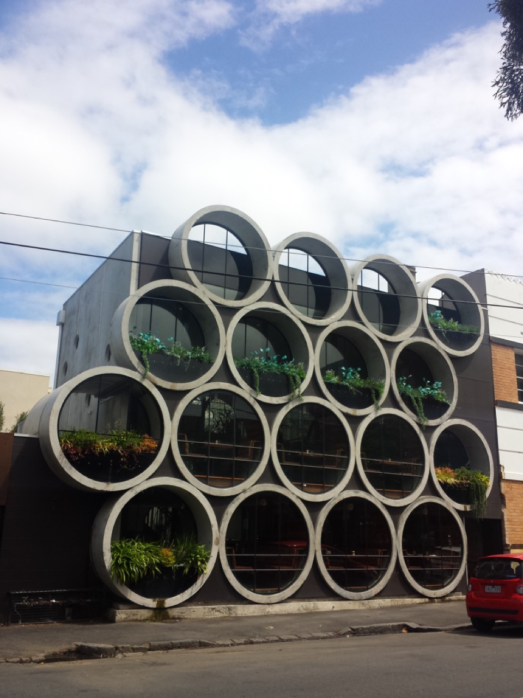
  </figure>
  
  <figure>
     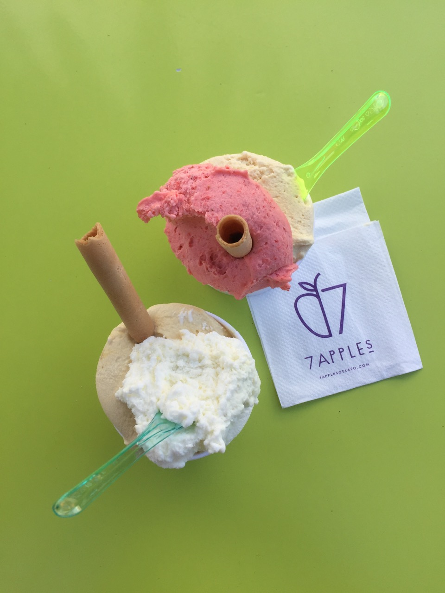
  </figure>
  
</content>
<body>
 

<!-- Kraustralia_9 In Search of a Home ----------------------------- --->    

<body>

<a id="kraustralia_9">
  <h3>Not So Super Bowl</h3>  
</a>
<i>2 February 2015 </i>  
Prahran, Vic  
 

9am Monday morning and we are headed to a bar. A friend of a friend had invited us out to the [College Lawn Hotel](https://collegelawnhotel.com.au/) in Prahran neighborhood.  Entrance was pricey, but we did get all you could drink beers and wines and a wide variety of free bar foods.  Upon arrival, we noticed the 12th man flag in the window.  We had made a good choice. 

The place filled quickly and there were about 200 people jammed in by the time the game started.  Its a big place, with numerous outdoor beer gardens, separate rooms and bars, so it never really felt too crowded.  I'd guess it was about 50% Seahawks fans, 30% Patriots fans, 10% random NFL jerseys (Barry Sanders, an old Darrelle Revis Jets and Mark Chmura...ok, no Mark Chmura) with the balance made up of about 20 odd Aussie dudes who didn't care much for the game, but couldn't seem to pass up all-you-could drink event on a Monday morning. 

We met about a dozen people from Seattle or the surrounding area, including one ex-Seattleite whose name was, I kid you not, Erin Krause.  The people and the atmosphere were great, the beer was good and the food was, well, filling.  We'll stop there as nothing really needs to be said about the game itself....at least we had an ample selection of decent Australian microbrews (and Heineken) to kill the pain.

  <figure>
     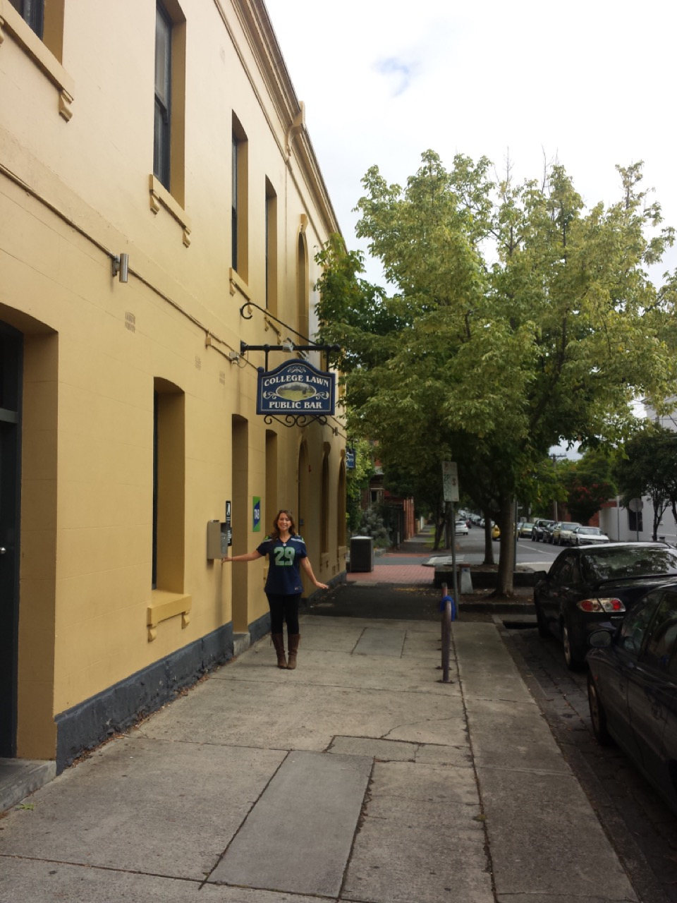
  </figure>

  <figure>
     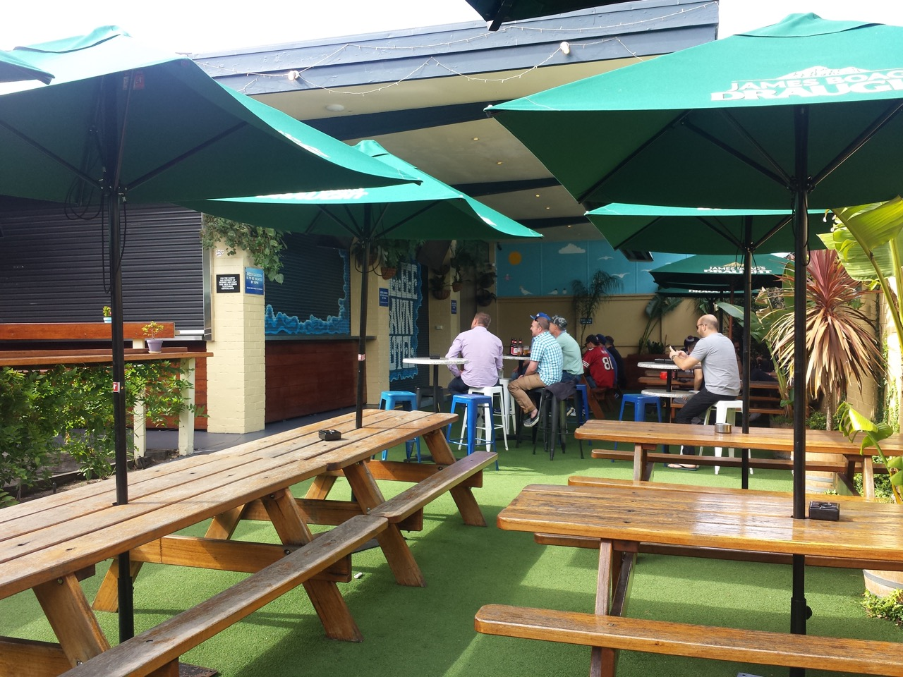
  </figure>

  <figure>
     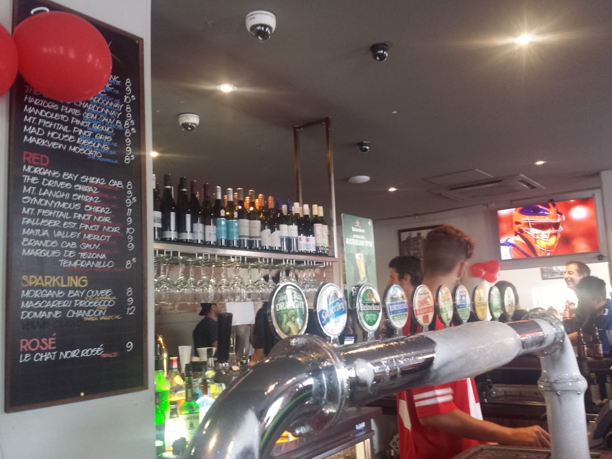
  </figure>

  <figure>
     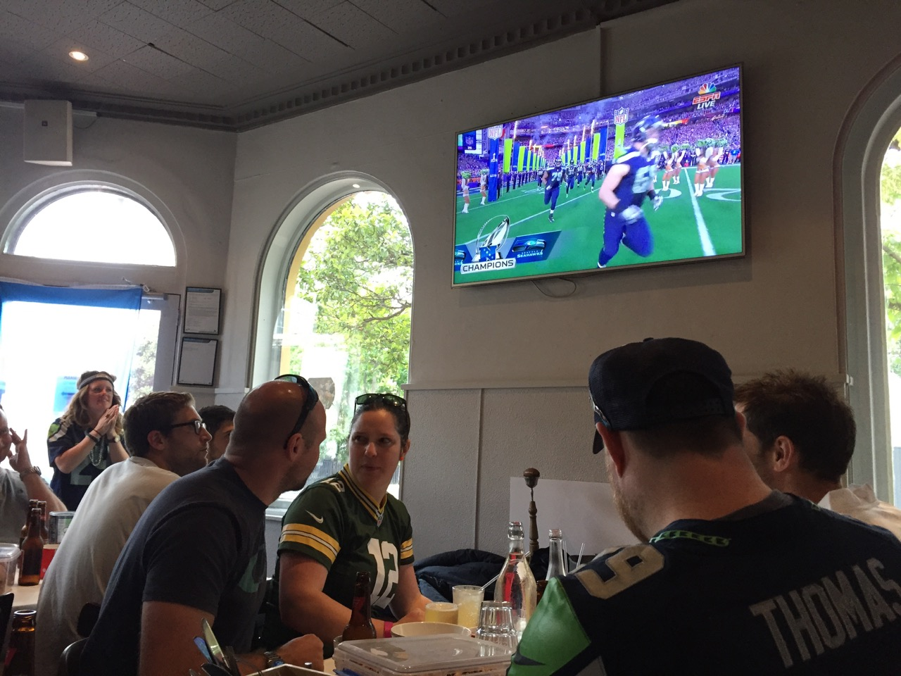
  </figure>

</content>
<body>
 

<!-- Kraustralia_10 In Search of a Home ----------------------------- --->    

<body>

<a id="kraustralia_10">
  <h3>How Ya Goin?</h3>  
</a>
<i>4 February 2015 </i>  
Albert Park, Vic  
 

After many tours, followup emails and countless hours scouring online listings, we finally secured a place to live.  It is a wee Victorian cottage in a neighborhood called Albert Park. It is a quaint, but upscale little area with adequate, but not hip, amenities and, importantly, is only a walk or short bike ride to the beach and a direct tram ride away from the University and downtown Melbourne. We are undoubtedly bringing down the median income for the area. We get the keys on Friday, so we will share more later in the week about the house. 

Today, Erin focused on some early neighborhood reconnaissance today. Near our house this is another open air market, the [South Melbourne Market](https://www.southmelbournemarket.com.au/). Compared to the Victoria Market we visited last week. This market is much smaller, but it still has amazing variety and yet better prices. It is less catered to the tourists and more toward locals looking for their groceries, staple items and delicious meals. Specialty shops abound, like the [Tea Drop](https://www.southmelbournemarket.com.au/traders/tea-drop) an entire booth dedicated to exotic and high end teas. It has Easter egg colored canisters stacked so high, it necessitated a ladder to reach them. And that bookstore-style ladder is not just some trendy design detail, my own order required its use. 

Picking her way slowly my way stall by stall through the market, Erin continued to come across the same issue we've both have had for the past two weeks of meeting and greeting friendly Aussies.  Instead of the "G'day" that everyone in America expects Australians to say, we almost always get some slurred version of 'How ya goin' or 'How're ya going?' This obviously means 'Hi, How are you doing?', and so we usually answer 'Good', but every single time there is an urgeto answer the question of where I'm going or how I got here, By tram? St. Kilda? I walked?

Knowing that we'd soon be leaving our St.Kilda apartment we spent our evening with a dinner at [Babu Ji](https://www.babuji.com.au/dine-in/) a fashionable Indian restaurant just down the street.  For a bit more than the cost of standard meal, the quality was outstanding. Some of most unique Indian flavors we each have ever tasted.  We are quite grateful that our new home is just a short tram ride away from this gem.  To aid in the digestion of this large meal, we concluded with a nice long walk along St.Kilda Beach.  Our home beach for just a few more days, until we relocated a mile or so to the west.  

  <figure>
     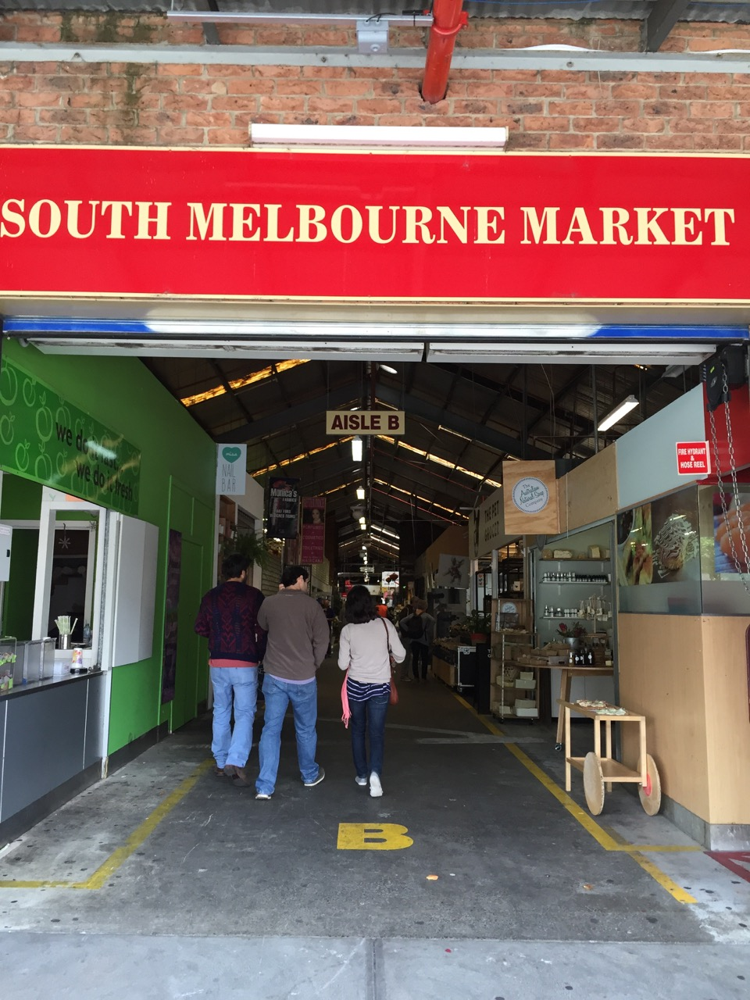
  </figure>

  <figure>
     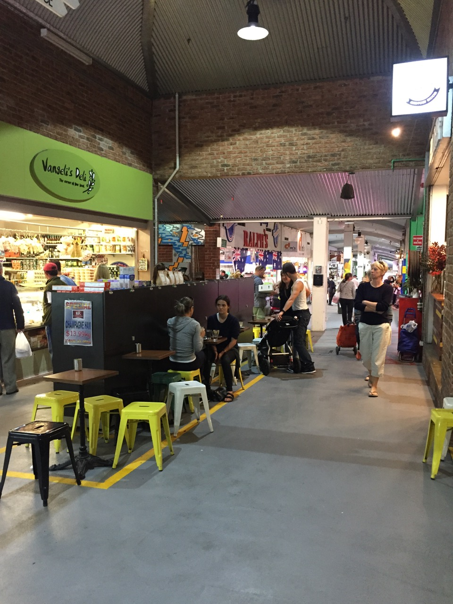
  </figure>

  <figure>
     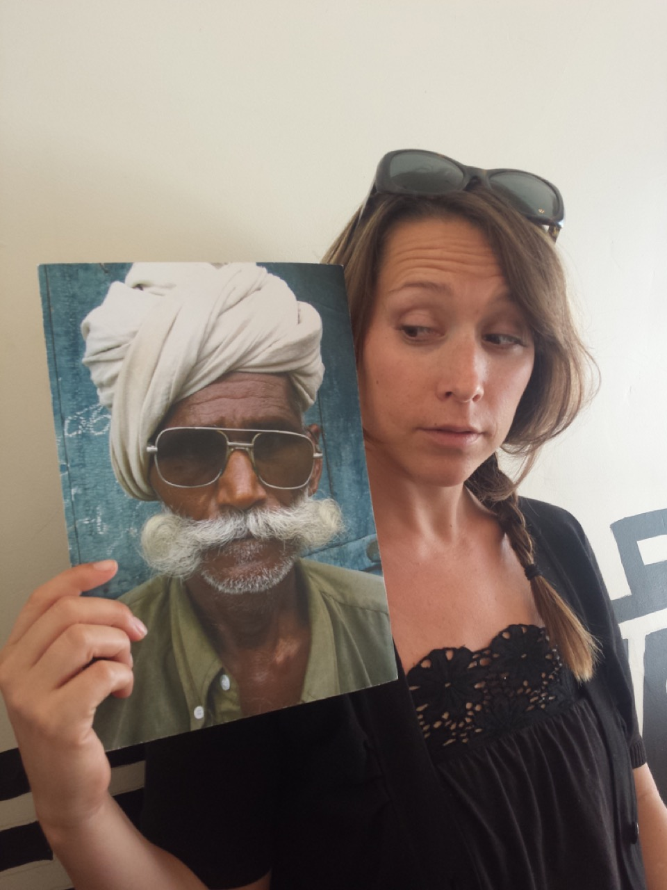
  </figure>

  <figure>
     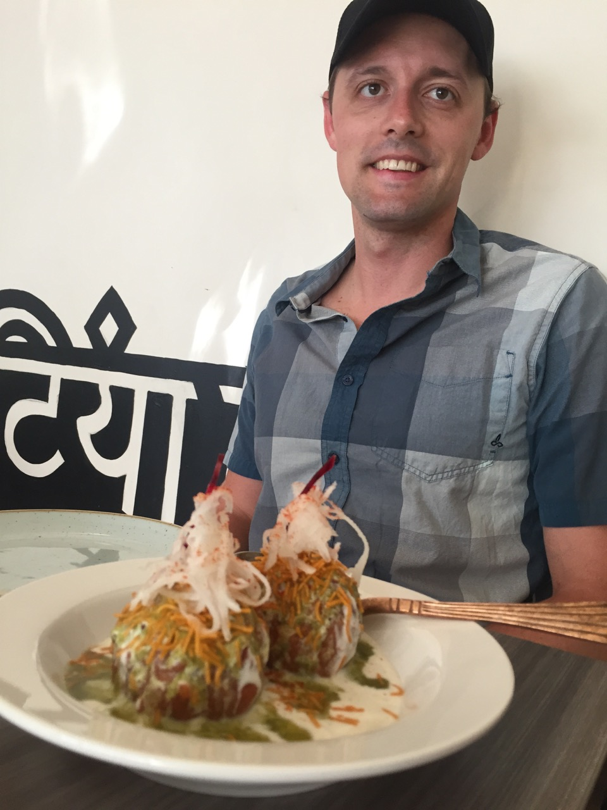
  </figure>
  <figure>
     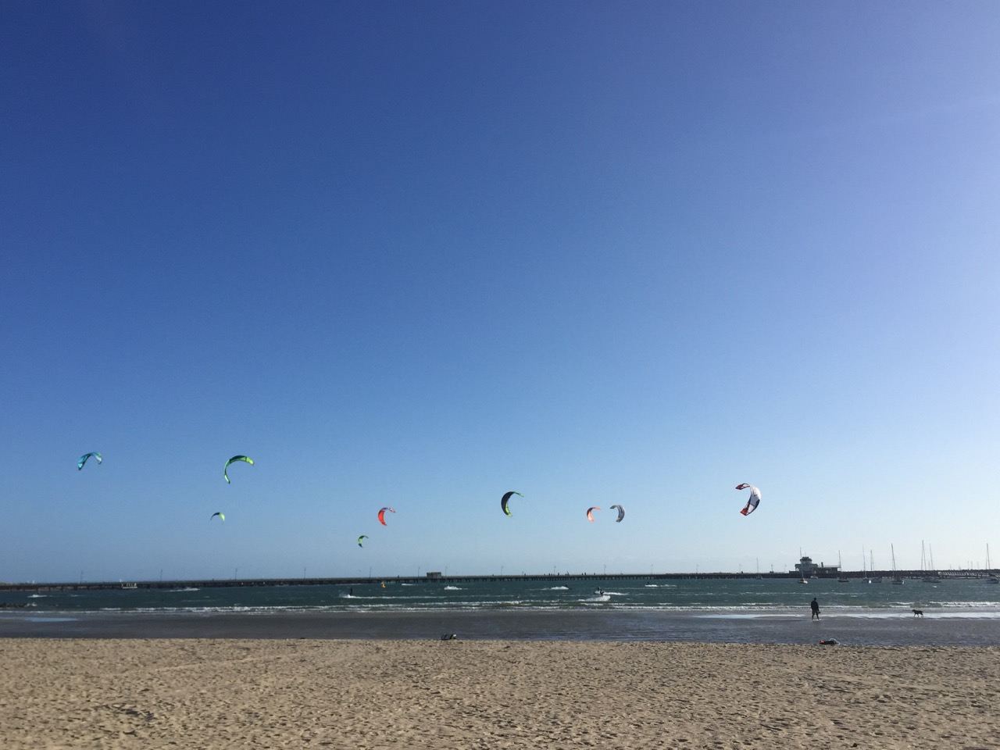
  </figure>
  
  
</content>
<body>
 

<!-- Kraustralia_11 Ikea-a-thon ----------------------------- --->    

<body>

<a id="kraustralia_11">
  <h3>Ikea-a-thon</h3>  
</a>
<i>8-9 February 2015 </i>  
Richmond, Vic  
 

We now have a house. It is filled with exactly nothing as all we own here are the bags we brought on the plane (and the various suncreens Andy has hoarded in the past two weeks) and those are still at the Airbnb we have for a few more days.  So we went shopping.  Furniture shopping -- the seventh level of hell for one of us. In fact, Andy might prefer any of the following over furniture shopping: going to the dentist, watching period-piece dramas and line dancing.  All of this shopping was, however, book-ended by two outdoor festival-type events and fun pit stops along the way -- which is probably why we got through it in one piece. And, not only does Andy now know the difference between a left and right chaise lounge but he can spot pebble weave upholstery from 50 meters out…. 

All of the things that we couldn't physically carry out of the store will be delivered to our home sometime in the next week.  Hopefully our number of days of sleeping on the floor will be exactly zero. 

Overall, our weekend went something like this: 

* (Fri) South Melbourne Market [night market](https://www.theurbanlist.com/melbourne/a-list/summer-evenings-at-south-melbourne-night-market) complete with delicious street paella. 

* (Sat) Some suburban Ikea and Domain Housewares Mall (think Ron Swanson’s personal hell).

* (Sun AM) West Elm, then urban Ikea (yes, multiple Ikeas in a weekend) 

* (Sun PM) The [St. Kilda Festival](https://www.stkildafestival.com.au/) with 300,000 of our fellow Melburnians…right in our back yard.  

  <figure>
     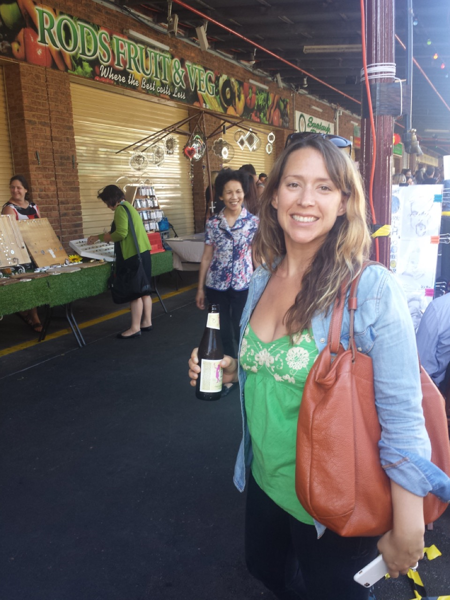
  </figure>

  <figure>
     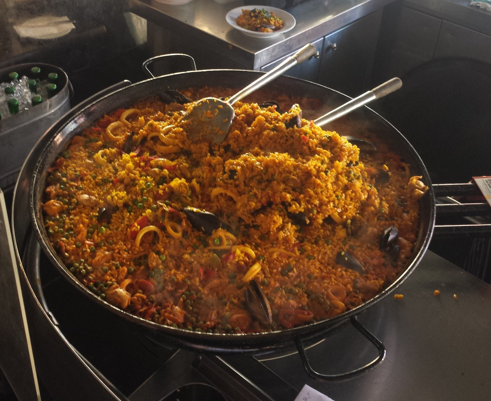
  </figure>
  
  <figure>
     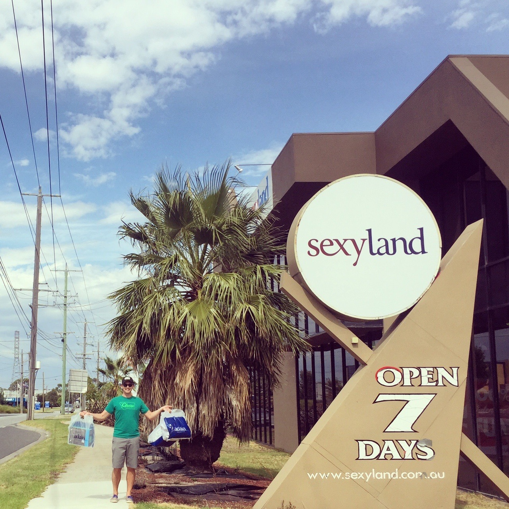
  </figure>
  
  <figure>
     
  </figure>
  
  <figure>
     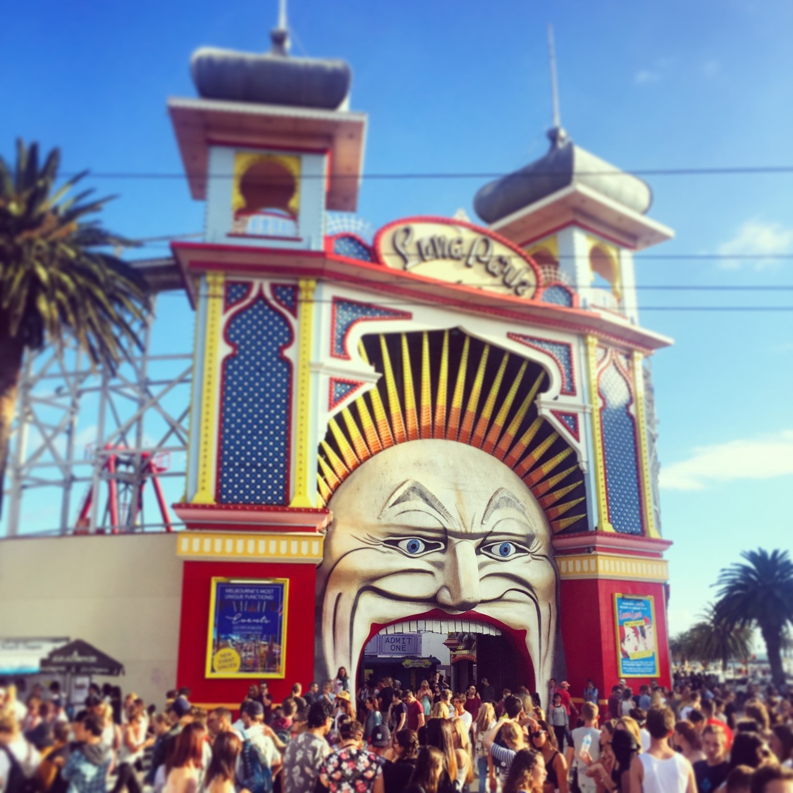
  </figure>
  
  <figure>
     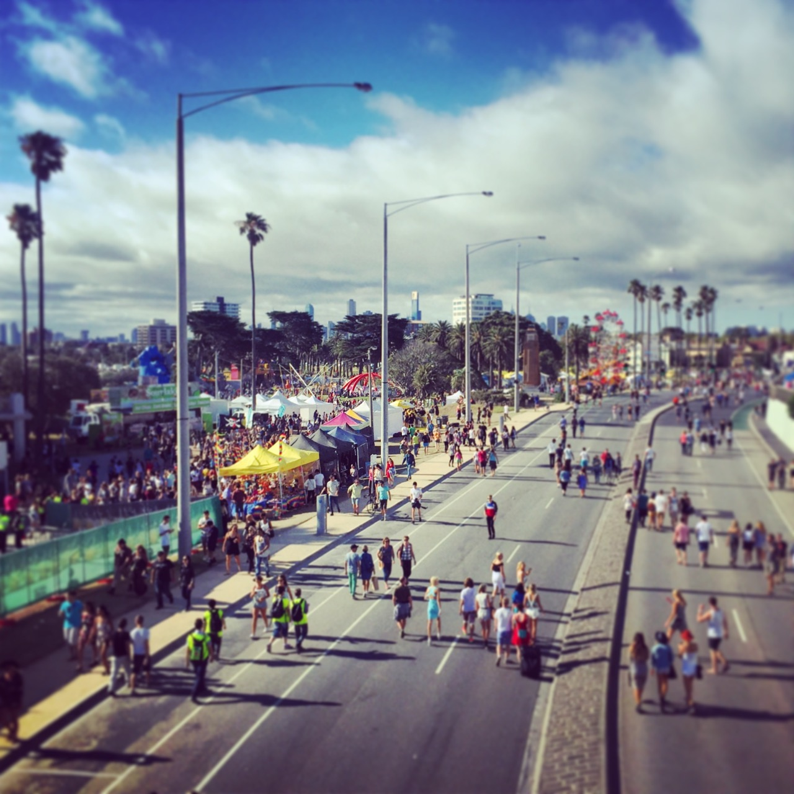
  </figure>
  
</content>
<body>
 

<!-- Kraustralia_12 Moving In ----------------------------- --->    

<body>

<a id="kraustralia_12">
  <h3>Moving In</h3>  
</a>
<i>12 February 2015 </i>  
Albert Park, Vic  
 

This entire blog post could be about nothing more than the series of minor failures that we have had in the past week while moving into our new home. Instead, we will channel the positive and enlighten you with the few, but crucial wins we have had secured. 

To begin, we are now the proud owners of a complete set of 'white goods' -- washing machine, dryer, and refrigerator. True adults are we. Once past the initial annoyance of knowing that we would have to not only buy these and but then also move them around to each place we will rent in the city we have become quite attached to them. Not so far as to name them, though.  Not yet. 

As our shipping crate of things -- some necessary and others not -- has been delayed until late March, we are trying to get by living minimally until then.  While temporarily living with 'just the essentials' seems simple enough, it really isn't as fun as it sounds to cook a full meal in one pot, or share one towel or sleep on a bed frame without the proper slats, therefore folding the mattress like a burrito, (one of many IKEA fails). To remedy this, Erin broke down and just started buying things we needed.  As satisfying as it felt to start filling up the house, without a car, she was the girl walking a mile and a half with a stainless steel garbage can balanced on her head, and then back a mile and a half to return it when she realized it didn't work with a plastic bag since, per the shopkeeper, you were just supposed to rinse out the plastic liner each time (?). Okay, so in the end we did share some of the fails; some things are too good to keep to oneself. 

Back in the win column, we also bought bikes this week. This affair took an entire afternoon but we ended up with two beautiful road bikes at a bargain price as well as finding ourselves a new and very Lithuanian friend. Test riding the bikes was a little horrific at first since biking on the wrong side of the road is only slightly less jarring than driving on the wrong side, but we caught on quick.  It took a little convincing our friend that Erin wasn't completely helpless on a bike, and in the end we both walked away with men's bikes. Erin was informed this men's bike would fit her fine due to her "gentlemen's shoulders".  We also learned more than we wanted to know about a recent crime epidemic in Footscray, the state of immigration politics in Australia and tips for maintaining proper brake cable tightness.  

Our new wheels allowed us to explore farther and faster than before.  This offered a needed break from hours of Ikea instruction following.  It is also provided much needed practice at operating on the opposite side of street as we will, eventually, find ourselves driving down here. 

 <figure>
     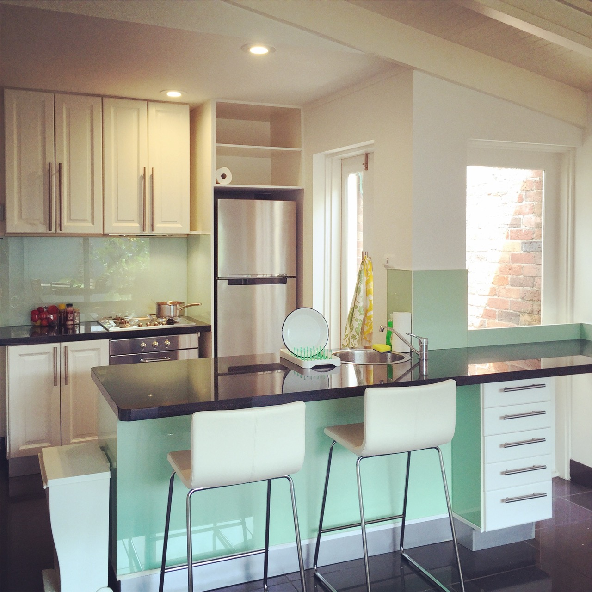
  </figure>
  
  <figure>
     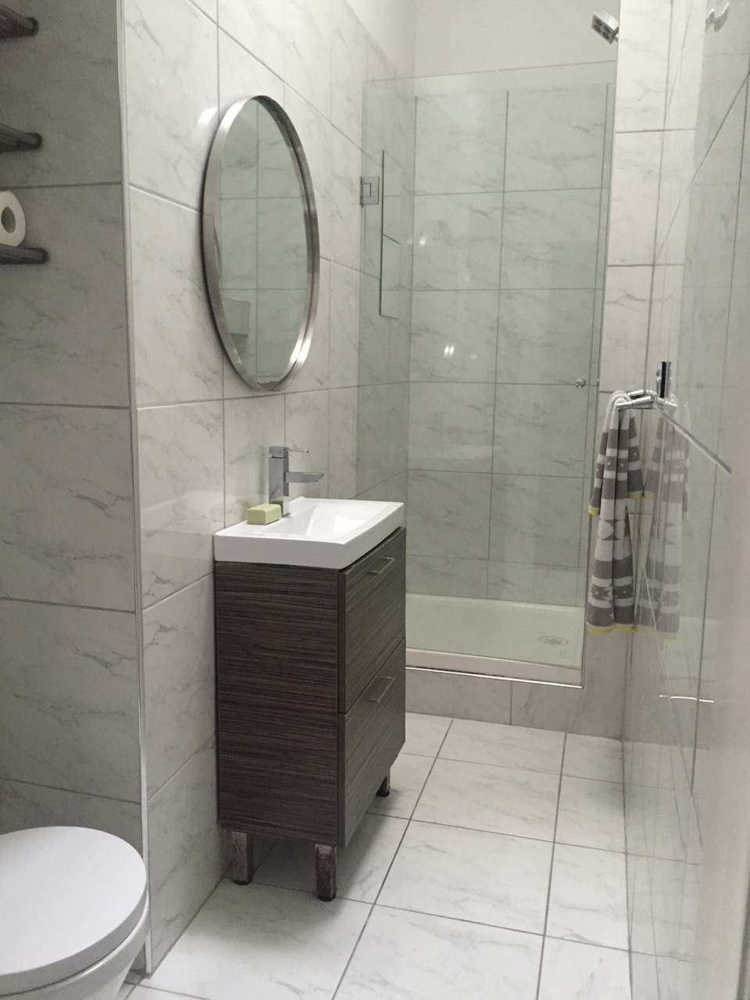
  </figure>

 <figure>
     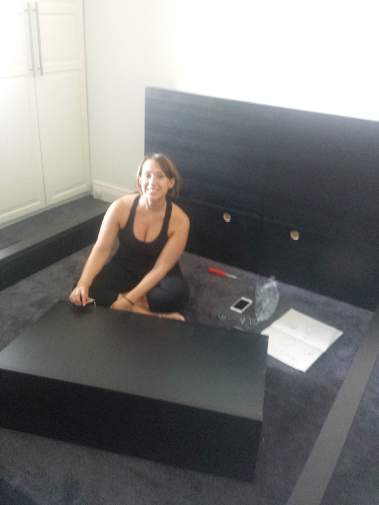
  </figure>
  
  <figure>
     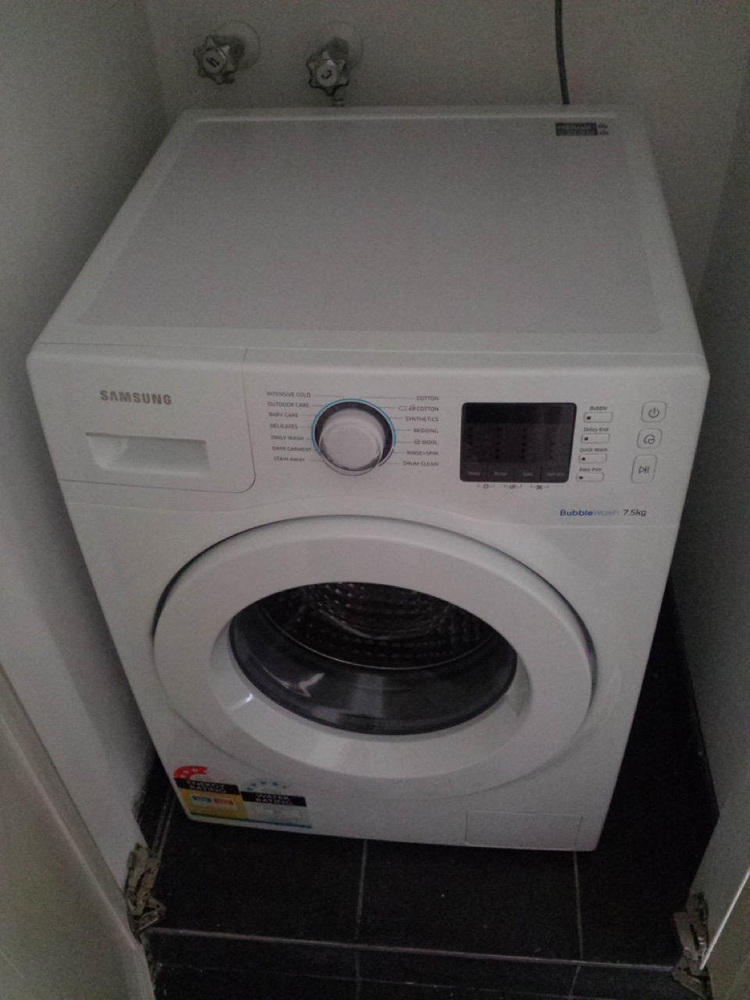
  </figure>

 <figure>
     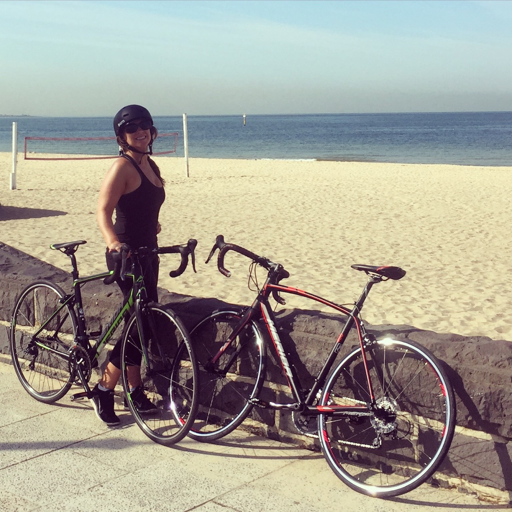
  </figure>
  
  <figure>
     
  </figure>

 <figure>
     
  </figure>
  
</content>
<body>
 

<!-- Kraustralia_13 A Downtown Walkabout ----------------------------- --->    

<body>

<a id="kraustralia_13">
  <h3>A Downtown Walkabout</h3>  
</a>
<i>14 February 2015 </i>  
Melbourne, Vic  
 

To celebrate St. Valentine (Valentino in the large Italian sector of Melbourne) we explored our city -- a long date filled with many cultural institutions and ice creams.  We began with a trip to the State Library and concluded at Federation Square, connecting these two iconic places via the least efficient and most interesting route possible. Down alleyways and up lanes, along the Yarra river walk and through a New Year’s festival. Erin paused to capture more photos of activated street-scapes and sidewalk cafes than Andy cared to, but this city is proving to be a designer’s dream and she can’t help but get swept up in it. 

Over the past few weeks, Erin has spent considerable time in cafes stealing wifi and drinking coffee with Melbournians. She's become familiar with the standard breakfast that is ordered to accompany a morning coffee.  The usual is a granola-based dish (occasionally bircher) with yogurt and some take on fruit compote.  Now that we have acquired a pot for our kitchen, she has decided she should start making this simple breakfast dish at home instead of eating out so much.  We are in the middle of summer, and all the markets are selling stone fruit for crazy sales, so recently she lugged home 2 kilos of it -- which is, as she learned, considerably more than two pounds and not that easy to carry home. When Andy came home to a fruit poaching factory and asked what I was making, he heard ‘Truman Capote’ instead of ‘fruit compote’, so now every morning for breakfast, I sit down to a small, but satisfying bowl of yogurt and Truman compote. 

 <figure>
     
  </figure>
  
 <figure>
     
  </figure>
  
   <figure>
     
  </figure>

 <figure>
     
  </figure>

 <figure>
     
  </figure>

 <figure>
     
  </figure>

 <figure>
     
  </figure>

</content>
<body>
 

<!-- Kraustralia_14 A Little Slice of Home ----------------------------- --->    

<body>

<a id="kraustralia_14">
  <h3>A Little Slice of Home</h3>  
</a>
<i>21 February 2015 </i>  
Melbourne, Vic  
 

In need of a vacuum, a year’s worth of toilet paper, three liters of barbecue sauce, a kilo and half of haloumi and several other bulk items that can only be moved with a pallet jack, we took a short tram ride to Costco Australia, conveniently located just north of downtown Melbourne. Rumor has it that the Melburnians were so pleased with the arrival of the big ‘C’ that they built a Ferris wheel in the parking lot. 

It was hot; 37C to be exact, which is about 99F if you are a Yank.  Inside of Costco -- a Costco nearly identical in shape, layout, color and smell to those back home -- was a comfortable 20 degrees. There were Kirkland signs everywhere, large families moving very slowly down every aisle and the pervasive odor (aroma?) of grilled meats. We trolled the samples; Erin hitting up the Jelly Belly lady more times than is likely allowed. Our cart swelled, we had purchased enough necessities that we had to catch a cab home as schlepping all of our goods on the tram would have been poor form. It was oddly comforting (or maybe no so oddly) to be in a place so familiar so far from home.  We’ll definitely make this a monthly outing…if for no other reason than to buy affordable American whiskey.

In the afternoon, we took a short walk to the Optus store to update our cell phone plans. On the way home we were caught in a very heavy 15-minute downpour.  The sun was shining, the windy howling and massive raindrops pummeled the sidewalk.  It passed, but the heat did not abate so we grabbed some cheap beers and headed to the beach for sunset.  Sundowners on the beach just a ten minute walk from home.  This is a life one can get used to.    

 <figure>
     
  </figure>
 <figure>
     
  </figure>
 <figure>
     
  </figure>
 <figure>
     
  </figure>
 <figure>
     
  </figure>
 <figure>
     
  </figure>

</content>
<body>
 

<!-- Kraustralia_15 Furniture and F1 ----------------------------- --->    

<body>

<a id="kraustralia_15">
  <h3>Furniture and F1</h3>  
</a>
<i>25 February 2015 </i>  
Albert Park, Vic  
 

Big week for us. We bought a grill (*barbie*), our couch and desk were delivered (installed incorrectly) and our internet was finally installed (with speeds near that of Andy's early 2000s dorm room...). After tethering our cell phones to our computers in order to get work done and sitting on the floor for 2 weeks, this was a big improvement.  That said, we are coming around to the minimalist approach. Here, here, Marie Kondo. By the time our shipping crate arrives -- now scheduled for early April -- we may wonder why we thought we needed all the stuff we brought from Seattle. We will also have to find a place for our bikes which are currently stored in our second bedroom with all of the giant boxes from our appliances. Our recycling bin is small so each week Erin carefully cuts down the huge boxes into smaller pieces to jam into the tiny bin. We may have emptied that room out by mid-April, it will be tight. We've considered an illegal bonfire in the middle of street some night, but the Aussies as a whole are a bit jumpy about potential bush fires.  

We are riding our bikes every day and it almost feels OK to be riding on the wrong (left) side of the road.  After we moved in to the neighborhood we realized that the Melbourne Grand Prix course takes up residence here as well every March.  Although the races don’t actually start until the 12th of March, the course has been under construction since we have been here.  The course is a loop road around Albert Park Lake and until they fully shut the road down our new evening ritual is to take laps around the course. It is actually quite fun whipping around the F1 course with no cars on it. Apparently it is going to be incredibly loud in our little village, but it seems like it will be entertaining. A lady in Erin's boxing class said she heads to the coast every year at this time since the neighborhood becomes “overrun with Bogans” (Australian term for 'redneck'). It was good to hear that some things are internationally true…

 <figure>
     
  </figure>
 <figure>
     
  </figure>
 <figure>
     
  </figure>
 <figure>
     
  </figure>
  
  <figure>
     
  </figure>
  
  
</content>
<body>
 

<!-- Kraustralia_16  ----------------------------- --->    

<body>

<a id="kraustralia_16">
  <h3>A Walk in the City, A Walk in the Bush</h3>  
</a>
<i>2 March 2015 </i>  
Melbourne + Belgrave, Vic  
 

We are getting to know our new city bit by bit and day by day.  Whether by suggestions from new friends, places we have read about on local websites or curiosities stumbled upon while lost, we end up on weekly field trips to discover little city gems.
Whilst wandering the city, one of the most pleasant surprises is volume and diversity of street art in Melbourne.  This weekend we decided to specifically search out some of the downtown alleys and lanes that have been transformed to destinations.  While at first we were reminded of the Gum Wall in Pike Place Market -- the alleys smelled appropriately of warm garbage and small packs of people were milling around and taking pictures -- the colorful and character-filled alleys won us over and our hunt for the best hidden murals took most of the afternoon. 

Before we moved here, we made it a priority each weekend get out of the city to hike or camp.  We realized it had been five weeks of living in Melbourne and we hadn't gotten out of town so we decided to take the train 1.5 hours east to the end of the line and spend some time hiking in the Dandendong Ranges National Park. The Ranges are hills, not mountains, but no matter, nature is nature. We hiked through massive Eucalyptus forests and other than an unruly and incredibly loud swarm of parrots, we didn't run into any wildlife, poisonous or otherwise. The smell of the Eucalyptus forests are intoxicating; an aroma that will no doubt stick with us for the rest of our days.  Erin did see a small red ant on Andy's back on the walk back to the train station which she immediately overreacted to and yelled "Fire Ant!"  before swatting at repeatedly.  The veracity of the ant sighting remains in doubt by one of our party. 

  <figure>
     
  </figure>
  <figure>
     
  </figure>
  <figure>
     
  </figure>
  <figure>
     
  </figure>
  <figure>
     
  </figure>
  
  
</content>
<body>
 

<!-- Kraustralia_17  ----------------------------- --->    

<body>

<a id="kraustralia_17">
  <h3>Classroom Debut</h3>  
</a>
<i>8 March 2015 </i>  
Parkville, Vic  
 

The students returned to campus this week, which meant the peacefulness Andy had been enjoying at work was suddenly shattered. It was easy to forget hat a scene a thriving 40,000 student campus could become. Added to this was the fact that we were housed in a brand new building, the likes of which the students hadn't seen yet, so much gawking, pointing and general malaise in way-finding occurred.  The start of the school year also meant that Andy had to teach.

In terms of week one, well, Andy survived.  His class lost a few minutes being locked out of our room and he undoubtedly used a number of American terms that they have no idea the meaning of.  To date, no official complaints were lodged with administration.  We'll see how many students show up this coming week.  While the students were focused on finding their classes, Andy sneaked away one afternoon to read in the sun on the surprisingly empty cricket grounds. 

After we accepted the job here and realized we would be moving to Melbourne, we spent a good bit of time poking around on Google Earth to check out our new city.  Once we came upon the small town of Ferntree Gully, we knew we had to pay it a visit.  I mean, it just sounds mystical, right?  The weather on Saturday was cloudy, but pleasant so we hopped a train bound for this -- assumed to be -- magical place.

The town is located at the edge of the Dandenong Ranges National Park, and hiking is the main attraction.  While it wasn't the easiest place to get into, the hike proved quite steep, challenging and full of massive eucalyptus (gum) trees and very little undergrowth.  A really nice, though busy, place for an afternoon hike.  Also, today we learned that there is an Upper (but no lower) Ferntree Gully; the Upper also containing a chocolate factory.     

On Sunday morning, we went for a short bike ride along the beach, cleaned up the back yard and then, when the sun came out, went back to the beach to relax.  We caught the end of a co-ed beach volleyball tournament -- that with a bit of practice -- we figured we could have been competitive in.  Next year....

We are settling in to a rhythm, a life less driven by hectic home searching and appliance shopping and more on finding a calmer, healthier routine than we had back in the States.  

  <figure>
     
  </figure>
  <figure>
     
  </figure>
  <figure>
     
  </figure>
  <figure>
     
  </figure>
  
</content>
<body>
 

<!-- Kraustralia_18  ----------------------------- --->    

<body>

<a id="kraustralia_18">
  <h3>Experimental Cooking</h3>  
</a>
<i>18 March 2015 </i>  
Parkville, Vic  
 

[Erin] Growing up, whenever my mom would try a meal outside of her wheelhouse, she would always preface the meal with the  descriptive warning that it was ‘experimental’. Carrying this over into my adult life, I have begun to refer to Andy’s enthusiastic use of flavors and discretionary attention to recipes as ‘experimental cooking’ and now whenever we try something new, it gets the ‘experimental’ disclaimer. 

Food is culture.  And there are a lot of new flavors in Melbourne for us to audition.  Lamb shows up in places it would never been seen in the U.S. There is a new palette of seafood and an incredible amount of beetroot. Some foods just have different names, like Capsicums (bell peppers), Lollies (sweets), PawPaw (Papaya), hundreds and thousands (candy sprinkles).  When I go to the market, I often spend a lot of time wandering around finding new things to try out in recipes.  The latest experiment involved a can of Duck Fat I found at the market.  Although this sounds absolutely disgusting, and honestly doesn’t look much better, I roasted baby potatoes and sage with duck fat and it was delicious.  I am pretty sure we will always be fully stocked with a gross little can of Duck fat in our pantry from now on. 

We remain with our shipment of goods and I refuse to buy a bunch of kitchen tools/dishes since we have all of our stuff ‘on-the-way’, we are rolling with just the essentials right now. This means 1 pot, 1 pitcher, 2 sets of cutlery, 2 plates/bowls and a variety of Shark Reef Knives that we got for Christmas and had to check in our baggage. Remarkably, one can do a lot with one pot.  Just today with said pot,  I made tea, poached two eggs, toasted some pepitas, trapped a large bee-fly and transported it outside, cooked a chili pork ragu, and cooked and then roasted a cheesy polenta. Of course this usually means it takes twice the amount of time that any normal cooking process might take, but it usually gives me twice the satisfaction. Plus, Australia is an island and everyone here is on some form of Island time...might as well join the crowd. 

Today’s Experiment:  Chili Pork Ragu over Cheesy Polenta and Kale Salad with Fennel and Apple.  

In adventure news, we rigged a setup to allow our hammock in the backyard (garden) and took a nice long bike ride down the Yarra River Trail, stopping only 'intermittently' to photograph interesting landscape design. 

  <figure>
     
  </figure>
  
  <figure>
     
  </figure>
  
  <figure>
     
  </figure>
  
  <figure>
     
  </figure>
  
  <figure>
     
  </figure>
  
  <figure>
     
  </figure>
  
  <figure>
     
  </figure>
  
  <figure>
     
  </figure>
  
</content>
<body>
 

<!-- Kraustralia_19  ----------------------------- --->    

<body>

<a id="kraustralia_19">
  <h3>Mornington, Day 1</h3>  
</a>
<i>20 March 2015 </i>  
Mornington Peninsula, Vic  
 

For Erin's upcoming birthday we decided to finally leave the comforts of the big city and venture into rural Victoria -- the Mornington Peninsula to be precise.  To do so meant renting a car and driving. Not just any driving, but driving on the left hand side of the road...or basically unlearning everything that you've been consciously (and sometimes not so) doing for the past 15-20 years.   

We picked up our small Toyota at 9am on Friday morning, convincing conned the salesman into believing that we knew what we were doing, entered the car on the correct side and managed to get out of the rental lot without hitting anything or anyone. The first 15 minutes are weird.  It is very hard to estimate the extents of your vehicle and we took a slow, circuitous route home to pick up our luggage and then were off.  The next 45 minutes are a bit less weird and finally after about an hour or so of driving it starts to feel somewhat natural.   

Out of the city, we continued on the Nepean highway to the little town of Mornington and stopped for breakfast. From there we took the bay side road all the way to the Nepean Point National Park. The parking lot was located in the old hospital and quarantine grounds that were used to offload passengers from British ships and stop the spread of typhus or whatever other diseases (not including bad taste and worse cooking) the Brits were bringing this way. From there, we hiked the coast all the way to the end of the Peninsula and the former Fort Nepean.  Along the way we explored many of the bunkers, though for fear of snakes and poisonous spiders elected to remain on the exterior. The threat of unexploded ordnance, however, couldn't quite keep our adventurous spirits in check. 

We hiked the road on the way back from the Fort and ran into our first large native monotreme, an echidna. Despite Erin's attempts to get a selfie with our new friend, he remained completely oblivious to us and cared only about sucking ants up out of the ground. 

After our hike, we drove down to the Cape Schanck lighthouse, our intended accommodation for the evening.  Upon arrival, we were notified that they were full and that they had not received our reservation details from Expedia.  After 90 minutes of phone calls to various parties we were able to wrangle a refund from Expedia (or so we've been promised).  Each side blamed the other and tried to set us up elsewhere, but we just took the money and ran.  Most places were full on a Friday night but we were able to land a room at the Lindenderry Farm and Winery up on Red Hill.  We slept comfortably after a long day of beach hikes, driving and phone calls with various customer service representatives...the latter being the most exhausting. 

This was our first trip out to the open ocean (as Melbourne is on Port Philip Bay) and it is every bit as wild, windy and rugged as imagined. Oh, and also quite beautiful. 

  <figure>
     
  </figure>
  
  <figure>
     
  </figure>
  
  <figure>
     
  </figure>
  
  <figure>
     
  </figure>
  
  <figure>
     
  </figure>
  
  <figure>
     
  </figure>
  
</content>
<body>
 

<!-- Kraustralia_20 Mornington, Day 2  ----------------------------- --->    

<body>

<a id="kraustralia_20">
  <h3>Mornington, Day 2</h3>  
</a>
<i>21 March 2015 </i>  
Mornington Peninsula, Vic  
 

Our last minute lodging at the Lindenderry Farm and Vineyards proved restful and we woke before sunrise to head to the Mornington Peninsula Hot Springs. With over twenty mineral pools to dip and soak in, we thought it would be the perfect morning activity. As the first people through the door, hustled up the hill to stake our claim in the aptly named Hilltop pool.  Doing so enabled us to catch sunrise with a 360 degree views all to ourselves. As other guests started to show up to the best pool in the land, we made our way down the hill to try out each of the different mineral pools.

Erin loves lighthouses. There is something romantically lonely and tragic about them and they are always anchored on some patch of wild coastline like a brave little pawn. The Cape Schanck Lighthouse was no different, and even though we weren't able to spend the night there as planned...we did return today to hike along the coastal trails of the National Park. Although the weather was hot and sunny, the wind made the temperature feel quite brisk, and after walking down the many stairs from lighthouse, we tucked in to this little cove and stretched out on the warm rocks before the steep hike back up the cliffs.

We spent the remainder of the day driving along the coast from small town to small town.  We stopped at a beach outside of Flinders to watch the surf competition that was in progress and next, in the town of Sorrento, at the sports fields to watch an ongoing game of Australian Rules Football. We had apparently parked in the equivalent of the endzone and our rental card got hit a few times by the ball. We probably could not have been less obvious as outsiders if we been sprinting around draped in a house-sized American flag.  To finish the day, we met up with some of our new friends at a particularly photogenic beach cove in the town of Portsea for 'sun-downers'. With our new mates, local wine and our toes buried in the sand, we toasted to the weekend.

 <figure>
     
  </figure>
  
  <figure>
     
  </figure>
  
  <figure>
     
  </figure>
  
  <figure>
     
  </figure>
  
  <figure>
     
  </figure>

</content>
<body>
 

 
<!-- Kraustralia_21 Bachelor Life ----------------------------- --->    

<body>

<a id="kraustralia_21">
  <h3>Bachelor Life</h3>  
</a>
<i>31 March 2015 </i>  
Albert Park, Vic  
 
 
[Andy] A few weeks ago, you heard about Erin’s daily routine of one-pot cooking,  sun-bathing and trips to the market.  With Erin in Hawaii and me living the bachelor life, I’ll provide some insight into my own daily exploits. 

I teach on Tuesday and generally have meetings, class prep and other administrative duties on Monday and Thursdays.  On those days, I take the leisurely 80-meter walk to our nearby stop and grab one of the #1 trams all the way to the University.  While a slow and often cramped ride, it drops me off less than a block from our new Melbourne School of Design building.  These old beasts are usually full of business people and students and do, somewhat sadly, lack the ‘socio-economic experience’ of riding the bus through downtown Seattle.

My office (shared) is in the far northwest corner of the top floor of our new MSD building.  It afford regional views and abundant sunlight.   Wednesdays and Fridays are work-at-home research days whenever possible.  Weather permitting, they begin with a long, exploratory bike ride somewhere around the city.  Melbourne has an amazing number of bike trails and lanes which make navigating in the city very easy.  I’ve stumbled across many charming new neighborhoods and interesting acts of graffiti.

With Erin gone, I get the hammock to myself and have been eating a variety of grilled meats and simple greens.  Little in the way of laundry or unnecessary cleaning has been done. 

  <figure>
     
  </figure>

  <figure>
     
  </figure>

</content>
<body>
 

<!-- Kraustralia_22 Bachelor Life ----------------------------- --->    

<body>

<a id="kraustralia_22">
  <h3>Botanical Gardens</h3>  
</a>
<i>5 April 2015 </i>  
Melbourne, Vic  
 

The city is a ghost town.  It is Easter weekend, a national holiday, and it would appear that most of our neighborhood and a fair bit of the city are off for a final summer's weekend someplace else.  

That included the shop owners and retail clerks.  As everything was closed up tight, we walked to the Royal Botanic Gardens which are open every day free of charge. The Gardens were established in 1846 on a swampy site near the Yarra River.  As the city expanded around the garden, the 38 hectares, (or 93 acres if you constantly forget what a hectare is like I do), remained, and continued to develop into the verdant treasure it is today.

[Erin] Since moving to Australia, I learned that there are over 700 different species of Eucalyptus, and since I can only make up so many Latin names before Andy starts to get suspicious, I figured I should start learning the 690 I don't currently know.   I didn't make much of a dent in this quest for knowledge, but it was a wonderful way to spend our first Easter day in the middle of Fall.

  <figure>
     
  </figure>

  <figure>
     
  </figure>

  <figure>
     
  </figure>

</content>
<body>
 

<!-- Kraustralia_23 Grampians ----------------------------- --->    

<body>

<a id="kraustralia_23">
  <h3>Grampians National Park</h3>  
</a>
<i>6-7 April 2015 </i>  
Halls Gap, Vic  
 

Toward our effort to explore our new state of Victoria, we took a quick two-day trip out for some bushwalking in the [Grampians National Park](https://www.visitgrampians.com.au/discover-the-region). The Grampians Mountain Range, or Gariwerd as known to the local Aboriginals, is a photogenic sandstone range that runs north-south cutting through the Victorian plains. The park is about 160 miles west of Melbourne, so we set out early Monday morning in our little rental car with two goals: 1) To keep to the left side of the road; and 2) To see some kangaroos in their natural habitat. 

We reached the small town of Hall’s Gap at the base of the National Park in the mid-morning.  The weather was very Pacific Northwest-y, but we braved the windy and overcast conditions to spend the better part of the day exploring waterfalls, lookouts and canyons.

That afternoon as we drove back through Hall’s Gap on the way to our hotel, we realized that there were dozens of Kangaroos scattered in every field we passed.  Since moving to Australia, we went from a Kangaroo count of zero to over three hundred in one day.  

On Tuesday morning we left the [Grampians Motel](https://grampiansmotel.com.au/) early in order to ensure a parking spot as we undertook one of the parks more popular hikes, The Pinnacle. We needn’t have worried, as it was lightly showering and extremely windy we were the only car at the trailhead both when we arrived and left. The solitude coupled with the dramatic weather made the summit of the Pinnacle eerie, and even though we didn’t get the sweeping views that hike normally promises, it was well worth the scramble. 

 <figure>
     
  </figure>
  
 <figure>
     
  </figure>
  
 <figure>
     
  </figure>

 <figure>
     
  </figure>
</content>
<body>
 

<!-- Kraustralia_23 Grampians ----------------------------- --->    

<body>

<a id="kraustralia_24">
  <h3>Fall and Footy</h3>  
</a>
<i>16-8 April 2015 </i>  
Melbourne, Vic  
 

Fall is definitely here, as the non-indigenous, deciduous trees are all beginning to drop their leaves.  After a lifetime in the Northern Hemisphere, it is really hard to condition yourself to think of April as being fall. We've both continually been referring to the upcoming months as 'summer', though they'll be anything but as our local friends are keen to remind us.  People here have assured us that it will get cold; we just are not quite sure how much we trust the judgement of those who grew up places like Sydney and Brisbane when it comes to defining cold.  I guess we'll find out soon enough.  While we wait, we are enjoying the cooler weather by cycling and walking about the city.

Like in the States, the end of summer means the start of the football season.  Australian Rules Football (AFL) starts around April 1st each year and plays games every weekend for 23 weeks. We've watched a bit of it on the 'telly' (Australians abbreviate any and everything with more than 3 syllables) and can tell you that, while Football is an appropriate name in some sense, it is nothing similar to the NFL.  It is more like an adult game of tag mixed with kickball and soccer.  We've been assured attending games is good fun...so we decided we'd try it. 

When we first moved here, the second thing everyone asks you (after where you are living) is which AFL team you support.  There are 18 teams in total, 10 of which are from the Greater Melbourne area (and Geelong).  AFL used to be a Melbourne-only sport -- then call the Victorian Football League -- but had gone national in the past few decades. Teams are based in the various suburbs and larger neighborhoods of the city.  It seems that fans generally cheer for the team near where they grew up, but not always.  Living in South Melbourne, our neighborhood team had left to become the Sydney Swans some time ago, so we had no obvious choice for a team.  The nearest teams to us are St. Kilda (4-19 last year) and the downtown team, Melbourne (lacking in 'spirit', we've been told).  Neither of those seemed very appealing.  The next closest are the North Melbourne Kangaroos.  They had a home game this Saturday at 7pm, so we decided to see if this squad might be worth our affection. 

The 'Roos started out slow and quickly fell behind 15-6 in the first quarter.  One of the first things you realize when at the game is how much the local fan base contests every single foul call (or non-call) by the officials -- the seven spritely young men running around in bright yellow.   They especially hate it when there is a missed 'holding the ball' call on the other team.  Apparently (and we are still figuring this out) if you had a chance to pass or kick the ball, but didn't and then you get tackled it is a turnover to the other team.  It is a very subjective call, and happens quite often.  When it happens to the other team, the entire crowd yells something that sounds like 'hhmmggbbbaaalllll'.  Just imagine stuffing a complete hot dog and bun into your mouth and then yelling "Ball" at the top of your lungs....every 2-3 minutes.  It is, as we were promised, good fun.  Erin's favourite penalty was 'holding the man', which she like to suggest was occurring more than it really was.  The scoring of the game is simple, the strategies pretty straightforward, but the foul calling still remains a bit of a mystery.  

We also had the luxury of sitting near a super-fan.  You know, the kind of guy who has a personal, and very loud conversation which each player.  "Oh, Benny, I told you to kick the ball".  "Dammit, George, ***** tackle that bastard", etc. This too was good fun.  Sadly, our team lost 113-105, giving up the deciding goal in the final 2 minutes.  The Kangaroos showed some heart.  Their ball-handling was suspect, but they did come on strong in the second half, have a great mascot and a 6'8" (201 cm) guy who looks exactly like CarrotTop so there is good chance they'll become our team.  

 <figure>
     
  </figure>
  
 <figure>
     
  </figure>
  
 <figure>
     
  </figure>

 <figure>
     
  </figure>
</content>
<body>
 

<!-- Kraustralia_25 Farm Life ----------------------------- --->    

<body>

<a id="kraustralia_25">
  <h3>Farm Life</h3>  
</a>
<i>1-3 May 2015 </i>  
Ballarat, Vic  
 

This weekend we were invited out to visit our friends Brooke and Steve who are ‘farmsitting’ for a month out in the country. The farm is just outside of the town of Ballarat and although it seemed a world away from the city, it only took about an hour’s drive when we left midday Friday.  

After an afternoon tour of the farm, we drove into Ballarat to stock up on groceries and drinks.  Prior to the first gold strike, Ballarat was a humble sheep station, but it quickly turned into a major settlement in the 1850’s during the Victorian Gold Rush.  After stocking up on food, a driving tour of the city, and a walk around Lake Wendouree where the rowing events from the 1956 Olympics took place, we made our way back to the farm. 

An afternoon of more drinking than eating led us to play an Australian version of Trivial Pursuit late into the night, finally falling asleep to the sound of a chorus of frog that sounded like chiming cell phones. We spent a lazy Saturday morning of exploring the farm and the surrounding bush.  Steve led us on a bushwalk through huge Eucalyptus groves and farm fields where we saw a couple wallabies, a few kangaroos and a large variety of parrots. We checked for eggs, brought water for the sheep, and threw treats for the pet magpie all the while Erin pointedly avoided the llamas and alpacas, (still traumatized from those llamas at Natalie Roush’s farm). We gathered Meyer lemons from the trees, cut squash, and enjoyed fresh Eucalyptus blossom honey from the neighboring farm.  Foraging has never felt so successful. 

The main event of Saturday was a pilgrimage to a nearby town of Clunes for the annual ‘booksale’. This booksale is actually a huge event, especially for a town just slightly larger than our home towns of Navarino (WI) and Lopez village (WA).  The Clunes Booktown Festival closes down the town’s main street for cars and opens it up for book stalls, food trucks, live music and more book stalls.  The shops along the main street are opened up as temporary bookstalls and book traders from all around set up shop for the weekend.   As a group of book-nerds, this was our Mecca.  We  headed out on our own for the afternoon and each found ourselves elbow-deep, pawing through hundreds, thousands of books. Erin held herself to only three books, two on the local botany and biology and the last an old children’s book, an illustrated account of the discovery, exploration and colonization of Australia.  I feel like I know very little of my new country, so I have to start from the beginning. 

About the time we returned back to the farm and starting preparing for a dinner Aussie style (which really just means double the amount of food any normal feast might have), the power went out.  Our new friend Ellen came by from a neighboring farm, (also without power) and so we all settled in for a night in the dark and went about re-imagining a dinner where everything could be made on the gas grill outside. We grilled Lamb, Chicken and steak, potatoes and every vegetable we could find with a torch (flashlight) in the fridge or garden.  The power came on as we had finally amassed enough candles to light up the table and we sat down to enjoy our efforts.  Even the apples filled with dates, brown sugar and sultanas (raisins) and wrapped in tinfoil were power-outage-proof, but we popped them in the oven instead and enjoyed them with cream.

In the morning, we collected more bounty from the farm to take home with us and went on another bushwalk to soak in the smells of Eucalyptus. Brooke and Steve dropped us off at the train station in Ballarat and we headed back into Melbourne after a satisfying weekend adventure. -->

 <figure>
     
  </figure>
  
 <figure>
     
  </figure>
  
 <figure>
     
  </figure>

 <figure>
     
  </figure>
</content>
<body>
 

<!-- Kraustralia_26 A Day of Culture ----------------------------- --->    

<body>

<a id="kraustralia_26">
  <h3>A Day of Culture</h3>  
</a>
<i>10 May 2015 </i>  
Melbourne, Vic  
 

Our well-laid plans to hike in the mountains east of the city were dashed due to storms. We pivoted and instead embarked on an urban hike to try to get to know our city a little better.  Andy kept on calling this a ‘Day of Culture’ but since I am writing this blog post, I will note that a ‘Day of walking really far’ would have been just as apt.  From our home in Albert Park, we trekked first to the National Gallery of Victoria, a wonderful and yet free gallery with art from around the world.

Although I loved the Nordic art / furniture exhibit and the Mesoamerica art, my favorite would have to be a piece called ‘The Island Bird’ by Ernesto Neto. It was part Swiss Family Robinson tree house part hammock meets Chuck E. Cheese ball tank. I am sure the artist would be horrified seeing this description but I thought it was amazing. After I doubled checked with the attendant that yes, you can walk around in this giant hanging bird nest in a gallery, I bounced around until Andy got antsy and then bounced around a little more. (I obviously bounced as respectively as one can bounce being that I was in a national gallery)

We left the gallery, crossed the Yarra river, and walked through Federation Square, a large mixed use development adjacent to Flinders Station, built over the rail lines.  Although the modern design was hotly contested when proposed in 1997, (especially considering the historic character of the surrounding context), I love the buildings and series of open spaces that are built today.   By way of the Melbourne CBD (Central Business District), we moved on to the next destination, Cook’s Cottage in Fitzroy Gardens.  Cook’s Cottage is purportedly the oldest building in Australia, as it was actually constructed in Yorkshire, England by Captain Cook’s parents in 1755, before being dismantled brick by brick, shipped and reconstructed in the middle of a downtown Melbourne park in 1935.
We continued on from the cottage and towards the Richmond neighborhood a couple miles away.  I am in search for the best Bibimbap, a Korean rice dish, and I had scouted out a tiny shop called Seoul Soul for a lunchtime stop.  For those not obsessed with the dish, Bibimbap is a staple Korean dish usually some variation of rice, sautéed and seasoned vegetables, chili and sesame sauce, grilled meat with an egg on top.  Mixed all together, this is one of my favorite foods and  the Seoul Soul Bibimbap served in a hot stone pot, (everything is better with a little sizzle), was perfect.

From the largely Vietnamese neighborhood, we walked to the hipster central neighborhood of Fitzroy. On the way we stopped in Collingwood at a small Japanese café/shop Mina-no-ie, for afternoon tea and coffee.  While I was delighted with my coffee and opportunity to peruse tiny and well design crafts from the shop, Andy somehow ended up ordering the same type of odd barley/green tea he hated so much in Japan.

We ended our adventure a while later in Fitzroy and took the tram all the way home.  All in all, we walked well over 10 miles today through our fine city.  (10 miles sounds much more impressive in kilometers, about 16 km)

 <figure>
     
  </figure>
  
 <figure>
     
  </figure>
  
 <figure>
     
  </figure>

 <figure>
     
  </figure>
</content>
<body>
 

<!-- Kraustralia_27 Sunshine Coast ----------------------------- --->    

<body>

<a id="kraustralia_27">
  <h3>Sunshine Coast</h3>  
</a>
<i>23 May 2015 </i>  
Alexandra Headlands, Qld  
 

As an early birthday present, Erin planned a short trip for us to Noosa and the Sunshine Coast -- a set of beachfront communities about an hour north of Brisbane.  We caught a Thursday afternoon flight out of Melbourne, which was quite bumpy due to the developing thunderstorms along coast.  As we approached the landing, our pilots hit the gas and pulled out of it a few moments before impact and then circled around and landed in the other direction.  I think everyone on board was relieved when we finally touched down.   No explanation for our little stunt episode was given.   

We would be spending the first two nights in a condo along Alexandra Headlands Beach (right between Mooloolaba and Maroochydore) before heading up to Noosa at the end of the trip.  Our taxi driver from the airport was a serious Queenslander.  We were told that “Finding ace tucker ‘round here is a piece of piss.  Heaps of feed joints in every direction.  No fossicking for a schooner either, mate.”  In English: Our place of stay was in the vicinity of numerous restaurants and bars.  He also informed us that once a month him and the other cabbies drive a few hours north to the Bundaberg Distillery and load the entire boot (trunk) of the car up with rum to last them the month.   Queensland is a strange amalgamation of Texas, Florida and West Virginia. 

We did little the first night.  Erin was amazed at the incredibly poor offerings on Australian TV (Volcano starting Tommie Lee Jones and Anne Heche, Knights of Badassdom staring Steve Zahn and Peter Dinklage, six cooking shows and one musical game show).  The weather was perfect the next day and we went for a long beach walk, perused some of the area’s finest ‘op’ shops (goodwill-type stores) and read in the sun.  The evening’s lineup was much improved: Wolf of Wall Street and some live rugby action. We retired; sunsoaked, exhausted and pleased. 

<figure>
     
  </figure>
  
 <figure>
     
  </figure>

 <!-- <figure> -->
 <!--      -->
 <!--  </figure> -->

 <figure>
     
  </figure>
  
   <figure>
     
  </figure>
  
   <figure>
     
  </figure>

  
</content>
<body>
 

<!-- Kraustralia_28 Noosa ----------------------------- --->    

<body>

<a id="kraustralia_28">
  <h3>Sunshine Coast</h3>  
</a>
<i>25 May 2015 </i>  
Noosa, Qld  
 

We left our Alexandra Heads accommodation early on the slow bus bound for Noosa.  The trip -- cheap and comfortable -- follows the windy road all up the coast.  We stopped every ½ mile or so to pick up a barefooted surfer or two along the way.  Scenic, slow and crowded by the time we arrived in downtown Noosa. 

Noosa Heads is a very quaint, somewhat high-end beach town tucked in between a national park and brackish bog.  Its beach is north-facing which makes it an oddity along the eastern coast and, often, much sunnier and warmer than other east-facing beaches.  After stashing our luggage in a locker we quickly found a frozen yogurt stand.  Then off to the beach for some relaxation.  Erin read, Andy played in the waves wary of the stories of box jellyfish he had heard and then attempted to nap. 

[Andy] To cool down from the relentless Queensland sun, we found an ice cream stand.  Not just any ice cream, but liquid nitrogen cooled ice cream.  They mix the ingredients in front of you and then rapidly cool it.  It is advertised as being smooth as silk.  This I can verify.  It is truly a game changer in terms of ice cream.  Your town needs a franchise, trust me.

Our friends Jodie and Paul picked us up shortly thereafter and we grabbed some beers and headed up to the National Park for sunset.  A civilized nation, open intoxicants are allowed in most places provided you aren’t being a jackass.  Maybe it was the beer on an empty stomach (or some sort of nitro-ice cream high), but the sunset seemed to last forever as we watched the surfers take in the last of the days waves.  Afterwards we grabbed a meal and drinks in Noosaville near Jodie’s parents place.  Australia also has this weird (unique) custom were you can bring your own alcohol to restaurants.  No more \$40 bottles of wine at dinner.  Simply show up with your favorite \$8 bottle of Syrah and drink the meal away. 
On the way home Paul was able to convince driver Jodie to stop at a gelato stand.  Naturally, I had some, thereby completing the ultimate trifecta of frozen yogurt, ice cream and gelato in the same day.  Check that off the list. 

The next morning, we did a long hike at the national park and then I headed to the airport for an afternoon flight home.  Erin stayed on for another two days to enjoy the beach and the warmth of north east Australia.  

<figure>
     
  </figure>
  
 <figure>
     
  </figure>
  
 <figure>
     
  </figure>

 <figure>
     
  </figure>
  
</content>
<body>
 

<!-- Kraustralia_29 Delivery ----------------------------- --->    

<body>

<a id="kraustralia_29">
  <h3>A Long Awaited Delivery</h3>  
</a>
<i>28 May 2015 </i>  
Albert Park, Vic  
 

After five months at sea – well more like two months at sea and three months in customs and port storage facilities – our shipment of household goods finally arrived.  And just 72 hours prior to our flights back to the U.S. for the month of June.  The boxes looked like they had been kicked, dragged and thrown the entire 8,186 miles, but miraculously nothing, minus a single plate, was broken.  The dresser did accumulate some scars…such is life on the road.  Somehow the delivery team did manage to unload our box spring at the wrong home but it was promptly brought back the day after. 

While Erin cursed our poor labeling of boxes, it turned out to provide some welcome excitement as one never knew what sort of treasures would be in any given box.  I mean, why wouldn’t you pack three pairs of socks, excess batteries, a wooden spoon, a lamp and four grocery bags all inside of a box labelled “Books”?  Our sparse domicile quickly became a cluttered mess. 

There were also quite a few WTF moments.  As in:  Why did we bring this?  The U.S. road atlas.  The Russian ushanka (hat).  Mostly empty salt and pepper containers.  Hundreds of sheets of loose graph paper.  An entire box of broken pens.  Two copies of a North American plant identification guide.  A non-functioning iron.  23 pennies and a nickel. 

Our biggest mistakes, however, were the lamps and kitchen appliances.  Yeah, Australia in its strive to be exotic uses a different wattage (or is it voltage or ampage?) of electricity, rendering many common items useless here.  After blowing up two light bulbs and tripping our breaker three times, I just gave up and threw all the lamps in a pile.  We now have a large kitchen mixer whose only functional use is that of an anchor. 

It felt nice to finally have our photographs, winter clothing, sports equipment, kitchen items and books.  Now we’ll need to figure out how to store all of these things.  The best news, however, is that second bed is here so you can all come visit now….just be advised that you might be schlepping a lamp or kitchen item back with you. 

<figure>
     
  </figure>
  
 <figure>
     
  </figure>
  

</content>
<body>
 

<!-- Kraustralia_30 Winter in Melbourne ----------- --->    

<body>

<a id="kraustralia_30">
  <h3>Winter in Melbourne</h3>  
</a>
<i>27 June 2015 </i>  
Albert Park, Vic  
 

[Andy] I returned from our hectic U.S. trip to depths of Melbourne winter. A calm and sunny 55 degrees.  As a native of the upper Midwest I remember late spring/early summer days that weren’t this nice. Yet, a good portion of the locals took the opportunity to don their North Face puffy jackets and knit, woolen hats.  Perhaps overkill, but I do love the smell of the wood fireplaces burning in our neighbourhood. 

With Erin still in the States, I had five days to myself in the city.  Due to jet lag this mostly meant waking at 3am and continuing the unpacking that we failed to finish prior to leaving in late May, followed by afternoons of preparing for my upcoming Asia work trip.  In the wee hours of the morning, I finally got around to putting together Erin’s 60-pound beach cruiser bicycle (the bane of my existence), sorting our sporting gear and breaking down the remaining boxes.  There were still some gems to be found – like the baseball signed by my high school team from my first complete game 20 years ago (for the record, Weyawega wasn’t very good).  Yes, 20 years ago.  It is hard to type, let alone fathom, that fact.

Between packing for my trip and cleaning up the house, I took a walk to St. Kilda for one last Anglo meal before the upcoming month of Asian delights.  I gorged on a burger and chips and had to take the tram home on account of gluttony.   

Just five days later, I’m back at the international terminal in Melbourne bound for Hong Kong.  I’ll endeavor to post at least once from each city I visit.  See you in month Melbourne!

 <figure>
     
  </figure>

</content>
<body>
 

<!-- Kraustralia_31 Melbourne from the Sky --->    

<body>

<a id="kraustralia_31">
  <h3>Melbourne from the Sky</h3>  
</a>
<i>20 July 2015 </i>  
Melbourne, Vic  
 

[Erin] I flew back to Melbourne on July 8th, prepared to keep myself busy with work until Andy got back on the 26th. One Cryptolock Virus, one trans-Pacific voyage for my computer and one panic attack later I found myself without a laptop, feeling completely un-tethered from society.  The only silver lining of sending my laptop back to the States for resurrection was that with the package also went the responsibility. 
Faced with two weeks without my computer and my husband I decided to throw myself into as many different things as possible. I took jazz, tap and hip-hop classes, went to the gym every day and either walked or road my bike to different parts of the city on mini adventures.

On one of the more sunny winter days, I decided to walk downtown and take in the views from the deck of Melbourne’s tallest highrise.  The Eureka Skydeck is on floor 88, boasting the title of the “Southern Hemisphere’s highest viewing platform”. 

The electronic voice in the lift assured me that feeling the tower sway is completely normal and that is was designed to sway 30 centimeters back and forth.  Level 88 welcomed me with 360 degrees views of Melbourne, the surrounding suburbs and mountain ranges beyond. Just me, a dozen retirees and three hundred ‘schoolies’ enjoyed a blue bird sky.

From 285 metres up you look over the CBD and along the Yarra River.  For a dense urban downtown, Melbourne has an incredibly expansive system of open spaces and pedestrian connections.  Several pedestrians bridges lace over the Yarra which on that day looked uncharacteristically and unfortunately flat and brown.  Since it was the first sunny day in a week, people were out for runs or coffee; tiny confetti from 88 floors up.

I continued my walk to Federation Square, but instead of stopping at the festive urban plaza, my destination was the rooftop of the parking garage.  In partnership with Little Veggie Patch Co., the rooftop has been transformed to the city’s largest community garden.  Over 140 individual plots make up the Pop Up Patch and are leased to the public, including plots for all of the Fed Square restaurants and cafes. Despite the winter season, the garden was still supporting an incredible variety of fresh produce and felt like a messy haven in the middle of downtown life.

 <figure>
     
  </figure>

 <figure>
     
  </figure>
  
  
 <figure>
     
  </figure>
  
  
 <figure>
     
  </figure>
  
  
 <figure>
     
  </figure>
  
 <figure>
     
  </figure>
  
</content>
<body>
 

<!-- Kraustralia_32 Heide Art Museum --->    

<body>

<a id="kraustralia_32">
  <h3>Heide Art Museum</h3>  
</a>
<i>22 July 2015 </i>  
Heidelberg, Vic  
 

[Erin] Earlier this week, on a day that promised to have 0% chance of rain, I took a bike ride out of town to visit the Heide Museum of Modern Art. A 20 kilometer bike ride from the city, the Heide sits within 15 acres of parklands.  The land was purchased by John and Sunday Reed in 1934. And what was initially their home of a farm house, (Heide I) and kitchen garden, evolved into a bohemian refuge for young artists and creative visionaries of the time.  With a great appreciation of modern art, John and Sunday helped to establish the Gallery of Contemporary Art, later evolving into the Museum of Modern Art of Australia. After they outgrew the small farmhouse in the mid-1960’s, the Reeds commissioned the modernist architect David McGlashan to design another house, (Heide II), or as they envisioned, ‘a gallery to be lived in’.Today, along with the Reed’s two previous houses Heide I and Heide II, the museum has a new wing housing revolving exhibits, a café supported by the produce grown in the two sprawling kitchen gardens and acres of sculpture park.  I was inspired by such early vision in support of grass roots food culture, literature, architecture and art and fell in love with the museum.

The museum itself was lovely… the bike ride there and back, not so much.
In total, I ended up biking 45 kilometers, 5 of those because I got lost, the other 40 because I was a little aggressive on my goals for the day.  Most of the ride was on busy city streets where the Aussie drivers are perhaps aware rules do exist, but nevertheless, decide to ignore them.  In hopes of taking a back-road to get on the main trail system that runs along the Yarra River and leads to the museum, I found myself halfway down a freeway on-ramp before wildly aborting off the ramp into the bush.  Only in Australia can you accidentally find yourself bicycling onto a freeway.

Once I found my way along the Yarra River, I had the trail all to myself, peaceful and fragrant with blooming Wattle and Eucalyptus trees. The bike ride home was less enjoyable since the trusty Melbourne weather report had changed dramatically and started to rain.  At least I took care not to get lost on the way home.
Note to other potential Museum visitors: In order not to look like a jackass straight off, Heide is an affectionate abbreviation of the nearby suburb of 'Heidelberg' (in my experience, Australian's love to shorten all words, or lengthen them if they are already manageably short).  So I would recommend pronouncing 'Heide' similarly to the blonde girl from the Alps, not Hide and Seek, if you don't want the Museum patron to throw a considerable amount of shade.

 <figure>
     
  </figure>
  
 <figure>
     
  </figure>

 <figure>
     
  </figure>

  
</content>
<body>
 

<!-- Kraustralia_33 Blind Date ------------>    

<body>

<a id="kraustralia_33">
  <h3>Blind Date</h3>  
</a>
<i>10 August 2015 </i>  
Frankston, Vic  
 

One perk of moving to a large, international city is that many of our friends, family and colleagues have connections here in Melbourne.  As a result, from time to time we get set up for, what could only be called, blind dates.  This Sunday was such an occasion.  One of Erin’s childhood friends had studied in New Zealand and knew a girl who happened to be living in the Melbourne area at the moment.  After a few emails and texts back and forth, we were set to visit them at 2pm on Sunday.  They lived in a suburb (exurb, really) known as Frankston.

When our other friends were informed that we were headed to Frankston on Sunday, we were met with beguiled looks and subdued excitement, culminating in comments such as “Well, at least the beach is nice.”  My trainer at the gym was a bit more up-front (in a classic Aussie way):  “Mate, it’s a bit rough down there.”  Undaunted, we boarded the tram bound for Frankston.  Due to construction we had to transfer to a train and then to a bus; arriving in Frankston 2 hours later.
ASIDE:  Australia definitely has some interesting taste sensations gracing the supermarket shelves.  The Frankston Safeway to be especially good fodder in our on-going search to located the finest (strangest) local flavours.  Today’s finds included Hot Dog flavoured potato chips (or crisps), the Grapetiser, a carbonated purple drink and Doritos Roulette (one in seven chips is especially spicy).  We purchased none of these items, but can do so on request if/when you, dear reader, decide to visit. 

As promised, Frankston represented a segment of society rather absent from our current neighbourhood and much of Melbourne in general.  The area proximate to the train station where we waited for our blind date to pick us up was especially captivating.  Ten minutes in, a man approached us and asked if we were the Americans waiting for a ride.  It was Damien, the husband of Erin’s friend’s friend.  After answering in the affirmative, he said: “I knew it. You were the only people around here wearing shoes.”  This was quickly followed by:  “Are you Mormons?”  When we answered in the negative, he seemed visually relieved and said “Good, because I feel like having a few beers this afternoon.”  This sounded promising. 

A short drive down the highway we arrived at their place which was very nicely located in the best part of town. Bridie, Damien’s pregnant wife, greeted us at their home.  A very nice lunch was preceded by, continued through and eventually capped off by adult beverages and good conversation.   Damien, after being diagnosed with gluten intolerance a few months back, ordered, in his words, ‘a few cases of hard cider’ so as to still be able to ‘crack a cold one’ from time to time.  Upon our tour of the home we discovered that ‘a few’ meant 200.  Cases.  His basement man-cave has over 4,500 bottles of cider waiting to be consumed.  We put, but a small dent in that.  The truly sad (funny?) part of the story is that he was mis-diagnosed and it is actually a fructose allergy that he has and should not be drinking cider at all. 

Bridie drove us all back to the train station and our trip home commenced.  But not without a case of cider to go and a few open ‘roaddies’ for the 30 minute ride back to the Mordialloc station.  One of our best blind dates yet.  If invited back, we’ll definitely make the trip to Frankston again. 

 <figure>
     
  </figure>
  
   <figure>
     
  </figure>
  
   <figure>
     
  </figure>
  
   <figure>
     
  </figure>

</content>
<body>
 
