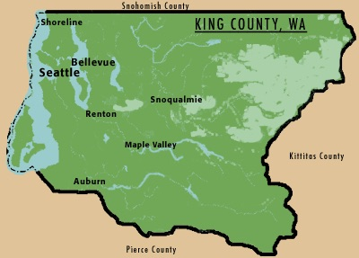

&nbsp;
&nbsp;

##  Pursuits of Leisure

&nbsp;

<a style="font-weight:bold;font-size:24px" href="waparks.html">WA State Parks Challenge</a>

&nbsp;

&nbsp;

One's adventure quotient can take a sizable hit when raising young children.  To help us continue to explore and to engender a healthy love of the outdoors in our kids, we've embarked on a quest to visit all of Washington's 137 State Parks.  

&nbsp;

---------------------------------

<a style="font-weight:bold;font-size:24px" href="trail_races.html">Trail Races</a>

&nbsp;

&nbsp;

I started running during COVID; just short little jogs around the neighborhood mostly to get me out of the house.  I've always loved hiking.  As my running habit grew so to did my knees' dislike of pounding pavement.  Not soon after I starting running the trails.  In the Fall of 2023 I did my first race -- the Cutthroat Classic -- and am hooked.  I'm recording my races here...mostly for my own memory.     

&nbsp;

---------------------------------

<a style="font-weight:bold;font-size:24px" href="king_county_traverse.html">King County Traverse</a>

&nbsp;

&nbsp;

In 2023, I set out to run across King County (WA), East to West.  On a wet morning in Early December at a non-descript bramble bush on the East Side of Tiger Mountain I finished.  Click on the link for a map and more details.   

&nbsp;

---------------------------------

<a style="font-weight:bold;font-size:24px" href="kraustralia/kraustralia.html">Kraustralia</a>

&nbsp;

&nbsp;

From January 2015 to May 2017, we lived in the amazing city of Melbourne Australia.  At that time we kept a blog -- Kraustralia.com.  While we've given up the website, I've resurrected the blog, mostly in text form, here for my own memory.  

&nbsp;

---------------------------------

<a style="font-weight:bold;font-size:24px" href="books.html">Book Reviews</a>

&nbsp;

&nbsp;

I used to read a lot of books. I still do, though they are now focused on Dr. Suess and the Adventures of Maisy.  Most of my literary intake is now via audio book, which is great when you need to consume literature on your lunch walks and occasional bus rides.  However, I find it less useful for actually retaining knowledge of what I've read.  To help this and to encourage me to write more, I'm self-enforcing book reviews.

&nbsp;

<!-- <a style="font-weight:bold;font-size:24px" href="on-being-fair.html">On Being Fair</a> -->

<!-- &nbsp; -->

<!-- An irregularly updated look at contemporary issues through the lens of fairness.   -->

<!-- &nbsp; -->
<!-- &nbsp; -->

