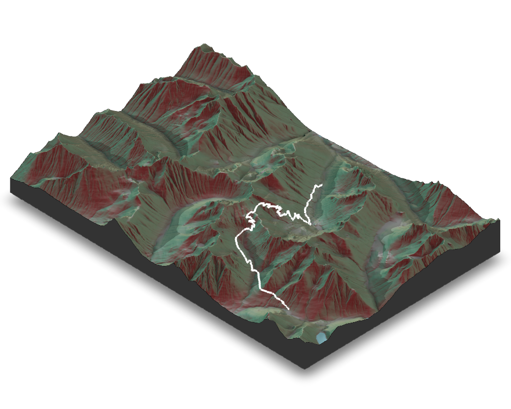

<link rel="stylesheet" href="kraustralia/kraustralia.css" type="text/css">

 
 
 

&nbsp;
&nbsp;

## Cutthroat Classic - 9/9/2023

[Race Website](https://methowtrails.org/events/cutthroat-classic)
&nbsp;
&nbsp;

[Results](https://results.raceroster.com/v2/en-US/results/aruguf2ankx7bx75/results)
&nbsp;
&nbsp;

Time: 1:34.18 -- (17th)
&nbsp;
&nbsp;

Distance: 10.5 Miles
&nbsp;
&nbsp;

Elevation Gain to Pass: 1,965
&nbsp;
&nbsp;

 

&nbsp;

 

&nbsp;

-----------------------------------------------------------------------------------------------------------------------------------------------

&nbsp;
&nbsp;

## Lord Hill 

[Race Website](https://www.evergreentrailruns.com/lord-hill/)
&nbsp;
&nbsp;

[Results](https://runsignup.com/Race/Results/68860#resultSetId-439600;perpage:100)
&nbsp;
&nbsp;

Time: 1:33.00 -- (1st/9th)
-- First in brunch run, but 9th if I had run the morning 10 miler
&nbsp;
&nbsp;

Distance: 10 Miles
&nbsp;
&nbsp;

Cumulative Gain: 1,800
&nbsp;
&nbsp;

 

&nbsp;

 

&nbsp;

## Orcas Half

[Race Website](https://www.destinationtrailrun.com/orcas-island)
&nbsp;
&nbsp;

[Results](https://ultrasignup.com/results_event.aspx?did=108474)
&nbsp;
&nbsp;

Time: 2:23.25 -- (7th)
&nbsp;
&nbsp;

Distance: 14 Miles
&nbsp;
&nbsp;

Cumulative Gain: 3,600
&nbsp;
&nbsp;

 

&nbsp;

 

&nbsp;

## Bigfoot 20
