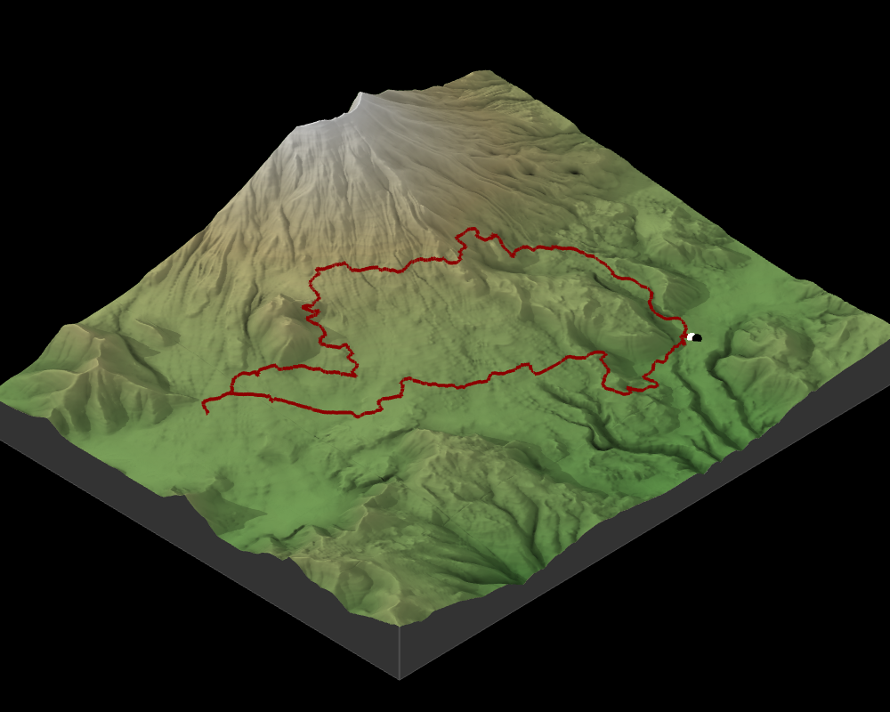
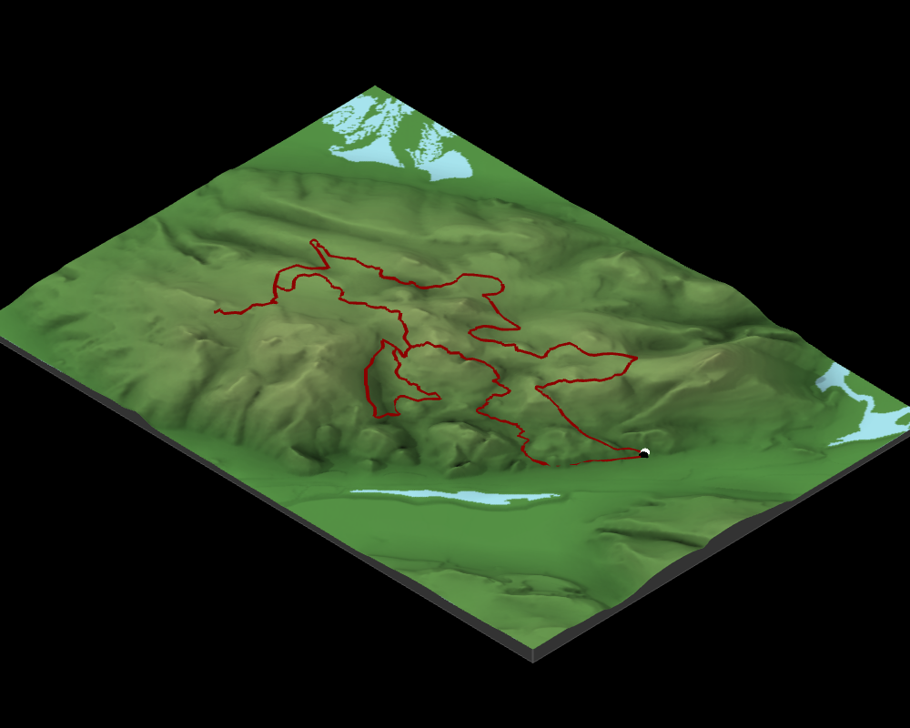
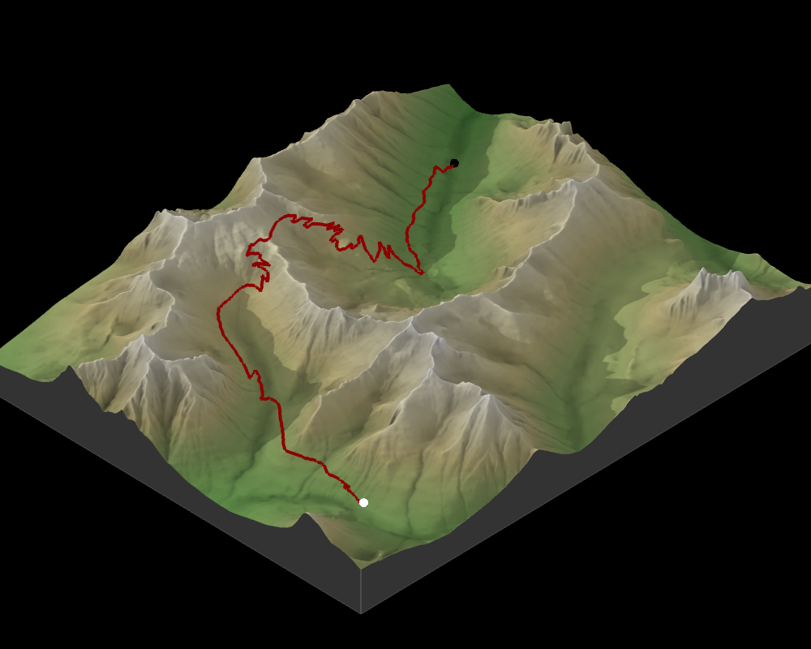

```{r include=FALSE}
  library(magrittr)
  library(magick)
  library(gridExtra)
  library(png)
  library(grid)
  source(file.path(getwd(), 'functions', 'mapping_functions.R'))


```

<link rel="stylesheet" href="trailraces.css" type="text/css">

<br/>
<br/>
<br/>

&nbsp;
&nbsp;

## Bigfoot 20 - 8/9/2024




<font color="black"> .</font>

<font color="black"> .</font>


`Time`: 3:40.45 (2nd Place)
&nbsp;
&nbsp;
&nbsp;
&nbsp;

`Distance`: 19.8 Miles
&nbsp;
&nbsp;
&nbsp;
&nbsp;

`Cumulative Gain`: 3,684 feet
&nbsp;
&nbsp;
&nbsp;
&nbsp;

<font color="black"> .</font>

<font color="black"> .</font>

[Race Website](https://www.destinationtrailrun.com/bigfoot-20m)
&nbsp;
&nbsp;
&nbsp;
&nbsp;

[Results](https://ultrasignup.com/entrants_event.aspx?did=107531)
&nbsp;
&nbsp;
&nbsp;
&nbsp;

<font color="black"> .</font>

<font color="black"> .</font>

<font color="black"> .</font>

---------------

## Orcas Island Half - 4/28/2024


<font color="black"> .</font>

<font color="black"> .</font>

`Time`: 2:23.25 -- (7th)
&nbsp;
&nbsp;

`Distance`: 14 Miles
&nbsp;
&nbsp;

`Cumulative Gain`: 3,600 feet
&nbsp;
&nbsp;

<font color="black"> .</font>

<font color="black"> .</font>

[Race Website](https://www.destinationtrailrun.com/orcas-island)
&nbsp;
&nbsp;

[Results](https://ultrasignup.com/results_event.aspx?did=108474)
&nbsp;
&nbsp;

<font color="black"> .</font>

<font color="black"> .</font>

<font color="black"> .</font>


---------------

## Lord Hill 10M -- 2/24/24



<font color="black"> .</font>

<font color="black"> .</font>

`Time`: 1:33.00 -- (1st/9th)
-- 1st in brunch run; 9th Overall
&nbsp;
&nbsp;

`Distance`: 10 Miles
&nbsp;
&nbsp;

`Cumulative Gain`: 1,800 feet
&nbsp;
&nbsp;

<font color="black"> .</font>

<font color="black"> .</font>

[Race Website](https://www.evergreentrailruns.com/lord-hill/)
&nbsp;
&nbsp;

[Results](https://runsignup.com/Race/Results/68860#resultSetId-439600;perpage:100)
&nbsp;
&nbsp;

<font color="black"> .</font>

<font color="black"> .</font>

<font color="black"> .</font>
---------------

## Cutthroat Classic - 9/9/2023



<font color="black"> .</font>

<font color="black"> .</font>

`Time`: 1:34.18 -- (17th)
&nbsp;
&nbsp;

`Distance`: 10.5 Miles
&nbsp;
&nbsp;

`Elevation Gain to Pass`: 1,965
&nbsp;
&nbsp;

<font color="black"> .</font>

<font color="black"> .</font>

[Race Website](https://methowtrails.org/events/cutthroat-classic)
&nbsp;
&nbsp;

[Results](https://results.raceroster.com/v2/en-US/results/aruguf2ankx7bx75/results)
&nbsp;
&nbsp;

<font color="black"> .</font>

<font color="black"> .</font>

<font color="black"> .</font>

---------------


 


 


<!-- ```{r, echo = FALSE} -->

  <!-- # library(raster) -->
  <!-- # library(sp) -->
  <!-- # library(sf) -->
  <!-- # library(rayshader) -->
  <!-- # options(rgl.useNULL = TRUE) -->
  <!-- # rgl::setupKnitr(autoprint = TRUE) -->

<!--   track_name = 'cutthroat_classic' -->
<!--   datax <- readRDS(file = file.path(getwd(), 'data', track_name, '3dmapdata.rds')) -->

<!--   idx <- c(1, nrow(datax$track_obj$elevation)) -->

<!--   rgl::open3d() -->
<!--   rgl::bg3d('black') -->

<!--   datax$topo_obj$rsm %>% -->
<!--    rayshader::plot_3d(datax$topo_obj$mat, -->
<!--             zscale = datax$plot_configs$z_scale, -->
<!--             fov = datax$plot_configs$fov, -->
<!--             theta = datax$plot_configs$theta, -->
<!--             zoom = datax$plot_configs$zoom, -->
<!--             phi = datax$plot_configs$phi, -->
<!--             windowsize = datax$plot_configs$window_size, -->
<!--             background="black") -->
<!--     rayshader::render_path(extent = sf::st_bbox(datax$topo_obj$elev), -->
<!--               lat = unlist(datax$track_obj$elevation$lat), -->
<!--               long = unlist(datax$track_obj$elevation$lon), -->
<!--               altitude = unlist(datax$track_obj$elevation$elevation) *  -->
<!--                datax$track_configs$elev_multiplier, -->
<!--               zscale = datax$plot_configs$z_scale, -->
<!--               color = datax$track_configs$color, -->
<!--               antialias = datax$plot_configs$antialias) -->
<!--   rayshader::render_points(extent = sf::st_bbox(datax$topo_obj$elev), -->
<!--               lat = unlist(datax$track_obj$elevation$lat[idx]), -->
<!--               long = unlist(datax$track_obj$elevation$lon[idx]), -->
<!--               altitude = unlist(datax$track_obj$elevation$elevation[idx]) *  -->
<!--                 datax$track_configs$elev_multiplier * 1.01, -->
<!--               zscale = datax$plot_configs$z_scale, -->
<!--               color = datax$plot_configs$start_end_colors, -->
<!--               size = datax$plot_configs$start_end_size) -->

<!--  rgl::rglwidget() -->

<!-- ``` -->