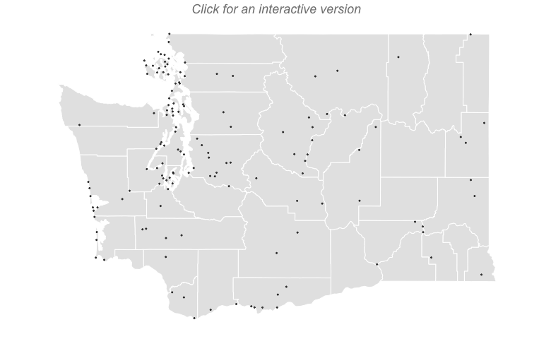
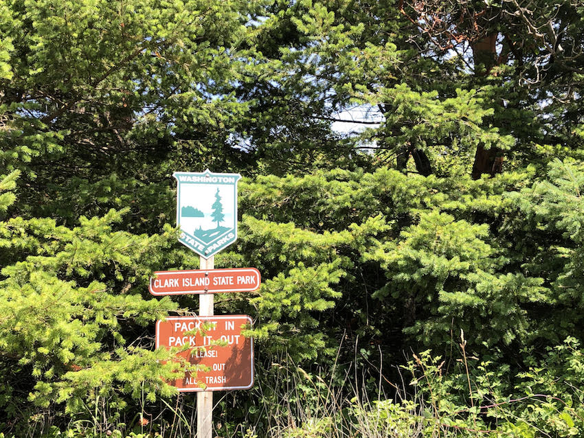
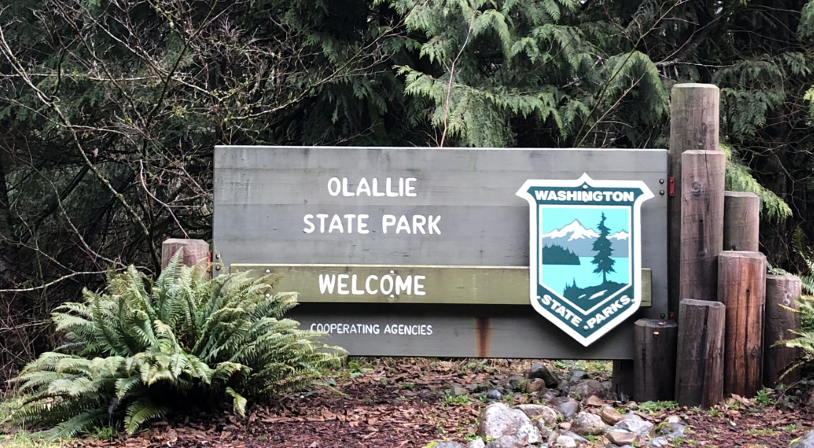

```{r, echo = FALSE, message = FALSE, warning=FALSE, comment = FALSE}

 ## Set Libraries

  library(magick)
  library(gridExtra)
  library(png)
  library(grid)
  library(sf)

 ## Read in Data
  
  summ_df <- readRDS(file.path(getwd(), 'data', 'created', paste0('summary.RDS')))
  visited_sf <- readRDS(file.path(getwd(), 'data', 'created', paste0('visited.RDS')))
 
 ## Source Files
  
  source(file.path(getwd(), 'scripts', 'mapping_functions.R'))

 ## Set Parameters
  
  clipp <- 100
  tt2 <- ttheme_minimal()


```

&nbsp;
&nbsp;

###  Introduction

&nbsp;
&nbsp;


We had lost our sense of adventure, mostly. With two small children packing the car and enduring road trip eventualities — soiled car seats, endless questions, whining — creates significant homebody inertia.  Getting out, especially in the short, damp days of a Northwest Winter, was often just too much.  We needed motivation.  

Busy professionals with weak spots for childish competitions and games, one of us gifted the other a Washington State Parks checklist banner — thanks [Etsy](https://www.etsy.com/listing/758790133/wa-state-park-checklists-washington?ga_order=most_relevant&ga_search_type=all&ga_view_type=gallery&ga_search_query=Washington+state+parks&ref=sr_gallery-1-1&organic_search_click=1&cns=1) — for Christmas.  The challenge was on, the game afoot.  Visiting State Parks is a sizable reduction in both investment and payoff, from say, counting continents, countries or even National Parks.  We had checked the map; done right we could probably do 5-7 parks some days.  Our reward would be picnic shelters and boat launches not grand geologic formations and soul-stirring vistas.  Playgrounds not postcards.   

There are a lot of state parks in Washington State, 137^[This number could vary based on which types of parks and park properties you count.  We've opted for all of those on the above mentioned banner, plus any other new parks that have their own website link on the WA State Parks website.  Imperfect, I know, but objective at the least] in all, and some not accessible by car. The good money would be on us not finishing this quest…and that’s OK, its the journey we seek. In our pre-child mid-twenties, we once visited the Grand Coulee dam. We’ve been to the Mima Mounds, overnighted in Warnambool (twice) and weathered a typhoon in Toba. We are no strangers to long journeys with small payoffs.  We've experienced -- and enjoyed -- being surrounded by retirees, RV people and empty parking lots. Though now we are two car seats strong and have a tiny collapsible toilet in the hatch. Adventure takes no universal form.  

&nbsp;
&nbsp;

&nbsp;&nbsp;

---------------------------------------------------------------------------------------------------

### **Progress**

&nbsp;
&nbsp;
&nbsp;


&nbsp;

<a style="font-weight:bold;font-size:24px" href="waparks_interactive.html">
  
</a>

&nbsp;
&nbsp;
&nbsp;
&nbsp;

```{r, echo = FALSE, cache = FALSE}

  head_col <- '#9df18e'
  row_col <- "#edf5fc"

  total_df <- data.frame(Visited = summ_df$Measure[2],
                         Remaining = summ_df$Measure[3],
                         Total = summ_df$Measure[1],
                         Done = round(100 * summ_df$Measure[2] / summ_df$Measure[1], 0))
  names(total_df)[4] <- '% Done'
  
  total_df %>%
   knitr::kable(., format = 'html') %>%
   kableExtra::kable_styling(full_width = F, stripe_color = strip_col)  %>%
   kableExtra::row_spec(0, background = head_col) 
  
```

&nbsp;
&nbsp;

```{r, echo = FALSE, cache = FALSE}

  travel_df <- data.frame('Miles Driven' = summ_df$Measure[4],
                          'Miles Ferried' = summ_df$Measure[5],
                          'Miles Boated' = summ_df$Measure[6],
                          'Miles Hike' = summ_df$Measure[7],
                          'Miles Paddleboarded' = summ_df$Measure[8])
  names(travel_df) <- c('Miles Driven', 'Miles Ferried', 'Miles Boated', 'Miles Hiked', 
                        'Miles Paddleboarded')
  
  travel_df %>%
   knitr::kable(., format = 'html') %>%
   kableExtra::kable_styling(full_width = F, stripe_color = strip_col)  %>%
   kableExtra::row_spec(0, background = row_col) 
  
```

&nbsp;

---------------------------------------------------------------------------------------------------

&nbsp;

### **Trip Reports**

&nbsp;
&nbsp;
&nbsp;


---------------------------------------------------------------------------------------------------

#### 72) [Rasar](https://parks.state.wa.us/571/Rasar): 

&nbsp;
&nbsp;

```{r, echo = FALSE, cache = FALSE, fig.height = 2.2, message = FALSE, comment = FALSE}

img <-
  "images/map_rasar.png" %>%
  magick::image_read() %>%
  cropp(right = clipp, top = clipp, left = clipp, bottom = clipp) %>%
  magick::image_scale(., '200')

gridExtra::grid.arrange(rasterGrob(img), 
                        makeTblx(visited_sf, 'Rasar'),
                        nrow = 1,
                        as.table = TRUE)
```

With the morning's mechanical delays, our time at Rasar needed to be short and sweet in order to make our boat. We all piled out of the car for requisite bathrooms runs and diaper changes before sitting down for a picnic in the long, soft grass. Leaves the size of our heads gently drifted down from the big leaf maples surrounding the day use area. No views from here, but a pleasant mix of sunshine and shade. Hints of autumn's pending arrival all around. 


Sated, we headed out for a quick hike; a much needed stretching of the legs after the three-hour drive from Twisp. We took the nearest trail down the hill and out into the flat floodplain of the Skagit River.  Oddly placed directly in the middle of a large meadow is a single picnic table and large, interpretive sign.  Expecting some explanation of riverine action or fluvial dynamics on the sign, I was surprised to find that it contained a short anecdote about an experience a ranger had with a threatening bull elk near this very spot.  I guess its intent was to serve as a warning to future hikers. Or maybe to call our attention to the wonders of elk mating habits. It is really hard to say. After looking at my fair share of signage at the previous 71 state parks, this certainly qualifies as the oddest.

While I scanned the horizon for angry ungulates, the eldest picked dandelions and braided them into small ropes. The younger child was testing out various ways to injure himself on the picnic table; fortunately a failed endeavor. The only sounds were the distant rush of the river and the occasional crow flying over head.  For a minute, it was relaxing.  Then the clock called and we had to pack up and hit the road again bound for Anacortes. Our ferry ended up being delayed and our rush was for naught. Considering we began the day with three functioning tires and no electricity, you'll hear no complaints about a bit of a wait at the ferry dock. 

&nbsp;

---------------------------------------------------------------------------------------------------

#### 71) [Rockport](https://parks.state.wa.us/574/Rockport): 

&nbsp;
&nbsp;

```{r, echo = FALSE, cache = FALSE, fig.height = 2.2, message = FALSE, comment = FALSE}

img <-
  "images/map_rockport.png" %>%
  magick::image_read() %>%
  cropp(right = clipp, top = clipp, left = clipp, bottom = clipp) %>%
  magick::image_scale(., '200')

gridExtra::grid.arrange(rasterGrob(img), 
                        makeTblx(visited_sf, 'Rockport'),
                        nrow = 1,
                        as.table = TRUE)
```

The kids slept through the night in our small hotel room in Winthrop and we all woke refreshed for another day on the road. This one our last of the trip. Unfortunately, our morning would deteriorate.  Returning from a morning run along the Methow River, I noticed that we had a flat tire.  This was the first vehicular issue of the trip, nearly 4,000 miles into our Parks Challenge. Returning to the hotel room to convey the bad news, I wasn't the only one with something to share.  The power had gone out in the hotel and, according to the front desk, in all of Methow Valley. A call to Les Schwab in Twisp confirmed that they had time to fix our tire but could only do so if the power returned. We faced the possibility of spending more time here than originally planned.


It wasn't the missed ferry reservation or the need to entertain the kids while at the repair shop that bothered us. No, our fear and loathing was precipitated by the possibility of a mis-alignment between the longer mountain crossing and the children's naps.  The nap schedule (read: our two hours of sanity) drove our trip planning and that now was threatened. After a quick consultation with our owner's manual I was able to put the spare tire on; enough to get us to the mechanic. Off we went, 10 miles in the wrong direction hoping the power would return.  Luckily it had and after an hour we had a patched tire and were on our way back west on Highway 20.  With any luck we'd still make our 3:05 ferry. 

Our original plan had been a picnic lunch at Rockport State Park. The kids were still sleeping so we opted for a slow roll through the park, awing at the big trees and fall colors.  The car never stopping so as to keep the backseat passengers asleep. Forty-five minutes earlier at a lookout over Ross Lake, we pulled a similar maneuver where one of us jumped out of the moving vehicle for a quick bathroom run while the other drove circles in the parking lot.  Foregoing a hike through the old growth at Rockport was a missed opportunity, but given our morning if that is all we had to forfeit on we'll consider the day salvaged.  

&nbsp;

---------------------------------------------------------------------------------------------------

#### 70) [Pearrygin Lake](https://parks.state.wa.us/563/Pearrygin-Lake): 

&nbsp;
&nbsp;

```{r, echo = FALSE, cache = FALSE, fig.height = 2.2, message = FALSE, comment = FALSE}

img <-
  "images/map_pearryginlake.png" %>%
  magick::image_read() %>%
  cropp(right = clipp, top = clipp, left = clipp, bottom = clipp) %>%
  magick::image_scale(., '200')

gridExtra::grid.arrange(rasterGrob(img), 
                        makeTblx(visited_sf, 'Pearrygin Lake'),
                        nrow = 1,
                        as.table = TRUE)
```

&nbsp;

Judging from the size of the parking lot, Pearrygin Lake State Park can get busy.  Lucky for us on this gorgeous weekday afternoon in October our fellow patrons only numbered in the dozens. We easily found a prime beach spot that allowed for both direct water access and enough shade. After three or four trips back and forth from the car we had all of our necessities and could settle in for an afternoon at the lake. While we had plenty of experience on the road by now and had been developing little systems to help simplify the process of traveling with kids, rare is the occasion that a followup trip to get the missing this or that isn't needed.  No amount of organizing or preparation seems to be able to allow one to run contrary to this Law of Parenting.  


The water appeared inviting and I was sweating from all the retrieving. Looks, however, can be deceiving. The chilly autumn evenings kept the lake temperature down and my swim was quickly aborted. Even the kids kept to knee deep or less in the cold water. We mostly collected sticks and rocks to build little beach structures and tried to keep the little one from destroying the big one's creations. A pretty standard day at the beach. 

Over the afternoon the beach slowly filled in. A few paddleboarders, another family that also appeared a bit weary from the journey here and a number of dog walkers. A single jet ski tore around the lake, interrupting our peace and quiet (Note: I used this term lightly given we have a toddler). No one else went for a swim, confirming to me that I wasn't just wimpy and that the water was actually too cold for sustained submersion. 

&nbsp;

---------------------------------------------------------------------------------------------------

#### 69) [Bridgeport](https://parks.state.wa.us/480/Bridgeport): 

&nbsp;
&nbsp;

```{r, echo = FALSE, cache = FALSE, fig.height = 2.2, message = FALSE, comment = FALSE}

img <-
  "images/map_bridgeport.png" %>%
  magick::image_read() %>%
  cropp(right = clipp, top = clipp, left = clipp, bottom = clipp) %>%
  magick::image_scale(., '200')

gridExtra::grid.arrange(rasterGrob(img), 
                        makeTblx(visited_sf, 'Bridgeport'),
                        nrow = 1,
                        as.table = TRUE)
```

&nbsp;

Exiting Highway 17 towards Bridgeport State Park you leave the manicured orchards and road side stands for the native sagebrush hills.  On your left as far as the eye can see is the olive green of the thinly scattered desert vegetation. On your right the massive Chief Joseph Dam; the water churning, the power lines humming. It is sparse out here. No people or moving vehicles in sight. The river pushes on toward the sea, slowing briefly for these annoyances that man has put in its way. Continuing on Half Sun Way, up and over a small rise and the dam and its accessories recede from view.  Burnt hills arise in the distance. A few birds of prey hang in the thermals rising from the land heating in the bright mid-morning sun. Passing through the abandoned Lake Woods Golf Course on the river side adds to the feeling of desolation.  


Honestly, the drive in had lowered our expectations for the park. Just another one to cross off of the list. Well, actually not just another one. Bridgeport would mark the halfway point of our State Parks Challenge.  For six of the past nine months (minus a 3-month COVID break) we've been dipping our toes at beaches and scouting campsites all over the state. Consulting our trusty gazetteer (and Google Maps) to plot routes to best align with nap schedules. And, most importantly, stocking up on snacks to help manage the emotions of all members of our intrepid party. In doing so we've driven the equivalent of Seattle to Key West, crossing the Cascades eight times, the Columbia River six. Setting foot in 24 counties and on 18 different islands. We were hoping for a joyous park experience to mark our progress. 

Arriving a Bridgeport we were so pleased to have been utterly wrong in our initial inference. The autumn colors here shown bright, the lawn well manicured, and the park empty. Other than a few remaining RVs we had the entire park to ourselves, much more space that we could ever hope to use. It was late enough in the morning that a swim would have been refreshing not chilling, but the large sign warning of toxic algae kept us out of the water. We explored the grounds freely, the kids excited at having the large playground to themselves, us adults noting the amazing views of the Columbia from the walk-in campsites.  We managed a short hike up the interpretative trail before returning to quell the hunger complaints from some of our party.  Having lunched, we piled back in the car for the drive up the Methow Valley. Bridgeport is a wonderful park set amidst the lonesome shore of the Columbia River; a fitting marker of our progress. 

The first half our challenge complete -- 68 more parks to go. 

&nbsp;

---------------------------------------------------------------------------------------------------

#### 68) [Alta Lake](https://parks.state.wa.us/239/Alta-Lake): 

&nbsp;
&nbsp;

```{r, echo = FALSE, cache = FALSE, fig.height = 2.2, message = FALSE, comment = FALSE}

img <-
  "images/map_altalake.png" %>%
  magick::image_read() %>%
  cropp(right = clipp, top = clipp, left = clipp, bottom = clipp) %>%
  magick::image_scale(., '200')

gridExtra::grid.arrange(rasterGrob(img), 
                        makeTblx(visited_sf, 'Alta Lake'),
                        nrow = 1,
                        as.table = TRUE)
```

&nbsp;

On a calm, October Monday morning Alta Lake lay still. A single aluminium fishing craft trolling so slowly its wake didn't upset the pane glass texture of the water.  The parking lot was no busier.  No bodies at the beach, the concession stand locked up for the season. After spending the weekend at Lake Chelan, the emptiness here was welcome. 


Burn scars from the 2014 fire still show on the larger remaining trees. The vegetation is mostly quick growing, post-fire plants. The cold nights have turned the leaves all shades of vibrant colors, the reds and yellow striking against the pure blue water and the irrigated greens of the parks lawns.  Around this natural palette brown hills form a bounding ring. Lest I wax too poetically about the natural scenery here, do note that much of the shoreline is privately owned and filled with modern homes, docks and boats.  

This early in the day it was too cold for a swim. We settled for a short hike to see the ghost trees down by the NW end of the lake and then spent a long episode at the swing set -- which appeared to be the only playground equipment to have survived the fire.  A simple design from generations ago -- wrought iron, now rusted --it may have survived the past few fires. In fact, I wouldn't be surprised if it was there when the first European settlers stumbled up the rim and looked down into the larger cavity containing the lake. 

&nbsp;

---------------------------------------------------------------------------------------------------

#### 67) [Lake Chelan](https://parks.state.wa.us/531/Lake-Chelan): 

&nbsp;
&nbsp;

```{r, echo = FALSE, cache = FALSE, fig.height = 2.2, message = FALSE, comment = FALSE}

img <-
  "images/map_lakechelan.png" %>%
  magick::image_read() %>%
  cropp(right = clipp, top = clipp, left = clipp, bottom = clipp) %>%
  magick::image_scale(., '200')

gridExtra::grid.arrange(rasterGrob(img), 
                        makeTblx(visited_sf, 'Lake Chelan'),
                        nrow = 1,
                        as.table = TRUE)
```

&nbsp;

Lake Chelan State Park is only nine miles from Twenty-Five Mile Creek. It feels a lot longer when you are jammed between two car seats trying to pacify your mutinous kids. The long day in the car was getting to them and no amount of beautiful mountains views or parental singing from the front seat would mollify them.  No, the moment called for direct adult interaction paired with snacks and videos, hence my position in the back seat. 


Where Twenty-Five Mile Creek was mostly a camping and boating crowd -- and a small one at that -- Lake Chelan was filled with day users and RVs. With a playground, larger beach and a store, it is a bigger draw than Twenty-Five Mile Creek, not to mention closer to town.  As a result, it was also much more crowded, though not uncomfortably so. Big groups abounded without a single mask to be seen. A time traveler from the deep past (say February 2020), would have had no idea we were amidst a pandemic; one currently affecting our highest levels of government.^[I use this term as a matter of official-ness, not a measure of capacity, ability or even motivation] 

We didn't stay long.  A quick trip to the beach to dip our toes and then a few runs down the slide and off we went. I returned to the center rear seat for the 30-minute ride to our rental home. Our place on Wapato Point was a mere 1.4 miles across the water, but 20-some miles by road and, thus, around the lake we drove. Uncomfortable as it maybe, the rear seat does afford one the opportunity to selectively filter the chocolate pieces from the trail mix without your spouse knowing, so it isn't all bad. 

---------------------------------------------------------------------------------------------------

#### 66) [Twenty-Five Mile Creek](https://parks.state.wa.us/293/Twenty-Five-Mile-Creek): 

&nbsp;
&nbsp;

```{r, echo = FALSE, cache = FALSE, fig.height = 2.2, message = FALSE, comment = FALSE}

img <-
  "images/map_twenty-fivemilecreek.png" %>%
  magick::image_read() %>%
  cropp(right = clipp, top = clipp, left = clipp, bottom = clipp) %>%
  magick::image_scale(., '200')

gridExtra::grid.arrange(rasterGrob(img), 
                        makeTblx(visited_sf, 'Twenty-Five Mile Creek'),
                        nrow = 1,
                        as.table = TRUE)
```

&nbsp;

Six highways, three passes, five stoplights, one pit stop and 196 miles later we arrived at Twenty-Five Mile Creek State Park.  On its own, it is not a destination worth a journey of that magnitude, but we were making a weekend of it in Chelan so, in truth, getting here was only a minor detour.  


Dominating the waterfront is the marina, oddly empty this gorgeous October weekend. A small beach rests inside of the moorage.  So well cordoned off is the marina that the water inside its confines is algae-laden and discolored, a sharp contrast to the signature crystal clear water of the rest of the Lake Chelan.  A smell wafted from the water, eerily reminiscent of the late summer lakes of my northern Wisconsin youth. A walk to the end of the concrete pier/breakwater will get you past the smell and out to a full, wide view across the lake.  This far up -- nearly 1/3 of the way from the southern most point where the Chelan River exits -- you can look out across and see no human development at all. Just a few sparse trees dotting the brown hills that dive straight into the water.  It is a side of Lake Chelan that few likely get to see. 

Next to the marina is the creek. A small water course with driftwood and bubbling falls, its a better place to spend an afternoon -- for adults and children alike -- than the lakeside beach.  While our attempt at building a beaver dam was ultimately unsuccessful, we did manage to escape with only a few bumps and bruises. Not an easy feat for two small children amidst slick rocks and sharp sticks. Upstream from our failed hydro project, we found a school of small sockeye salmon working their way slowly up the creek to spawn. Too tired to hide, they allowed us to get close enough to nearly touch. We left them to their timeless journey and us to ours. A quick snack and repack of the car and we were on our way.     

---------------------------------------------------------------------------------------------------

#### 65) [Bay View](http://parks.state.wa.us/473/Bay-View): 

&nbsp;
&nbsp;

```{r, echo = FALSE, cache = FALSE, fig.height = 2.2, message = FALSE, comment = FALSE}

img <-
  "images/map_bayview.png" %>%
  magick::image_read() %>%
  cropp(right = clipp, top = clipp, left = clipp, bottom = clipp) %>%
  magick::image_scale(., '200')

gridExtra::grid.arrange(rasterGrob(img), 
                        makeTblx(visited_sf, 'Bay View'),
                        nrow = 1,
                        as.table = TRUE)
```

&nbsp;

To this point we had driven some 3,500 miles on our Parks Challenge without any major incidents.  No accidents, no flat tires, our boat never ran aground, our paddleboards never tipped. No altercations with locals, no harassment by or of wild animals and no visits from law enforcement. Just a few miles south of Bay View State Park we stained our perfect record.  One of us mentioned to the other that we appeared to be gaining on a motorcycle that may have been a police vehicle. Shortly thereafter we were pulled over for speeding through the small town of Bay View.  A mask covered the smug grin on the passenger's face.  


The driver's (who shall remain nameless) previously unblemished record may have resulted in us getting off with a warning.  Our biggest concern was that our four-year-old -- who has taken to calling out speed limits sign whenever he sees them -- was going to tattle on us to the highway patrolman regarding our conversation about knowingly speeding prior to the incident. He kept quiet, likely transfixed by the flashing lights at our immediate rear.  

Brush with the law over, we slowly pulled in and parked at Bay View State Park.  The non-camping area is compact, but with a pleasant beach. The view of the bay is dominated by the Tesoro Refinery which steals no small amount of charm from what was once idyllic Padilla Bay. The park was as sleepy as the town.  A few dog walkers here and there.  A cyclist with laden panniers eating lunch out of a can. An old man smoking a cigarette in his car with the windows up and engine running. We had to manufacture all of the excitement ourselves; boulder scrambling, fence climbing, rock throwing, an aborted attempt at a swim by a toddler, some yelling, more whining. Our stay was short, but I fear we may have brought too much get-up-and-go for this park and it denizens. I set the cruise control at 25 and we back-tracked through town and out to the highway. 

---------------------------------------------------------------------------------------------------

#### 64) [Scenic Beach](http://parks.state.wa.us/579/Scenic-Beach): 

&nbsp;
&nbsp;

```{r, echo = FALSE, cache = FALSE, fig.height = 2.2, message = FALSE, comment = FALSE}

img <-
  "images/map_scenicbeach.png" %>%
  magick::image_read() %>%
  cropp(right = clipp, top = clipp, left = clipp, bottom = clipp) %>%
  magick::image_scale(., '200')

gridExtra::grid.arrange(rasterGrob(img), 
                        makeTblx(visited_sf, 'Scenic Beach'),
                        nrow = 1,
                        as.table = TRUE)
```

&nbsp;

In addition to sending us to new and exciting corners of this state, our Parks Challenge has consistently pushed us through times of low motivation to be more active and engaged with the kids. It often means naps in the car and eating more travel snacks than an ideal diet would call for, but, in general our determination -- our grit -- has been richly rewarded. That said, we may have pushed it a bit too far on our trip to Scenic Beach. 


As we loaded the ferry in downtown Seattle bound for Bremerton, Erin felt a migraine coming on.  It was, physically, too late to turn around as such a maneuver on the dock en route to the boat would have likely caused a visit from the Coast Guard. Ferry trips during COVID aren't nearly as much fun as its hard to keep the kids from running around on the passenger decks. Fortunately, it was an early morning boat and the exterior top level, the sun deck was empty.  It was not sunny and was somewhat cold, but it was large enough and well fenced that I could singularly, and safely, corral them without endangering other passengers.  Armed with plentiful snacks, we survived the hour long crossing. The three boys terrorizing the upper level of the boat; mom resting in the car.   

The forecast had called for 10% chance of rain. Upon our arrival the rain began and continued for the entire drive to the park. As we disembarked the automobile it tapered to a light drizzle. Erin had improved to the point where should could take a small hike down to the beach.  The tide was up, obscuring most of the beach. The kids got into some rotten apples that had fallen from a tree and nearly were attacked by yellow jackets.  The youngest had a bowel movement that his diaper didn't quite hold.  Upon returning from that cleanup, I cut my hand showing the elder child how to open an oyster with a rock. We abandoned the beach for a hike in the woods.  After the first small hill, and noting the frustrating morning, no doubt, the elder child declared that he didn't want to be at a park any more and just wanted to go home. So we did.  Multiple hours in travel, 45 minutes at Scenic Beach Park.  On the plus side, both kids got to sit atop a decommissioned torpedo on the Bremerton wharf while we waited for the return boat...clearly the highlight of the trip.  

---------------------------------------------------------------------------------------------------

#### 63) [Yakima Sportsman](http://parks.state.wa.us/278/Yakima-Sportsman): 

&nbsp;
&nbsp;

```{r, echo = FALSE, cache = FALSE, fig.height = 2.2, message = FALSE, comment = FALSE}

img <-
  "images/map_yakimasportsman.png" %>%
  magick::image_read() %>%
  cropp(right = clipp, top = clipp, left = clipp, bottom = clipp) %>%
  magick::image_scale(., '200')

gridExtra::grid.arrange(rasterGrob(img), 
                        makeTblx(visited_sf, 'Yakima Sportsman'),
                        nrow = 1,
                        as.table = TRUE)
```

&nbsp;

Heading west from the Tri-Cities you leave the Columbia and begin to climb back up the eastern flank of the Cascades along the Yakima River. Decades of irrigation projects have turned this valley into a bright green ribbon among the arid hills. As we rose in elevation the air began to clear. Nowhere near normal, but to a level much more suitable for outdoor exploration. 


Yakima Sportsman, our eighth and final park of this overnight trip, is located directly across the river from downtown Yakima. The approach is not lacking in suburban appeal.  Once inside, it is easy to forget you are in the city. Or at least it felt that way on a very quiet, early Saturday morning. COVID had closed the camping areas for the season and the only other park patrons there at this hour consisted of a group busy training search and rescue dogs.

We embarked on a short hike through the barren and ghostly campground, up and over the abandoned rail line and on to the banks of the Yakima River. At that very moment a small herd of deer were fording the river, an act we knew happened but had never actually witnessed. Despite it being late summer and one of little rain at all, the river, fed by snow melt, is still high and swift. The deer managed the crossing successfully, looking to have swam for a small bit at the deepest part. After a quick breakfast in the parking lot, we were back in our trusty steed aimed for Seattle some 150 minutes away with Ken Burns and his take on Lewis & Clark's journey to keep us entertained. 

&nbsp;
&nbsp;
&nbsp;

---------------------------------------------------------------------------------------------------

#### 62) [Sacajawea](http://parks.state.wa.us/575/Sacajawea): 

&nbsp;
&nbsp;

```{r, echo = FALSE, cache = FALSE, fig.height = 2.2, message = FALSE, comment = FALSE}

img <-
  "images/map_sacajawea.png" %>%
  magick::image_read() %>%
  cropp(right = clipp, top = clipp, left = clipp, bottom = clipp) %>%
  magick::image_scale(., '200')

gridExtra::grid.arrange(rasterGrob(img), 
                        makeTblx(visited_sf, 'Sacajawea'),
                        nrow = 1,
                        as.table = TRUE)
```

&nbsp;

The smoke had settled into the Walla Walla River basin thick and low, allegedly to PM2.5 levels near the worst in the country and likely the world.  We left at day break, amidst low visibility, a choking smell and empty roadways; an eerie, post-apocalyptic scene.  On our way we passed the (geologically) famous [Wallula Gap](https://en.wikipedia.org/wiki/Wallula_Gap), though air quality would not allow for a remote view nor time an intimate inspection.  After crossing the Snake River once again, we exited the freeway, bound for Sacajawea State Park.


By this time in our road trip, our initial audio book had completed.  Inspired by stories about the European exploration of the West, we quickly downloaded Ken Burns' short history of Lewis & Clark to fill the remainder of our drive.  Thus, our arrival at Sacajawea, located at the confluence of the Snake and Columbia Rivers, was very apropos. As our history teachers no doubt told us, and what this book would later re-enforce is the centrality of Sacajawea -- the trips only indigenous member and only woman -- the success of the Corps of Discovery's journey. Naming the park after her seems a deserved, if still too, small of an honor.  

Unfortunately, as is often the case in our travels, we were too early.  The gates to the park would not open for another hour or so. I sprinted (OK, lightly jogged) inside to capture a photo of the park's signage and to use the facilities. Itching to stretch my legs a bit more, I continued on for a short bit down the Sacajawea Heritage Trail to the water's edge. Looking out over the Columbia -- which, oddly enough, flows east here until it turns south and then west at Wallula -- I could see no evidence of modern society. Though, to be fair, I could not see very far. Geese honked, a dog parked and the river quietly rolled on just as it has for millennium.  Little did it know that what Lewis & Clark's trip would ultimately engender would take from it its freedom and most of its salmon.  

&nbsp;
&nbsp;
&nbsp;

---------------------------------------------------------------------------------------------------

#### 61) [Lewis & Clark Trail](http://parks.state.wa.us/539/Lewis-Clark-Trail): 

&nbsp;
&nbsp;

```{r, echo = FALSE, cache = FALSE, fig.height = 2.2, message = FALSE, comment = FALSE}

img <-
  "images/map_lewis&clarktrail.png" %>%
  magick::image_read() %>%
  cropp(right = clipp, top = clipp, left = clipp, bottom = clipp) %>%
  magick::image_scale(., '200')

gridExtra::grid.arrange(rasterGrob(img), 
                        makeTblx(visited_sf, 'Lewis & Clark Trail'),
                        nrow = 1,
                        as.table = TRUE)
```

&nbsp;

After abandoning our campsite at Fields Spring on account of the deteriorating air quality, we headed back west in the hopes of finding indoor accommodation for the night. A brief pit stop for fuel, snacks and some inquiring phone calls to hoteliers and we were off to Walla Walla for the night.  It would mean we were 90 minutes closer to home for the drive tomorrow. It also meant 90 more minutes in the car today.  We were now racing downstream with the Snake River on our starboard side, dry yellow hills and buttes on our port. The sun hung low in the sky, a bright red orb so obscured by the smoke that you could look directly at it without averting your gaze. As our distance to Walla Walla decreased, so, too, did the visibility.  


We would need to make a brief stop. Lewis & Clark Trail State Park -- our sixth of the day -- was en route. Not surprising given that Highway 12 from Lewiston to Waitsburg roughly follows their Eastbound (return) Overland route.  We pulled into the park amidst a choking haze.  We did a very slow circuit through the campground, pausing briefly as we crossed over the trail.  I remain skeptical as to the likelihood that the modern day trail lies along their party's exact footsteps, but it is a piece of American History, nonetheless. Upon leaving, we stopped long enough for a requisite Merriwether Lewis pose (one hand blocking the sun, the other pointed off into the distance) in front of the park's signage. Then quickly back inside the car where, to be honest, the air was probably no cleaner. 

Back on the road as we, like the early explorers, inched ever closer to the mighty Columbia. Leaving Lewis & Clark's route and crossing deeper into Wine Country the change was subtle but evident even without being able to see the vines blanketing the surrounding hills.  The buildings are in better repair, especially those calling to tourists.  The political signs fewer in number and shading much bluer. The global economy -- the one President Jefferson had hoped would flow through the Northwest Passage -- has greater reach here than it does just a few hours east.  

&nbsp;
&nbsp;
&nbsp;

---------------------------------------------------------------------------------------------------

#### 60) [Fields Spring](http://parks.state.wa.us/503/Fields-Spring): 

&nbsp;
&nbsp;

```{r, echo = FALSE, cache = FALSE, fig.height = 2.2, message = FALSE, comment = FALSE}

img <-
  "images/map_fieldsspring.png" %>%
  magick::image_read() %>%
  cropp(right = clipp, top = clipp, left = clipp, bottom = clipp) %>%
  magick::image_scale(., '200')

gridExtra::grid.arrange(rasterGrob(img), 
                        makeTblx(visited_sf, 'Fields Spring'),
                        nrow = 1,
                        as.table = TRUE)
```

&nbsp;

From Lyons Ferry we continued East along the Lewis & Clark Memorial Highway (US 12). Upon reaching Clarkston, WA -- sister city to Lewiston, ID across the Snake River -- we turned due south up the very crooked Highway 129. This is Asotin County, the farthest corner of the state. Our destination, Fields Spring State Park is the most distant of all the state parks, in straight line measurement, from our home in Seattle at 265.4 miles. Via roadways it closer to 350. Judging by the political signage, it still isn't far enough from Seattle for the people here.  In fact, a number of ambitious souls were suggesting splitting the state into two whereby west of the Cascades would remain Washington and east of it would become Liberty, our 51st state.  


After you rise out of the Snake River valley you crest out on the high plateau and the Blue Mountains come into view. At first it is flat, treeless farmland. Gradually the incline leads into sparse, then dense, pine forests. According to [AirNow](https://www.airnow.gov) this far corner of Washington had the least dangerous air in the state; nonetheless our mountain views were vastly diminished. 

The entrance to the park is discrete and we nearly missed it. Likewise, we couldn't find the standard brown, wooden sign. We had booked a campsite for here for the night.  We paid it a visit, it seemed well enough but with the uncertainty around air quality for the evening, we had made the decision to retreat to a hotel for the evening.  In place of camping, we drove out to the far corner of the park and went for a short walk in the hopes of catching some views of Hells Canyon and Idaho and Oregon beyond. Despite the growing haze, we could easily see three states from where we stood. Little did we know at the time, this would be our last glimpse of blue skies and breathes of fresh air for some time (going on five days at the time of this writing). Back into the car and on the road again, this time reclaiming some of the distance to home. I do regret not having more time to spend here. The miles of hiking/snowshoeing trails, the limited camping spots and the mountain views make Field Springs one of the few parks that we've visited so far that caters to the more active crowd (no beaches, not much room for RVs). We promised to stop again the next time a road trip takes us to the far southeastern reaches of Washington State as it would make a great base camp for exploring this entire region.         

&nbsp;
&nbsp;
&nbsp;

---------------------------------------------------------------------------------------------------

#### 59) [Lyons Ferry](http://parks.state.wa.us/915/Lyons-Ferry): 

&nbsp;
&nbsp;

```{r, echo = FALSE, cache = FALSE, fig.height = 2.2, message = FALSE, comment = FALSE}

img <-
  "images/map_lyonsferry.png" %>%
  magick::image_read() %>%
  cropp(right = clipp, top = clipp, left = clipp, bottom = clipp) %>%
  magick::image_scale(., '200')

gridExtra::grid.arrange(rasterGrob(img), 
                        makeTblx(visited_sf, 'Lyons Ferry'),
                        nrow = 1,
                        as.table = TRUE)
```

&nbsp;

I noted (lamented?) the extreme isolation of Palouse Falls in relation to anything else of possible interest or concern. I had, knowingly, taken a bit of poetic license with the truth. If you continue your journey just a seven miles down the road you will be rewarded with a second State Park, Lyons Ferry. Though be forewarned that the former is considerably more exciting. 


The smoke had continued to pour in from the south giving Lyons Ferry a low, artificial ceiling. We were one of a small handful of groups enjoying the grounds here at the confluence of the Snake and Palouse Rivers. A roving herd of wild turkeys roamed with authority while geese and other unidentified fowl played out their natural machinations in the calm backwaters of the river. A beach suggested that the swimming might be good here, though we did not test the waters. Nor did we do much hiking around. The interpretative signage, both of the Ice Age floods and of the visit by the Corps of Discovery (Lewis & Clark) some 200+ years ago were excellent and we left much wiser about the geological and European history of the area. Consider this an educational stop. The rail line that crosses far overhead seem impossibly narrow and liable to blow over in the softest of breezes; a feat of early 20th century engineering.   

On this trip we were listening to an audio book, [Astoria](https://www.harpercollins.com/products/astoria-peter-stark?variant=32122181812258), by Peter Stark. As we worked our way south east across the State toward the Snake River, Astor's 1810 overland party was struggling through Hells Canyon along this same river, though a few hundred miles upstream. We had food, water and a reliable and fast mode of transit. By this point in their journey they had none of these, save some old moccasins to chew on and the occasional meal of horse meat. Despite our differences in circumstance, we felt some kinship with this ragged band of fortune seekers.  Their travails shaped our mood -- one of thankfulness, mostly, but also just a hint of envy regarding their short list of concerns, tasks and responsibilities.  Move, eat, sleep, stay alive. Leaving Lyons Ferry we crossed over the Snake at 55 miles per hour with the air conditioning on while enjoying a snack of fresh fruit (our party shall not fall prey to scurvy)...perhaps modern travel wasn't so bad after all.        

&nbsp;
&nbsp;
&nbsp;

---------------------------------------------------------------------------------------------------

#### 58) [Palouse Falls](http://parks.state.wa.us/559/Palouse-Falls): 

&nbsp;
&nbsp;

```{r, echo = FALSE, cache = FALSE, fig.height = 2.2, message = FALSE, comment = FALSE}

img <-
  "images/map_palousefalls.png" %>%
  magick::image_read() %>%
  cropp(right = clipp, top = clipp, left = clipp, bottom = clipp) %>%
  magick::image_scale(., '200')

gridExtra::grid.arrange(rasterGrob(img), 
                        makeTblx(visited_sf, 'Palouse Falls'),
                        nrow = 1,
                        as.table = TRUE)
```

&nbsp;

To get to Palouse Falls, you drive to the absolute, literal, middle of nowhere and then turn left down a dirt road for a few miles. Once you cross over a rail line blasted through pure basalt and find yourself in an odd labyrinth of parking lots you'll know you are there. Past the parking lots, a massive crack in the earth appears with a waterfall plunging 200ft down into into a canyon. Pure vertical walls of the same height again rise up on either side of the falls, giving the canyon a much grander appearance. 


Were it not for its location of utmost inconvenience, the park would likely be overrun with tourist buses, a gift shop and acres of paved parking. On this hot, smoky afternoon, there were but a few dozen people milling about the grounds.  A busier park would also need more fencing and patrols for safety.  The drop into the abyss is sudden and lethal.  A small fence surrounds the main viewing platform.  As you venture out up above the falls the only prophylactics here are a few signs reminding you that previous hikers have died here so don't be stupid. 

We took the sinuous route out along the highest butte, then back down along the railroad and finally down the steep grade to the river above the falls. The Palouse River here is mostly small bubbling rapids as the water tumbles forward, oblivious to the abrupt trip it will take in a few hundred yards. Set against the towering rock walls carved by the river itself, the hollow is striking. And, on a hot day, oppressively warm. If the rocks were sandstone instead of basalt, vermilion instead of jet black, it could easily be mistaken for Zion, Canyonlands or one of the many other lesser known parks of Southern Utah.  

The Falls are a treasure. An under-developed, under-advertised and under-visited gem.  And that's OK. You really have to work to get to this park and in that, too, there is some sense of accomplishment, or at the very least a nod to your determination and grit.  For, as you return to your car and wipe the sweat from your brow you again realize where you are which is, no matter where you are headed, a long way from your destination. 


&nbsp;
&nbsp;
&nbsp;


---------------------------------------------------------------------------------------------------

#### 57) [Columbia Plateau Trail](http://parks.state.wa.us/490/Columbia-Plateau-Trail): 

&nbsp;
&nbsp;

```{r, echo = FALSE, cache = FALSE, fig.height = 2.2, message = FALSE, comment = FALSE}

img <-
  "images/map_columbiaplateau.png" %>%
  magick::image_read() %>%
  cropp(right = clipp, top = clipp, left = clipp, bottom = clipp) %>%
  magick::image_scale(., '200')

gridExtra::grid.arrange(rasterGrob(img), 
                        makeTblx(visited_sf, 'Columbia Plateau'),
                        nrow = 1,
                        as.table = TRUE)
```

&nbsp;

East of Othello, life dwindles.  Human, animal, plant.  All of it.  The next recognizable town on the map is Washtucna.  Dry and dusty, the shuttered storefronts and deferred maintenance suggested that Washtucna had seen better days. Past wealth from agriculture had moved on. Additionally, the smoke had continued to roll in, giving the entire area a post-apocalyptic feel.  


We entered and promptly found the main office of the Columbia Plateau Trail State Park.  It was closed.  We were not surprised by this finding.  One could scarcely imagine the boredom of the poor ranger who drew the assignment to man this desk on a weekday. Had anyone been so unfortunate, they likely flipped the small sign to 'Closed' and laid down for a nap in the back room.  Or, perhaps, they were at lunch.  No matter, we grabbed a photo as proof of our visit and were on our way.  

As we rolled on to our next park, we crossed over the trail.  We slowed and looked each direction. The path, long and straight. The ground, rocky and dry. The air, hot and smoky. No shade in sight. Not a day to be out on the Columbia Plateau Trail for any real length of time. Post-trip research showed it to be a work in progress.  Over 130 miles of former railroad bed stretching from south of Spokane to the Tri-Cities.  The sections near the two ends were well developed, in the middle -- where we now stood -- it remained a bit wilder. 

&nbsp;
&nbsp;
&nbsp;

---------------------------------------------------------------------------------------------------

#### 56) [Potholes](http://parks.state.wa.us/568/Potholes): 

&nbsp;
&nbsp;

```{r, echo = FALSE, cache = FALSE, fig.height = 2.2, message = FALSE, comment = FALSE}

img <-
  "images/map_potholes.png" %>%
  magick::image_read() %>%
  cropp(right = clipp, top = clipp, left = clipp, bottom = clipp) %>%
  magick::image_scale(., '200')

gridExtra::grid.arrange(rasterGrob(img), 
                        makeTblx(visited_sf, 'Potholes'),
                        nrow = 1,
                        as.table = TRUE)
```

&nbsp;

A tractor attempting to turn left had blocked east bound traffic. We waited patiently as we were, unfortunately, going that direction as well.  Normally, stopping the vehicle would wake the kids in the back bringing an abrupt end to a peaceful drive. But today, this trip, it was just us two.  Adults, an open road and a number of far-flung parks to check off of our list. The road cleared and we followed the farm implement down one of the arrow-straight roads branching off from Highway 26 in perfect perpendicular fashion every mile or so.  Destination: Potholes State Park. 


Like so much of Washington east of the Columbia, the land here was shaped by the glacial floods. Scablands, as they are often referred to.  In the 1930s and 1940s, the Columbia Basin Irrigation Project radically changed the face of this land, adding dams, canals, reservoirs.  From this followed power generation and agriculture. The semi-arid land now transformed into a critical piece of the state's economy. The Potholes Reservoir collects up-gradient irrigation runoff and then redistributes it to down-gradient canals.  A massive holding tank turned recreational water body. 

It wasn't particularly busy on a hot Friday morning in September. A few power boats raced back and forth across the water.  An elderly man happily cleaned a few fish at the designated station near the boat launch.  The irrigated grass beneath the willow trees on the main park grounds was plush; shockingly green against the dusty hills that surround it. The reservoir was low, well below the obvious shoreline. It hadn't rained here in months. An aroma of stale water and dying aquatic plants filled the air. We walked out through the late summer mud and mire to the water's edge where a nearby group of children collectively pulled a cement block attached to a rope across the cracked and drying mud. Busy little trilobites skirting the sea floor. 

The forecast called for smoke to blow north from the massive fires in Oregon.  Leaving the park, we could see the weather models were going to be correct.  We opted for the scenic route through the Columbia National Wildlife Refuge on our way back to the highway. Here the native basalt columns, sage brush and small, tepid ponds remained in their natural format. A preferable state to the neighboring reservoir, in my opinion. 

&nbsp;
&nbsp;
&nbsp;

---------------------------------------------------------------------------------------------------

#### 55) [Peshastin Pinnacles](http://parks.state.wa.us/565/Peshastin-Pinnacles): 

&nbsp;
&nbsp;

```{r, echo = FALSE, cache = FALSE, fig.height = 2.2, message = FALSE, comment = FALSE}

img <-
  "images/map_peshastinpinnacles.png" %>%
  magick::image_read() %>%
  cropp(right = clipp, top = clipp, left = clipp, bottom = clipp) %>%
  magick::image_scale(., '200')

gridExtra::grid.arrange(rasterGrob(img), 
                        makeTblx(visited_sf, 'Peshastin Pinnacles'),
                        nrow = 1,
                        as.table = TRUE)
```

&nbsp;

Packed and out of the hotel, we were climbing back up Highway 2 with the sun rising behind us at 7:15 am.  Our haste precipitated mostly by a deep desire to avoid being caught in Labor Day traffic headed back into Seattle.  Also, there is only so long you can keep two small children alive in a 200 square foot hotel room full of sharp corners, uncovered outlets and loosely hung wall mirrors. We had not yet caused any damage to property or person. Best not to tempt the fates any longer than absolutely necessary.  


A sharp exit onto Dryden Road put us at the entrance to Peshastin Pinnacles State Park.  The entrance is a far as we would be going.  The park was closed for the summer due to utility work. The Pinnacles is mostly a climber's park, with a number of shear rock faces jutting vertically from the surrounding hills.  Orchards below, power lines overhead, the two primary drivers of the local economy -- fruit and electricity -- cannot be escaped, at least for now. As we learned from the signage, the utility work being done will remove the power lines returning the Pinnacles to their natural state.  

You might be asking if such a quick stop is in the spirit of our State Parks Challenge.  The answer is, unequivocally, "Yes".  All we can control is our intent.  Well, that and our attitudes, though that can be challenging at times. We had intended to visit and had set foot on park property.  Mark it down.  Some parks will inevitably get more attention than others, such is a whirlwind tour of a state this vast and varied. In case that rationale doesn't sit well with you, I scaled the entrance gate just to demonstrate the extent of our intent.  It is a climber's park, after all. 

&nbsp;
&nbsp;
&nbsp;

---------------------------------------------------------------------------------------------------

#### 54) [Lincoln Rock](http://parks.state.wa.us/541/Lincoln-Rock): 

&nbsp;
&nbsp;

```{r, echo = FALSE, cache = FALSE, fig.height = 2.2, message = FALSE, comment = FALSE}

img <-
  "images/map_lincolnrock.png" %>%
  magick::image_read() %>%
  cropp(right = clipp, top = clipp, left = clipp, bottom = clipp) %>%
  magick::image_scale(., '200')

gridExtra::grid.arrange(rasterGrob(img), 
                        makeTblx(visited_sf, 'Lincoln Rock'),
                        nrow = 1,
                        as.table = TRUE)
```

&nbsp;

Late afternoon on a long, hot day split equally between hours in the sun and hours in the car.  The sane choice would have been blowing past Lincoln Rock State Park in favor of the air-conditioned confines of our hotel room.  A dip in the pool. A cleansing shower. The chilled adult beverages waiting in the fridge.  But that would mean coming back to Lincoln Rock in the morning or on another trip.  Subservient to the quest, we exited the highway and entered our fourth park of the day. 


Every boat owner in the greater Wenatchee area was here as well.  The park offers the closest boat launch above the Rocky Reach Dam and was being used to its fullest on a hot Sunday afternoon.  There was no shortage of swimmers either as the beach was an absolute melee. A very pre-COVID scene; comforting in its normality, but also too much for us weary travelers to venture into.  

The lone parking spot we could find was directly adjacent to the park's snack shop.  Ice cream was advertised in big chalk letters.  I needed no further encouragement.  Serving as the vanguard, the eldest child and I were the first to order.  In reading off the flavors, I made a critical parenting mistake by mentioning that there was a bubble gum option.  Once that option was heard, there was no changing of his mind.  I knew he wouldn't like it.  No one likes bubble gum ice cream.  Seriously, [research](https://www.huffpost.com/entry/worst-ice-cream-flavors_n_5547394) shows it is the second worst ice cream flavor of all time, after only a Viagra-laced variety.  A minute later I'm holding my delicious mint ice cream and his toxic blue abomination. After one spoon full he declared it 'awful' and began poaching mine. I tried it out on the one-year old. He turned up his nose at it as well. Five minutes later, I'm left holding a melted cup of chemical blue sugar milk.  The yellow jackets wouldn't even stop to drink from it. I made sure to carefully deposit it in the trash lest any leak out onto the ground and kill the grass or poison the groundwater.    

&nbsp;
&nbsp;
&nbsp;


---------------------------------------------------------------------------------------------------

#### 53) [Daroga](http://parks.state.wa.us/495/Daroga): 

&nbsp;
&nbsp;

```{r, echo = FALSE, cache = FALSE, fig.height = 2.2, message = FALSE, comment = FALSE}

img <-
  "images/map_daroga.png" %>%
  magick::image_read() %>%
  cropp(right = clipp, top = clipp, left = clipp, bottom = clipp) %>%
  magick::image_scale(., '200')

gridExtra::grid.arrange(rasterGrob(img), 
                        makeTblx(visited_sf, 'Daroga'),
                        nrow = 1,
                        as.table = TRUE)
```

&nbsp;

Back across the high farmlands of the plateau and down into the Columbia Valley.  North this time from Orondo and up to Daroga State Park. By some miracle the kids slept nearly the entire way, freeing the adults from the unstoppable litany of 'why' questions and the intermittent provision of snacks. Ninety minutes to ponder the wonders of Douglas County, most of which was consumed strategizing on how best to pass various slow moving trucks and RVs without waking the children.  


It was mid-afternoon by the time we had parked and the heat was full on, upper 90s. The high voltage lines that ran through the park crackled and hissed as they powered air-conditioning units from Leavenworth to Lynnwood and from Yakima to Yelm. The park was busy, but generally well socially-distanced except for the five generational, 50 person strong birthday party that occupied the eastern half of the beach. We circled it widely, and found two thick and welcoming shade trees between which to string the hammock and settle in for a calm afternoon out of the earshot of speedboats and jetskis.       

We had chosen this swimming spot outside of cordoned beach mainly to provide some breathing room from the rabid packs of siblings and cousins juiced up on frosting and Capri Sun. Unfortunately, after about ten minutes in the water we realized it was proximate to a mystery water pipe that discharged water at irregular intervals.  No one else seemed the least bit concerned about it, so we carried on in standard fashion, though just a little more careful than normal to avoid any accidental imbibing of the river water. Well, some of us. For the little one, we aren't quite past the 'random objects in mouth' phase so undoubtedly he consumed some small amount of whatever was in the water. Let's hope it leads to some X-Men-like super power and not a third eye like that fish on the Simpsons. It is hardly an adventure if there isn't a bit of risk.    

&nbsp;
&nbsp;
&nbsp;

---------------------------------------------------------------------------------------------------

#### 52) [Steamboat Rock](http://parks.state.wa.us/590/Steamboat-Rock): 

&nbsp;
&nbsp;

```{r, echo = FALSE, cache = FALSE, fig.height = 2.2, message = FALSE, comment = FALSE}

img <-
  "images/map_steamboatrock.png" %>%
  magick::image_read() %>%
  cropp(right = clipp, top = clipp, left = clipp, bottom = clipp) %>%
  magick::image_scale(., '200')

gridExtra::grid.arrange(rasterGrob(img), 
                        makeTblx(visited_sf, 'Steamboat Rock'),
                        nrow = 1,
                        as.table = TRUE)
```

&nbsp;

From Sun Lakes-Dry Falls it was up the Grand Coulee to Steamboat Rock. From whence the flood waters of the last ice age came, almost. Here to, the camping area and manicured park grounds are a sharp green against the brown hills; the river supplying all of the scenery in one way or another. It was nearly 10am, 85 degrees and headed much higher. The traffic at the boat launch a harbinger of the mass of humanity about to congregate on the beach here.  


Loaded down with our beach necessities, we hiked a half mile or so down the perfect sand beach to a shaded spot under a loan willow tree, hundreds of yards from the few other groups scattered along the beach.  I ran back to the car to inflate the paddleboard and brought that to our camp as well.  

The water was the perfect temperature; cool enough to refresh but not to shock.  Boat traffic steadily grew, making the crossing over to the rock islands on a paddleboard treacherous.  These weren't the languid sailboats and slow moving crafts of the marine NW Washington variety.  No, here they were floating race cars ripping through the narrow channel at 40 plus miles an hour.  We each took a turn exploring, doing a bit of Frogger on the way there and back.  As we swam, the beach steadily filled with large groups and their boats. By noon, we were surrounded on both sides by dozens of parties.  Spring Break 2020!  Or something like it.  Per the usual, we were the black swan, the ugly duckling, the sore thumb, the only people there without some form of motorized watercraft. In a weak attempt at blending it, we loaded the paddleboard down like a fresh mule for the trip back to the car to moved our cargo home the way river folk intended.  

The beach here is fantastic.  Absolutely stunning in its beauty; the fine sand, the clear water and the surrounding hills and cliffs are all worth the trip on their own, let alone all together. Easily the best fresh water beach we've been to in Washington.  Unfortunately, it is a little too nice as it gets overrun on sunny weekend. Seems like the perfect place to camp midweek, maybe just after Labor Day.  The hiking looks stellar as well, not something that fit into our tight schedule.    

&nbsp;
&nbsp;
&nbsp;


---------------------------------------------------------------------------------------------------

#### 51) [Sun Lakes-Dry Falls](http://parks.state.wa.us/298/Sun-Lakes-Dry-Falls): 

&nbsp;
&nbsp;

```{r, echo = FALSE, cache = FALSE, fig.height = 2.2, message = FALSE, comment = FALSE}

img <-
  "images/map_sunlakes-dryfalls.png" %>%
  magick::image_read() %>%
  cropp(right = clipp, top = clipp, left = clipp, bottom = clipp) %>%
  magick::image_scale(., '200')

gridExtra::grid.arrange(rasterGrob(img), 
                        makeTblx(visited_sf, 'Sun Lakes-Dry Falls'),
                        nrow = 1,
                        as.table = TRUE)
```

&nbsp;

The drive from Wenatchee to Coulee City (home of Sun Lakes-Dry Falls Park) is a journey of contrast.  First across and along the wide, slow rolling Columbia River full of orchards and power lines.  Then up the Corbaley Canyon with its Ponderosa Pines and steep slopes.  And, finally, out onto to the flat, dusty farmlands of the plateau.  Confident you've seen it all for the day, the Grand Coulee at Dry Falls offers another landscape all together different and much more alien that the others. A deep gash in the earth with tall basalt column walls and a variety of small lakes hidden within.  


Down the long ramp into the abyss we went. Past the golf course and swimming beach, we headed for the farthest reaches of the park up near the once roaring, now still, Dry Falls. A winding, unpaved route, we finally put our AWD Subaru to the test on some primitive roads. Believe it or not, the first significant unpaved travel of our State Parks Challenge to date.  After a few small bumps and potholes we landed at a small turn around next to an outhouse and a wetlands full of tall reedy material. Signage was minimal (read: absent). We chose the path most well-traveled -- Robert Frost be damned -- as it would be the most pleasant for the tiny legs in the group.  The trail eventually led to a small rise on which we could overlook the remaining lake at the bottom of the once mighty falls.  Small effort, small reward in this case. The most popular part of the trip for all involved was tracking the large rabbit and small bird that had made tracks alongside our trail.

The inside of the Coulee is a village of its own -- a golf course, campgrounds, swimming holes, Duke's Diner -- and truly has something for everyone. There is also a lot here at Sun Lakes-Dry Falls for the interested and able hiker. With our small kids and the hot weather we only met the first of those requirements and had to leave the more intrepid parts of the park for a future trip, probably in Spring or Fall when the weather on the West Side is damp and gray and one can fully appreciate being cooked inside this natural cauldron.  


&nbsp;
&nbsp;
&nbsp;


---------------------------------------------------------------------------------------------------

#### 50) [Wenatchee Confluence](http://parks.state.wa.us/286/Wenatchee-ConfluenceLarrabee): 

&nbsp;
&nbsp;

```{r, echo = FALSE, cache = FALSE, fig.height = 2.2, message = FALSE, comment = FALSE}

img <-
  "images/map_wenatcheeconfluence.png" %>%
  magick::image_read() %>%
  cropp(right = clipp, top = clipp, left = clipp, bottom = clipp) %>%
  magick::image_scale(., '200')

gridExtra::grid.arrange(rasterGrob(img), 
                        makeTblx(visited_sf, 'Wenatchee Confluence'),
                        nrow = 1,
                        as.table = TRUE)
```

&nbsp;

Wenatchee Confluence Park was so close to our hotel (straight line distance: 1,300 feet to be exact). In fact, we could see it from the parking lot.  We considered walking but railroad tracks, lack of sidewalks, no direct route and the heat forced us to think better of that option. Back in the car for a very short drive to our third park of the day. 


Lush is the appropriate word. And a welcome site after an afternoon of driving through sun-dried hills, rock walls and dust.  Contrasted with the surrounding golden ridges of the plateau to the east and the blue waters of the Columbia, the irrigated greens of Wenatchee Confluence are a striking site. The thermometer in the car read 100.  We grabbed the bare minimum of accessories -- mostly water -- and made quick time across the soft grass to the swimming area.    

We feared a crowded beach, as Lake Wenatchee had been.  To our utmost surprise the crowd was reasonable.  Surprising given the heat, or perhaps because of it. The generators in the camping areas hummed, keeping the RVs cool.  Powerboats raced up and down the river.  Clearly, the locals and the professional campers weren't about to go out in this weather, and if they did, it was going to be out on the water.  All to our gain.  We were able to enjoy a pleasant evening at the beach on the Pacific Northwest's mightiest river. Inspired by our surrounds, on the walk back to the car we read aloud the [lyrics](https://www.woodyguthrie.org/Lyrics/Roll_On_Columbia.htm) to Woody Guthrie's classic 'Roll on Columbia'. I do not believe we did the song justice as the kids quickly asked for more Raffi instead.  Inspiration alone does not a musician make. 

&nbsp;
&nbsp;
&nbsp;

---------------------------------------------------------------------------------------------------

#### 49) [Squilchuck](http://parks.state.wa.us/589/Squilchuck): 

&nbsp;
&nbsp;

```{r, echo = FALSE, cache = FALSE, fig.height = 2.2, message = FALSE, comment = FALSE}

img <-
  "images/map_squilchuck.png" %>%
  magick::image_read() %>%
  cropp(right = clipp, top = clipp, left = clipp, bottom = clipp) %>%
  magick::image_scale(., '200')

gridExtra::grid.arrange(rasterGrob(img), 
                        makeTblx(visited_sf, 'Squilchuck'),
                        nrow = 1,
                        as.table = TRUE)
```

&nbsp;

This Labor Day weekend trip was of the last minute variety.  We had, as a result, under planned. Though we had a rough ordering of parks to visit, we were leaving the specifics of what to do at each up to chance. Relying on spontaneity to carry us through. To the poet, serendipity.      


Pulling into Squilchuck, you could easily mistake the parking lot for an old, though admittedly short, tarmac. We stepped out onto it and into a still and sizzling 91 degrees. Looking around, we discovered this was a mountain biking park complete with ramps, rails and all manner of exciting things to do on a bicycle.  A few small groups occupied the prime shaded spots.  What remained was a lone picnic table baking in the sun next to a dusty set of jumps. A fine lunch spot, indeed. 

Oddly enough, our kids are big fans of a certain [video](https://www.youtube.com/watch?v=K_7k3fnxPq0) featuring Danny MacAskill -- a RedBull sponsored mountain biker -- doing insane things on a bike all through Scotland.  We channeled our inner Danny and manufactured some fun by giving the course all we could on our two feet instead of two wheels.  The children became intensely dirty as only kids can and I nearly broke my ankle trying to land a 540 parkour twist, but we made it out alive...and had a good, though sweaty, time doing so. Serendipity had arisen to meet the call.  

&nbsp;
&nbsp;
&nbsp;

---------------------------------------------------------------------------------------------------

#### 48) [Lake Wenatchee](http://parks.state.wa.us/535/LakeWenatchee): 

&nbsp;
&nbsp;

```{r, echo = FALSE, cache = FALSE, fig.height = 2.2, message = FALSE, comment = FALSE}

img <-
  "images/map_lakewenatchee.png" %>%
  magick::image_read() %>%
  cropp(right = clipp, top = clipp, left = clipp, bottom = clipp) %>%
  magick::image_scale(., '200')

gridExtra::grid.arrange(rasterGrob(img), 
                        makeTblx(visited_sf, 'Lake Wenatchee'),
                        nrow = 1,
                        as.table = TRUE)
```

&nbsp;

What a difference the pass makes.  From Seattle to the windward slope of Stevens Pass it was cloudy, calm and cool.  Speeding by the chairlifts, the sky immediately broke open, the temperature jumped and the wind howled. And, by some miracle, the youngest child slept the entire way.  


At Lake Wenatchee a ranger guided us to one of the last remaining nearby parking spots. Just after 10am, it was a late arrival for us.  We are not accustomed to jockeying for parking, dealing with crowds or waiting in general. A steady stream of cars followed. Saturday of Labor Day weekend and the beach at Lake Wenatchee was going to be full. As we settled in to a cozy spot up against a log, it was easily the most crowded place we had been since COVID hit. Everyone was social distancing fairly well, but still an odd feeling of 'nearness' to strangers after so many months spent avoiding them.  I wonder how long it will take for us to shed these new-found habits?  The deliberate side step, the turning of the head, the instinct to isolate.  

The wind blew hard right at the main beach. A number of kites were launched; immediately claimed by the nearby trees. Unmanned inter tubes returned quickly to shore. Aspiring paddleboarders thought better of the chop and settled for a swim. I spent about a minute preparing a flotation device for the eldest child.  He lasted all of 30 seconds in it before calling it quits.  That 2:1 ratio of time preparing to time actually used is universal. I'd argue its the Second Law of Parenting. The First being, of course, that any slight discrepancy in discipline or instruction provided separately by two parents will be exploited by the child to their maximal advantage.   

As the crowd grew we made an escape for a hike down the lake's outlet -- the Wenatchee River. Pure serenity. No crowds or wind.  We hung the hammock and clambered around on some glacial erratics strewn throughout the forest. There are some nice beach spots down along the river, though the north side looks to be even better; more sun, more sand.  Next time we'll skip the main beach and head here instead.

&nbsp;
&nbsp;
&nbsp;

---------------------------------------------------------------------------------------------------

#### 47) [Larrabee](http://parks.state.wa.us/536/Larrabee): 

&nbsp;
&nbsp;

```{r, echo = FALSE, cache = FALSE, fig.height = 2.2, message = FALSE, comment = FALSE}

img <-
  "images/map_larrabee.png" %>%
  magick::image_read() %>%
  cropp(right = clipp, top = clipp, left = clipp, bottom = clipp) %>%
  magick::image_scale(., '200')

gridExtra::grid.arrange(rasterGrob(img), 
                        makeTblx(visited_sf, 'Larrabee'),
                        nrow = 1,
                        as.table = TRUE)
```

&nbsp;

The southern approach to Larrabee State Park is via Chuckanut Drive (Highway 11). After leaving I-5 it is a straight shot through the lowland agricultural flats (correction: the upscale Bow-Edison farm-to-market district) then climbing to skirt, sinuously so, along the steep western slope of Chuckanut Mountain.  This section is a highway -- speeding cars, stripped yellow line, high volume -- but on nice days it also doubles as a parking lot for the numerous hiking trails that begin at the road. It is a sketchy affair to say the least.  At 8am on a Saturday morning, the standard parking pullouts were already full of what looked to be mostly fit 20-somethings from Bellingham.  And their dogs.  With night life limited and other healthy pursuits like yoga shuttered as well, it is no surprise to see traffic on the trails rise. 


A decade ago we would have been parked and half way up the mountain by now.  Today, we sped past those pullouts and trail heads, cognizant of our own jealousy but also joyously reminiscent of those days.  Hiking will return for us; just a few more years until all eight of our legs are strong enough to pound out some wilderness miles. Lost in reverie, I nearly made a wrong turn, but we did finally land at the main parking lot to the Larrabee park beach. We were the first of our kind there.  Our kind being the now-childed former hikers still intent on spending our free time outdoors.  

Commissioned in 1913, Larrabee was Washington's first State Park.  It maintains the feel of a place designed and built before the age of long, wide vehicles.  At a time when camping was a human and a tent, not a 30-foot RV. There is comfort in the intimacy of the roads and the spaces here.  There is also the occasional blast from the railroad that runs directly through the middle of the lower, marine facing portion of the park.  This, too, a signal of the times that bequeathed this park.         

A gentle breeze off the water made 58 feel chilly; for August. In short, it was a nice fall morning, unfortunately six weeks too early. A low tide left countless tide pools on the weathered sandstone outcroppings.  Each one full of small crabs, various mollusks and the occasional stranded minnow.  We were lucky enough to be visited by a juvenile otter as well.  He/she kept their distance, but played close enough to give the kids a good show. By the drive back home the parking melee along the road had intensified. I couldn't help but chuckle, knowing full well that for many of these eager, strong-thighed and free young people they would be soon enough trading their minimalist backpacks, trail runners and hydro-flasks for plastic shovels, over-sized bags of snacks and sand.  A lot of sand.  Everywhere.  In hair, mouths, noses.  In purses and wallets and food containers.  Truly everywhere.  

&nbsp;
&nbsp;
&nbsp;

---------------------------------------------------------------------------------------------------

#### 46) [Skagit Island](http://parks.state.wa.us/584/Skagit-Island): 

&nbsp;
&nbsp;

```{r, echo = FALSE, cache = FALSE, fig.height = 2.2, message = FALSE, comment = FALSE}

img <-
  "images/map_skagitisland.png" %>%
  magick::image_read() %>%
  cropp(right = clipp, top = clipp, left = clipp, bottom = clipp) %>%
  magick::image_scale(., '200')

gridExtra::grid.arrange(rasterGrob(img), 
                        makeTblx(visited_sf, 'Skagit Island'),
                        nrow = 1,
                        as.table = TRUE)
```

&nbsp;


Researching possible routes from which to approach Skagit Island, the large peninsula that nearly reaches out and nearly touches it is rarely, if ever, mentioned. It's a strange omission; looking at a map, a clear defiance of common sense, prudence, ease.  Perhaps it is the relative recency with which the Kukateli peninsula returned to public land status. More likely, we determined, it is a concerted effort to keep this, somewhat obscure, preserve a secret.  With our limited readership, I don't feel I'm betraying local adventurers, bird watchers and beach-bums by mentioning it here.  Back at the map, the major impediments to our proposed plan appeared to be limited parking and the need to carry your gear -- and in our case our children and their gear -- about a mile to the beach near the western end of the peninsula.  Early risers with plenty of portable and/or wheeled goods, we took this bet.


And, I'm happy to report that it paid off splendidly. At 8am only two of the seven parking spots were filled. We hiked down a hill, over the tombolo (formerly a road, now returned to its natural state), up and over another, larger hill, down past the former homestead and onto the narrow beach facing Skagit Island.  I had the inflated paddleboard on my back while pushing the pram, filled mostly with food as the youngest child had escaped. Erin, with our beach setup in a large back pack, ended up carrying the youngest whose independent streak lasted up until the hill climb. The elder child marched along backpack laden with fig bars, rocks from previous beaches and a change of shoes, keeping a steady pace of two or three 'why?' questions per minute.  A merry caravan were we. 

From our temporary post on the deserted beach it was a .25 mile paddle over to Skagit Island. With a few kayakers heading in and out during the morning, the small landing area on Skagit Island was busier than the beach on the mainland.  A quaint little island, it has a few campsites, a pit toilet and a small beach on its eastern shore. Certainly there are more adventurous or beautiful island sin the State's Marine Park System, but for a short 1 mile hike and a half-mile, round-trip paddle, few are as accessible without a power boat. In addition, the Kukateli Preserve itself is worthy of the trip.  If you want a parking spot or first crack at the blackberries or apple trees, make sure you get there early...and don't tell too many others as we'd like to return to an empty lot and a quiet beach in the future.   

&nbsp;
&nbsp;
&nbsp;


---------------------------------------------------------------------------------------------------

#### 45) [Hope Island (Skagit)](http://parks.state.wa.us/518/Hope-Island---Skagit): 

&nbsp;
&nbsp;

```{r, echo = FALSE, cache = FALSE, fig.height = 2.2, message = FALSE, comment = FALSE}

img <-
  "images/map_hopeisland(skagit).png" %>%
  magick::image_read() %>%
  cropp(right = clipp, top = clipp, left = clipp, bottom = clipp) %>%
  magick::image_scale(., '200')

gridExtra::grid.arrange(rasterGrob(img), 
                        makeTblx(visited_sf, 'Hope Island (Skagit)'),
                        nrow = 1,
                        as.table = TRUE)
```

&nbsp;

To date, our assault on Marine State Parks have been either via friends' boats or on childless adventure days. Today we tried a different approach: divide and conquer.  One of us at a time paddling our way to an island and back.  The other minding the kids -- frantically keeping one from eating rocks and the other from running off into the riptide (cue Vance Joy).  


Departing from Ala Spit county park Hope Island (the Skagit version) offered itself as an easy target via paddleboard. From our aerial image reconnaissance, the spit, too, appeared worthy of a visit so we opted to make a day of it. To beat the heat and to align with the low, slack tide for our crossings we arrived early. What we hadn't factored in was that it was also a weekend with a very low tide during clamming season.  As a result, the beach was busy with large groups wearing knee-high boots, stomping through the tidelands and carrying all manner of oddly-shaped shovels. Enter us with our bare feet, swimsuits and paddleboard; four of these things were not like the others. Like the metal-detector guy who, so focused on his craft, wanders through an outdoor wedding, we cut through their mix and headed for the water. Oddballs, no matter.   

Despite the slack tide the 0.4 mile crossing to Hope Island wasn't easy. Dodging powerboats and fighting the rip, it is a battle to maintain anything resembling a straight path. The tidal current is a river, and a fairly fast one at that, about 100 yards wide right in the middle of the channel. It is smooth sailing on either side, but you have to paddle your heart out to get across it and at the same time try to keep from catching an errant wake. We went at the best of all times -- early morning, low, slack tide -- and it was still a struggle. Neither of us spent much time on the island itself.  Just long enough to catch our breath, take a few photos and lament the lost opportunity to spend the entire afternoon on a mostly deserted island.  We are happy to report, however, that the spit itself was a wonderful place for small children to play and even with dozens of groups out foraging it still had plenty of room to social distance as well as very cool driftwood forts to play among. Bear in mind Ala Spit is a mostly rocky beach and there are no toilets, no water, no shade. 

&nbsp;
&nbsp;
&nbsp;

---------------------------------------------------------------------------------------------------

#### 44) [Penrose Point](https://parks.state.wa.us/564/Penrose-Point): 

&nbsp;
&nbsp;

```{r, echo = FALSE, cache = TRUE, fig.height = 2.2, message = FALSE, comment = FALSE}

img <-
  "images/map_penrosepoint.png" %>%
  magick::image_read() %>%
  cropp(right = clipp, top = clipp, left = clipp, bottom = clipp) %>%
  magick::image_scale(., '200')

gridExtra::grid.arrange(rasterGrob(img), 
                        makeTblx(visited_sf, 'Penrose Point'),
                        nrow = 1,
                        as.table = TRUE)
```

&nbsp;

From Joemma Beach, Penrose Point Park is about three miles, by air, closer to five by road.  We upped that into eight or so by missing our turn and taking a round-about route as a consequence. Along the way, we nearly hit a deer and had to slow to a stop to allow a particularly angry group of Canadian geese to cross the road. Lorenz Road: The wilder side of the Key Peninsula. 


The beach at Penrose was considerably busier than Joemma.  It is flatter, sandier and, overall, more easily accessible. Most definitely better set up for all generations to access the water.  We walked the exposed shore out along the western side of the eponymous 'point' of the park.  It is a dramatic edge.  Steep cliffs with trees clinging off at 90 degree angles. Occasionally undercuts, caves almost, caused by the wave action. The low tide made this traverse possible; a high tide would have been a wet walk.  

Rounding the point in this manner greets the intrepid with an amazing view of Mt. Rainier.  Its about fifty miles from here, but seems much closer as it looms over the sky to the ESE.  The water is clearer, crisper on the east side of the point. A welcome contrast to the muddy bay from whence we came. Like nearly all parks at any level of jurisdiction, the size of the crowds declines exponentially as the distance from the parking lot increases. We had the point to ourselves on this calm, bluebird August day in the PNW...all for the price of mile walk. 

&nbsp;
&nbsp;
&nbsp;

---------------------------------------------------------------------------------------------------

#### 43) [Joemma Beach](https://parks.state.wa.us/524/Joemma-Beach): 

&nbsp;
&nbsp;

```{r, echo = FALSE, cache = TRUE, fig.height = 2.2, message = FALSE, comment = FALSE}

img <-
  "images/map_joemmabeach.png" %>%
  magick::image_read() %>%
  cropp(right = clipp, top = clipp, left = clipp, bottom = clipp) %>%
  magick::image_scale(., '200')

gridExtra::grid.arrange(rasterGrob(img), 
                        makeTblx(visited_sf, 'Joemma Beach'),
                        nrow = 1,
                        as.table = TRUE)
```

&nbsp;

Crossing the Purdy Sand Spit and entering the town of Wauna a signs urges you to 'Discover Key Peninsula'.  We had.  Like Harstine Island, the Key Peninsula was unknown to me prior to planning this trip.  The steady vehicle traffic, many laden with campers, kayaks and kids, would suggest we were late to the party, figuratively speaking.  


It was a weekday, after all, and the Joemma Beach parking lot was scarcely 25% full at 11am, though the boat launch was quite active. Joemma is a nice, little crescent-shaped bay, southwest facing and with an impressive dock that sports room for a dozen or so boats. You could certainly do worse in choosing a place for a snack and a nap.  

We spent a bit of time scouring the beach for treasures for the kids. The oldest child is collecting both beach glass and agates and we support this mission on our adventure days -- its the least we can do for leaving him behind while we are out exploring. Beach glass is a fairly common on any beach near civilization, it's like finding a stick in the woods. Agates, however, are a true prize. Ignorant of the proper technique for finding the elusive agate (see [www.pnwbeachcombing.com](http://wwww.pnwbeachcombing.com) for helpful hints), I relied on the tried and true method of letting my gut decide. Doing so conjures the gambler's tickle. That atavistic feeling that you might just know something others don't. That the roulette ball will hit your number this time. That your horse will pull off an upset. That the next pan will hold the gold nugget. That your lottery numbers will come up. Rationally, you know better, but that pang of superstition can be hard to suppress.  It can be a bit liberating, too, to let the subjective and the spontaneous crowd into our, often, objective and planned lives if only for a respite.  Am I waxing too poetic about rocks? Yes, most certainly. This aside, our agate collection grew by two.         

&nbsp;
&nbsp;
&nbsp;

---------------------------------------------------------------------------------------------------

#### 42) [Cutts Island](https://parks.state.wa.us/494/Cutts-Island): 

&nbsp;
&nbsp;

```{r, echo = FALSE, cache = TRUE, fig.height = 2.2, message = FALSE, comment = FALSE}

img <-
  "images/map_cuttsisland.png" %>%
  magick::image_read() %>%
  cropp(right = clipp, top = clipp, left = clipp, bottom = clipp) %>%
  magick::image_scale(., '200')

gridExtra::grid.arrange(rasterGrob(img), 
                        makeTblx(visited_sf, 'Cutts Island'),
                        nrow = 1,
                        as.table = TRUE)
```

&nbsp;

Early on a Friday morning we found ourselves back on the shores of Kopachuck Beach.  Things were different this time, though. The tide was out, the crowds were gone, the wind was down, the boat traffic non-existent and, most importantly, we were childless. Intent on making the crossing to Cutts Island we also had our paddleboards. 


A bit winded from pumping up the boards -- the rechargeable air pump was not up to the task -- we set off for the 0.8 mile crossing.  Twenty minutes later we beached on the eastern shore of Cutts.  Though careful to maintain much more than the recommended distance, our presence spooked the basking seals and they made for a circuitous trip around us. We felt their eyes, possibly sizing us up for a sneak attack.  Or at the very least pulling our boards back into the water just to see some humans scramble and flail as they attempted to locomote their land-lubbing bodies through the cold water of the Sound. Happy to report our fears were unfounded. 

After a quick trip around the island and out to the exposed tombolo (formerly of the seal's domain) we climbed up to the elevated plateau at the center of Cutts Island.  Hoping for a pristine-ish natural environs like that which greets visitors on McMicken, we found reality a let down.  English Ivy (hedera helix) had taken over most of the ground and the lower portion of the trees. In more exposed areas there was poison oak (toxicodendron diversilobum).  Discarded toilet paper and empty alcohol containers filled in other hollows.  Judging by the quality of drink, I'd venture Cutts is a not-so-secret rendezvous point for high schoolers (homo adolescenza) out on their parents' boats.  The cliff face, the tombolo, the hanging madronas (arbutus menziesii), Cutts is endowed with amble natural wonders; proximity to civilization and lack of maintenance do leave the state of the park underwhelming.  A day or two of a work crew could have it in tip-top shape...and, yes, we would gladly volunteer for this mission.  


&nbsp;
&nbsp;
&nbsp;

---------------------------------------------------------------------------------------------------

#### 41) [McMicken Island](https://parks.state.wa.us/545/McMicken-Island): 

&nbsp;
&nbsp;

```{r, echo = FALSE, cache = TRUE, fig.height = 2.2, message = FALSE, comment = FALSE}

img <-
  "images/map_mcmickenisland.png" %>%
  magick::image_read() %>%
  cropp(right = clipp, top = clipp, left = clipp, bottom = clipp) %>%
  magick::image_scale(., '200')

gridExtra::grid.arrange(rasterGrob(img), 
                        makeTblx(visited_sf, 'McMicken Island'),
                        nrow = 1,
                        as.table = TRUE)
```

&nbsp;

Formed by tidal diffraction and refraction, a tombolo is a narrow strip of land connecting an island to a mainland. During high tide, McMicken Island is, indeed, an island.  During low tide its tombolo surfaces tying it to the larger Harstine Island.  We had our inflatable paddleboards in the car, but opted for a land approach as we had timed the tides correct, we hoped, and didn't want to miss the chance to experience this rare geographic formation.  


Getting to the tombolo on foot isn't an easy affair. After parking at the lot in the old Harstine State Park (now just a satellite property of Jarrell Cove State Park), a winding 0.3 mile path takes you down to the beach. Then it is a slow and occasionally treacherous mile-long tidelands hike across seaweed covered rocks, dozens of downed trees and a number of small streams. We arrived at the foot of the tombolo just shy of noon, tide at about +3.5 feet and dropping. The tombolo was fully submerged, but we could see the sinuous line it cut as a disturbance in the retreating tide.  Shoes off, pants hike up we found that the deepest crossing (2 feet or so) was in the immediate 50 feet.  After that it leveled out and then slowly shallowed. In crossing when we did, we had a narrow but easy to follow path out to McMicken Island. The tide pulled water hard across our feet; it was very similar to cross a shallow but fast moving mountain stream. Crabs waited patiently in the lee of the little ridge that had formed for lunch to float by.  On either side of the 6-foot wide path, it dropped off steadily to the surrounding shoal. By the time we reached the McMicken Island side the very end of the tombolo was beginning to breach the surface.  

We had crossed from one island to another via a secret, underwater path: We were legends. We surveyed the island of our conquest -- a 1/2 loop hike makes this a quick affair -- and settled in for lunch (and some wine) on the beach. Hungry legends, it turned out. There is a small home and various outbuildings on the SE corner sequestered behind a private property sign. Strangely, a number of groups were camped on its grounds (A later check of the county's land records showed no private land on the island, oddly enough). An hour after we had crossed, the entire tombolo was exposed and the path back to Harstine Island was, quite literally, a standard walk in the park. Our original, aquatic crossing was much preferable to the return trip.  I'd highly recommend timing the tides right -- at about 3.5 feet and falling -- if you plan to access McMicken Island by foot.   

&nbsp;
&nbsp;
&nbsp;

---------------------------------------------------------------------------------------------------

#### 40) [Jarrell Cove](https://parks.state.wa.us/523/Jarrell-Cove): 

&nbsp;
&nbsp;

```{r, echo = FALSE, cache = TRUE, fig.height = 2.2, message = FALSE, comment = FALSE}

img <-
  "images/map_jarrellcove.png" %>%
  magick::image_read() %>%
  cropp(right = clipp, top = clipp, left = clipp, bottom = clipp) %>%
  magick::image_scale(., '200')

gridExtra::grid.arrange(rasterGrob(img), 
                        makeTblx(visited_sf, 'Jarrell Cove'),
                        nrow = 1,
                        as.table = TRUE)
```

&nbsp;

The area south of Bremerton, north of Olympia, west of Tacoma and east of the Olympics -- the Southwest Puget Sound -- was definitely Terra Incognita for me prior to planning today's park visits. All I knew was that it held many long narrow inlets, peninsulas, islands, trees and few people. Asked to located Harstine Island on a map, I'm not certainly where exactly I would have incorrectly pointed. Part of the beauty of our park quest is in filling in those blank spots on my mental map of our state.  


Dropping off of Highway 3, we avoided the siren call of the Olympic Bakery and the Spencer Lake Bar & Grill (largest pull-tab selection in the state) and forged on through the Pickering District and up and over the Harstine Bridge to the Island.  A meandering road north takes you to Jarrell Cove.  Underwhelming on entry, once you get to the water this park really shines.  The sun had poked through by now and the water was a deep blue-green, still as glass except for the refracted wake of passing boats from the larger Case Inlet.  

Both park docks were busy. One with boaters trading stories, the other with a docking sailboat. Together with the neighboring marina, the cove was at capacity with limited moorage available in any direction.  While Harstine Island was a mystery to me, it is clearly a known quantity to the larger boating community...and for good reason.  We gave the shoreline and campground a 'once-over' hike to survey future campsites and beach play areas and were on our way.  

&nbsp;
&nbsp;
&nbsp;

---------------------------------------------------------------------------------------------------

#### 39) [Twanoh](https://parks.state.wa.us/294/Twanoh): 

&nbsp;
&nbsp;

```{r, echo = FALSE, cache = TRUE, fig.height = 2.2, message = FALSE, comment = FALSE}

img <-
  "images/map_twanoh.png" %>%
  magick::image_read() %>%
  cropp(right = clipp, top = clipp, left = clipp, bottom = clipp) %>%
  magick::image_scale(., '200')

gridExtra::grid.arrange(rasterGrob(img), 
                        makeTblx(visited_sf, 'Twanoh'),
                        nrow = 1,
                        as.table = TRUE)
```

&nbsp;

Stately evergreen trees with a mat of orange needles beneath, well built and designed stone buildings and walls, narrow parking lots and drives. Twanoh is the quintessential Civilian Conservation Corps (CCC) park.  Nearly a century old, these projects have beautifully stood the test of time.


An overcast weekday morning, we were among the small handful of visitors. But wandering the well-kept grounds you could almost feel the generations of summer vacations that were had here. The sweaty tennis matches, the trees climbed and the shells collected. Campfires, cookouts and hide-and-go seek. Perhaps all the nostalgia was due to its similarity to parks we visited during my youth in Northern Wisconsin, or maybe it was just the joy of our adult-only day of adventure. Regardless of the cause, the surrounds filled me with an invigorating spirit; my steps light, my mood grand.

We didn't stay long -- we had upcoming adventures planned and a tight timeline -- but long enough to know we'd like to return in the future.  The dock looked relatively recently updated, perhaps arriving by water would be a nice approach some day. I think the kids would have a field day here. 

&nbsp;
&nbsp;
&nbsp;

---------------------------------------------------------------------------------------------------

#### 38) [Belfair](https://parks.state.wa.us/475/Belfair): 

&nbsp;
&nbsp;

```{r, echo = FALSE, cache = TRUE, fig.height = 2.2, message = FALSE, comment = FALSE}

img <-
  "images/map_belfair.png" %>%
  magick::image_read() %>%
  cropp(right = clipp, top = clipp, left = clipp, bottom = clipp) %>%
  magick::image_scale(., '200')

gridExtra::grid.arrange(rasterGrob(img), 
                        makeTblx(visited_sf, 'Belfair'),
                        nrow = 1,
                        as.table = TRUE)
```

&nbsp;

Covid had nixed our plans for a 5-day group trip to Seabrook. We gave most of the vacation days back, but kept Friday open for an adults-only adventure. A mental health day. A relaxing time rushing from one state park to another in the South West Puget Sound.


Kids to day care downtown, a short hop to the Bremerton Ferry, across the Sound and then onward to Belfair State Park. Always on the lookout for good future camping spots, we rolled through the campground upon arrival.  The beach loop, while located true to its name, had the look of a used RV sale taking place on a poorly maintained cricket pitch. Hard pass, we are tenting people. The tree loop offers some nicely tucked in sites, though the highway is never far away.  
After creeping on the campers, we took a quick tour of the beach. Mud flats, really. Tidal wetlands would be the correct term.  An interesting array of non-natural detritus littered the small cove we explored: a mint-condition baseball hat, a well-used infant's onesie and some legos. Prohibitive signage in abundance as well.  All manner of postings on the beach and in the toilets directing park users when and when not to forage for shellfish, what to and what not to eat of collected shellfish, where and where not to clean shellfish and other game, and how and how not to repair the tidelands after foraging. It is apparent that previous users of Belfair State Park have struggled to self-educate on proper shellfish harvesting actions prior to arrival.It is not a park we are likely to return to, but I will say that, outside of Lake Sammamish Park, these were the cleanest bathrooms at a state park we've seen...possibly because of the helpful signage reminding users not to clean fish in the toilets.  

&nbsp;
&nbsp;
&nbsp;

---------------------------------------------------------------------------------------------------

#### 37) [Kopachuck](https://parks.state.wa.us/530/Kopachuck): 

&nbsp;
&nbsp;

```{r, echo = FALSE, cache = TRUE, fig.height = 2.2, message = FALSE, comment = FALSE}

img <-
  "images/map_kopachuck.png" %>%
  magick::image_read() %>%
  cropp(right = clipp, top = clipp, left = clipp, bottom = clipp) %>%
  magick::image_scale(., '200')

gridExtra::grid.arrange(rasterGrob(img), 
                        makeTblx(visited_sf, 'Kopachuck'),
                        nrow = 1,
                        as.table = TRUE)
```

&nbsp;

We are morning people. Most of our part visits occur early in the day and, as such, we are generally one of few cars in the lot.  Beaches and trails to ourselves.  Rolling into Kopachuck at 11:30 on a hot Sunday was out of character for us and left us with crowds to navigate.  


A number of interweaving trails lead down to the beach; all were full of people headed one way or the other.  Half way down, the eldest had an emergency need to go back up to the bathroom, so again we split.  Meandering through groups -- half masked, half not -- on the rocky beach, I tucked us into a small little nest out the sun and the wind. Much of the action at the park was paddle boarders and kayakers launching for the crossing to Cutts Island State Park.  Its not that far of a trip but a someone treacherous one on the weekend with all the powerboats criss-crossing the water.  

Lunch, a brief swim and back to the car in time for naps on the ride home.  We managed three parks today, but a bit at the expense of our sanity. The kids are good riders in the car, adventurous outdoorsmen and overall supportive of our parks quest, however, sometimes too many stops, too many ins and outs of the car wear us all out.   

&nbsp;
&nbsp;
&nbsp;

---------------------------------------------------------------------------------------------------

#### 36) [Manchester](https://parks.state.wa.us/542/Manchester):

&nbsp;
&nbsp;

```{r, echo = FALSE, cache = TRUE, fig.height = 2.2, message = FALSE, comment = FALSE}

img <-
  "images/map_manchester.png" %>%
  magick::image_read() %>%
  cropp(right = clipp, top = clipp, left = clipp, bottom = clipp) %>%
  magick::image_scale(., '200')

gridExtra::grid.arrange(rasterGrob(img), 
                        makeTblx(visited_sf, 'Manchester'),
                        nrow = 1,
                        as.table = TRUE)
```

&nbsp;

By water, Manchester State Park is just a few miles from Illahee.  By land is a longer journey.  Down through Bremerton, past the Naval Yards -- an aircraft carrier was in, very cool -- through the used car lots of Gorst, back up through Port Orchard, along Beach Drive to the peninsula, then back down again to the park.  Long enough for one child to fall asleep, the other to get hangry and us to make one wrong turn and then an errant stop at Port Orchard Ford for picnic vittles (the navigator thought Google Maps was showing her Port Orchard Food).  


We arrived, bereft of food but still full of spirit.  The receding tide had left the main beach coated with drying and dying aquatic plants.  In addition to that stale marine smell, it also meant treacherous footing.  Soon, the elder child was splayed out on his back in the muck.  While tending to him, the younger one attempted to eat the loose seaweed as well as some rocks. Our mood began to wane. 

Zone coverage on the two children wasn't working well, so we split up for a man-to-man defense, rendezvousing later at the old Torpedo Building.  The de-activated naval mines out-front are a vivid reminder of the military preparations done in and around the Puget Sound during the first half of the 20th century. The overturned picnic tables and social distancing signs within a reminder of our current battle just as vivid.   

&nbsp;
&nbsp;
&nbsp;

---------------------------------------------------------------------------------------------------

#### 35) [Illahee](https://parks.state.wa.us/520/Illahee): 

&nbsp;
&nbsp;


```{r, echo = FALSE, cache = TRUE, fig.height = 2.2, message = FALSE, comment = FALSE}

img <-
  "images/map_illahee.png" %>%
  magick::image_read() %>%
  cropp(right = clipp, top = clipp, left = clipp, bottom = clipp) %>%
  magick::image_scale(., '200')

gridExtra::grid.arrange(rasterGrob(img), 
                        makeTblx(visited_sf, 'Illahee'),
                        nrow = 1,
                        as.table = TRUE)
```

&nbsp;


We had planned a long weekend camping on the eastern side of the Olympics. A series of blunders together with inattentive camp hosts and greatly increased demand for time in the great outdoors during Covid turned our imagined three-night getaway into 24 hours of frustration wrapped around a night spend squatting in someone else's camp site. In the course of our wanderings we did manage to cross seven counties, seventeen fire district and one national park boundary.  Unfortunately, with small children the journey is usually not the reward.  


After a Saturday spent resting and re-evaluating our enthusiasm towards travel with small kids, we summoned some vigor, and a bit of vim, and decided to salvage the weekend.  Sunday morning we caught an early ferry to Bremerton and onward to some state parks.  

By 9am it was evident it was going to be a great day for the beach. Blue sky, slight breeze, heat. Illahee State Park has a number of defining features -- the world's oldest Pacific Yew tree, a large, stately dock for the boating class and cannons. The beach here, however, is under-whelming. Even the beach glass was sub-par; mostly the thin brown variety of recent vintage with little-to-no wear. Our discerning three-year old wouldn't waste the time to even pick it up. The Yew Tree had been towered over by Douglas Firs and encroached upon by a maintenance shed.  From all appearances it was clearly yearning for more independence. You could tell it was alive if you looked close enough, but absent the signage one couldn't be blamed for thinking it a common snag.  The cannons, at least the kids loved the cannons.      

&nbsp;
&nbsp;
&nbsp;

---------------------------------------------------------------------------------------------------

#### 34) [Clark Island](https://parks.state.wa.us/488/Clark-Island): 

&nbsp;
&nbsp;

```{r, echo = FALSE, cache = TRUE, fig.height = 2.2, message = FALSE, comment = FALSE}

img <-
  "images/map_clarkisland.png" %>%
  magick::image_read() %>%
  cropp(right = clipp, top = clipp, left = clipp, bottom = clipp) %>%
  magick::image_scale(., '200')

gridExtra::grid.arrange(rasterGrob(img), 
                        makeTblx(visited_sf, 'Clark Island'),
                        nrow = 1,
                        as.table = TRUE)
```

&nbsp;

The Pacific Northwest is anything but tropical. Even during our 10 weeks of summer, the native botany, rocky beaches and mountain backdrops will not let you forget where you are. But put yourself onto the white sand beach of the western side of Clark Island on a warm, sunny day and you just might, if you try hard enough, drum up visions of the Mediterranean or maybe Central America.  Until you touch the water.  It is still really cold. 



Clark is a small stick of an island NE of Orcas.  Its a 1 minute hike from one side to the other east-west; the west side sandier than the east.  Great madrona groves cover the small rise between the two coasts given the scene an appearance of out of this region.  It is a glorious little place, probably the best beach we've seen in the San Juan's and maybe all of Washington.  Its not a secret to the boat/kayak crowd either.  There were half a dozen boats, a few full campsites and a kayaker on a lazy Tuesday afternoon.   

We don't currently own a boat. This week's island trips have been courtesy of our friends and housemates for the week who recently purchased one. Clark Island is the reason why we may soon be in the market for a boat. With long-distance travel in limbo due to COVID we're slowly but surely awakening to the wonders our state has to offer.  So many of them are marine-based that it seems a shame to not be able to easily reach them.  

&nbsp;
&nbsp;
&nbsp;

---------------------------------------------------------------------------------------------------

#### 33) [Posey Island](https://parks.state.wa.us/567/Posey-Island): 

&nbsp;
&nbsp;

```{r, echo = FALSE, cache = TRUE, fig.height = 2.2, message = FALSE, comment = FALSE}

img <-
  "images/map_poseyisland.png" %>%
  magick::image_read() %>%
  cropp(right = clipp, top = clipp, left = clipp, bottom = clipp) %>%
  magick::image_scale(., '200')

gridExtra::grid.arrange(rasterGrob(img), 
                        makeTblx(visited_sf, 'Posey Island'),
                        nrow = 1,
                        as.table = TRUE)
```

Our journey from hiking on Stuart Island to dinner on San Juan Island took us past Posey Island. Less than a mile from glitzy Roche Harbor -- you can see the glean from the multi-million dollar yachts from its shores -- Posey is a postage stamp sized little rock with a few picnic tables and a pit toilet.  


We convinced the captain to pull in as close as he felt comfortable -- its surrounded by reefs and rocks -- and both of us piled onto a single paddleboard for the short trip over. It was dead calm, the only movement from disturbances caused by passing pleasure craft. Its a good thing too, as it isn't easy to paddleboard from the front of the board with a moving human on the back.  Then again, the water was never more than 3-4 feet deep so the worst that could have happened was an uncomfortable dinner and a good story. 

Our stay on the island was measurable in seconds.  Our friends both were keeping the boat off the rocks and watching our two kids. The least we could do was hustle along.  A (natural) toilet break and a few photos later and we were off.  Back onto the paddleboard designed for one and up into the boat.  Off to Roche, the Monaco of the San Juan's.  A former lime kiln mill turned playground for the rich and others fortunate enough to be on a watercraft, powered or otherwise. 

&nbsp;
&nbsp;
&nbsp;

---------------------------------------------------------------------------------------------------

#### 32) [Stuart Island](https://parks.state.wa.us/593/Stuart-Island): 

&nbsp;
&nbsp;

```{r, echo = FALSE, cache = TRUE, fig.height = 2.2, message = FALSE, comment = FALSE}

img <-
  "images/map_stuartisland.png" %>%
  magick::image_read() %>%
  cropp(right = clipp, top = clipp, left = clipp, bottom = clipp) %>%
  magick::image_scale(., '200')

gridExtra::grid.arrange(rasterGrob(img), 
                        makeTblx(visited_sf, 'Stuart Island'),
                        nrow = 1,
                        as.table = TRUE)
```

Stuart Island is the westernmost of the San Juan Islands. Beyond it lies the Haro Strait and then the Canadian Gulf Islands.  Our trip here from Orcas took us up around Waldron and Skipjack, very close the border itself.  In normal times, a radio to the Canadian Coast Guard would allow passage to the nearest port of entry.  But not now.  That border -- an imaginary line in the water -- is the edge of where we Americans can travel.  I hadn't thought much about that fact until this very moment; that for the first time in my life I wasn't mostly free to travel outside of our country. There, right in front of me was Saturna Island, not three miles away and access was forbidden.  


From the near rendezvous with the border, we vectored SW and into Prevost Harbor on Stuart's North Side. Much of Stuart Island is private land.  A secluded little community out here at the edge of the country, literally. I suspect that, like much of the San Juans, the population hasn't grown much over the years, with vacation homes taking from the housing stock and astronomical building costs and limited economic opportunities failing to replace the lost residents. A common fate in amenity rich, economically challenged regions. 

From the dock, we hiked up and over a ridge, along a cliff and down to a sand/rock beach.  While the older kids took turns whipping each other with bull kelp, our youngest tried to swallow a rock. A child peed shamelessly on the beach. Yelling, screaming and splashing scared a perched osprey from its roost. A kayak tour approaching the beach landed in the farthest possible location from us; perhaps in the name of social distancing, perhaps self preservation. A childless person may well have looked on our beach gathering with horror; as parents we saw no blood, no tears, all was well.  As the snacks ran out and our own hunger built, we trekked back to the boat, through Johns Pass and onward towards Spieden Island.        

&nbsp;
&nbsp;
&nbsp;

---------------------------------------------------------------------------------------------------

#### 31) [Moran](https://parks.state.wa.us/547/Moran): 

&nbsp;
&nbsp;

```{r, echo = FALSE, cache = TRUE, fig.height = 2.2, message = FALSE, comment = FALSE}

img <-
  "images/map_moran.png" %>%
  magick::image_read() %>%
  cropp(right = clipp, top = clipp, left = clipp, bottom = clipp) %>%
  magick::image_scale(., '200')

gridExtra::grid.arrange(rasterGrob(img), 
                        makeTblx(visited_sf, 'Moran'),
                        nrow = 1,
                        as.table = TRUE)
```

We awoke to a northerly breeze, moderate but consistent. To avoid the chill and the chop, we headed inland to Moran State Park for the morning session -- our days bifurcated by the midday nap routine (requirement). Moran was the state's first major park and one of the largest at over 5,000 acres.  Mostly a hiker's paradise, there are a handful of gorgeous mountain lakes spread throughout.  Hiking has a different meaning with toddlers and all involved had been to the peak of Mt. Constitution before so we settled for some beach time at Cascade Lake. 


An early arrival provided us with full control of the beach at the roped off swimming area.  Slowly the park came to life.  First the geese, then the shop workers, a few fishermen and then, eventually, other families to the beach.  Our end of the beach was the normal rodeo of fights over splashing and toys, requests for snacks, sunscreen in the eyes and brief moments of joy.  Parents tagged in and out, usually between hyper vigilance around the water and mindlessly checking our phones.  

Erin and I managed to slip in nice paddleboard trips across the lake to the wooden bridge and the small lagoon beyond.  The cross wind proved formidable, but neither of us dumped in the water.  Hopefully that was enough exercise to justify ice cream and whisky later in the day.  

&nbsp;
&nbsp;
&nbsp;

---------------------------------------------------------------------------------------------------

#### 30) [Sucia Island](https://parks.state.wa.us/594/Sucia-Island): 

&nbsp;
&nbsp;

```{r, echo = FALSE, cache = TRUE, fig.height = 2.2, message = FALSE, comment = FALSE}

img <-
  "images/map_suciaisland.png" %>%
  magick::image_read() %>%
  cropp(right = clipp, top = clipp, left = clipp, bottom = clipp) %>%
  magick::image_scale(., '200')

gridExtra::grid.arrange(rasterGrob(img), 
                        makeTblx(visited_sf, 'Sucia Island'),
                        nrow = 1,
                        as.table = TRUE)
```

Sucia Island is known as the crown jewel of the Washington State's Marine Park system.  Its long fingers give it many miles of shoreline -- most of them steep cliffs or sand beaches -- as well as multiple bays and coves perfect for boat parking.  


We arrived, slalomed through the dozens of boats moored in the bay and claimed the last remaining spot on the northernmost of the two public docks in Fossil Bay.  The kids wanted beach time immediately, we adults made them earn it with a hike first.  On the map the trail to Ev Henry Point and back looks like a simple two mile loop.  In reality, its a fairly exposed hike and somewhat dangerous, at least for kids.  There are some severe drops just feet off of the trail, though with them, views to match.  I definitely recommend the hike; leave the children behind.  

The beaches are ideal.  Very shallow slope with all manner of shells, sticks and sea life.  It was busy by remote island standards; practically vacant from the perspective of city dwellers. Other than mask wearing on the docks, you could almost forget about COVID out here. In fact, I think that is what most visitors were trying to do.  To bring back some sense of normalcy to their lives with the grandest summer tradition of them all: the beach day. 

&nbsp;
&nbsp;
&nbsp;

---------------------------------------------------------------------------------------------------

#### 29) [Obstruction Pass](https://parks.state.wa.us/553/Obstruction-Pass): 

&nbsp;
&nbsp;


```{r, echo = FALSE, cache = TRUE, fig.height = 2.2, message = FALSE, comment = FALSE}

img <-
  "images/map_obstructionpass.png" %>%
  magick::image_read() %>%
  cropp(right = clipp, top = clipp, left = clipp, bottom = clipp) %>%
  magick::image_scale(., '200')

gridExtra::grid.arrange(rasterGrob(img), 
                        makeTblx(visited_sf, 'Obstruction Pass'),
                        nrow = 1,
                        as.table = TRUE)
```

&nbsp;

With an early start from Seattle we made the 7:40am ferry to Orcas with time to spare. A last minute invite to split a house with some friends has us headed to a different island than usual. San Juan County has loosened their travel restrictions and the islands have begun to see more actions -- still off from a normal summer, but trending upwards.  After our last camping trip, we realized that with two car seats and all the gear that comes with young kids our car travel situation was lacking.  We upgraded with a roof box, a new cooler and a large duffel bag.  Time to break in the new equipment.  Yes, like every other Seattlite, we now have a black Subaru Outback with a matching Thule roof rack.  Some things are just not worth being original about. 


In additional to being a delightful place to spend a few summer days, Orcas Island is also a great jumping off point for many of the State's Marine Parks.  But first a stop at Obstruction Pass park on the main island.  

Arriving straight from the ferry landing, we unloaded and packed up for a short hike the beach.  The littler one is walking now and took off sprinting for a nearby dog and end up face first in the mud and gravel not 60 seconds after our arrival.  Every good vacation starts with some blood on your face.  The undulating hike takes you less than a mile to get to a secluded beach looking out to Obstruction, Blakely, Lopez and Shaw Islands.  The beaches here in the San Juan vary so in constitution. Some have large rocks, other small, even sand in some places. Obstruction Pass is somewhere right in the middle, the perfect size to making walking optimally difficult. Combined with a slight incline, it is a labor to walk 50 feet on this beach.  So we didn't. We sat, snacked and splashed, watching the chipmunks while being watched by a hungry raccoon. Then back to the car an onward to the house.   

&nbsp;
&nbsp;
&nbsp;

---------------------------------------------------------------------------------------------------

#### 28) [Blake Island](https://www.parks.state.wa.us/476/Blake-Island)


&nbsp;
&nbsp;

```{r, echo = FALSE, cache = TRUE, fig.height = 2.2, message = FALSE, comment = FALSE}

img <-
  "images/map_blakeisland.png" %>%
  magick::image_read() %>%
  cropp(right = clipp, top = clipp, left = clipp, bottom = clipp) %>%
  magick::image_scale(., '200')

gridExtra::grid.arrange(rasterGrob(img), 
                        makeTblx(visited_sf, 'Blake Island'),
                        nrow = 1,
                        as.table = TRUE)
```

&nbsp;

Our Friday night picnic plans for Blake Island had been derailed by a forecast of strong northerly winds.  The gale never really materialized, but better safe than sorry when taking small children asea.  We rescheduled for the next morning which promised calmer waters.


With our friend's new 28-foot pleasure craft as our trusty steed and an experienced-ish seaman at the helm, the trip over was pleasant.  Calm but rainy. The standard cargo ships and ferries to dodge, but few other pleasure crafts about. Ensconced in the cabin, the weather presented no diminishment to the children's joy of racing across the Puget Sound at 35 knots. Or my own, for that matter. The city and surrounds take on a different look from the water.  More grand in some sense, but also more vulnerable. Wider, encroaching, parasitic, almost.

We claimed the last available moorage spot as the wet weather hadn't kept the weekend boaters away. The campsite was fairly full; a bit of surprise given personal boats or other watercraft were the only way of reaching the island -- the Argosy boat was not running due to COVID.  But then again, there is little else to do in this time of the plague.

Donning our masks and backpacks, we unloaded the kids, unloosed their life-jackets and released them to scavenge the beach and practice their standards acts of foolery. Wet feet, dirty faces and hurt feelings followed as expected. After a short, damp hike through large cedars, blooming foxglove and stinging nettle taller than any of us, we packed the boat back up for the short 15 minute ride home. Not home exactly, but the Elliot Bay marina to be correct. Blake is great little park so close to the city. We'll certainly be back.  

&nbsp;
&nbsp;
&nbsp;

---------------------------------------------------------------------------------------------------

#### 27) [Blind Island](https://www.parks.state.wa.us/477/Blind-Island)


&nbsp;
&nbsp;


```{r, echo = FALSE, cache = TRUE, fig.height = 2.2, message = FALSE, comment = FALSE}

img <-
  "images/map_blindisland.png" %>%
  magick::image_read() %>%
  cropp(right = clipp, top = clipp, left = clipp, bottom = clipp) %>%
  magick::image_scale(., '200')

gridExtra::grid.arrange(rasterGrob(img), 
                        makeTblx(visited_sf, 'Blind Island'),
                        nrow = 1,
                        as.table = TRUE)
```

&nbsp;

Leaving Jones, we had planned to head west to the postage stamp-sized Posey Island, near Roche Harbor.  The chop picked up rapidly as we crossed San Juan Channel and we nestled down near O'Neal Island in Rocky Bay to re-evaluate our situation.  O'Neal Island is an odd little rock, it has a home and a dock, but the drawbridge to the dock is hoisted many tens of feet in the air, ostensibly to ward off would be pirates.  A post trip Google search showed the owner to be Ann Holquist Moss, the ex-wife of Jerome Moss a legendary music producer and horse racing socialite.  The place looks like it doesn't see a lot of use, likely a traded pawn in the divorce proceedings.  


With the weather threatening, we crossed back over the Channel to the safety of the passage between Shaw and Orcas Islands and onward to Blind Island. It was a rough ride.  Steering a small aluminum boat via tiller is a work out in good weather; an outright punishment on the body during rough water. Our stop at Blind Island was hardly a stop.  The south wind prevented a clean landing, so I held our position amidst the rocks while Erin jumped out to summit the small rock and grab the requisite photo.  If you fly right by Blind Island and don't notice it on your ferry trip to/from Shaw you can't be blamed; its a rock with two picnic tables and remnant orchard.  There were homesteaders here in 1800s, one descendant of whom lived alone here until the 1960s...doing what, it is hard to say.     

Our trip from Jones and our eventual 'stop' here showed us the short-comings of a boat that fills the middle between one large enough to handle 10 knot winds and one small enough to pull up onto any beach or rock (a kayak).  In good weather, with flat broad beaches, a 15 foot aluminum boat is great for island hopping.  If either of those situations doesn't hold, you find yourself wet, cold and stuck off shore.  

&nbsp;
&nbsp;
&nbsp;

---------------------------------------------------------------------------------------------------

#### 26) [Jones Island](https://parks.state.wa.us/525/Jones-Island)


&nbsp;
&nbsp;


```{r, echo = FALSE, cache = TRUE, fig.height = 2.2, message = FALSE, comment = FALSE}

img <-
  "images/map_jonesisland.png" %>%
  magick::image_read() %>%
  cropp(right = clipp, top = clipp, left = clipp, bottom = clipp) %>%
  magick::image_scale(., '200')

gridExtra::grid.arrange(rasterGrob(img), 
                        makeTblx(visited_sf, 'Jones Island'),
                        nrow = 1,
                        as.table = TRUE)
```

&nbsp;

From Turn Island, we pointed our trusty float NW and headed up San Juan Channel; destination Jones Island.  Jones sits off the western edge of much larger Orcas Island. Our trip there -- just over seven miles -- took some weaving between the Yellow and Low islands group.  The wind remained minimal and there were few other boats around.  The sky had not cleared.  The main point of entry for Jones is the north facing cove.  Unlike Turn, Jones has a large dock. Also unlike Turn, the place was busy.  All the dock tie-offs were occupied as well as the mooring buoys, mostly by large, live-aboard type boats. We found a spot in the area reserved for dinghies -- our 15 ft aluminium boat qualified in relation to the present company occupying this harbor. 


Having been in relative quarantine for nearly three weeks, it was an odd sight to see a public place humming with activity.  By and large, most groups were social distancing-ish but there is only so much room you give on an eight foot wide dock.  Tied off we headed ashore for a hike around the island.  The sun poked through the clouds for most of our walk which looped around the western half of the island.  There were people picnicking, the local park steward was mowing the large grassy area and kids splashed in the water in the small beach coves.  Despite it location and the circumstances, Jones was a busy place, relative to our previous destination and our experience in the San Juan's for the past three months.  

There are some truly magnificent trees tucked into the valley in the middle of the island.  Burn scars from the days when the native used fire to clear ground for camas, these monsters are many feet in diameter, growing right up against the rock faces.  The sun light slopes are filled with madrona and small pockets of Garry oaks.  Like Turn, the forest here is a real attraction to those appreciative of native NW arboreal habitats.    

&nbsp;
&nbsp;
&nbsp;

---------------------------------------------------------------------------------------------------

#### 25) [Turn Island](https://www.parks.state.wa.us/295/Turn-Island)

&nbsp;
&nbsp;

```{r, echo = FALSE, cache = TRUE, fig.height = 2.2, message = FALSE, comment = FALSE}

img <-
  "images/map_turnisland.png" %>%
  magick::image_read() %>%
  cropp(right = clipp, top = clipp, left = clipp, bottom = clipp) %>%
  magick::image_scale(., '200')

gridExtra::grid.arrange(rasterGrob(img), 
                        makeTblx(visited_sf, 'Turn Island'),
                        nrow = 1,
                        as.table = TRUE)
```

&nbsp;

To celebrate my birthday (40), we borrowed a friend's boat and planned a day of island hopping in the San Juan's.  Kids ensconced with their grandparents, we had the day to ourselves.  Home to boat launch was issue-free. Twenty years from my last boat backing experience, I was able to reverse the boat down the launch and into the water on the first try.  Erin parked the truck and trailer while I attempted to start the motor.  I pulled for an eternity and then gave up and rowed over to the public dock.  I had likely flooded it.  And old sea wolf hanging around the dock agreed with my diagnosis.  After some googling, the online crowd of boat owners suggested trying to start it with the throttle wide open.  One pull and off we went.  First destination, Turn Island.  

The forecast called for partly cloudy.  Our location was supplying the cloudy part of the mix.  The wind held light but steady from the south.  We skirted Lopez Island then SW to Turn, which hangs off the tip of San Juan Island, not far from Friday Harbor.  The tide was out, -2, and we had an easy time pulling the boat up onto the sand beach and tying off to a picnic table.  Turn Island can get a lot of kayak traffic in the summer, but COVID-19 has cancelled all of the tourist activities and we had the place to ourselves.  


With the low tide we were easily able to walk across Boat Channel and climb up the small islet to the NW of Turn.  We couldn't stay long as we had stumbled onto a Canadian Goose nesting site and were quickly and loudly chased from the area.  Back on the main island, we circumambulated on the ring trail noting future camping sites and small coves to explore.  The outside of the island is rich with native madronas, junipers and big leaf maples, giving way to large Douglas firs in the interior. Though civilization is easy visible out across the water in all directions, there is a certain immediate sense of adventure being on an island all by yourselves.  Turn Island may look like a small blip on the map, but it really is a treasure of beaches, trails and picturesque flora.  

On our last leg of the hike, we scared up two raccoons who appeared to have been heading for our boat (and our lunch).  We had not closely read the park guidelines on landing; "Food should be kept in secure holds as the raccoons are intelligent and aggressive scavengers."  Disaster averted.  We untied and push off into the Sound.  The motor started on the first pull.  

&nbsp;
&nbsp;
&nbsp;

---------------------------------------------------------------------------------------------------


#### 24) [Tolmie](https://parks.state.wa.us/297/Tolmie)

&nbsp;
&nbsp;

```{r, echo = FALSE, cache = TRUE, fig.height = 2.2, message = FALSE, comment = FALSE}

img <-
  "images/map_tolmie.png" %>%
  magick::image_read() %>%
  cropp(right = clipp, top = clipp, left = clipp, bottom = clipp) %>%
  magick::image_scale(., '200')

gridExtra::grid.arrange(rasterGrob(img), 
                        makeTblx(visited_sf, 'Tolmie'),
                        nrow = 1,
                        as.table = TRUE)
```

&nbsp;

The short haul from the freeway to Tolmie State Park presents an odd combination of land uses.  The juxtapositions -- distributions centers butted up against churches, parks and small lot subdivisions -- viewed through through a seemingly endless progression of round-abouts immediately reminded us of our days of driving through suburban Melbourne looking for some random baseball diamond or trailhead. It is the oddest little things that take me back there in an instant. 


The weather had not improved from our morning trip to Millersylvania.  The chill hung in the air; visible and almost threatening.  There were other people about here.  Mostly dog walkers but a few beach-combing families like ourselves.  No one went out of their way to distance from each other in the parking lot as the initial COVID outbreak in King County was far enough from here to be a bit out of mind.  

We stayed long enough for a snack and a brief hunt for sea glass.  The tide was out and shore was muddy; poor conditions for true scavenging.  Back to the car and Seattle and the uncertainty of an evolving pandemic.  

&nbsp;
&nbsp;
&nbsp;

---------------------------------------------------------------------------------------------------


#### 23) [Millersylvania](https://parks.state.wa.us/546/Millersylvania): 

&nbsp;
&nbsp;

```{r, echo = FALSE, cache = TRUE, fig.height = 2.2, message = FALSE, comment = FALSE}

img <-
  "images/map_millersylvania.png" %>%
  magick::image_read() %>%
  cropp(right = clipp, top = clipp, left = clipp, bottom = clipp) %>%
  magick::image_scale(., '200')

gridExtra::grid.arrange(rasterGrob(img), 
                        makeTblx(visited_sf, 'Millersylvania'),
                        nrow = 1,
                        as.table = TRUE)
```

&nbsp;

The lake was glass; still, reflecting the gray fog that hovered just feet above, cold and silent.  This was our first post-COVID outbreak park and the mood was appropriate, scripted almost.  A bufflehead diving for a meal broke the silence.  It wasn't reverie -- positive and comforting -- nor was it necessarily worry, just a sustained sense of uncertainty that percolates through all discussions, planning and thought recently.    
 


Over the creek and through the mud, to the old growth forest we went.  Some truly impressive trees remain in the virgin tracks of forest here.  Nurse stumps and towering canopies lost in the fog.  Our walk was cut short by flooded trails, but well worth the visit. An alleged splinter gained while throwing sticks in the creek required a minor medical (ok, mostly psychological) intervention.  The patient recovered fully.  

Back at the car, the little one needed a drink, so Everett and I spent some time exploring the empty park buildings -- including a beer garden near the beach -- and practicing the time-honored art of nature peeing.  Suffice it to say, that at 9:30am on a cold March day we were among the few visitors in the entire park and the only ones at the beach.  
 
&nbsp;
&nbsp;
&nbsp;

---------------------------------------------------------------------------------------------------

#### 22) [Lake Easton](https://parks.state.wa.us/532/Lake-Easton): 

&nbsp;
&nbsp;

```{r, echo = FALSE, cache = TRUE, fig.height = 2.2, message = FALSE, comment = FALSE}

img <-
  "images/map_lakeeaston.png" %>%
  magick::image_read() %>%
  cropp(right = clipp, top = clipp, left = clipp, bottom = clipp) %>%
  magick::image_scale(., '200')

gridExtra::grid.arrange(rasterGrob(img), 
                        makeTblx(visited_sf, 'Lake Easton'),
                        nrow = 1,
                        as.table = TRUE)
```
&nbsp;


A late winter day, above freezing, full of fog.  A perfect day for sledding on the beach.  The sledding hill at our rental house was steep, like fun, nearly dangerous, for adults, type steep.  Almost too much for the kids.  

Just up the road, Lake Easton park offered more moderate options. In fact, the best area was the beach.  A perfect, consistent slope. The ideal location for a risk-averse three year old, provided one could stop before heading into the open water of Lake Easton.  

The smaller one got to roll around in the snow tucked into his hand-me down snowmobile suit.  Lake Easton looks like a great summer park, its probably nice for active adventurers in the winter too.  I have little else to say about it.  

&nbsp;
&nbsp;
&nbsp;

---------------------------------------------------------------------------------------------------

#### 21) [Gingko Petrified Forest](https://parks.state.wa.us/288/Ginkgo-Petrified-Forest): 


&nbsp;
&nbsp;

```{r, echo = FALSE, cache = TRUE, fig.height = 2.2, message = FALSE, comment = FALSE}

img <-
  "images/map_ginkgo.png" %>%
  magick::image_read() %>%
  cropp(right = clipp, top = clipp, left = clipp, bottom = clipp) %>%
  magick::image_scale(., '200')

gridExtra::grid.arrange(rasterGrob(img), 
                        makeTblx(visited_sf, 'Ginkgo Petrified Forest'),
                        nrow = 1,
                        as.table = TRUE)
```
&nbsp;

Only an hour from the drenched western slopes of the Cascades, Gingko Petrified Forest and all of the Columbia Basin hereabouts, could hardly be more different. Brown everywhere.  The rocks, the grasses, the dirt.  Broken only by the black ribbon of highway and the steel gray Columbia rolling on slowly through this dry and desolate land.  


Late morning on a Friday in February, we were the only visitors.  Perhaps in busier months the Gem Shop just outside the park would poach a few tourist -- if for nothing other than photos with its large, dinosaurs monuments -- but its lot too was barren.  Failing to properly explain to a three-year old how a tree became a rock but still looked like a tree, we ditched the geology for geography and went for a hike down to the water.  The small beach area, a rock pile, really, was once home to both a ferry landing and the original bridge over the Columbia.  Today's river is wide and slow and shallow, thanks to the Wanapum Dam. In earlier days the bridge was shorter but the ferry ride probably riskier due to the current.  We threw rocks and scouted out the new campground along its banks.  

&nbsp;
&nbsp;
&nbsp;

---------------------------------------------------------------------------------------------------

#### 20) [Olmstead Place Historical](https://parks.state.wa.us/556/Olmstead-Place): 


&nbsp;
&nbsp;

```{r, echo = FALSE, cache = TRUE, fig.height = 2.2, message = FALSE, comment = FALSE}

img <-
  "images/map_olmsteadplace.png" %>%
  magick::image_read() %>%
  cropp(right = clipp, top = clipp, left = clipp, bottom = clipp) %>%
  magick::image_scale(., '200')

gridExtra::grid.arrange(rasterGrob(img), 
                        makeTblx(visited_sf, 'Olmstead Place'),
                        nrow = 1,
                        as.table = TRUE)
```
&nbsp;

The working farm country surrounding Olmstead do not provide a building sense of grandeur or majesty upon nearing the park.  Were it not for the signage, you'd never know it was there.  On a cold but clear Thursday afternoon in February, we were the only visitors, save some salesman using the parking lot to take phone calls and aggressively vape.  The park was not ready for us, being locked up and fully winterized.  


After a call on nature, we made for a quick tour of the old buildings and farm machinery. It may not have been the most exciting park to date, but it was the most dangerous.  A storm had blown many wooden shakes off the roofs of the old building, some of which landed face down with sharp and rusty nails facing straight up. A farm is always in need of repair. 

The stop was saved by the discovery of the small creek, now rushing and bubbling from the week's rains.  A short 'fishing' session left the eldest child with one wet shoe, muddy pants and inches away from a trip down the creek. The younger one tried to eat a stick and then nearly poked out my eye.  We left shortly thereafter, miraculously intact.    

&nbsp;
&nbsp;
&nbsp;

---------------------------------------------------------------------------------------------------

#### 19) [Iron Horse/Palouse to Cascades Trail](https://parks.state.wa.us/521/Palouse-to-Cascades): 

&nbsp;
&nbsp;

```{r, echo = FALSE, cache = TRUE, fig.height = 2.2, message = FALSE, comment = FALSE}

img <-
  "images/map_palousetocascades.png" %>%
  magick::image_read() %>%
  cropp(right = clipp, top = clipp, left = clipp, bottom = clipp) %>%
  magick::image_scale(., '200')

gridExtra::grid.arrange(rasterGrob(img), 
                        makeTblx(visited_sf, 'Palouse to Cascades'),
                        nrow = 1,
                        as.table = TRUE)
```
&nbsp;

Recently, the Iron Horse Trail State Park was renamed to the Palouse to Cascades Trail State Park.  Not all of the sign, websites and our quest check-off banner got the message. The two are used interchangeably on local road signs and both appear on our banner.  Thus, we are double counting this visit, if only to keep to the original 136 count of parks.  [Note: the double naming appears to hold through much of Kittitas County as well].


Planning to access the park from the Rattlesnake Lake/Ledge area had us worried as the parking lots can be a downright Zoo on the weekends.  However, the heavy rain had closed Rattlesnake Ledge hike and the crowds were minimal. We opted to visit the very end of the trail, the last 0.1 miles from the far parking lot of the Cedar River Watershed Education Center to the building itself.  It isn't clear if this is actually even part of the park.  But it was an old rail bed and a trail and we were hiking it so we're going to count it -- twice, in fact -- for our parks quest.   

The Cedar River Watershed Education Center (CRWEC?) is surprisingly worthwhile visit.  We came for the outdoor water drums and the toilets, we learned a good deal about the local watershed and the history of the valley. There are toys for the kids and 3-D relief maps for adult-sized geography nerds like me.  I'm not certain that a museum-type visit is in the spirit of a trail-focused State Park, but we'll undoubtedly have to cut some corner to get to 139; I see this as a minor cheat, if at all. 

&nbsp;
&nbsp;
&nbsp;

---------------------------------------------------------------------------------------------------

#### 18) [Olallie](https://parks.state.wa.us/555/Olallie): 

&nbsp;
&nbsp;

```{r, echo = FALSE, cache = TRUE, fig.height = 2.2, message = FALSE, comment = FALSE}

img <-
  "images/map_olallie.png" %>%
  magick::image_read() %>%
  cropp(right = clipp, top = clipp, left = clipp, bottom = clipp) %>%
  magick::image_scale(., '200')

gridExtra::grid.arrange(rasterGrob(img), 
                        makeTblx(visited_sf, 'Olallie'),
                        nrow = 1,
                        as.table = TRUE)
```
&nbsp;

We've likely driven by Olallie State Park hundreds of times on our way to and from Snoqualmie Pass and other destinations in and across the Cascades.  On our hikes of Mt. Washington, we've use the parking lot as well.  But never had we ventured into the park proper.  




It was bound to happen. We had forgotten our Discover Pass.  Olallie doesn't have an electronic pay station and the paper passes were soaked and illegible from last night's rain.  Though the rangers were parked mere tens of yards away, we rolled the dice and simply left a small note in the window describing our lack of preparedness.  Perhaps the sight of two car seats, a pram in the back and a scattering of empty apple sauces pouches and half-eaten Goldfish would suffice in supporting our story of the forgotten pass.  A high crime for sure, but a risk we had to take.  

The presence and proportion of old growth along the short Weeks Falls trail is a pleasant surprise. There are some truly spectacular Western Red Cedars and Hemlocks within line of sight from the freeway. It is amazing that so many survived the logger's ax despite being located alongside the old wooden road leading from the pass down to the coast.  We had a small snack at down by the rushing river and hustled back to the car...we were parked, illegally, after all. 

&nbsp;
&nbsp;
&nbsp;

---------------------------------------------------------------------------------------------------

#### 17) [Joseph Whidbey](https://parks.state.wa.us/526/Joseph-Whidbey): 

&nbsp;
&nbsp;

```{r, echo = FALSE, cache = TRUE, fig.height = 2.2, message = FALSE, comment = FALSE}

img <-
  "images/map_josephwhidbey.png" %>%
  magick::image_read() %>%
  cropp(right = clipp, top = clipp, left = clipp, bottom = clipp) %>%
  magick::image_scale(., '200')

gridExtra::grid.arrange(rasterGrob(img), 
                        makeTblx(visited_sf, 'Joseph Whidbey'),
                        nrow = 1,
                        as.table = TRUE)
```
&nbsp;

Joseph Whidbey did well by attaching his name to the fourth-largest island in the contiguous United States. Not as well as his shipmate Peter Puget or their captain George Vancouver, but well in his own right. Of the four state parks, however, the eponymous Joseph Whidbey is not the island's crown jewel, overshadowed as it is by the vistas and variety of landscape forms of its southern counterparts.  


Or, perhaps, being the last park of the day for us, we'd given it short shrift. We were running up against our deadline for returning home so we had intended an in-and-out here; a visit for the sake of crossing it off the list. Weary travelers -- childless and a bit free-er than usual -- but still tired in that eternal, parents-of-young-children sort of way.  

There was a delay getting into the park.  The main lot was full (6 spaces), but we grabbed the last remaining spot at the auxiliary lot up the hill (3 spaces).  Both other cars were empty but running. A line formed at the toilet.  Others were intending to use this park for its bathroom facility and move on, much as we were.  I jogged down a side trail, found a prime location overlooking the flooded picnic area and made a call on Mother Nature as the former inhabitants -- The Lower Skagit, Swinomish, Suquamish, Snohomish - did...long before Joseph (and Peter and George) sailed the Salish Sea. On the road again.

&nbsp;
&nbsp;
&nbsp;

---------------------------------------------------------------------------------------------------

#### 16) [Fort Ebey](https://parks.state.wa.us/507/Fort-Ebey): 

&nbsp;
&nbsp;

```{r, echo = FALSE, cache = TRUE, fig.height = 2.2, message = FALSE, comment = FALSE}

img <-
  "images/map_fortebey.png" %>%
  magick::image_read() %>%
  cropp(right = clipp, top = clipp, left = clipp, bottom = clipp) %>%
  magick::image_scale(., '200')

gridExtra::grid.arrange(rasterGrob(img), 
                        makeTblx(visited_sf, 'Fort Ebey'),
                        nrow = 1,
                        as.table = TRUE)
```

&nbsp;

En route to Fort Ebey, we made a stop at Ebey's Landing. So had much of the rest of Whidbey's active population.  Or at least it felt that way due to the small parking lot and busy trailhead.  The history of the site is interesting, but we had come for the hike. True, it wasn't officially part of Fort Ebey State Park, but this is a technicality due to jurisdictional alignments and governmental funding that I'll overlook in this entry.  


The Bluff Trail provides a 3.5-mile loop hike full of views and rugged shoreline. It isn't hard -- 260 ft elevation gain -- but the upper side offers the prospect of rolling down the long incline into the lagoon and the beach hike is uneven and soft, making for slow headway.  Ah yes, but it is rewarding.  A number of eagles soared overhead, fishing and hunting in the grass and water below.  The surf and tide were up, providing that calming marine sound of rocks washing over rocks with each retreating wave.  

After the hike, we eventually made our way to Fort Ebey.  Much larger in size, the main attraction for day visitors are the battlements.  Having our fill of military history, we didn't linger long. It looks like a great place to camp in the summer, perhaps we'll return. 

&nbsp;
&nbsp;
&nbsp;

---------------------------------------------------------------------------------------------------

#### 15) [Fort Casey](https://parks.state.wa.us/505/Fort-Casey): 

&nbsp;
&nbsp;

```{r, echo = FALSE, cache = TRUE, fig.height = 2.2, message = FALSE, comment = FALSE}

img <-
  "images/map_fortcasey.png" %>%
  magick::image_read() %>%
  cropp(right = clipp, top = clipp, left = clipp, bottom = clipp) %>%
  magick::image_scale(., '200')

gridExtra::grid.arrange(rasterGrob(img), 
                        makeTblx(visited_sf, 'Fort Casey'),
                        nrow = 1,
                        as.table = TRUE)
```

&nbsp;


Together with Fort Worden and Fort Flagler, Fort Casey provided protection for the Puget Sound during the first half of the twenty century.  Its large battery was never used, save testing.  Where Fort Worden is grown over and end-of-world looking, Fort Casey has been kept cleared and even repainted (partially) recently.  It goes without saying that it is a wonderful thing these fortifications were never used; the glorious side effect of our war preparations are the amazing open spaces and parks that we now have. Without these former bases, this land -- strategically located with amazing water views -- would no doubt be privately held, inaccessible and less environmentally managed.  Silver linings.  


The wind blew hard from the north, creating ideal kite-flying conditions on the open field behind the battlements.  Young kids reveling in their, mostly, failed attempts to keep kites in the air.  And one old dude.  Quite nearly, the Dude, Jeffrey Lebowski himself. Clad in short and sandals, he had not only the look of 1990's Jeff Bridges but the mien as well.  "Kids be damned, I'm going to monopolize the center of this field with my two-handed, custom-built kite/parachute."  His challenge was not keeping it airborne, but rather in ensuring his flowing locks and manicured beard didn't become entangled in the lines.  Sheer joy on his face.  It takes it all kinds.

Erin is a lighthouse fanatic and was disappointed to find Fort Casey's covered in scaffolding and closed for the season.  We explored the battlements for a bit, thankfully we hadn't spent days in the ammunition loading room with 20 tons of explosives and a handful of other sweaty 19-year-old men.  It puts your own workplace complaints into perspective very quickly. 

&nbsp;
&nbsp;
&nbsp;

---------------------------------------------------------------------------------------------------

#### 14) [South Whidbey](https://parks.state.wa.us/585/South-Whidbey): 

&nbsp;
&nbsp;

```{r, echo = FALSE, cache = TRUE, fig.height = 2.2, message = FALSE, comment = FALSE}

img <-
  "images/map_southwhidbey.png" %>%
  magick::image_read() %>%
  cropp(right = clipp, top = clipp, left = clipp, bottom = clipp) %>%
  magick::image_scale(., '200')

gridExtra::grid.arrange(rasterGrob(img), 
                        makeTblx(visited_sf, 'South Whidbey'),
                        nrow = 1,
                        as.table = TRUE)
```

&nbsp;


Freedom! Erin's parents had the children for the day and we had a plan to explore Whidbey Island and check four state parks off our list. The weather was standard February in the NW: mid 40s, cloudy with rain about. An improvement from the drenching week we had, but a chilly day, nonetheless. A drive to Mukilteo, a ferry to Clinton, a pit stop in Langley for breakfast and to the first park,  South Whidbey before 9:30am.  


We were joined in the parking lot by a sports utility van. A modified living arrangement/carrier of all manner of outdoor equipment including mountain bike, paddle board, skis and a Thule rack bursting at the seems.  Its tri-tone exterior was covered in National Park stickers and other advertisements of the adventurous nature of its owner(s).  Here was a true traveler.  It turned out to be a young guy and his dog.  The SUVan their home for some time.  If I sound a bit critical it is only out of jealously.  We, feeling young and carefree, were immediately reminded of the relativity of our fleeting freedom.  But then again, we had done this too in days gone by, sort of, at least.  Nostalgia replaced jealousy and we headed down the trail for a short hike. 

The mud and our big plans for the day cut this hike short.  That and the fact that the beach trail was closed due to recent flooding. We stopped to take a selfie to send to the kids, when a large eagle swooped down near us, creating a well-timed expression on Erin's face as I snapped a photo.  On our way back up the trail our adventurous friend asked, somewhat mockingly, if that was it for our hike today. Condescending little turd. So we let all the air out of his SUVan's tires once we got back to the parking lot. Don't mock us adventure-dude.  

Actually, we didn't do that...but the thought crossed my mind.  

&nbsp;
&nbsp;
&nbsp;

---------------------------------------------------------------------------------------------------

#### 13) [Federation Forest](https://parks.state.wa.us/502/Federation-Forest): 

&nbsp;
&nbsp;

```{r, echo = FALSE, cache = TRUE, fig.height = 2.2, message = FALSE, comment = FALSE}

img <-
  "images/map_federationforest.png" %>%
  magick::image_read() %>%
  cropp(right = clipp, top = clipp, left = clipp, bottom = clipp) %>%
  magick::image_scale(., '200')

gridExtra::grid.arrange(rasterGrob(img), 
                        makeTblx(visited_sf, 'Federation Forest'),
                        nrow = 1,
                        as.table = TRUE)
```

&nbsp;

To the mountains for our final stop of this four-park day. Traffic was moderate, with a steady stream of late risers making their way to Crystal Mountain for the day. The Federation Forest Interpretive Center and main parking lot were closed. We continued on to the mud pit/pull off area at the far eastern end of the park.  


Just a short walk takes you back into the old growth forest, multiple hundreds of years back, actually.  Saved from the logger's saw by the General Federation of Women's Clubs in the early 20th century, it not pristine in the way that the Redwoods are, but inspiring nonetheless. 

The spongy flood plain maintained a hint of the week's earlier snowfall. Cold, but we were now far enough from the sea to have lost some of that damp chill.  Our progeny were generally unimpressed by the massive trees.  One had milk on his mind, the other just wanted to throw rocks in the water.  In the end, they both won out and our hike was cut short. So great that a few of these trees still exist; so sad also.     

&nbsp;
&nbsp;
&nbsp;

---------------------------------------------------------------------------------------------------

#### 12) [Nolte](https://parks.state.wa.us/552/Nolte): 

&nbsp;
&nbsp;

```{r, echo = FALSE, cache = TRUE, fig.height = 2.2, message = FALSE, comment = FALSE}

img <-
  "images/map_nolte.png" %>%
  magick::image_read() %>%
  cropp(right = clipp, top = clipp, left = clipp, bottom = clipp) %>%
  magick::image_scale(., '200')

gridExtra::grid.arrange(rasterGrob(img), 
                        makeTblx(visited_sf, 'Nolte'),
                        nrow = 1,
                        as.table = TRUE)
```

&nbsp;

This was a check off stop.  Or at least intended to be so. The sun peaked through the clouds and the small depression in which the lake resides kept the wind at bay.  


A number of young families crowded the beach, children working on the perfect cast with their Mickey/Minnie Mouse fishing poles. Ever the observer, Everett was content just watching the young anglers.  Hawkins, wrapped in his size-much-too-large full body fur suit just wanted to move about. So I set him on the picnic table and let him clamber around a bit.  It is possible he was mistaken for a small blue dog.  It is hard to say. Most adults at the park were too busy dodging errant hooks and replacing missing worms to be bothered with our machinations.  

Its a nice park.  The grounds are well kept, the facilities aged in that underfunded, heavily-used way. The information on bulletin board; relevant but out of date. The fish were not biting, though perhaps anglers of higher skill may have had luck. I had never been this way before and likely never will again, but its a nice park...more than we had expected.      

&nbsp;
&nbsp;
&nbsp;

---------------------------------------------------------------------------------------------------

#### 11) [Kanaskat-Palmer](https://parks.state.wa.us/527/Kanaskat-Palmer): 

&nbsp;
&nbsp;

```{r, echo = FALSE, cache = TRUE, fig.height = 2.2, message = FALSE, comment = FALSE}

img <-
  "images/map_kanaskat-palmer.png" %>%
  magick::image_read() %>%
  cropp(right = clipp, top = clipp, left = clipp, bottom = clipp) %>%
  magick::image_scale(., '200')

gridExtra::grid.arrange(rasterGrob(img), 
                        makeTblx(visited_sf, 'Kanaskat-Palmer'),
                        nrow = 1,
                        as.table = TRUE)
```

&nbsp;

Only a few miles of river separate Kanasket-Palmer and Flaming Geyser Parks.  But is a wild, cliff-lined river, not exactly amenable to road building.  Thus, driving from one to the other is a 20 minute, sinuous affair.  


Thought it wasn't much warmer, it was snack time so we settled down into a small 'beach' area near the river to eat. A mud flat, really. The river was mad with January rain, rushing over the exposed rocks and almost over the far bank.  Nearly as mad as the two kayakers who came hurling down it minutes later.  It looked like a wild ride, but they navigated the rapids with ease and were quickly on their way.  

As with our earlier stop, we pretty much had the park to ourselves.  In the city, dog-walkers keep parks busy from sun-up to sunset.  Out here, the parks serve a different purpose and campers are thin this time of year.  The collection of empty spaces that are equipped for crowds -- shelter, picnic tables, toilets and parking lots -- gives an end of the world type feeling. The steel gray sky aiding the aura of doom.  

&nbsp;
&nbsp;
&nbsp;

---------------------------------------------------------------------------------------------------

#### 10) [Flaming Geyser](https://parks.state.wa.us/504/Flaming-Geyser): 

&nbsp;
&nbsp;

```{r, echo = FALSE, cache = TRUE, fig.height = 2.2, message = FALSE, comment = FALSE}

img <-
  "images/map_flaminggeyser.png" %>%
  magick::image_read() %>%
  cropp(right = clipp, top = clipp, left = clipp, bottom = clipp) %>%
  magick::image_scale(., '200')

gridExtra::grid.arrange(rasterGrob(img), 
                        makeTblx(visited_sf, 'Flaming Geyser'),
                        nrow = 1,
                        as.table = TRUE)
```

&nbsp;


After a crooked route into the Green River Gorge, we crossed a very modern bridge and followed the main route to park next to a not-so modern building.  Fire was once the main draw, but that flame had slowly weakened to nothing over the years.  Water was now the attraction.  Access to the Green River, to be exact.  It had rained heavily the night before so the ground was laden, the small creek and the river itself flowing fast.  Water in the air too.  That damp Northwest cold that no jacket or wind-break can possibly shield you from.  It cuts right to the bone.  I grew up in Wisconsin and I'd gladly take a 20 degree sunny day there over the damp, low-40s chill we get here. 

Geyser is a misnomer.  It is pipe drilled 1,300 feet into the ground originally intended to prospect for coal.  They found a methane seam, lit it aflame and it burned for decades. Once many feet high, then many inches, now not at all.  The park has been re-purposed from spectacle to recreational and it is much better for it. We peered at the faded hydrocarbon darling, caught a feint whiff of methane from down deep and hustled back to the car.  We had more parks to see.    

&nbsp;
&nbsp;
&nbsp;

---------------------------------------------------------------------------------------------------

#### 9) [Squak Mountain](https://parks.state.wa.us/588/Squak-Mountain): 

&nbsp;
&nbsp;

```{r, echo = FALSE, cache = TRUE, fig.height = 2.2, message = FALSE, comment = FALSE}

img <-
  "images/map_squakmountain.png" %>%
  magick::image_read() %>%
  cropp(right = clipp, top = clipp, left = clipp, bottom = clipp) %>%
  magick::image_scale(., '200')

gridExtra::grid.arrange(rasterGrob(img), 
                        makeTblx(visited_sf, 'Squak Mountain'),
                        nrow = 1,
                        as.table = TRUE)
```

&nbsp;


Upon arrival our three year old asked: "Where's the beach?". We hadn't realized it until then, but this was our first non-beach park visit on this quest.  It was also our first joint visit, as the Michener-Malcolm family joined us for a hike.  Hike is a generous term.  More like short, slow walk in the woods with small children.  There's a lot of stops, some whining, stick-play, one face-plant in the mud, some snacks, more whining.  We made it multiple miles (2.0) with a few hundred feet of elevation gain all without any major incidents.  A small steps on the long journey to reclaiming our once-defining outdoor lifestyle.  

Back at the parking lot the fun truly began for the younger generation.  Puddles from last night's rain abounded and none were left unexplored. No boots, socks or pants remained dry either.  Toddlers entertaining themselves for 15 minutes is well worth the trouble.  Young families were filing in as we packed up to leave.  A 'hiking with kids' Meetup we were told.  Our timing was impeccable. Two kids on the trail is manageable, two dozen is disaster. 

&nbsp;
&nbsp;
&nbsp;

---------------------------------------------------------------------------------------------------

#### 8) [Camano Island](https://parks.state.wa.us/272/Camano-Island): 

&nbsp;
&nbsp;

```{r, echo = FALSE, cache = TRUE, fig.height = 2.2, message = FALSE, comment = FALSE}

img <-
  "images/map_camanoisland.png" %>%
  magick::image_read() %>%
  cropp(right = clipp, top = clipp, left = clipp, bottom = clipp) %>%
  magick::image_scale(., '200')

gridExtra::grid.arrange(rasterGrob(img), 
                        makeTblx(visited_sf, 'Camano Island'),
                        nrow = 1,
                        as.table = TRUE)
```

&nbsp;
A few miles down the road from Cama Beach is Camano Island State Park.  In place of the small cabins and structured sea wall is a wilder coast as the campgrounds and main park buildings are situated upland and away from the water.


The beach here has a more southerly aspect.  Better for sun-bathing on a summer day, but headlong into today's stiff breeze.  49 felt like 29 as the wind-driven waves pounded the shoreline in front of us. The Olympics and the Cascades, both currently snow-covered, are visible from the parking lot as its orientation points you directly down the Puget Sound and gap between the two.  From some vantage points in Western Washington the ranges look distant; from here the Sound looks so very narrow. 

Everett and I found a makeshift driftwood fort which we requisitioned and remodeled into a frontier shell store (and general mercantile).  I was assigned shell collection duty whilst my partner manned the storefront.  Resources were plentiful and soon our shelves were stocked.  Few paying customers, however, on a day like today.  The big win was convincing the store owner to leave behind his goods for the next kid.    

&nbsp;
&nbsp;
&nbsp;

---------------------------------------------------------------------------------------------------

#### 7) [Cama Beach](https://www.parks.state.wa.us/407/Cama-Beach-State-Park): 

&nbsp;
&nbsp;

```{r, echo = FALSE, cache = TRUE, fig.height = 2.2, message = FALSE, comment = FALSE}

img <-
  "images/map_camabeach.png" %>%
  magick::image_read() %>%
  cropp(right = clipp, top = clipp, left = clipp, bottom = clipp) %>%
  magick::image_scale(., '200')

gridExtra::grid.arrange(rasterGrob(img), 
                        makeTblx(visited_sf, 'Cama Beach'),
                        nrow = 1,
                        as.table = TRUE)
```

&nbsp;


A re-purposed fishing resort from the 1930s, the defining features of Cama Beach are man-made.  The small cabins, wooden boat museum and park support offices sit tightly clustered in a (mostly) automobile-free community right on the beach.  New urbanism meets wilderness outpost meets Airbnb.  Though the buildings had been restored and some modern conveniences added, on this steel gray day it wasn't hard to imagine the resort in full swing during the 1930s.  Shellfish and the day's catch being unloaded and cleaned, wood fires burning, whiskey swilled and spilled.   

Being a holiday weekend, some of the cabins had been inhabited the night before and some life stirred in this little waterfront 'community'.  We found a mostly wind-sheltered location to drop a picnic blanket and lunch. We didn't last long, barely enough to eat before the damp wind drove us back up the hill and to the car.    

&nbsp;
&nbsp;
&nbsp;

---------------------------------------------------------------------------------------------------

#### 6) [Deception Pass](https://parks.state.wa.us/497/Deception-Pass): 

&nbsp;
&nbsp;

```{r, echo = FALSE, cache = TRUE, fig.height = 2.2, message = FALSE, comment = FALSE}

img <-
  "images/map_deceptionpass.png" %>%
  magick::image_read() %>%
  cropp(right = clipp, top = clipp, left = clipp, bottom = clipp) %>%
  magick::image_scale(., '200')

gridExtra::grid.arrange(rasterGrob(img), 
                        makeTblx(visited_sf, 'Deception Pass'),
                        nrow = 1,
                        as.table = TRUE)
```

&nbsp;
Deception Pass is both natural spectacle and monument to human engineering.  Tidal ebbs and flows rush through the narrow channel at upwards of 10 mph -- a marine river; audible and visually striking -- beneath the double span bridge nearly 200 feet above. There's more than just that: salt and freshwater beaches, multiple lakes and miles of hiking trails.  


I had been here before on a hungover morning back in 2005.  In such a state, walking along the bridge turned out to be a poor idea and I had turned back without completing it. This time two young children presented another reason to pass on the attempt at a pedestrian crossing.  It is a very narrow walkway, separated from speeding traffic on one side by an iron cable and from a 180-foot fall to you death by a 4-foot high railing on the other.  Parents, the feint of heart and the clumsy need not apply.  

We had been at the beach for no more than five minutes when the oldest's feet were swamped from behind by a rogue wave.  At once both Erin and I scolded: 'Never turn your back on the sea'.  Some significant part of marriage (and parenting) is about becoming the same person. Most of the other part of marriage (and parenting) seems to be about becoming your own parents.   

The amphitheater had a compass rose stamped in the concrete.  Clever parent that I am, I took the opportunity to explain the cardinal directions to a 3-year old. I was utterly defeated.  'Why is East East?'.  That is a good damn question and one I could not answer.  End of science lesson.  Let's go throw some more stick and other sticks.    

&nbsp;
&nbsp;
&nbsp;

---------------------------------------------------------------------------------------------------

#### 5) [Dash Point](https://parks.state.wa.us/496/Dash-Point): 

&nbsp;
&nbsp;

```{r, echo = FALSE, cache = TRUE, fig.height = 2.2, message = FALSE, comment = FALSE}

img <-
  "images/map_dashpoint.png" %>%
  magick::image_read() %>%
  cropp(right = clipp, top = clipp, left = clipp, bottom = clipp) %>%
  magick::image_scale(., '200')

gridExtra::grid.arrange(rasterGrob(img), 
                        makeTblx(visited_sf, 'Dash Point'),
                        nrow = 1,
                        as.table = TRUE)
```

&nbsp;
The second park on our first (hopefully of many) multiple park day.  One failed park visit already on the books, we would not be denied here.  It was raining.  So, we geared up and hit the beach.  Temperature, 43 degrees.  We had brought neither the beach toys nor the rugged and waterproof pram.


Fortune shined on us even though the sun would not.  Everett found two discarded sifters on the beach and we were able to fashion our picnic blanket into a make-shift umbrella/tent for Hawkins.  The little one didn’t last long outside, but Everett and I collected, cleaned and piled shells until we were soaked.  

The hardest part, often, is just getting out of the car.  Kids have no problem racing off to play in the rain. Its as if they don’t even notice it such is their focus on the task at hand (play).  Its a good lesson; one that us adults would do well to remember. I’m proud of us for braving the weather, the closure and overcoming the instinct to pack it in when it became a little uncomfortable.  If one is going to do this thing right — the parks quest, parenting, life, everything, really — a little fortitude and child-like abandon is necessary.   

Getting ready to leave the parking lot, there were three families preparing to do a polar plunge. Just when you think you’ve gone off and won the day, someone will show up and put you in your place.  Humility, don’t forget the humility.  

&nbsp;
&nbsp;
&nbsp;

---------------------------------------------------------------------------------------------------

#### 4) [Saltwater](https://parks.state.wa.us/578/Saltwater): 

&nbsp;
 
&nbsp;
&nbsp;

```{r, echo = FALSE, cache = TRUE, fig.height = 2.2, message = FALSE, comment = FALSE}

img <-
  "images/map_Saltwater.png" %>%
  magick::image_read() %>%
  cropp(right = clipp, top = clipp, left = clipp, bottom = clipp) %>%
  magick::image_scale(., '200')

gridExtra::grid.arrange(rasterGrob(img), 
                        makeTblx(visited_sf, 'Saltwater'),
                        nrow = 1,
                        as.table = TRUE)
```

&nbsp;

The forecast looked grim, the weather delivered, we persevered…at least in terms of intent.  The highlight of the journey was seeing a broken down car-carrier being actively repaired on the side of the road.  


‘So, too much poop?’.  That was our 3-year-old's summation of our explanation of why Saltwater State Park was closed on our arrival.  The torrential rains earlier in the week had caused sewer overflow runoff to contaminate some of the low-lying areas, thus leading to the park's closure.  Our poor research efforts this morning had failed to uncover these developments.  After reading the full announcement from the park’s website (while parked in front of the locked gate), the response from the back seat was ‘So, too much poop?’

Despite this, our spirits were high and instead of heading home defeated we called an audible and headed south to Dash Point State Park.

&nbsp;
&nbsp;
&nbsp;

---------------------------------------------------------------------------------------------------

#### 3) [Lake Sammamish](https://parks.state.wa.us/533/Lake-Sammamish): 

&nbsp;
 
&nbsp;

```{r, echo = FALSE, cache = TRUE, fig.height = 2.2, message = FALSE, comment = FALSE}

img <-
  "images/map_Lakesammamish.png" %>%
  magick::image_read() %>%
  cropp(right = clipp, top = clipp, left = clipp, bottom = clipp) %>%
  magick::image_scale(., '200')

gridExtra::grid.arrange(rasterGrob(img), 
                        makeTblx(visited_sf, 'Lake Sammamish'),
                        nrow = 1,
                        as.table = TRUE)
```

&nbsp;
A front had moved through last night and gone was the balmy 50+ degrees.  In its place a biting wind and threatening clouds.  Still early in our State Parks quest and full of vim, vigor and a general dread of being shut up for the entire day, we decided to have a go at Lake Sammamish State Park. The choice of destination was a hedge, however.  Lake Sammamish Park is (sub)urbanly-located meaning if the weather drove us off, we could still fulfill a number of other errands without much additional travel.  


The weather had kept the crowds at bay and the massive parking lot was mostly empty.  The few humans about were walking their dogs.  The main park structure, playground and associated grounds had recently been re-done, a marked change from the standard worn picnic tables and cramped toilets.  The sense of public investment — crisp design, new structures, clean surrounds — was reminiscent of our time in Melbourne.  Our stay at the park was short; in which we took turns speed-walking the stroller around to stay warm.  The big hit was the large plastic spoon that was found and used to fling mud at the resident ducks.  

&nbsp;
&nbsp;
&nbsp;

---------------------------------------------------------------------------------------------------

#### 2) [Saint Edward](https://parks.state.wa.us/577/Saint-Edward): 
 
&nbsp;
&nbsp;

```{r, echo = FALSE, cache = TRUE, fig.height = 2.2, message = FALSE, comment = FALSE}

img <-
  "images/map_saintedward.png" %>%
  magick::image_read() %>%
  cropp(right = clipp, top = clipp, left = clipp, bottom = clipp) %>%
  magick::image_scale(., '200')

gridExtra::grid.arrange(rasterGrob(img), 
                        makeTblx(visited_sf, 'Saint Edward'),
                        nrow = 1,
                        as.table = TRUE)
```

&nbsp;

Twenty minutes from our house, Saint Edward is our most quickly and easily accessible state park. The journey was rather uneventful, few people other than parents and, perhaps, athletes-in-training venture out on the roadways at eight-thirty AM on New Years Day.  The park, however, was full. Heaping full of young families like our own.  In addition to the trails and old seminary building there is a massive, Sherwood Forest-themed playground.  Actually, child-castle would be a better description. 


We opted first for a hike to the lake and back.  The Grotto Trail descends quickly to the water, past hanging moss and radial sword ferns, but oddly, not past the Grotto. Though a much promised attraction, we did not back-track to find it. Our 3-year old rated the hike “Bad: too many mud and roots”.  The beach area also lacked enough "sticks for throwing in the water.” His complaints were duly noted and filed with the park ranger.  

Post-hike, we entered the melee at the playground. Time was passed silently judging the disciplining techniques of other parents and taking mental notes of design ideas for the tree house we are building at the in-laws.  In the parking lot we were accused of being Australian — due to our kids being suited in Bonds clothing — by another couple that had also lived in Melbourne a few years back.  We chatted briefly and were on our way home.  Within the bustle of daily life we often forget about our past Australian adventure.  Little coincidences like this bring it front and center and remind us of: 1) How amazing it was; and 2) Why we refuse to let our intrepid fire die.  Smolder as it may during through these years of rearing young children, we shall keep a spark (or two) alive.  

&nbsp;
&nbsp;
&nbsp;

---------------------------------------------------------------------------------------------------

#### 1) [Spencer Spit](https://parks.state.wa.us/687/Spencer-Spit): 

&nbsp;
&nbsp;

```{r, echo = FALSE, cache = TRUE, fig.height = 2.2, message = FALSE, comment = FALSE}

img <-
  "images/map_spencerspit.png" %>%
  magick::image_read() %>%
  cropp(right = clipp, top = clipp, left = clipp, bottom = clipp) %>%
  magick::image_scale(., '200')

gridExtra::grid.arrange(rasterGrob(img), 
                        makeTblx(visited_sf, 'Spencer Spit'),
                        nrow = 1,
                        as.table = TRUE)
```

&nbsp;

We were five days into a six-day stay at the in-laws. Sure, Christmas and some unseasonably good weather had eased the psychological toll of having and/or being guests.  Nonetheless, patience wore thin.  Escape called.  


The steel gray, bone-chilling damp days had returned.  The eldest child was lured from the house with promises of a beach and eagles and a log cabin and some snacks.  All of these were available, or at least possible, at Spencer Spit — the to-be first stop of our WA Parks Challenge. We had been here many times, in fact, Erin had worked here as a junior park ranger during high school.  It seemed right to take the first step on our home turf.  

The highlight of journey — an eight minute drive — was seeing a white cat perched on a utility box. No tantrums, no detours, no arguments; a solid first step.  

But…the park was closed for the season.  We had stumbled out of the gate.  Or maybe not.  This was our Challenge, we made the rules and the rules became only that we had to get a photo of the entrance sign.  Physical presence within the park boundary is enough to check the box.  It is important to get a thing like this started and important to set expectations.  It certainly won’t be the only time we run into a ‘Park Closed’ sign; now we have precedent.  Case law, if you will.  Plus, we’ll likely be back here many times before we visit all the others.

&nbsp;
&nbsp;